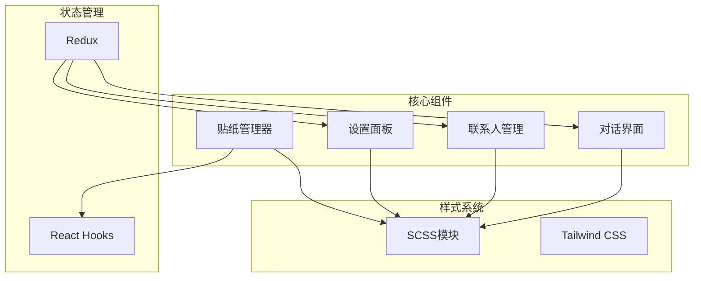
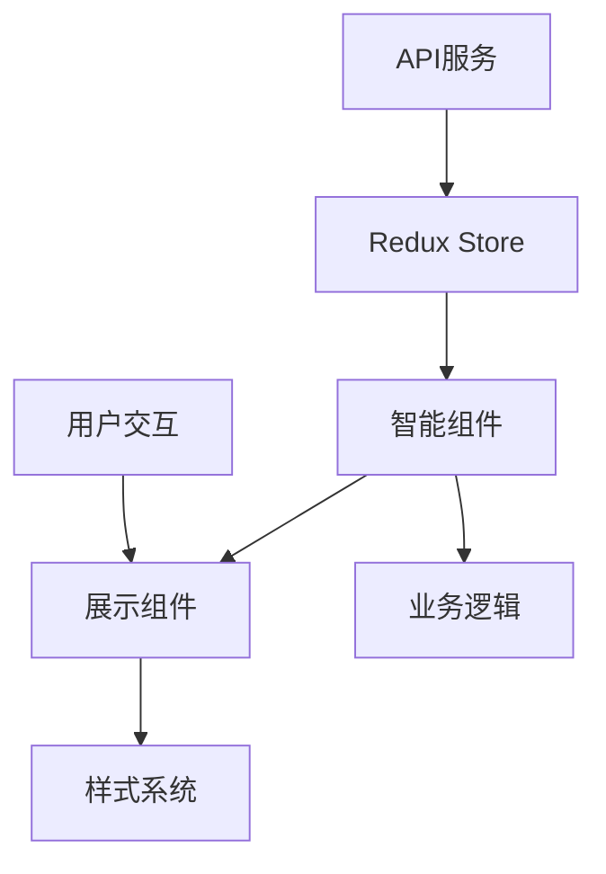
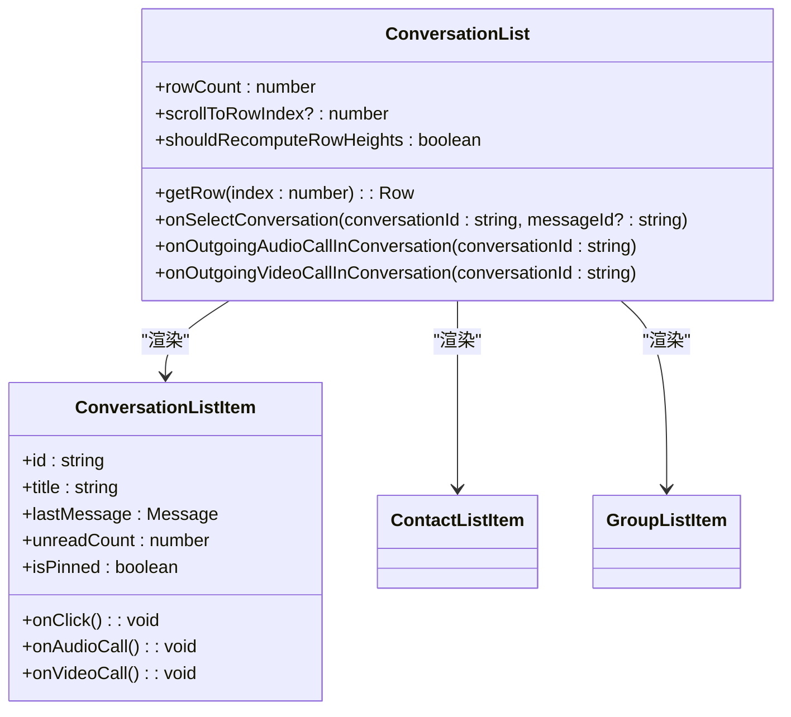
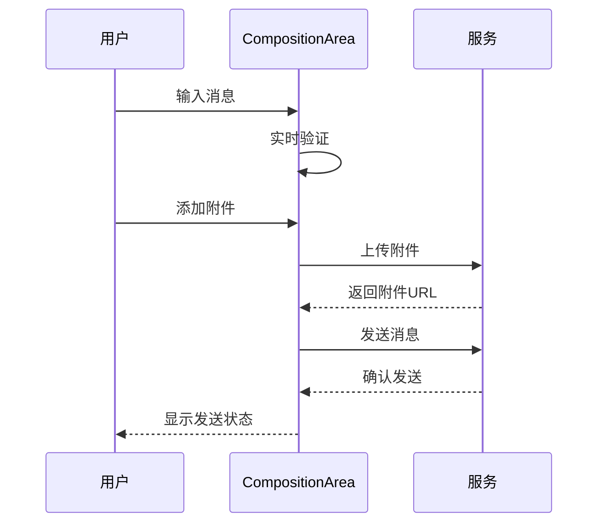
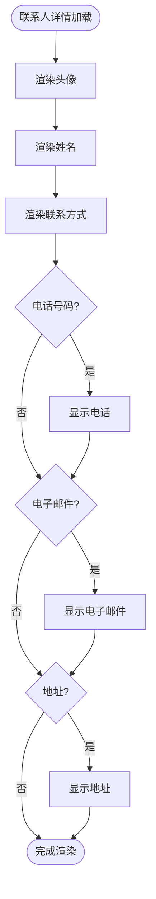
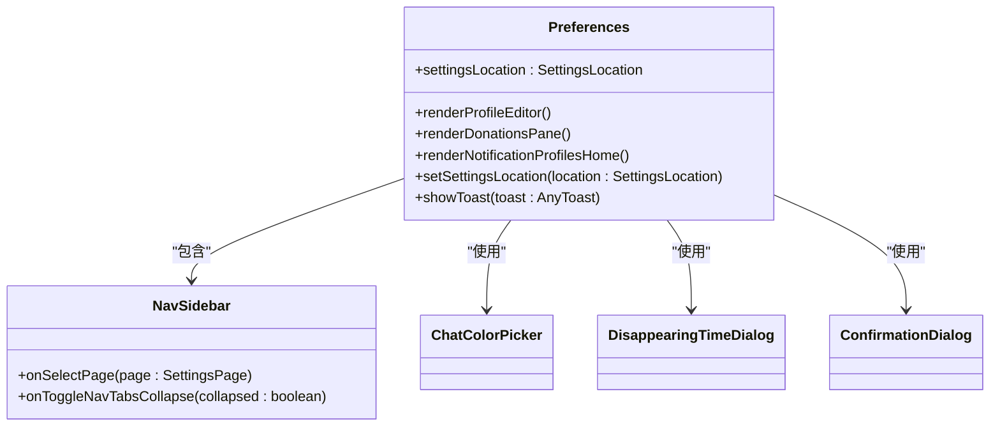
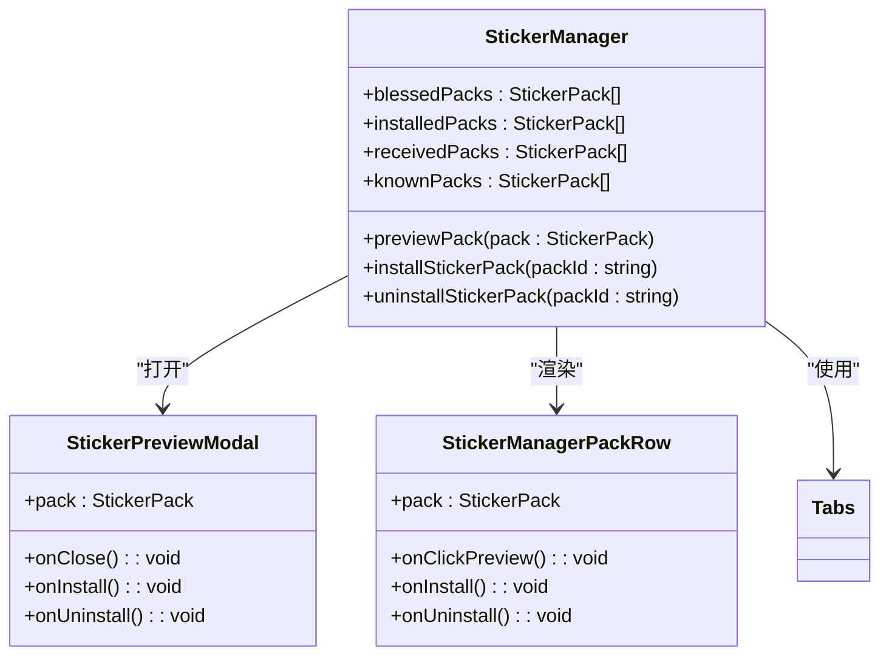
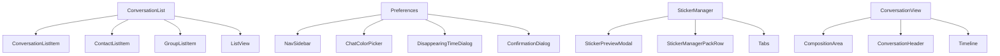

# UI组件

<cite>
**本文档中引用的文件**  
- [ConversationList.dom.tsx](file://ts/components/ConversationList.dom.tsx)
- [Preferences.dom.tsx](file://ts/components/Preferences.dom.tsx)
- [ContactDetail.dom.tsx](file://ts/components/conversation/ContactDetail.dom.tsx)
- [StickerManager.dom.tsx](file://ts/components/stickers/StickerManager.dom.tsx)
- [ConversationView.dom.tsx](file://ts/components/conversation/ConversationView.dom.tsx)
- [CompositionArea.dom.stories.tsx](file://ts/components/CompositionArea.dom.stories.tsx)
</cite>

## 目录
1. [简介](#简介)
2. [项目结构](#项目结构)
3. [核心组件](#核心组件)
4. [架构概述](#架构概述)
5. [详细组件分析](#详细组件分析)
6. [依赖分析](#依赖分析)
7. [性能考虑](#性能考虑)
8. [故障排除指南](#故障排除指南)
9. [结论](#结论)

## 简介
Signal-Desktop的UI组件文档旨在全面描述应用程序中的关键用户界面元素。本文档重点关注对话界面、联系人管理、设置面板和贴纸管理器等核心功能模块。通过分析这些组件的视觉外观、行为模式、用户交互、属性和事件，为开发者和设计者提供详细的参考指南。文档还涵盖了响应式设计、无障碍访问、主题支持和跨浏览器兼容性等重要方面。

## 项目结构
Signal-Desktop项目的UI组件主要分布在`ts/components`目录下，按功能模块组织。核心UI组件包括对话界面、联系人管理、设置面板和贴纸管理器等。样式文件位于`stylesheets/components`目录，采用模块化SCSS组织。项目使用TypeScript和React构建，组件遵循现代前端开发的最佳实践。

**图源**  
- [ts/components](file://ts/components)
- [stylesheets/components](file://stylesheets/components)

**本节来源**  
- [ts/components](file://ts/components)
- [stylesheets/components](file://stylesheets/components)

## 核心组件
Signal-Desktop的核心UI组件包括对话列表、联系人详情、设置面板和贴纸管理器。这些组件构成了应用程序的主要用户界面，提供了消息通信、联系人管理和个性化设置等关键功能。每个组件都经过精心设计，确保用户体验的一致性和高效性。

**本节来源**  
- [ConversationList.dom.tsx](file://ts/components/ConversationList.dom.tsx)
- [ContactDetail.dom.tsx](file://ts/components/conversation/ContactDetail.dom.tsx)
- [Preferences.dom.tsx](file://ts/components/Preferences.dom.tsx)
- [StickerManager.dom.tsx](file://ts/components/stickers/StickerManager.dom.tsx)

## 架构概述
Signal-Desktop的UI架构采用分层设计，将展示组件与智能组件分离。智能组件（Smart Components）负责状态管理和数据获取，而展示组件（Dumb Components）专注于UI渲染和用户交互。这种架构模式提高了代码的可维护性和可测试性。

**图源**  
- [ts/state/smart](file://ts/state/smart)
- [ts/components](file://ts/components)

## 详细组件分析

### 对话界面分析
对话界面是Signal-Desktop的核心功能之一，负责显示和管理用户的消息会话。该组件提供了丰富的交互功能，包括消息发送、媒体附件处理和会话管理。

#### 对话列表组件

**图源**  
- [ConversationList.dom.tsx](file://ts/components/ConversationList.dom.tsx)
- [conversationList/ConversationListItem.dom.js](file://ts/components/conversationList/ConversationListItem.dom.js)

#### 消息输入组件

**图源**  
- [CompositionArea.dom.stories.tsx](file://ts/components/CompositionArea.dom.stories.tsx)
- [conversation/ConversationView.dom.tsx](file://ts/components/conversation/ConversationView.dom.tsx)

### 联系人管理分析
联系人管理组件负责显示和管理用户的联系人信息，提供详细的联系人视图和交互功能。

#### 联系人详情组件

**图源**  
- [ContactDetail.dom.tsx](file://ts/components/conversation/ContactDetail.dom.tsx)
- [contactUtil.dom.js](file://ts/components/conversation/contactUtil.dom.js)

### 设置面板分析
设置面板组件提供了应用程序的配置和个性化选项，包括隐私设置、通知管理和账户信息。

#### 设置面板结构

**图源**  
- [Preferences.dom.tsx](file://ts/components/Preferences.dom.tsx)
- [NavSidebar.dom.tsx](file://ts/components/NavSidebar.dom.tsx)

### 贴纸管理器分析
贴纸管理器组件允许用户管理和使用贴纸包，提供贴纸浏览、安装和预览功能。

#### 贴纸管理器组件

**图源**  
- [StickerManager.dom.tsx](file://ts/components/stickers/StickerManager.dom.tsx)
- [StickerPreviewModal.dom.tsx](file://ts/components/stickers/StickerPreviewModal.dom.tsx)

**本节来源**  
- [ConversationList.dom.tsx](file://ts/components/ConversationList.dom.tsx)
- [ContactDetail.dom.tsx](file://ts/components/conversation/ContactDetail.dom.tsx)
- [Preferences.dom.tsx](file://ts/components/Preferences.dom.tsx)
- [StickerManager.dom.tsx](file://ts/components/stickers/StickerManager.dom.tsx)
- [CompositionArea.dom.stories.tsx](file://ts/components/CompositionArea.dom.stories.tsx)

## 依赖分析
Signal-Desktop的UI组件之间存在复杂的依赖关系，这些依赖关系确保了组件之间的协调工作和数据流动。

**图源**  
- [ts/components](file://ts/components)
- [ts/state/smart](file://ts/state/smart)

**本节来源**  
- [ts/components](file://ts/components)
- [ts/state/smart](file://ts/state/smart)

## 性能考虑
Signal-Desktop的UI组件在设计时充分考虑了性能优化。对话列表使用虚拟滚动技术，只渲染可见区域的项目，大大提高了大型列表的渲染性能。图片和媒体附件采用懒加载策略，减少初始加载时间。组件使用React.memo进行记忆化，避免不必要的重新渲染。状态管理采用Redux，通过选择器优化数据获取，减少组件重新渲染的频率。

## 故障排除指南
当遇到UI组件相关问题时，可以按照以下步骤进行排查：

1. 检查组件的props是否正确传递
2. 验证状态管理是否正常工作
3. 检查样式文件是否正确加载
4. 确认事件处理函数是否正确绑定
5. 查看浏览器控制台是否有错误信息
6. 检查网络请求是否成功
7. 验证数据格式是否符合预期

**本节来源**  
- [ts/components](file://ts/components)
- [ts/state](file://ts/state)
- [stylesheets/components](file://stylesheets/components)

## 结论
Signal-Desktop的UI组件设计体现了现代桌面应用程序的最佳实践。通过模块化的设计、清晰的组件层次和高效的性能优化，为用户提供了流畅、直观的使用体验。文档中分析的关键组件——对话界面、联系人管理、设置面板和贴纸管理器——共同构成了应用程序的核心功能。建议在开发和维护过程中遵循现有的架构模式，保持代码的一致性和可维护性。未来可以进一步优化组件的可访问性，增强响应式设计，以适应更多设备和使用场景。