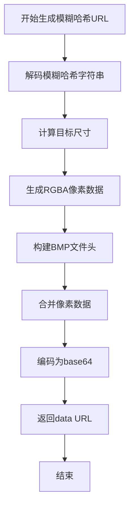
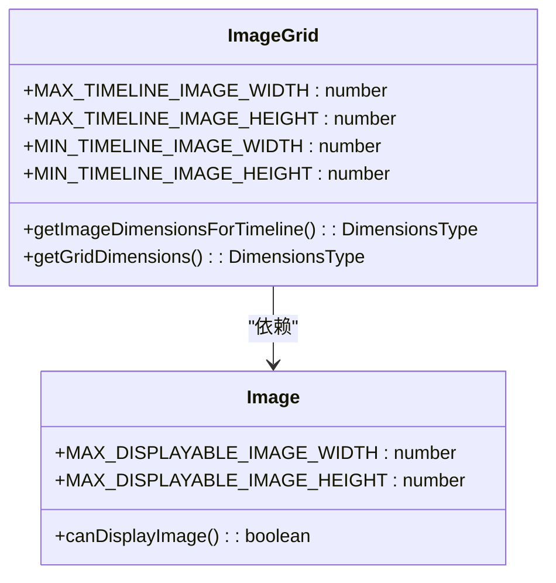
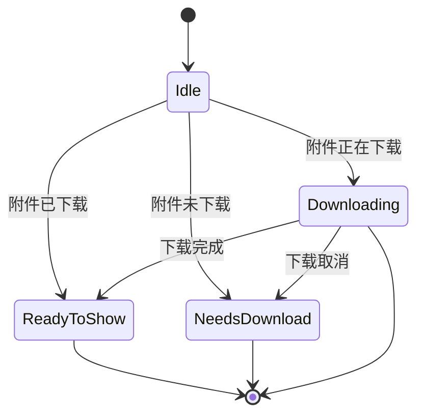
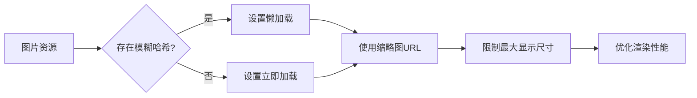

# 图片组件

<cite>
**本文档引用的文件**   
- [ImageOrBlurhash.dom.tsx](file://ts/components/ImageOrBlurhash.dom.tsx)
- [Image.dom.tsx](file://ts/components/conversation/Image.dom.tsx)
- [ImageGrid.dom.tsx](file://ts/components/conversation/ImageGrid.dom.tsx)
- [computeBlurHashUrl.std.ts](file://ts/util/computeBlurHashUrl.std.ts)
- [Attachment.std.ts](file://ts/util/Attachment.std.ts)
</cite>

## 目录
1. [简介](#简介)
2. [核心组件分析](#核心组件分析)
3. [图片加载与模糊哈希渲染](#图片加载与模糊哈希渲染)
4. [响应式设计与布局](#响应式设计与布局)
5. [错误处理与下载管理](#错误处理与下载管理)
6. [性能优化策略](#性能优化策略)
7. [图片编辑与处理](#图片编辑与处理)
8. [用户体验优化](#用户体验优化)
9. [结论](#结论)

## 简介
Signal-Desktop的图片组件系统为用户提供安全、高效且美观的图片展示体验。该系统包含三个核心组件：Image、ImageOrBlurhash和ImageGrid，它们共同实现了图片的加载、显示、布局和交互功能。组件设计注重性能优化，通过模糊哈希（Blurhash）技术提供优雅的加载过渡效果，并支持多种网络条件下的用户体验优化。本文档深入分析这些组件的实现细节，包括图片加载机制、错误处理、缩略图生成、模糊哈希渲染、响应式设计以及性能优化策略。

## 核心组件分析

### Image组件
Image组件是Signal-Desktop中图片展示的基础单元，负责单个图片的渲染和交互。它封装了复杂的图片加载逻辑，提供统一的API接口。组件支持多种显示模式，包括普通图片、视频缩略图和占位符。通过丰富的props配置，开发者可以灵活控制图片的外观和行为，如边框样式、圆角大小、叠加层等。组件还集成了下载管理功能，能够根据附件状态显示相应的下载按钮或进度指示器。

**组件来源**
- [Image.dom.tsx](file://ts/components/conversation/Image.dom.tsx#L1-L368)

### ImageOrBlurhash组件
ImageOrBlurhash组件实现了图片的渐进式加载体验。它结合了实际图片和模糊哈希两种渲染方式，为用户提供流畅的视觉过渡。当图片正在加载时，组件会先显示由模糊哈希生成的低分辨率预览图，待实际图片加载完成后平滑过渡到高清版本。这种设计显著提升了用户体验，特别是在网络条件较差的情况下。组件通过CSS背景图技术实现模糊哈希的显示，并在图片加载完成后自动移除背景，确保视觉效果的连贯性。

**组件来源**
- [ImageOrBlurhash.dom.tsx](file://ts/components/ImageOrBlurhash.dom.tsx#L1-L73)

### ImageGrid组件
ImageGrid组件负责多张图片的网格布局和展示。它根据图片数量自动调整布局模式，支持1至5张图片的不同排列方式。对于单张图片，组件提供完整的显示区域；对于多张图片，则采用紧凑的网格布局，最大化利用屏幕空间。组件还集成了附件详情提示功能，当存在多个可下载附件时，会显示下载提示按钮。布局算法考虑了对话气泡的圆角样式，确保图片网格与周围UI元素的视觉一致性。

**组件来源**
- [ImageGrid.dom.tsx](file://ts/components/conversation/ImageGrid.dom.tsx#L1-L605)

## 图片加载与模糊哈希渲染

### 模糊哈希生成机制
模糊哈希（Blurhash）是一种将图片编码为短字符串的算法，能够在极小的数据量下保留图片的主要视觉特征。Signal-Desktop使用blurhash库实现这一功能，通过computeBlurHashUrl工具函数将模糊哈希字符串转换为可显示的图片数据。该函数首先解码模糊哈希字符串，生成指定尺寸的RGBA像素数据，然后构建BMP文件头，最后将整个数据编码为base64格式的data URL。这种方法避免了额外的网络请求，提高了加载效率。

**图表来源**
- [computeBlurHashUrl.std.ts](file://ts/util/computeBlurHashUrl.std.ts#L62-L122)

### 图片加载流程
图片加载流程采用分层策略，优先使用可用的最高质量资源。组件首先检查是否存在完整的图片URL，如果存在则直接使用；否则尝试使用模糊哈希生成预览图。加载过程中，组件通过onLoad事件监听图片解码完成，确保只有在图片完全准备好后才显示，避免了部分加载的图片造成的视觉闪烁。对于需要下载的图片，组件会显示下载按钮，用户点击后触发下载流程，下载完成后自动更新显示。

**组件来源**
- [ImageOrBlurhash.dom.tsx](file://ts/components/ImageOrBlurhash.dom.tsx#L24-L73)
- [Image.dom.tsx](file://ts/components/conversation/Image.dom.tsx#L170-L182)

## 响应式设计与布局

### 自适应尺寸计算
组件系统采用智能的尺寸计算策略，确保图片在不同设备和屏幕尺寸下都能获得最佳显示效果。对于时间线中的图片，系统定义了最大和最小显示尺寸，避免图片过大影响布局或过小影响可读性。尺寸计算考虑了图片的原始宽高比，通过保持宽高比来防止图片变形。对于网格布局，系统预定义了不同数量图片的最优布局尺寸，确保视觉平衡和空间利用率。

**图表来源**
- [Attachment.std.ts](file://ts/util/Attachment.std.ts#L50-L57)
- [ImageGrid.dom.tsx](file://ts/components/conversation/ImageGrid.dom.tsx#L51-L571)

### 网格布局算法
ImageGrid组件的布局算法根据图片数量选择最优的排列方式：
- 1张图片：全尺寸显示
- 2张图片：水平并排
- 3张图片：一大两小，大图在左
- 4张图片：2×2网格
- 5张以上：前4张小图加"更多"提示

这种算法在保证视觉美观的同时，最大限度地利用了有限的屏幕空间。布局还考虑了对话气泡的圆角样式，通过curveTopLeft、curveTopRight等props确保图片网格与气泡边界的视觉连贯性。

**组件来源**
- [ImageGrid.dom.tsx](file://ts/components/conversation/ImageGrid.dom.tsx#L235-L559)

## 错误处理与下载管理

### 下载状态管理
系统通过复杂的条件判断管理图片的下载状态和显示内容。组件检查附件的path、pending状态和incremental属性，确定当前的下载阶段。对于未下载的图片，显示下载按钮；对于正在下载的图片，显示带有进度指示器的取消按钮；对于已下载的图片，则直接显示内容。这种状态管理确保了用户界面的准确性和可预测性。

**图表来源**
- [Image.dom.tsx](file://ts/components/conversation/Image.dom.tsx#L184-L215)
- [Attachment.std.ts](file://ts/util/Attachment.std.ts#L408-L441)

### 错误处理机制
组件系统实现了全面的错误处理机制，能够应对各种异常情况。当图片加载失败时，通过onError回调通知上层组件；当附件永久不可下载时，显示相应的不可用图标。系统还处理了Unicode字符异常等安全问题，通过replaceUnicodeOrderOverrides等函数净化文件名，防止潜在的安全风险。对于损坏的附件，系统会标记isCorrupted属性，避免尝试加载无效数据。

**组件来源**
- [Image.dom.tsx](file://ts/components/conversation/Image.dom.tsx#L166-L168)
- [Attachment.std.ts](file://ts/util/Attachment.std.ts#L107-L152)

## 性能优化策略

### 懒加载与资源优化
系统采用智能的懒加载策略优化性能。当存在模糊哈希时，图片加载设置为"lazy"，利用浏览器的原生懒加载功能；否则设置为"eager"，确保关键内容优先加载。对于缩略图，系统优先使用预生成的缩略图URL，减少数据传输量。尺寸计算限制了最大显示尺寸，防止超大图片消耗过多内存和渲染资源。

**图表来源**
- [ImageOrBlurhash.dom.tsx](file://ts/components/ImageOrBlurhash.dom.tsx#L69)
- [Attachment.std.ts](file://ts/util/Attachment.std.ts#L301-L308)

### 内存与缓存管理
系统通过多种机制管理内存使用和缓存效率。模糊哈希的尺寸动态计算，平衡视觉效果和内存占用。对于增量下载的附件，系统支持分块处理，减少单次内存压力。URL获取逻辑优先使用缩略图，避免加载完整图片数据。这些策略共同确保了应用在处理大量图片时仍能保持流畅的性能表现。

**组件来源**
- [computeBlurHashUrl.std.ts](file://ts/util/computeBlurHashUrl.std.ts#L68-L89)
- [Attachment.std.ts](file://ts/util/Attachment.std.ts#L320-L321)

## 图片编辑与处理

### 编辑功能集成
虽然核心图片组件主要关注展示，但系统为图片编辑提供了良好的集成支持。Image组件的showVisualAttachment回调为全屏查看和编辑提供了入口。通过与MediaEditor组件的协作，用户可以对图片进行裁剪、绘制等操作。编辑完成后，修改后的图片可以通过相同的组件系统重新渲染，确保用户体验的一致性。

**组件来源**
- [Image.dom.tsx](file://ts/components/conversation/Image.dom.tsx#L103-L112)
- [MediaEditor.dom.stories.tsx](file://ts/components/MediaEditor.dom.stories.tsx#L1-L61)

### 安全与验证
系统实施了严格的内容安全策略。通过isImageTypeSupported和isVideoTypeSupported等函数验证MIME类型，防止不支持的文件格式引发问题。文件名处理函数清除潜在的恶意Unicode字符，防范安全漏洞。下载前验证digest和key等元数据，确保附件的完整性和安全性。这些措施共同构建了坚固的安全防线，保护用户免受恶意内容的威胁。

**组件来源**
- [Attachment.std.ts](file://ts/util/Attachment.std.ts#L22-L24)
- [Attachment.std.ts](file://ts/util/Attachment.std.ts#L134-L152)

## 用户体验优化

### 交互设计
组件系统注重细节的交互设计，提供直观的用户操作体验。所有可点击元素都实现了鼠标和键盘双模式支持，确保辅助功能的完整性。下载按钮和取消按钮的点击处理都包含preventDefault和stopPropagation，防止事件冒泡影响父级组件。视觉反馈通过CSS类和内联样式实现，确保状态变化的即时可见性。

**组件来源**
- [Image.dom.tsx](file://ts/components/conversation/Image.dom.tsx#L104-L112)
- [Image.dom.tsx](file://ts/components/conversation/Image.dom.tsx#L127-L145)

### 视觉层次
系统通过精心设计的视觉层次提升用户体验。模糊哈希作为加载过渡，提供了内容预期；下载进度指示器让用户了解操作状态；"更多"提示优雅地处理大量图片的显示。暗色叠加层和播放图标等视觉元素，增强了界面的信息传达能力。这些设计细节共同营造了专业而友好的用户界面。

**组件来源**
- [ImageOrBlurhash.dom.tsx](file://ts/components/ImageOrBlurhash.dom.tsx#L50-L68)
- [ImageGrid.dom.tsx](file://ts/components/conversation/ImageGrid.dom.tsx#L544-L546)

## 结论
Signal-Desktop的图片组件系统展现了现代Web应用在媒体处理方面的最佳实践。通过Image、ImageOrBlurhash和ImageGrid三个核心组件的协同工作，系统实现了高效、安全且美观的图片展示。模糊哈希技术的应用显著提升了加载体验，智能的布局算法确保了视觉一致性，全面的状态管理和错误处理保障了系统的可靠性。性能优化策略平衡了视觉质量和资源消耗，为用户提供流畅的使用体验。整体设计体现了对用户体验的深刻理解和对技术细节的精确把控，为类似应用的开发提供了有价值的参考。