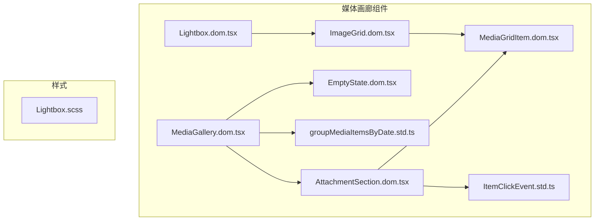
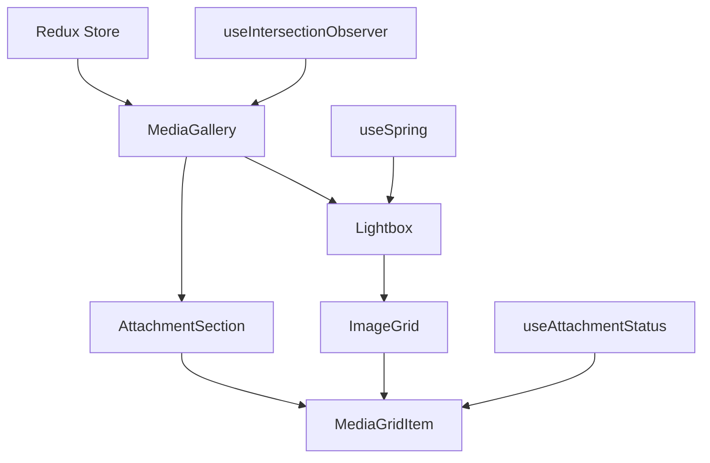
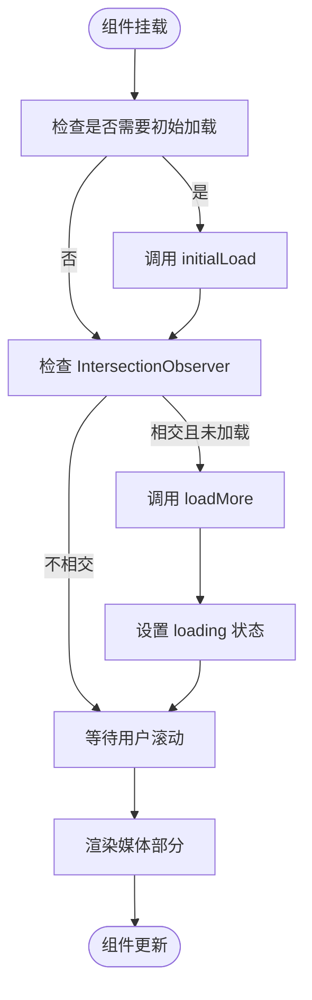
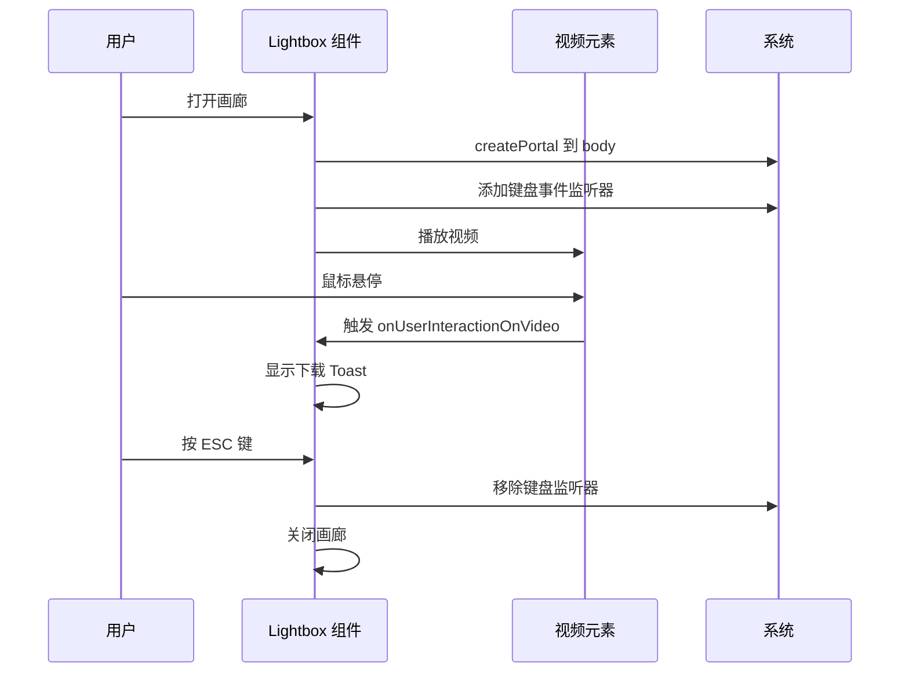

# 媒体画廊

<cite>
**本文档中引用的文件**  
- [MediaGallery.dom.tsx](file://ts/components/conversation/media-gallery/MediaGallery.dom.tsx)
- [Lightbox.dom.tsx](file://ts/components/Lightbox.dom.tsx)
- [ImageGrid.dom.tsx](file://ts/components/conversation/ImageGrid.dom.tsx)
- [MediaGridItem.dom.tsx](file://ts/components/conversation/media-gallery/MediaGridItem.dom.tsx)
- [AttachmentSection.dom.tsx](file://ts/components/conversation/media-gallery/AttachmentSection.dom.tsx)
- [EmptyState.dom.tsx](file://ts/components/conversation/media-gallery/EmptyState.dom.tsx)
- [groupMediaItemsByDate.std.ts](file://ts/components/conversation/media-gallery/groupMediaItemsByDate.std.ts)
- [ItemClickEvent.std.ts](file://ts/components/conversation/media-gallery/types/ItemClickEvent.std.ts)
- [Lightbox.scss](file://stylesheets/components/Lightbox.scss)
</cite>

## 目录
1. [简介](#简介)
2. [项目结构](#项目结构)
3. [核心组件](#核心组件)
4. [架构概述](#架构概述)
5. [详细组件分析](#详细组件分析)
6. [依赖分析](#依赖分析)
7. [性能考虑](#性能考虑)
8. [故障排除指南](#故障排除指南)
9. [结论](#结论)

## 简介
Signal-Desktop 的媒体画廊组件为用户提供了一个集中式界面，用于查看和管理对话中的所有媒体内容。该画廊支持多种媒体类型，包括图片、视频、GIF、音频文件、链接预览和文档。画廊通过分页加载和无限滚动实现高性能，同时提供搜索过滤、批量操作和离线访问功能。Lightbox 组件提供全屏媒体查看体验，支持缩放、导航和元数据展示。ImageGrid 组件则在消息流中以响应式网格布局展示多个附件。

## 项目结构
媒体画廊相关组件位于 `ts/components/conversation/media-gallery/` 目录下，与消息界面紧密集成。该结构遵循功能模块化设计，将画廊功能与核心消息组件分离。



**Diagram sources**
- [MediaGallery.dom.tsx](file://ts/components/conversation/media-gallery/MediaGallery.dom.tsx)
- [Lightbox.dom.tsx](file://ts/components/Lightbox.dom.tsx)
- [ImageGrid.dom.tsx](file://ts/components/conversation/ImageGrid.dom.tsx)
- [MediaGridItem.dom.tsx](file://ts/components/conversation/media-gallery/MediaGridItem.dom.tsx)
- [AttachmentSection.dom.tsx](file://ts/components/conversation/media-gallery/AttachmentSection.dom.tsx)
- [EmptyState.dom.tsx](file://ts/components/conversation/media-gallery/EmptyState.dom.tsx)
- [groupMediaItemsByDate.std.ts](file://ts/components/conversation/media-gallery/groupMediaItemsByDate.std.ts)
- [ItemClickEvent.std.ts](file://ts/components/conversation/media-gallery/types/ItemClickEvent.std.ts)
- [Lightbox.scss](file://stylesheets/components/Lightbox.scss)

**Section sources**
- [MediaGallery.dom.tsx](file://ts/components/conversation/media-gallery/MediaGallery.dom.tsx)
- [Lightbox.dom.tsx](file://ts/components/Lightbox.dom.tsx)
- [ImageGrid.dom.tsx](file://ts/components/conversation/ImageGrid.dom.tsx)

## 核心组件
媒体画廊由三个核心组件构成：MediaGallery、Lightbox 和 ImageGrid。MediaGallery 是主容器组件，负责组织和展示按类型和日期分组的媒体内容。它处理分页加载、状态管理和用户交互。Lightbox 组件提供全屏媒体查看器，支持键盘导航、缩放和媒体控制。ImageGrid 组件在消息流中以响应式网格布局渲染多个附件，支持 1-5 个附件的不同布局模式。

**Section sources**
- [MediaGallery.dom.tsx](file://ts/components/conversation/media-gallery/MediaGallery.dom.tsx)
- [Lightbox.dom.tsx](file://ts/components/Lightbox.dom.tsx)
- [ImageGrid.dom.tsx](file://ts/components/conversation/ImageGrid.dom.tsx)

## 架构概述
媒体画廊采用分层架构，将数据获取、状态管理、UI 渲染和用户交互分离。MediaGallery 组件作为顶层容器，接收来自 Redux store 的媒体数据，并通过 props 将其传递给子组件。AttachmentSection 组件负责按日期对媒体项进行分组和渲染，使用 Tailwind CSS 的响应式网格系统实现自适应布局。MediaGridItem 组件表示单个媒体项，显示缩略图、元数据和下载状态。Lightbox 组件通过 React Portal 渲染在 DOM 树的顶层，确保全屏覆盖和正确的 z-index 层级。



**Diagram sources**
- [MediaGallery.dom.tsx](file://ts/components/conversation/media-gallery/MediaGallery.dom.tsx)
- [AttachmentSection.dom.tsx](file://ts/components/conversation/media-gallery/AttachmentSection.dom.tsx)
- [MediaGridItem.dom.tsx](file://ts/components/conversation/media-gallery/MediaGridItem.dom.tsx)
- [Lightbox.dom.tsx](file://ts/components/Lightbox.dom.tsx)
- [ImageGrid.dom.tsx](file://ts/components/conversation/ImageGrid.dom.tsx)

## 详细组件分析

### MediaGallery 组件分析
MediaGallery 组件是媒体画廊的核心，负责协调所有子组件并管理整体状态。它使用 React 的 useState 和 useEffect 钩子来处理本地加载状态和副作用。组件通过 useIntersectionObserver 钩子实现无限滚动，当用户滚动到页面底部时自动加载更多媒体。媒体项按日期分组，使用 groupMediaItemsByDate 工具函数将项目分为“今天”、“昨天”、“本周”、“本月”和“年月”等部分。



**Diagram sources**
- [MediaGallery.dom.tsx](file://ts/components/conversation/media-gallery/MediaGallery.dom.tsx)
- [groupMediaItemsByDate.std.ts](file://ts/components/conversation/media-gallery/groupMediaItemsByDate.std.ts)

**Section sources**
- [MediaGallery.dom.tsx](file://ts/components/conversation/media-gallery/MediaGallery.dom.tsx)

### Lightbox 组件分析
Lightbox 组件提供全屏媒体查看体验，支持图片和视频的查看。它使用 React Spring 实现平滑的缩放动画，并通过 useReducedMotion 钩子尊重用户的减少动画偏好。组件通过 createPortal 将自身渲染到 body 元素下，确保正确的叠加层级。键盘事件监听器允许用户使用方向键导航，ESC 键关闭画廊。对于视频，组件显示下载进度 Toast，并支持播放/暂停控制。



**Diagram sources**
- [Lightbox.dom.tsx](file://ts/components/Lightbox.dom.tsx)

**Section sources**
- [Lightbox.dom.tsx](file://ts/components/Lightbox.dom.tsx)

### ImageGrid 组件分析
ImageGrid 组件在消息流中以网格布局渲染多个附件。它根据附件数量（1-5）应用不同的 CSS 布局，确保视觉一致性。对于 5 个以上的附件，组件显示 "+N" 覆盖层，表示还有更多媒体。组件使用 getCurves 函数计算消息气泡的圆角，以匹配 Signal 的消息设计语言。AttachmentDetailPill 显示文件大小和下载状态，而下载药丸按钮允许用户批量下载所有附件。

```mermaid
classDiagram
class ImageGrid {
+attachments : AttachmentForUIType[]
+direction : 'incoming' | 'outgoing'
+i18n : LocalizerType
+showVisualAttachment(attachment)
+startDownload()
+cancelDownload()
-getCurves() : CurveType
-renderDownloadPill() : JSX.Element
}
class Image {
+attachment : AttachmentType
+url : string
+height : number
+width : number
+playIconOverlay : boolean
+showVisualAttachment()
}
class AttachmentDetailPill {
+attachments : AttachmentForUIType[]
+i18n : LocalizerType
+startDownload()
+cancelDownload()
}
ImageGrid --> Image : "渲染多个"
ImageGrid --> AttachmentDetailPill : "显示元数据"
ImageGrid --> "下载药丸" : "批量下载"
```

**Diagram sources**
- [ImageGrid.dom.tsx](file://ts/components/conversation/ImageGrid.dom.tsx)

**Section sources**
- [ImageGrid.dom.tsx](file://ts/components/conversation/ImageGrid.dom.tsx)

## 依赖分析
媒体画廊组件依赖于多个核心系统和工具。它使用 Redux 进行全局状态管理，通过 action creators 处理附件下载、保存和播放。组件依赖于 util/Attachment.std.js 中的工具函数来处理附件元数据、URL 生成和 MIME 类型检查。国际化通过 i18n prop 实现，支持多语言。样式主要通过 Tailwind CSS 类实现，确保一致的设计语言。Lightbox 组件依赖于 react-spring 实现动画，react-dom 的 createPortal 用于渲染到 DOM 树顶层。

```mermaid
graph TD
MediaGallery --> Redux[Redux Store]
MediaGallery --> AttachmentUtil[util/Attachment.std.js]
MediaGallery --> Tailwind[Tailwind CSS]
MediaGallery --> Moment[moment.js]
Lightbox --> ReactSpring[@react-spring/web]
Lightbox --> ReactPortal[react-dom createPortal]
Lightbox --> Lodash[lodash]
ImageGrid --> ClassNames[classnames]
All --> i18n[国际化系统]
```

**Diagram sources**
- [MediaGallery.dom.tsx](file://ts/components/conversation/media-gallery/MediaGallery.dom.tsx)
- [Lightbox.dom.tsx](file://ts/components/Lightbox.dom.tsx)
- [ImageGrid.dom.tsx](file://ts/components/conversation/ImageGrid.dom.tsx)

**Section sources**
- [MediaGallery.dom.tsx](file://ts/components/conversation/media-gallery/MediaGallery.dom.tsx)
- [Lightbox.dom.tsx](file://ts/components/Lightbox.dom.tsx)
- [ImageGrid.dom.tsx](file://ts/components/conversation/ImageGrid.dom.tsx)

## 性能考虑
媒体画廊通过多种技术实现高性能。无限滚动和分页加载确保只渲染可见媒体，减少内存占用。ImageGrid 组件使用 getThumbnailUrl 获取缩略图，避免加载全尺寸图像。MediaGridItem 使用 blurHash 显示占位符，改善加载体验。Lightbox 组件仅在需要时加载全尺寸媒体，并通过 useIntersectionObserver 延迟加载。动画使用 React Spring 优化，尊重用户的减少动画偏好。附件状态通过 useAttachmentStatus 钩子高效管理，避免不必要的重新渲染。

## 故障排除指南
常见问题包括媒体无法加载、下载进度不更新和画廊布局错乱。检查网络连接和附件 URL 的有效性。确保 Redux store 中的媒体数据正确加载。验证附件的 contentType 和路径属性。对于布局问题，检查 Tailwind CSS 类是否正确应用。如果 Lightbox 无法打开，确认 createPortal 是否成功将元素附加到 body。对于动画问题，检查 useReducedMotion 钩子是否按预期工作。

**Section sources**
- [MediaGallery.dom.tsx](file://ts/components/conversation/media-gallery/MediaGallery.dom.tsx)
- [Lightbox.dom.tsx](file://ts/components/Lightbox.dom.tsx)
- [ImageGrid.dom.tsx](file://ts/components/conversation/ImageGrid.dom.tsx)

## 结论
Signal-Desktop 的媒体画廊组件是一个功能丰富、性能优化的系统，为用户提供无缝的媒体浏览体验。通过模块化设计、响应式布局和智能加载策略，画廊能够高效处理大量媒体内容。Lightbox 和 ImageGrid 组件的分离关注点设计确保了代码的可维护性和可扩展性。未来的改进可以包括更高级的搜索过滤、机器学习驱动的媒体组织和增强的离线功能。