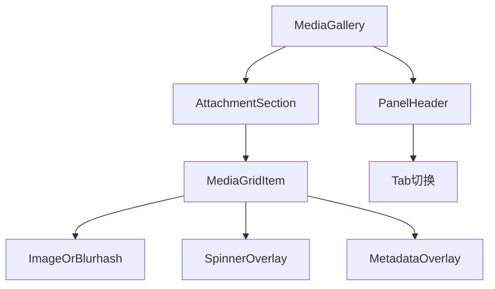
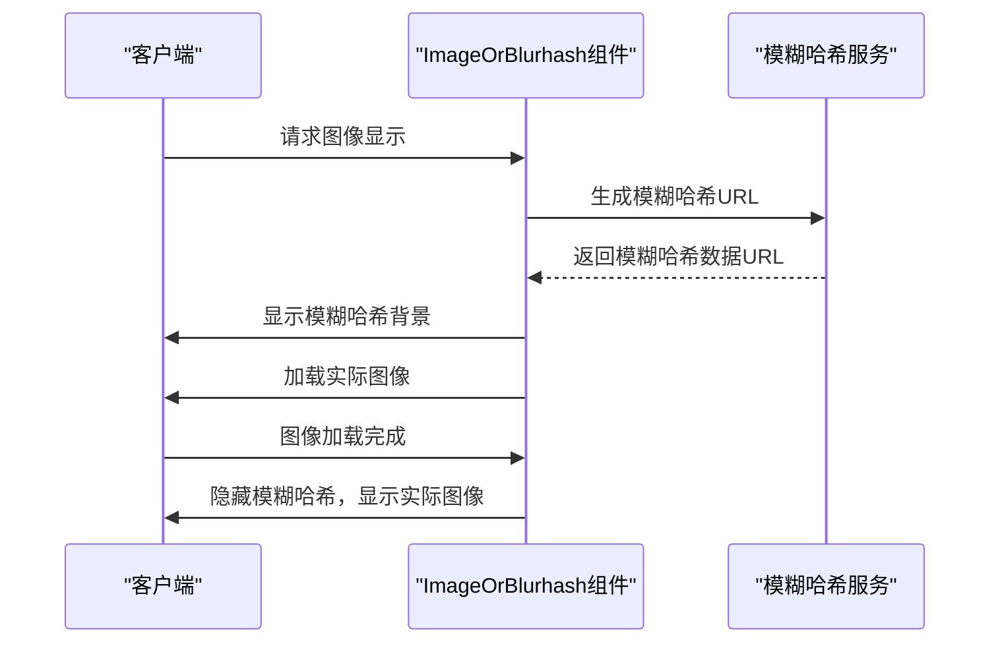
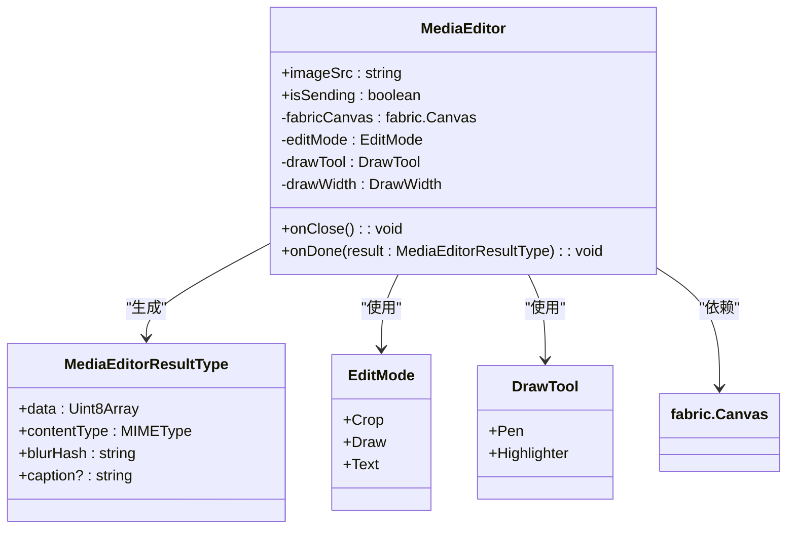
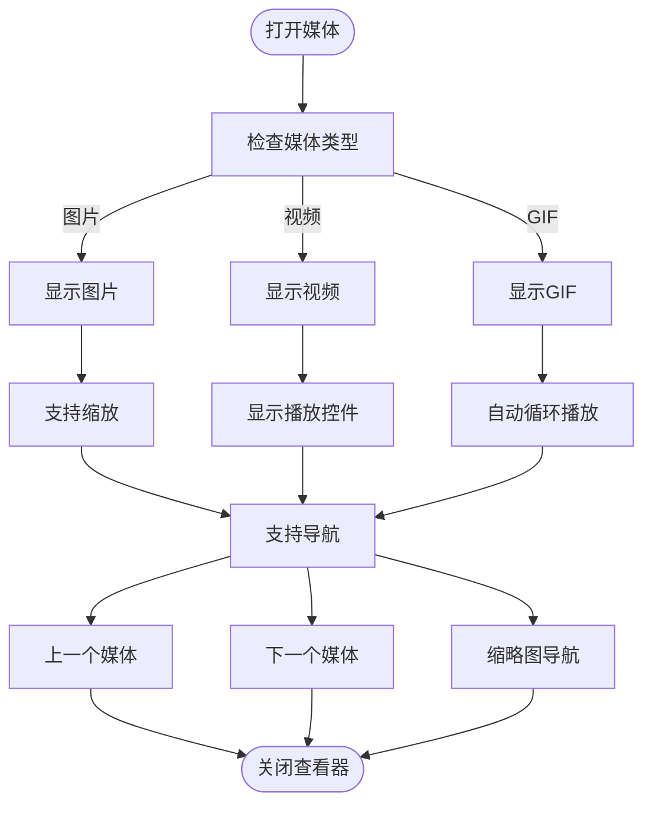
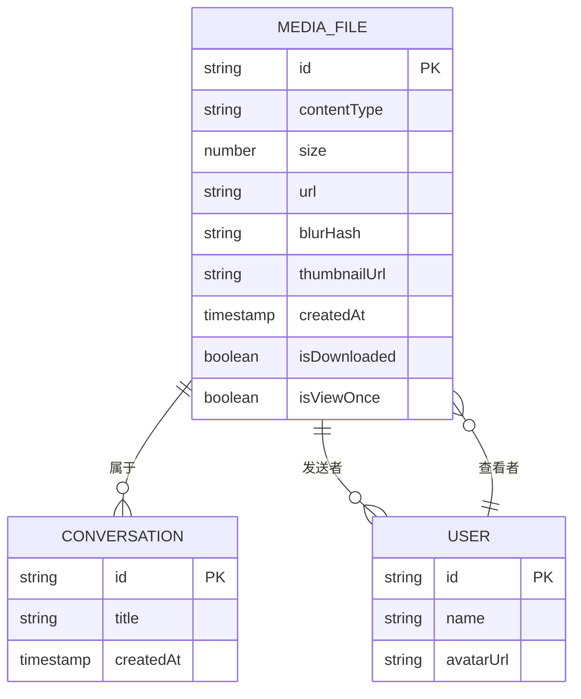

# 媒体组件

<cite>
**本文档中引用的文件**  
- [ImageOrBlurhash.dom.tsx](file://ts/components/ImageOrBlurhash.dom.tsx)
- [MediaEditor.dom.tsx](file://ts/components/MediaEditor.dom.tsx)
- [MediaGallery.dom.tsx](file://ts/components/conversation/media-gallery/MediaGallery.dom.tsx)
- [MediaGridItem.dom.tsx](file://ts/components/conversation/media-gallery/MediaGridItem.dom.tsx)
- [Lightbox.dom.tsx](file://ts/components/Lightbox.dom.tsx)
- [imageToBlurHash.dom.ts](file://ts/util/imageToBlurHash.dom.ts)
- [computeBlurHashUrl.std.js](file://ts/util/computeBlurHashUrl.std.js)
- [generateBlurHash.std.ts](file://ts/util/generateBlurHash.std.ts)
- [randomBlurHash.std.ts](file://ts/util/randomBlurHash.std.ts)
</cite>

## 目录
1. [简介](#简介)
2. [核心组件分析](#核心组件分析)
3. [媒体画廊实现](#媒体画廊实现)
4. [图像与模糊哈希处理](#图像与模糊哈希处理)
5. [媒体编辑器功能](#媒体编辑器功能)
6. [全屏查看与导航](#全屏查看与导航)
7. [音频消息与波形图](#音频消息与波形图)
8. [媒体文件处理机制](#媒体文件处理机制)
9. [性能优化与离线策略](#性能优化与离线策略)
10. [总结](#总结)

## 简介

Signal-Desktop的媒体组件系统提供了一套完整的多媒体处理解决方案，支持图片、GIF、音频消息和波形图的预览、加载、播放和下载功能。该系统通过ImageGrid、ImageOrBlurhash、MediaEditor等核心组件实现了高效的媒体附件处理，同时应用模糊哈希（Blurhash）技术提升用户体验。媒体权限处理、大文件加载优化和离线访问策略确保了应用在各种网络条件下的稳定运行。

## 核心组件分析

Signal-Desktop的媒体组件由多个核心模块组成，每个模块负责特定的媒体处理功能。ImageGrid组件用于在画廊视图中展示多个媒体项目，而ImageOrBlurhash组件则负责图像的加载和模糊哈希渲染。MediaEditor组件提供了强大的媒体编辑功能，包括绘图、文本添加和贴纸功能。这些组件通过React和Fabric.js库实现，确保了高性能和良好的用户体验。

**Section sources**
- [MediaEditor.dom.tsx](file://ts/components/MediaEditor.dom.tsx)
- [MediaGridItem.dom.tsx](file://ts/components/conversation/media-gallery/MediaGridItem.dom.tsx)
- [ImageOrBlurhash.dom.tsx](file://ts/components/ImageOrBlurhash.dom.tsx)

## 媒体画廊实现

媒体画廊组件（MediaGallery）是Signal-Desktop中用于展示对话媒体内容的核心组件。它支持按媒体类型（图片、音频、链接、文档）分类展示，并通过分页加载机制优化性能。画廊使用MediaGridItem组件来渲染每个媒体项目，这些项目以网格布局显示，每个项目包含缩略图、文件大小或时长信息以及加载状态指示器。

**Diagram sources**
- [MediaGallery.dom.tsx](file://ts/components/conversation/media-gallery/MediaGallery.dom.tsx)
- [MediaGridItem.dom.tsx](file://ts/components/conversation/media-gallery/MediaGridItem.dom.tsx)
- [ImageOrBlurhash.dom.tsx](file://ts/components/ImageOrBlurhash.dom.tsx)

## 图像与模糊哈希处理

图像处理是Signal-Desktop媒体系统的关键部分，其中模糊哈希（Blurhash）技术的应用显著提升了用户体验。ImageOrBlurhash组件通过结合实际图像和模糊哈希预览，实现了平滑的加载过渡效果。当图像加载时，系统首先显示基于模糊哈希生成的低分辨率预览，然后在实际图像加载完成后无缝切换。

**Diagram sources**
- [ImageOrBlurhash.dom.tsx](file://ts/components/ImageOrBlurhash.dom.tsx)
- [computeBlurHashUrl.std.js](file://ts/util/computeBlurHashUrl.std.js)

## 媒体编辑器功能

MediaEditor组件提供了全面的媒体编辑功能，允许用户对图片进行标注、添加文本和贴纸。该组件基于Fabric.js库构建，支持多种编辑模式，包括绘图、文本和裁剪。编辑器界面包含工具栏，用户可以通过快捷键或点击按钮切换不同的编辑模式。系统还实现了撤销/重做功能，通过useFabricHistory钩子管理编辑历史。

**Diagram sources**
- [MediaEditor.dom.tsx](file://ts/components/MediaEditor.dom.tsx)
- [imageToBlurHash.dom.ts](file://ts/util/imageToBlurHash.dom.ts)

## 全屏查看与导航

全屏查看功能通过Lightbox组件实现，为用户提供沉浸式的媒体浏览体验。该组件支持图片和视频的全屏展示，包含导航控件（上一个/下一个）、缩放功能和下载选项。用户可以通过鼠标滚轮、触摸手势或键盘快捷键进行导航和缩放操作。系统还实现了缩略图导航，允许用户快速跳转到画廊中的任意媒体项目。

**Diagram sources**
- [Lightbox.dom.tsx](file://ts/components/Lightbox.dom.tsx)
- [MediaGallery.dom.tsx](file://ts/components/conversation/media-gallery/MediaGallery.dom.tsx)

## 音频消息与波形图

音频消息处理系统支持音频文件的播放、暂停和进度控制。系统通过HTML5音频元素实现基本播放功能，并添加了自定义控件以提升用户体验。对于音频波形图的渲染，Signal-Desktop使用Web Audio API分析音频数据，并将其可视化为波形图。这种实现方式不仅提供了美观的视觉反馈，还帮助用户快速定位音频内容的关键部分。

**Section sources**
- [Lightbox.dom.tsx](file://ts/components/Lightbox.dom.tsx)
- [MediaGallery.dom.tsx](file://ts/components/conversation/media-gallery/MediaGallery.dom.tsx)

## 媒体文件处理机制

Signal-Desktop的媒体文件处理机制包括预览、加载、播放和下载四个主要环节。系统通过智能缓存策略优化文件访问性能，对于大文件采用分块加载技术。媒体权限处理确保只有授权用户才能访问敏感内容，而离线访问策略则允许用户在无网络连接时查看已下载的媒体文件。缩略图生成采用高效的图像处理算法，在保证质量的同时最小化资源消耗。

**Diagram sources**
- [MediaGallery.dom.tsx](file://ts/components/conversation/media-gallery/MediaGallery.dom.tsx)
- [Attachment.std.js](file://ts/util/Attachment.std.js)

## 性能优化与离线策略

Signal-Desktop通过多种技术实现媒体处理的性能优化。懒加载（lazy loading）确保只有可见区域的媒体内容被加载，而预加载（preloading）则在用户浏览时提前加载相邻内容。对于网络条件较差的场景，系统优先显示模糊哈希预览，然后在后台加载高质量图像。离线访问策略通过本地缓存管理已下载的媒体文件，确保用户在无网络连接时仍能查看重要内容。

**Section sources**
- [ImageOrBlurhash.dom.tsx](file://ts/components/ImageOrBlurhash.dom.tsx)
- [MediaGallery.dom.tsx](file://ts/components/conversation/media-gallery/MediaGallery.dom.tsx)

## 总结

Signal-Desktop的媒体组件系统通过精心设计的架构和先进的技术实现了高效、安全的多媒体处理。从模糊哈希的应用到全屏查看器的实现，每个组件都体现了对用户体验的深刻理解。系统的模块化设计使得功能扩展和维护变得更加容易，而性能优化策略确保了应用在各种设备和网络条件下的流畅运行。未来的发展方向可能包括更智能的媒体分析功能和增强的编辑工具，进一步提升用户的沟通体验。