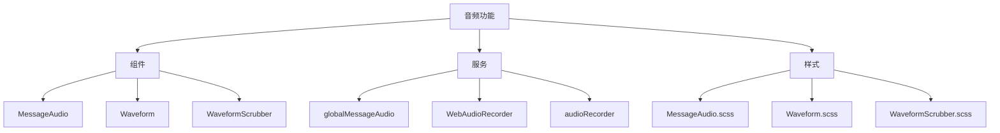
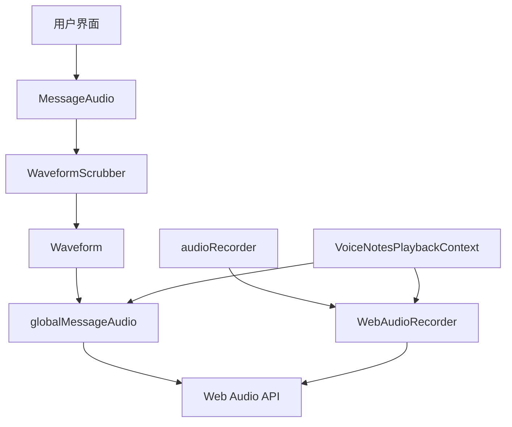
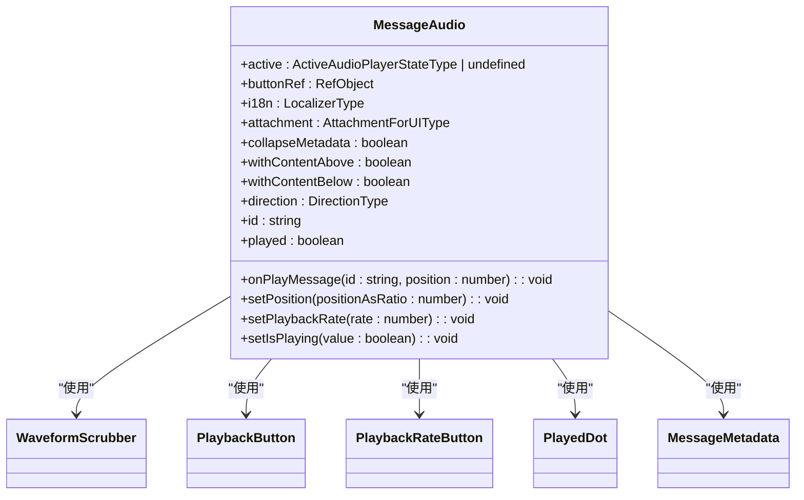
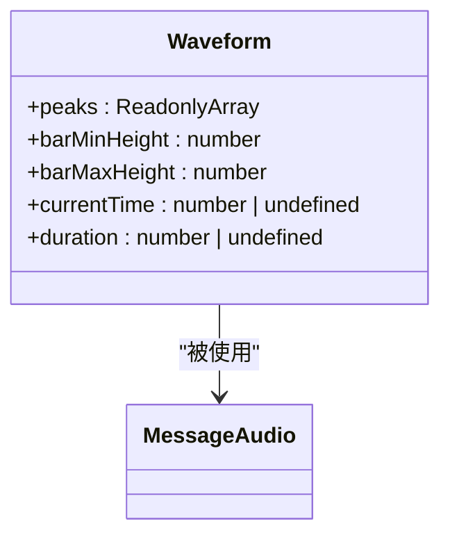
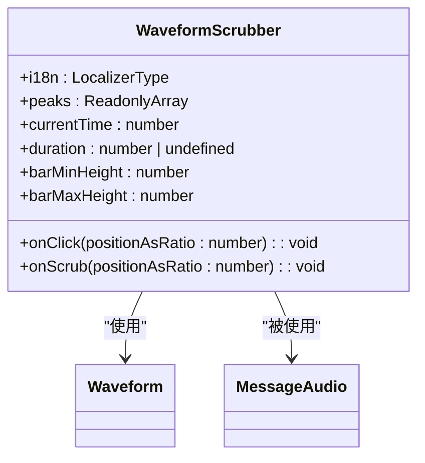
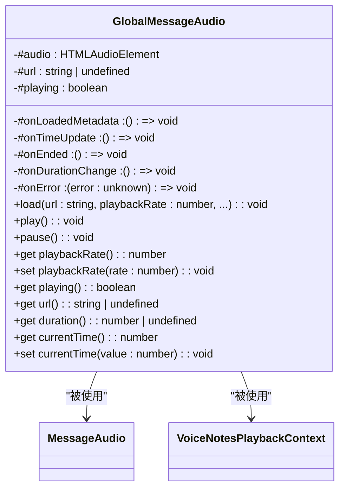
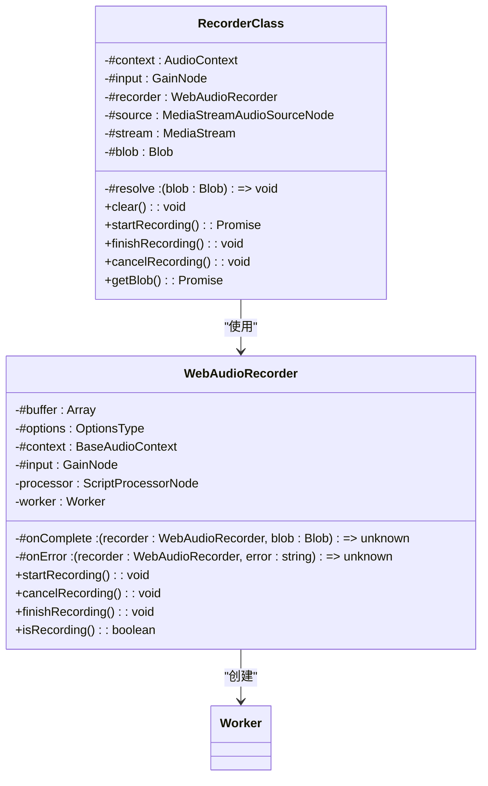
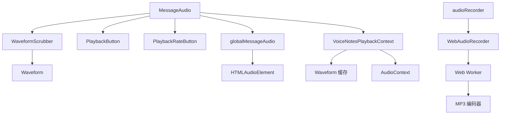

# 音频组件

<cite>
**本文档中引用的文件**  
- [MessageAudio.dom.tsx](file://ts/components/conversation/MessageAudio.dom.tsx)
- [Waveform.dom.tsx](file://ts/components/conversation/Waveform.dom.tsx)
- [WaveformScrubber.dom.tsx](file://ts/components/conversation/WaveformScrubber.dom.tsx)
- [globalMessageAudio.std.ts](file://ts/services/globalMessageAudio.std.ts)
- [WebAudioRecorder.std.ts](file://ts/WebAudioRecorder.std.ts)
- [audioRecorder.dom.ts](file://ts/services/audioRecorder.dom.ts)
- [VoiceNotesPlaybackContext.dom.tsx](file://ts/components/VoiceNotesPlaybackContext.dom.tsx)
- [MessageAudio.scss](file://stylesheets/components/MessageAudio.scss)
- [Waveform.scss](file://stylesheets/components/Waveform.scss)
- [WaveformScrubber.scss](file://stylesheets/components/WaveformScrubber.scss)
</cite>

## 目录
1. [简介](#简介)
2. [项目结构](#项目结构)
3. [核心组件](#核心组件)
4. [架构概述](#架构概述)
5. [详细组件分析](#详细组件分析)
6. [依赖分析](#依赖分析)
7. [性能考虑](#性能考虑)
8. [故障排除指南](#故障排除指南)
9. [结论](#结论)

## 简介
Signal-Desktop 的音频组件为用户提供安全、高效的语音消息录制、播放和可视化功能。本文档详细描述了 MessageAudio、Waveform 和 WaveformScrubber 组件的实现，涵盖音频消息的录制、播放、暂停、进度控制和波形渲染。文档还记录了组件的 props、事件、状态管理以及音频上下文管理机制。

## 项目结构
Signal-Desktop 的音频功能分布在多个目录中，主要包括组件、服务和样式文件。核心音频组件位于 `ts/components/conversation/` 目录下，音频服务和工具位于 `ts/services/` 和 `ts/` 目录下，样式文件位于 `stylesheets/components/` 目录下。

**Diagram sources**
- [ts/components/conversation/MessageAudio.dom.tsx](file://ts/components/conversation/MessageAudio.dom.tsx)
- [ts/components/conversation/Waveform.dom.tsx](file://ts/components/conversation/Waveform.dom.tsx)
- [ts/components/conversation/WaveformScrubber.dom.tsx](file://ts/components/conversation/WaveformScrubber.dom.tsx)
- [ts/services/globalMessageAudio.std.ts](file://ts/services/globalMessageAudio.std.ts)
- [ts/WebAudioRecorder.std.ts](file://ts/WebAudioRecorder.std.ts)
- [ts/services/audioRecorder.dom.ts](file://ts/services/audioRecorder.dom.ts)
- [stylesheets/components/MessageAudio.scss](file://stylesheets/components/MessageAudio.scss)
- [stylesheets/components/Waveform.scss](file://stylesheets/components/Waveform.scss)
- [stylesheets/components/WaveformScrubber.scss](file://stylesheets/components/WaveformScrubber.scss)

**Section sources**
- [ts/components/conversation/MessageAudio.dom.tsx](file://ts/components/conversation/MessageAudio.dom.tsx)
- [ts/components/conversation/Waveform.dom.tsx](file://ts/components/conversation/Waveform.dom.tsx)
- [ts/components/conversation/WaveformScrubber.dom.tsx](file://ts/components/conversation/WaveformScrubber.dom.tsx)
- [ts/services/globalMessageAudio.std.ts](file://ts/services/globalMessageAudio.std.ts)
- [ts/WebAudioRecorder.std.ts](file://ts/WebAudioRecorder.std.ts)
- [ts/services/audioRecorder.dom.ts](file://ts/services/audioRecorder.dom.ts)
- [stylesheets/components/MessageAudio.scss](file://stylesheets/components/MessageAudio.scss)
- [stylesheets/components/Waveform.scss](file://stylesheets/components/Waveform.scss)
- [stylesheets/components/WaveformScrubber.scss](file://stylesheets/components/WaveformScrubber.scss)

## 核心组件
Signal-Desktop 的音频系统由三个核心组件构成：MessageAudio 负责整体音频消息的展示和控制，Waveform 负责波形的可视化渲染，WaveformScrubber 提供交互式进度控制。这些组件协同工作，提供完整的音频消息体验。

**Section sources**
- [ts/components/conversation/MessageAudio.dom.tsx](file://ts/components/conversation/MessageAudio.dom.tsx)
- [ts/components/conversation/Waveform.dom.tsx](file://ts/components/conversation/Waveform.dom.tsx)
- [ts/components/conversation/WaveformScrubber.dom.tsx](file://ts/components/conversation/WaveformScrubber.dom.tsx)

## 架构概述
Signal-Desktop 的音频架构采用分层设计，从底层的 Web Audio API 到上层的 React 组件，形成了清晰的职责分离。全局音频管理器 globalMessageAudio 负责音频播放的核心控制，WebAudioRecorder 处理录音功能，而 React 组件负责用户界面和交互。

**Diagram sources**
- [ts/components/conversation/MessageAudio.dom.tsx](file://ts/components/conversation/MessageAudio.dom.tsx)
- [ts/components/conversation/Waveform.dom.tsx](file://ts/components/conversation/Waveform.dom.tsx)
- [ts/components/conversation/WaveformScrubber.dom.tsx](file://ts/components/conversation/WaveformScrubber.dom.tsx)
- [ts/services/globalMessageAudio.std.ts](file://ts/services/globalMessageAudio.std.ts)
- [ts/WebAudioRecorder.std.ts](file://ts/WebAudioRecorder.std.ts)
- [ts/services/audioRecorder.dom.ts](file://ts/services/audioRecorder.dom.ts)
- [ts/components/VoiceNotesPlaybackContext.dom.tsx](file://ts/components/VoiceNotesPlaybackContext.dom.tsx)

## 详细组件分析
本节详细分析 Signal-Desktop 音频系统中的各个关键组件，包括它们的实现细节、状态管理和交互逻辑。

### MessageAudio 组件分析
MessageAudio 组件是音频消息的主控组件，负责协调播放控制、波形显示和元数据展示。它通过 Redux 状态管理与全局音频系统通信，实现跨消息的播放控制。

**Diagram sources**
- [ts/components/conversation/MessageAudio.dom.tsx](file://ts/components/conversation/MessageAudio.dom.tsx)
- [ts/components/conversation/WaveformScrubber.dom.tsx](file://ts/components/conversation/WaveformScrubber.dom.tsx)
- [ts/components/conversation/PlaybackButton.dom.js](file://ts/components/conversation/PlaybackButton.dom.js)
- [ts/components/conversation/PlaybackRateButton.dom.js](file://ts/components/conversation/PlaybackRateButton.dom.js)

**Section sources**
- [ts/components/conversation/MessageAudio.dom.tsx](file://ts/components/conversation/MessageAudio.dom.tsx)

### Waveform 组件分析
Waveform 组件负责音频波形的可视化渲染。它接收音频峰值数据，将其转换为可视化的柱状图，并根据播放进度高亮当前播放位置。

**Diagram sources**
- [ts/components/conversation/Waveform.dom.tsx](file://ts/components/conversation/Waveform.dom.tsx)
- [ts/components/conversation/MessageAudio.dom.tsx](file://ts/components/conversation/MessageAudio.dom.tsx)

**Section sources**
- [ts/components/conversation/Waveform.dom.tsx](file://ts/components/conversation/Waveform.dom.tsx)

### WaveformScrubber 组件分析
WaveformScrubber 组件为波形提供交互式控制功能，支持鼠标点击和键盘导航来控制播放进度。

**Diagram sources**
- [ts/components/conversation/WaveformScrubber.dom.tsx](file://ts/components/conversation/WaveformScrubber.dom.tsx)
- [ts/components/conversation/Waveform.dom.tsx](file://ts/components/conversation/Waveform.dom.tsx)
- [ts/components/conversation/MessageAudio.dom.tsx](file://ts/components/conversation/MessageAudio.dom.tsx)

**Section sources**
- [ts/components/conversation/WaveformScrubber.dom.tsx](file://ts/components/conversation/WaveformScrubber.dom.tsx)

### 全局音频管理分析
globalMessageAudio 服务是 Signal-Desktop 音频系统的核心，它封装了 HTMLAudioElement，提供统一的音频播放控制接口。

**Diagram sources**
- [ts/services/globalMessageAudio.std.ts](file://ts/services/globalMessageAudio.std.ts)
- [ts/components/conversation/MessageAudio.dom.tsx](file://ts/components/conversation/MessageAudio.dom.tsx)
- [ts/components/VoiceNotesPlaybackContext.dom.tsx](file://ts/components/VoiceNotesPlaybackContext.dom.tsx)

**Section sources**
- [ts/services/globalMessageAudio.std.ts](file://ts/services/globalMessageAudio.std.ts)

### 录音功能分析
audioRecorder 和 WebAudioRecorder 类共同实现了音频录制功能，使用 Web Audio API 进行录音，并通过 Web Worker 进行 MP3 编码。

**Diagram sources**
- [ts/services/audioRecorder.dom.ts](file://ts/services/audioRecorder.dom.ts)
- [ts/WebAudioRecorder.std.ts](file://ts/WebAudioRecorder.std.ts)
- [js/WebAudioRecorderMp3.js](file://js/WebAudioRecorderMp3.js)

**Section sources**
- [ts/services/audioRecorder.dom.ts](file://ts/services/audioRecorder.dom.ts)
- [ts/WebAudioRecorder.std.ts](file://ts/WebAudioRecorder.std.ts)

## 依赖分析
Signal-Desktop 音频组件的依赖关系清晰，形成了一个层次化的架构。上层组件依赖下层服务，而核心音频功能通过全局单例进行管理，确保了音频播放的互斥性。

**Diagram sources**
- [ts/components/conversation/MessageAudio.dom.tsx](file://ts/components/conversation/MessageAudio.dom.tsx)
- [ts/components/conversation/WaveformScrubber.dom.tsx](file://ts/components/conversation/WaveformScrubber.dom.tsx)
- [ts/components/conversation/Waveform.dom.tsx](file://ts/components/conversation/Waveform.dom.tsx)
- [ts/services/globalMessageAudio.std.ts](file://ts/services/globalMessageAudio.std.ts)
- [ts/services/audioRecorder.dom.ts](file://ts/services/audioRecorder.dom.ts)
- [ts/WebAudioRecorder.std.ts](file://ts/WebAudioRecorder.std.ts)
- [ts/components/VoiceNotesPlaybackContext.dom.tsx](file://ts/components/VoiceNotesPlaybackContext.dom.tsx)

**Section sources**
- [ts/components/conversation/MessageAudio.dom.tsx](file://ts/components/conversation/MessageAudio.dom.tsx)
- [ts/components/conversation/WaveformScrubber.dom.tsx](file://ts/components/conversation/WaveformScrubber.dom.tsx)
- [ts/components/conversation/Waveform.dom.tsx](file://ts/components/conversation/Waveform.dom.tsx)
- [ts/services/globalMessageAudio.std.ts](file://ts/services/globalMessageAudio.std.ts)
- [ts/services/audioRecorder.dom.ts](file://ts/services/audioRecorder.dom.ts)
- [ts/WebAudioRecorder.std.ts](file://ts/WebAudioRecorder.std.ts)
- [ts/components/VoiceNotesPlaybackContext.dom.tsx](file://ts/components/VoiceNotesPlaybackContext.dom.tsx)

## 性能考虑
Signal-Desktop 的音频系统在性能方面进行了多项优化。Waveform 组件使用 LRU 缓存来存储已计算的波形数据，避免重复计算。音频播放使用全局单例，减少资源消耗。录音功能通过 Web Worker 进行编码，避免阻塞主线程。

**Section sources**
- [ts/components/VoiceNotesPlaybackContext.dom.tsx](file://ts/components/VoiceNotesPlaybackContext.dom.tsx)
- [ts/services/globalMessageAudio.std.ts](file://ts/services/globalMessageAudio.std.ts)
- [ts/WebAudioRecorder.std.ts](file://ts/WebAudioRecorder.std.ts)

## 故障排除指南
当音频功能出现问题时，可以检查以下方面：确保麦克风权限已授予，检查浏览器是否支持 Web Audio API，验证音频文件是否损坏，确认全局音频播放器状态是否正常。

**Section sources**
- [ts/services/audioRecorder.dom.ts](file://ts/services/audioRecorder.dom.ts)
- [ts/services/globalMessageAudio.std.ts](file://ts/services/globalMessageAudio.std.ts)
- [ts/components/VoiceNotesPlaybackContext.dom.tsx](file://ts/components/VoiceNotesPlaybackContext.dom.tsx)

## 结论
Signal-Desktop 的音频组件提供了一套完整、高效的音频消息解决方案。通过合理的架构设计和性能优化，系统能够流畅地处理音频的录制、播放和可视化。组件间的清晰职责分离使得代码易于维护和扩展。