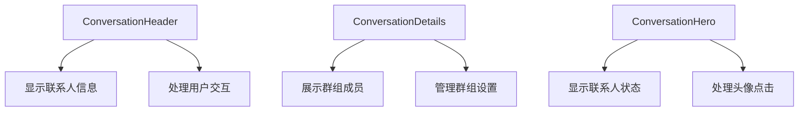
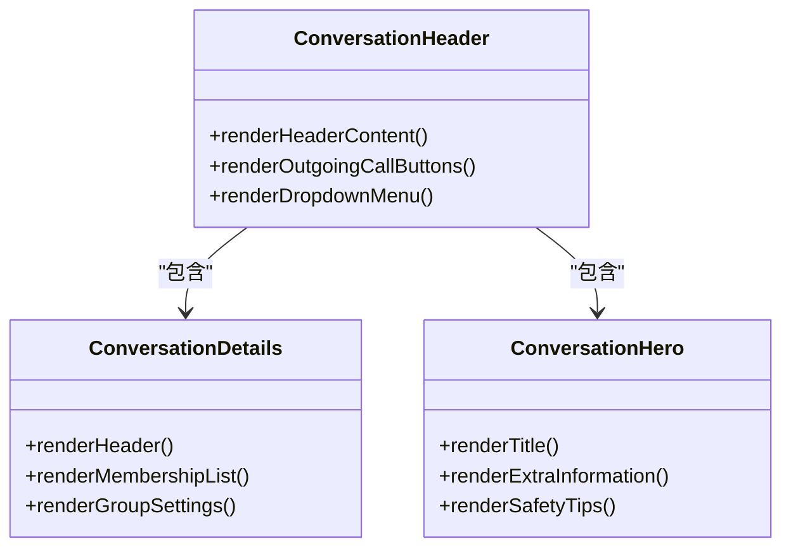
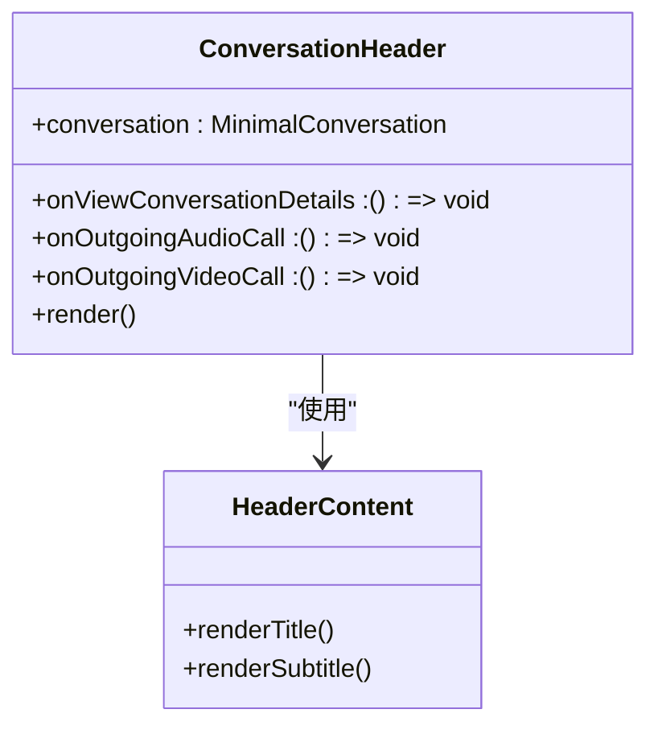
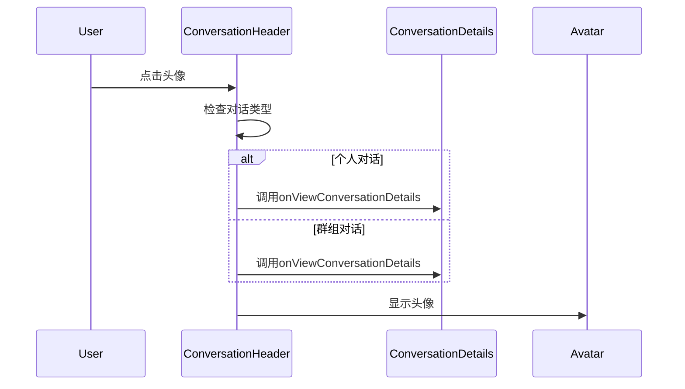
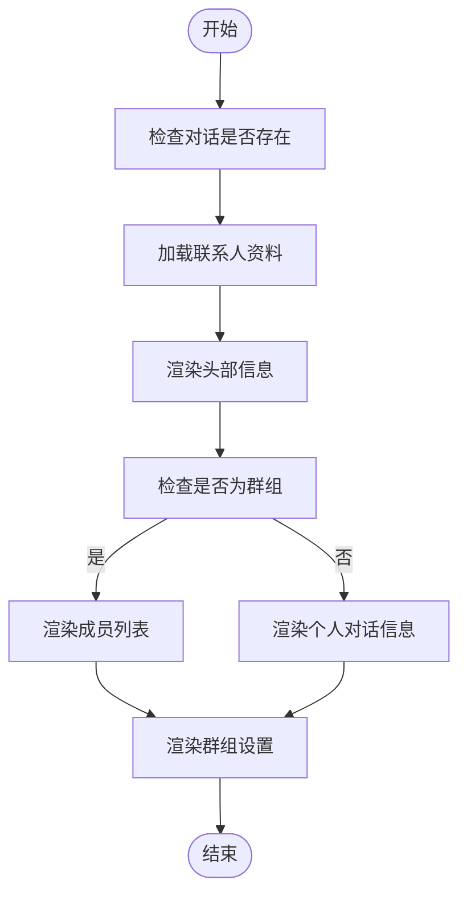
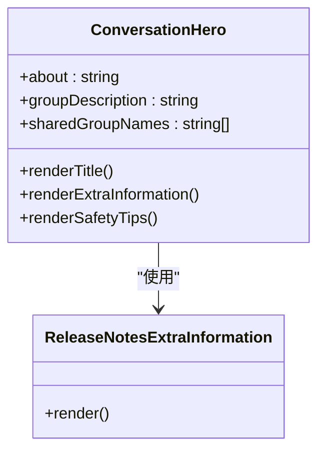
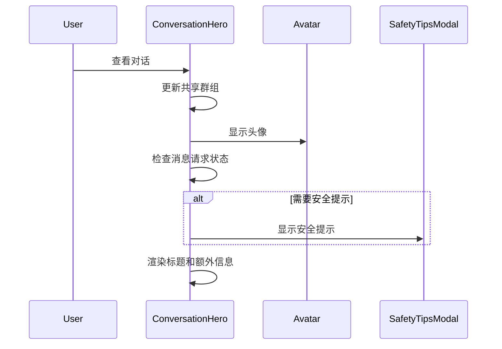
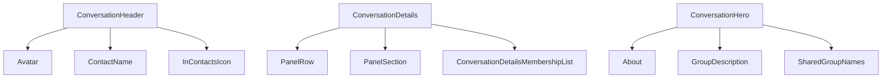

# 对话头组件

<cite>
**Referenced Files in This Document**   
- [ConversationHeader.dom.tsx](file://ts/components/conversation/ConversationHeader.dom.tsx)
- [ConversationDetails.dom.tsx](file://ts/components/conversation/conversation-details/ConversationDetails.dom.tsx)
- [ConversationHero.dom.tsx](file://ts/components/conversation/ConversationHero.dom.tsx)
- [ConversationHeader.scss](file://stylesheets/components/ConversationHeader.scss)
- [ConversationDetails.scss](file://stylesheets/components/ConversationDetails.scss)
- [ConversationHero.scss](file://stylesheets/components/ConversationHero.scss)
</cite>

## 目录
1. [介绍](#介绍)
2. [项目结构](#项目结构)
3. [核心组件](#核心组件)
4. [架构概述](#架构概述)
5. [详细组件分析](#详细组件分析)
6. [依赖分析](#依赖分析)
7. [性能考虑](#性能考虑)
8. [故障排除指南](#故障排除指南)
9. [结论](#结论)

## 介绍
本文档旨在深入解析Signal-Desktop中的对话头组件，包括ConversationHeader、ConversationDetails和ConversationHero组件的设计与实现。文档将详细记录联系人头像、名称、状态、安全号码、消息请求操作等元素的展示逻辑，并涵盖对话详情面板、联系人信息展示、安全验证和群组管理功能。

## 项目结构
Signal-Desktop的对话头组件主要位于`ts/components/conversation/`目录下，包含三个核心组件：ConversationHeader、ConversationDetails和ConversationHero。这些组件分别负责对话界面的头部、详情面板和英雄区域的展示。

**Diagram sources**
- [ConversationHeader.dom.tsx](file://ts/components/conversation/ConversationHeader.dom.tsx)
- [ConversationDetails.dom.tsx](file://ts/components/conversation/conversation-details/ConversationDetails.dom.tsx)
- [ConversationHero.dom.tsx](file://ts/components/conversation/ConversationHero.dom.tsx)

**Section sources**
- [ConversationHeader.dom.tsx](file://ts/components/conversation/ConversationHeader.dom.tsx)
- [ConversationDetails.dom.tsx](file://ts/components/conversation/conversation-details/ConversationDetails.dom.tsx)
- [ConversationHero.dom.tsx](file://ts/components/conversation/ConversationHero.dom.tsx)

## 核心组件
对话头组件由三个主要部分组成：ConversationHeader、ConversationDetails和ConversationHero。每个组件都有其特定的职责和功能。

**Section sources**
- [ConversationHeader.dom.tsx](file://ts/components/conversation/ConversationHeader.dom.tsx#L1-L1055)
- [ConversationDetails.dom.tsx](file://ts/components/conversation/conversation-details/ConversationDetails.dom.tsx#L1-L858)
- [ConversationHero.dom.tsx](file://ts/components/conversation/ConversationHero.dom.tsx#L1-L399)

## 架构概述
对话头组件采用React函数式组件设计，通过props传递数据和回调函数。组件之间通过Redux状态管理进行通信，确保数据的一致性和可预测性。

**Diagram sources**
- [ConversationHeader.dom.tsx](file://ts/components/conversation/ConversationHeader.dom.tsx#L1-L1055)
- [ConversationDetails.dom.tsx](file://ts/components/conversation/conversation-details/ConversationDetails.dom.tsx#L1-L858)
- [ConversationHero.dom.tsx](file://ts/components/conversation/ConversationHero.dom.tsx#L1-L399)

## 详细组件分析
### ConversationHeader 分析
ConversationHeader组件负责显示对话的基本信息，包括联系人头像、名称和状态。它还处理用户交互，如点击头像查看详细信息。

#### 对象导向组件：

**Diagram sources**
- [ConversationHeader.dom.tsx](file://ts/components/conversation/ConversationHeader.dom.tsx#L1-L1055)

#### API/服务组件：

**Diagram sources**
- [ConversationHeader.dom.tsx](file://ts/components/conversation/ConversationHeader.dom.tsx#L1-L1055)
- [ConversationDetails.dom.tsx](file://ts/components/conversation/conversation-details/ConversationDetails.dom.tsx#L1-L858)

**Section sources**
- [ConversationHeader.dom.tsx](file://ts/components/conversation/ConversationHeader.dom.tsx#L1-L1055)

### ConversationDetails 分析
ConversationDetails组件负责展示对话的详细信息，包括群组成员、共享群组和各种设置选项。

#### 复杂逻辑组件：

**Diagram sources**
- [ConversationDetails.dom.tsx](file://ts/components/conversation/conversation-details/ConversationDetails.dom.tsx#L1-L858)

**Section sources**
- [ConversationDetails.dom.tsx](file://ts/components/conversation/conversation-details/ConversationDetails.dom.tsx#L1-L858)

### ConversationHero 分析
ConversationHero组件负责显示对话的英雄区域，包括联系人状态、共享群组和安全提示。

#### 对象导向组件：

**Diagram sources**
- [ConversationHero.dom.tsx](file://ts/components/conversation/ConversationHero.dom.tsx#L1-L399)

#### API/服务组件：

**Diagram sources**
- [ConversationHero.dom.tsx](file://ts/components/conversation/ConversationHero.dom.tsx#L1-L399)
- [SafetyTipsModal.dom.tsx](file://ts/components/SafetyTipsModal.dom.tsx#L1-L200)

**Section sources**
- [ConversationHero.dom.tsx](file://ts/components/conversation/ConversationHero.dom.tsx#L1-L399)

## 依赖分析
对话头组件依赖于多个其他组件和工具函数，确保功能的完整性和一致性。

**Diagram sources**
- [ConversationHeader.dom.tsx](file://ts/components/conversation/ConversationHeader.dom.tsx#L1-L1055)
- [ConversationDetails.dom.tsx](file://ts/components/conversation/conversation-details/ConversationDetails.dom.tsx#L1-L858)
- [ConversationHero.dom.tsx](file://ts/components/conversation/ConversationHero.dom.tsx#L1-L399)

**Section sources**
- [ConversationHeader.dom.tsx](file://ts/components/conversation/ConversationHeader.dom.tsx#L1-L1055)
- [ConversationDetails.dom.tsx](file://ts/components/conversation/conversation-details/ConversationDetails.dom.tsx#L1-L858)
- [ConversationHero.dom.tsx](file://ts/components/conversation/ConversationHero.dom.tsx#L1-L399)

## 性能考虑
对话头组件在设计时考虑了性能优化，通过memoization和懒加载等技术减少不必要的渲染。

**Section sources**
- [ConversationHeader.dom.tsx](file://ts/components/conversation/ConversationHeader.dom.tsx#L1-L1055)
- [ConversationDetails.dom.tsx](file://ts/components/conversation/conversation-details/ConversationDetails.dom.tsx#L1-L858)
- [ConversationHero.dom.tsx](file://ts/components/conversation/ConversationHero.dom.tsx#L1-L399)

## 故障排除指南
当对话头组件出现问题时，可以检查以下常见问题：

1. **头像不显示**：检查avatarUrl是否正确，以及是否有网络问题。
2. **信息不更新**：确认Redux状态是否正确更新。
3. **交互无响应**：检查事件处理器是否正确绑定。

**Section sources**
- [ConversationHeader.dom.tsx](file://ts/components/conversation/ConversationHeader.dom.tsx#L1-L1055)
- [ConversationDetails.dom.tsx](file://ts/components/conversation/conversation-details/ConversationDetails.dom.tsx#L1-L858)
- [ConversationHero.dom.tsx](file://ts/components/conversation/ConversationHero.dom.tsx#L1-L399)

## 结论
对话头组件是Signal-Desktop中重要的UI元素，负责展示和管理对话的基本信息。通过深入分析其设计和实现，我们可以更好地理解其工作原理，并进行有效的维护和优化。