# 对话组件

<cite>
**本文档引用的文件**   
- [ConversationView.dom.tsx](file://ts/components/conversation/ConversationView.dom.tsx)
- [Message.dom.tsx](file://ts/components/conversation/Message.dom.tsx)
- [MessageBody.dom.tsx](file://ts/components/conversation/MessageBody.dom.tsx)
- [Timeline.dom.tsx](file://ts/components/conversation/Timeline.dom.tsx)
- [MediaGallery.dom.tsx](file://ts/components/conversation/media-gallery/MediaGallery.dom.tsx)
- [MessageContextMenu.dom.tsx](file://ts/components/conversation/MessageContextMenu.dom.tsx)
- [ConversationHeader.dom.tsx](file://ts/components/conversation/ConversationHeader.dom.tsx)
- [ConversationView.scss](file://stylesheets/components/ConversationView.scss)
- [MessageBody.scss](file://stylesheets/components/MessageBody.scss)
- [TimelineDateHeader.scss](file://stylesheets/components/TimelineDateHeader.scss)
</cite>

## 目录
1. [简介](#简介)
2. [项目结构](#项目结构)
3. [核心组件](#核心组件)
4. [架构概述](#架构概述)
5. [详细组件分析](#详细组件分析)
6. [依赖分析](#依赖分析)
7. [性能考虑](#性能考虑)
8. [故障排除指南](#故障排除指南)
9. [结论](#结论)

## 简介
本文档详细描述了Signal-Desktop应用程序中的对话组件。该组件构成了用户与联系人进行消息交流的核心界面，提供了完整的消息收发、媒体共享和用户交互功能。文档涵盖了对话界面的视觉布局、消息气泡、时间线、媒体画廊和输入区域的用户交互模式，以及核心组件的属性、事件和状态管理。

## 项目结构
Signal-Desktop的对话组件主要位于`ts/components/conversation/`目录下，包含多个关键的React组件文件。这些组件共同构建了完整的对话界面，包括消息显示、时间线管理、媒体处理和用户交互功能。

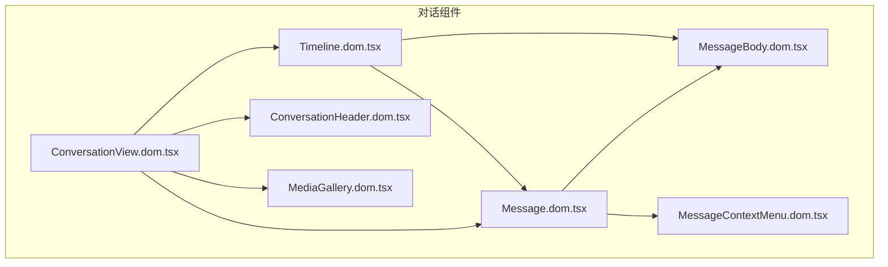

**Diagram sources**
- [ConversationView.dom.tsx](file://ts/components/conversation/ConversationView.dom.tsx#L1-L184)
- [Message.dom.tsx](file://ts/components/conversation/Message.dom.tsx#L1-L3467)
- [MessageBody.dom.tsx](file://ts/components/conversation/MessageBody.dom.tsx#L1-L196)
- [Timeline.dom.tsx](file://ts/components/conversation/Timeline.dom.tsx#L1-L1365)
- [MediaGallery.dom.tsx](file://ts/components/conversation/media-gallery/MediaGallery.dom.tsx#L1-L338)
- [MessageContextMenu.dom.tsx](file://ts/components/conversation/MessageContextMenu.dom.tsx#L1-L140)
- [ConversationHeader.dom.tsx](file://ts/components/conversation/ConversationHeader.dom.tsx#L1-L1055)

**Section sources**
- [ConversationView.dom.tsx](file://ts/components/conversation/ConversationView.dom.tsx#L1-L184)
- [Message.dom.tsx](file://ts/components/conversation/Message.dom.tsx#L1-L3467)
- [MessageBody.dom.tsx](file://ts/components/conversation/MessageBody.dom.tsx#L1-L196)
- [Timeline.dom.tsx](file://ts/components/conversation/Timeline.dom.tsx#L1-L1365)
- [MediaGallery.dom.tsx](file://ts/components/conversation/media-gallery/MediaGallery.dom.tsx#L1-L338)
- [MessageContextMenu.dom.tsx](file://ts/components/conversation/MessageContextMenu.dom.tsx#L1-L140)
- [ConversationHeader.dom.tsx](file://ts/components/conversation/ConversationHeader.dom.tsx#L1-L1055)

## 核心组件
对话组件由多个核心组件构成，每个组件负责特定的功能。`ConversationView`是主容器组件，负责组织对话界面的整体布局。`Message`组件处理单个消息的显示和交互，`MessageBody`负责消息文本的渲染，`Timeline`管理消息的时间线布局，`MediaGallery`处理媒体文件的展示，而`MessageContextMenu`则提供消息的上下文操作菜单。

**Section sources**
- [ConversationView.dom.tsx](file://ts/components/conversation/ConversationView.dom.tsx#L1-L184)
- [Message.dom.tsx](file://ts/components/conversation/Message.dom.tsx#L1-L3467)
- [MessageBody.dom.tsx](file://ts/components/conversation/MessageBody.dom.tsx#L1-L196)
- [Timeline.dom.tsx](file://ts/components/conversation/Timeline.dom.tsx#L1-L1365)
- [MediaGallery.dom.tsx](file://ts/components/conversation/media-gallery/MediaGallery.dom.tsx#L1-L338)

## 架构概述
对话组件采用分层架构设计，`ConversationView`作为顶层容器，协调各个子组件的工作。该组件通过props传递数据和回调函数，实现了组件间的松耦合。时间线组件`Timeline`负责管理消息的滚动和加载，实现了虚拟滚动以优化性能。消息组件`Message`封装了消息显示的全部逻辑，包括文本、媒体、状态指示和交互功能。

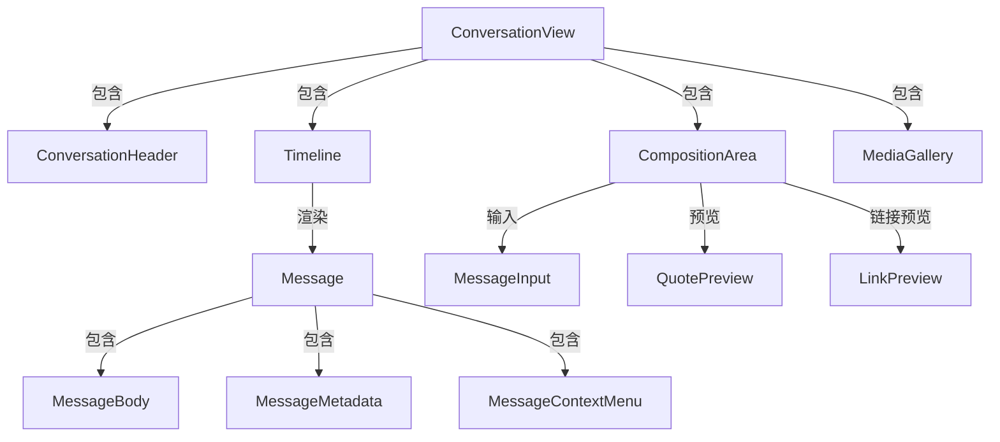

**Diagram sources**
- [ConversationView.dom.tsx](file://ts/components/conversation/ConversationView.dom.tsx#L1-L184)
- [Timeline.dom.tsx](file://ts/components/conversation/Timeline.dom.tsx#L1-L1365)
- [Message.dom.tsx](file://ts/components/conversation/Message.dom.tsx#L1-L3467)

## 详细组件分析

### ConversationView 分析
`ConversationView`是对话界面的主容器组件，负责组织和协调所有子组件。它处理拖放和粘贴事件，允许用户直接将文件拖入对话中发送。

#### 对话视图组件
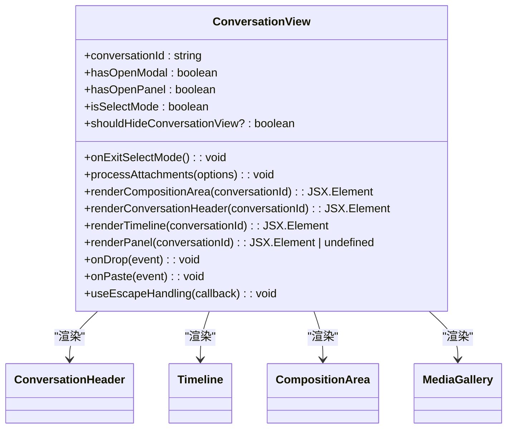

**Diagram sources**
- [ConversationView.dom.tsx](file://ts/components/conversation/ConversationView.dom.tsx#L1-L184)
- [ConversationView.scss](file://stylesheets/components/ConversationView.scss#L1-L73)

### Message 分析
`Message`组件是对话中消息显示的核心，处理各种类型消息的渲染和交互。

#### 消息组件
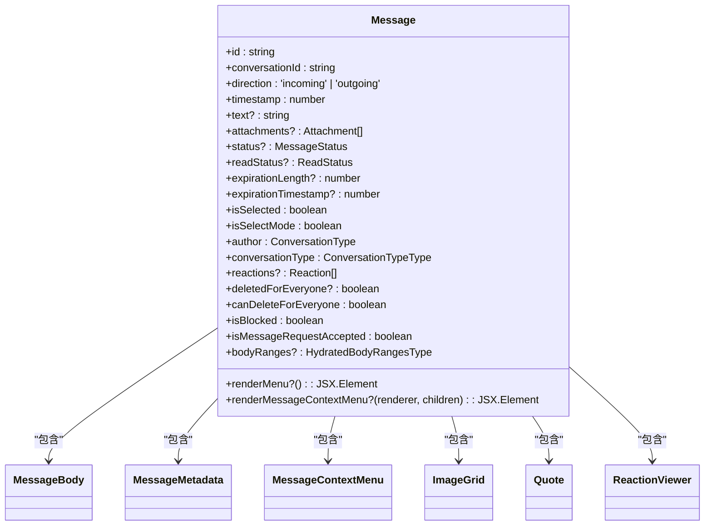

**Diagram sources**
- [Message.dom.tsx](file://ts/components/conversation/Message.dom.tsx#L1-L3467)

### MessageBody 分析
`MessageBody`组件专门负责消息文本的渲染，支持表情符号、链接和提及功能。

#### 消息体组件
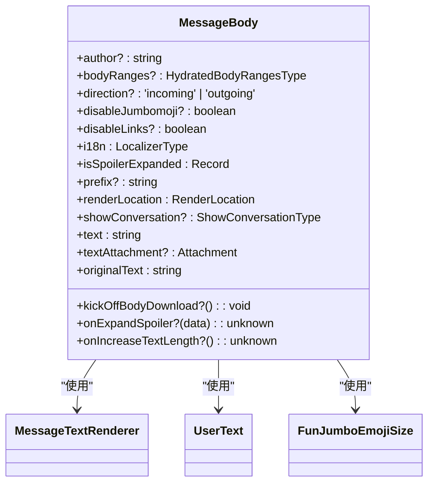

**Diagram sources**
- [MessageBody.dom.tsx](file://ts/components/conversation/MessageBody.dom.tsx#L1-L196)
- [MessageBody.scss](file://stylesheets/components/MessageBody.scss#L1-L74)

### Timeline 分析
`Timeline`组件管理对话中消息的时间线布局，处理滚动、加载和可见性检测。

#### 时间线组件
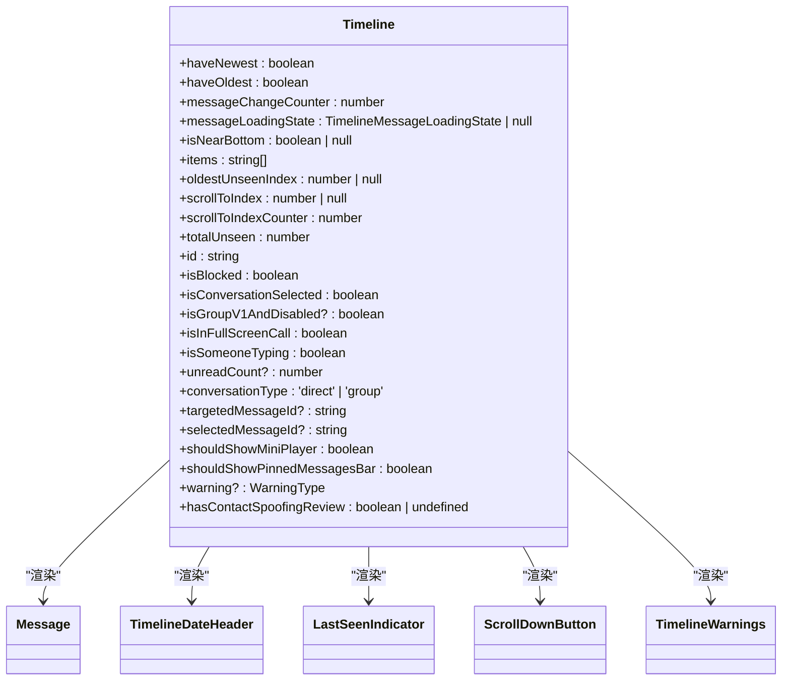

**Diagram sources**
- [Timeline.dom.tsx](file://ts/components/conversation/Timeline.dom.tsx#L1-L1365)
- [TimelineDateHeader.scss](file://stylesheets/components/TimelineDateHeader.scss#L1-L32)

### MediaGallery 分析
`MediaGallery`组件负责展示对话中的媒体文件，包括图片、音频、文档和链接。

#### 媒体画廊组件
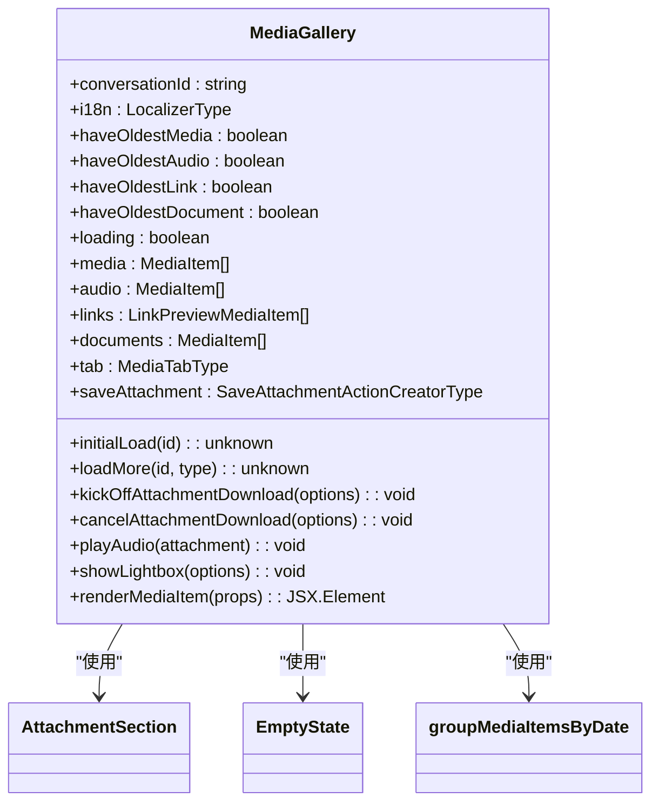

**Diagram sources**
- [MediaGallery.dom.tsx](file://ts/components/conversation/media-gallery/MediaGallery.dom.tsx#L1-L338)

## 依赖分析
对话组件依赖于多个外部库和内部模块，形成了复杂的依赖关系网络。

```mermaid
graph TD
React[React] --> ConversationView
React --> Message
React --> MessageBody
React --> Timeline
React --> MediaGallery
React --> MessageContextMenu
classNames[classNames] --> ConversationView
classNames --> Message
classNames --> MessageBody
classNames --> Timeline
classNames --> MediaGallery
lodash[lodash] --> Message
lodash --> Timeline
moment[moment] --> MediaGallery
type-fest[type-fest] --> Message
type-fest --> Timeline
react-popper[react-popper] --> Message
@popperjs/core[@popperjs/core] --> Message
ConversationView --> Message
ConversationView --> Timeline
ConversationView --> ConversationHeader
ConversationView --> MediaGallery
Message --> MessageBody
Message --> MessageMetadata
Message --> MessageContextMenu
Message --> ImageGrid
Message --> Quote
Message --> ReactionViewer
Timeline --> Message
Timeline --> TimelineDateHeader
Timeline --> LastSeenIndicator
Timeline --> ScrollDownButton
Timeline --> TimelineWarnings
```

**Diagram sources**
- [ConversationView.dom.tsx](file://ts/components/conversation/ConversationView.dom.tsx#L1-L184)
- [Message.dom.tsx](file://ts/components/conversation/Message.dom.tsx#L1-L3467)
- [MessageBody.dom.tsx](file://ts/components/conversation/MessageBody.dom.tsx#L1-L196)
- [Timeline.dom.tsx](file://ts/components/conversation/Timeline.dom.tsx#L1-L1365)
- [MediaGallery.dom.tsx](file://ts/components/conversation/media-gallery/MediaGallery.dom.tsx#L1-L338)
- [MessageContextMenu.dom.tsx](file://ts/components/conversation/MessageContextMenu.dom.tsx#L1-L140)

## 性能考虑
对话组件在设计时充分考虑了性能优化，特别是在处理大量消息时的表现。

### 虚拟滚动和懒加载
`Timeline`组件实现了虚拟滚动机制，只渲染可见区域的消息，大大减少了DOM节点数量。通过`IntersectionObserver`检测消息的可见性，实现了懒加载和自动标记已读功能。

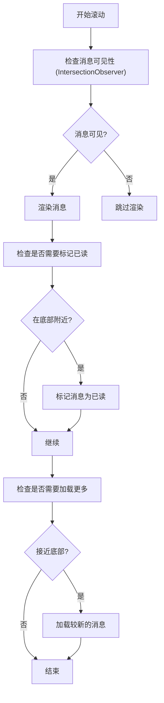

**Diagram sources**
- [Timeline.dom.tsx](file://ts/components/conversation/Timeline.dom.tsx#L1-L1365)

### 响应式设计
对话组件采用响应式设计，能够适应不同屏幕尺寸。通过`WidthBreakpoint`检测容器宽度，调整布局和显示内容。

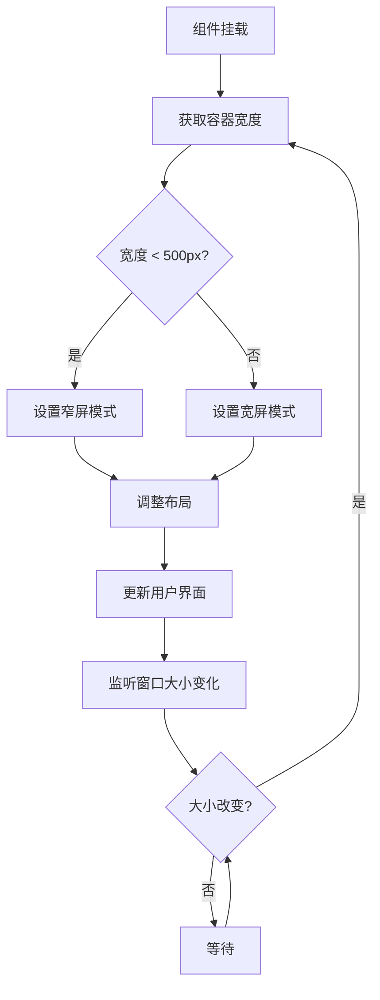

**Diagram sources**
- [ConversationHeader.dom.tsx](file://ts/components/conversation/ConversationHeader.dom.tsx#L1-L1055)
- [Timeline.dom.tsx](file://ts/components/conversation/Timeline.dom.tsx#L1-L1365)

## 故障排除指南
本节提供对话组件常见问题的解决方案和调试建议。

### 消息状态反馈
消息状态（已发送、已送达、已读）通过视觉反馈机制向用户展示。这些状态在消息气泡的右下角显示为小图标。

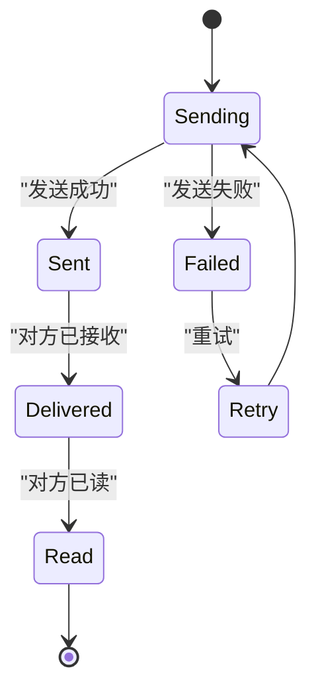

**Diagram sources**
- [Message.dom.tsx](file://ts/components/conversation/Message.dom.tsx#L1-L3467)

### 无障碍访问支持
对话组件提供了良好的无障碍访问支持，包括键盘导航、屏幕阅读器兼容性和高对比度模式。

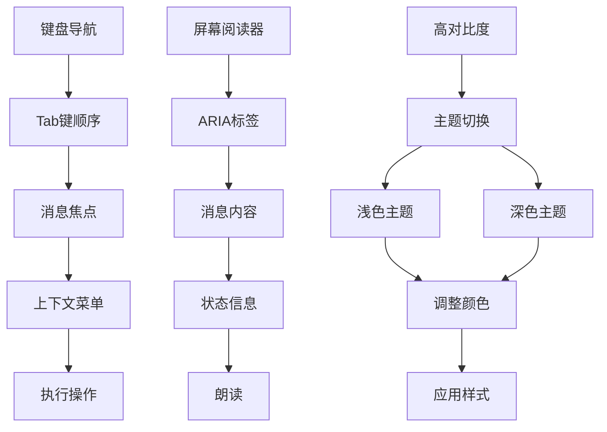

**Diagram sources**
- [Message.dom.tsx](file://ts/components/conversation/Message.dom.tsx#L1-L3467)
- [MessageBody.dom.tsx](file://ts/components/conversation/MessageBody.dom.tsx#L1-L196)

## 结论
Signal-Desktop的对话组件是一个复杂而功能丰富的用户界面系统，提供了完整的消息交流体验。通过合理的架构设计和性能优化，该组件能够高效地处理大量消息，同时保持良好的用户体验。组件的模块化设计使得功能扩展和维护变得更加容易，而响应式设计确保了在不同设备上的良好显示效果。