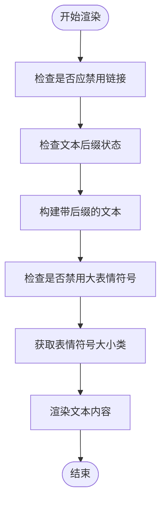
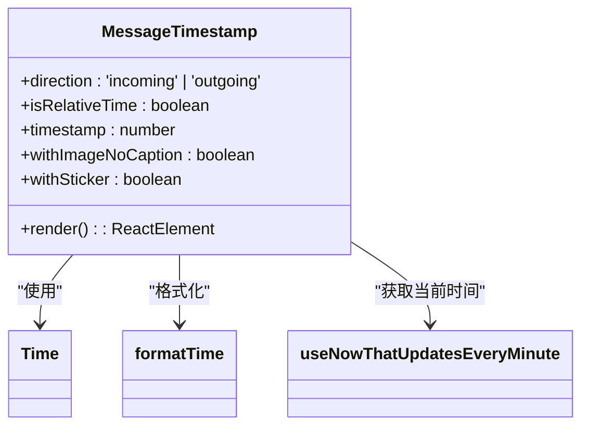
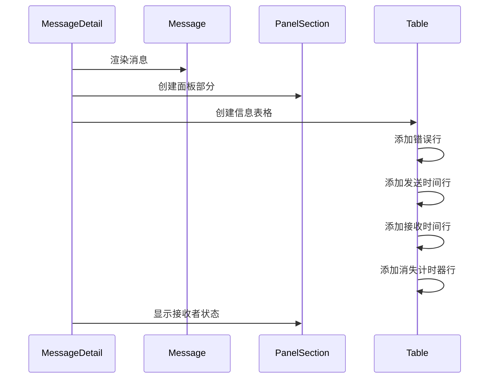
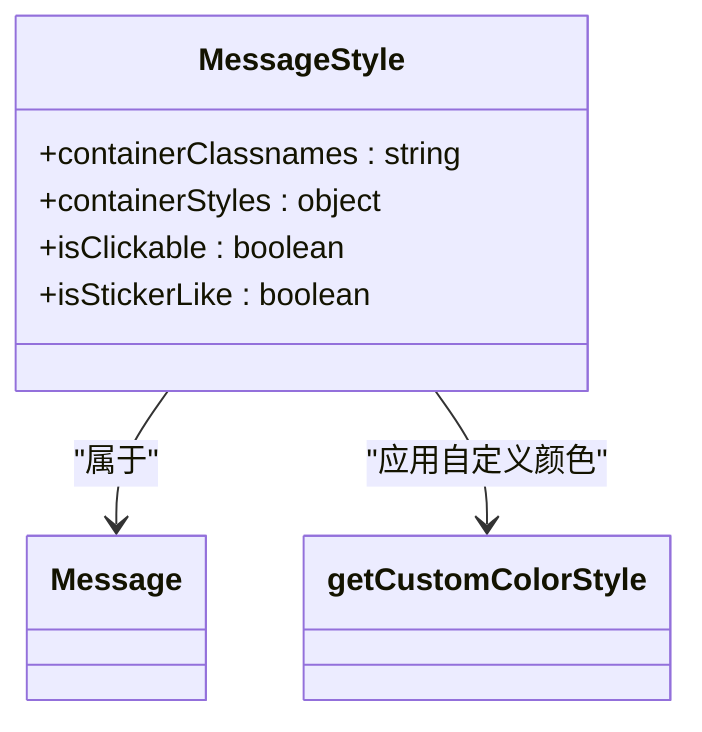
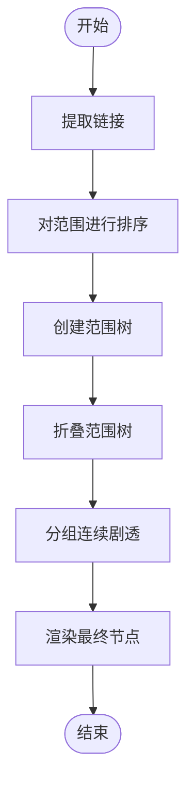
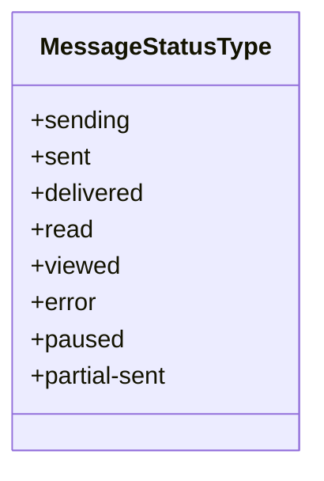
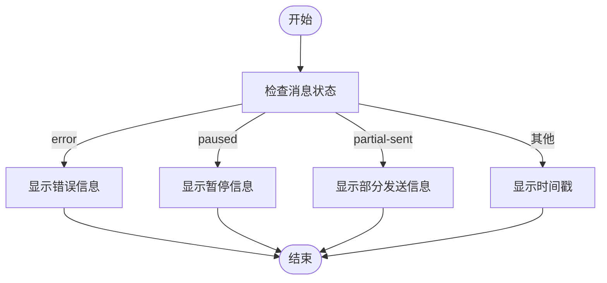
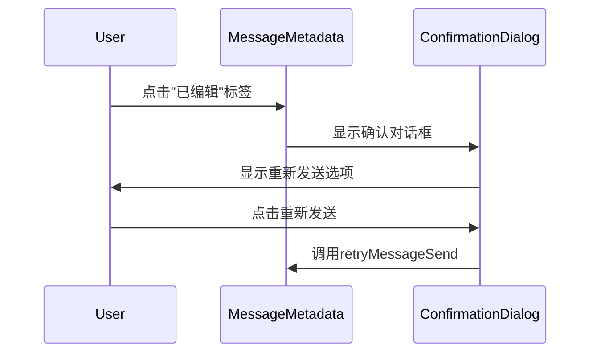
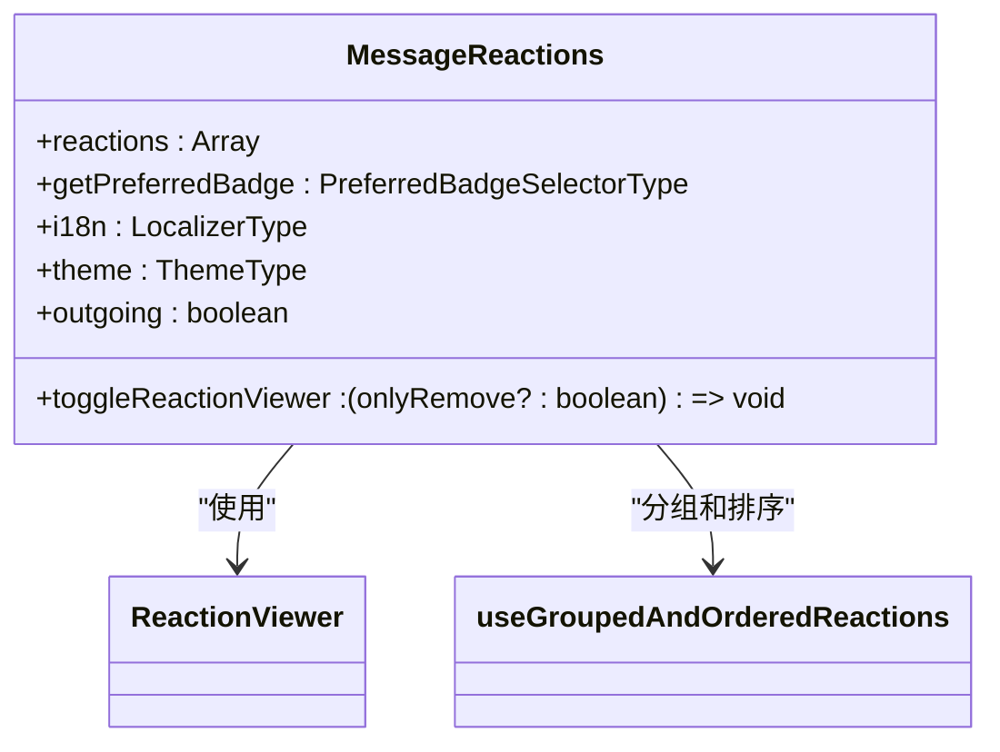
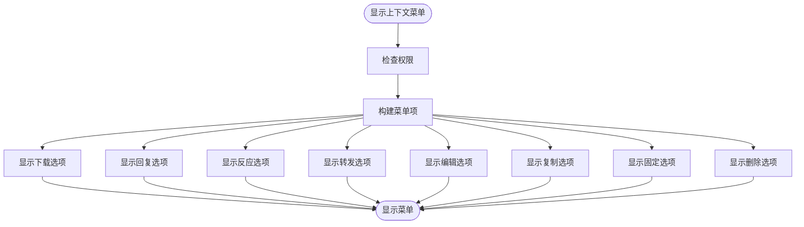

# 消息组件

<cite>
**本文档引用的文件**   
- [Message.dom.tsx](file://ts/components/conversation/Message.dom.tsx)
- [MessageBody.dom.tsx](file://ts/components/conversation/MessageBody.dom.tsx)
- [MessageTimestamp.dom.tsx](file://ts/components/conversation/MessageTimestamp.dom.tsx)
- [MessageDetail.dom.tsx](file://ts/components/conversation/MessageDetail.dom.tsx)
- [MessageTextRenderer.dom.tsx](file://ts/components/conversation/MessageTextRenderer.dom.tsx)
- [MessageMetadata.dom.tsx](file://ts/components/conversation/MessageMetadata.dom.tsx)
- [MessageContextMenu.dom.tsx](file://ts/components/conversation/MessageContextMenu.dom.tsx)
- [MessageBody.scss](file://stylesheets/components/MessageBody.scss)
- [MessageDetail.scss](file://stylesheets/components/MessageDetail.scss)
- [MessageTimestamp.scss](file://stylesheets/components/MessageTimestamp.scss)
</cite>

## 目录
1. [简介](#简介)
2. [核心组件分析](#核心组件分析)
3. [消息气泡视觉样式](#消息气泡视觉样式)
4. [文本渲染与内容处理](#文本渲染与内容处理)
5. [消息状态显示机制](#消息状态显示机制)
6. [交互功能实现](#交互功能实现)
7. [上下文菜单](#上下文菜单)
8. [性能优化策略](#性能优化策略)
9. [错误处理与无障碍访问](#错误处理与无障碍访问)

## 简介
本文档深入解析Signal-Desktop应用中的消息组件实现。文档详细分析了`Message`、`MessageBody`、`MessageTimestamp`和`MessageDetail`等核心组件的props定义、状态管理、样式应用和渲染逻辑。涵盖了消息气泡的视觉样式、文本渲染、链接识别、表情符号处理以及消息状态（已发送、已送达、已读）的显示机制。同时，文档还提供了消息编辑、删除、引用、反应等交互功能的代码示例，解释了消息上下文菜单的触发和操作流程，并包括了性能优化策略。

## 核心组件分析

### Message组件
`Message`组件是消息系统的核心，负责协调和渲染消息的所有组成部分。它是一个React纯组件，管理着消息的交互状态、过期检查和反应查看器。

**组件属性**
- `PropsData`: 包含消息的基本数据，如ID、文本、时间戳、方向（incoming/outgoing）、状态等
- `PropsHousekeeping`: 包含容器引用、断点宽度、首选徽章选择器等辅助属性
- `PropsActions`: 包含各种操作函数，如重试发送、删除消息、显示轻盒等

**状态管理**
组件维护了多个状态，包括：
- `metadataWidth`: 元数据宽度，用于防止文本跳动
- `expiring`和`expired`: 消息过期状态
- `imageBroken`: 图像加载失败状态
- `isTargeted`: 消息是否被选中
- `reactionViewerRoot`: 反应查看器的根元素
- `giftBadgeCounter`: 礼物徽章计数器

**生命周期方法**
- `componentDidMount`: 初始化各种定时器，如目标消息定时器、礼物徽章更新定时器和过期检查定时器
- `componentWillUnmount`: 清理所有定时器和事件监听器
- `componentDidUpdate`: 处理状态更新，如目标消息的显示和发送完成事件

**Section sources**
- [Message.dom.tsx](file://ts/components/conversation/Message.dom.tsx#L635-L800)

### MessageBody组件
`MessageBody`组件负责渲染消息的文本内容，集成了表情符号、链接和换行的处理。

**组件属性**
- `bodyRanges`: 包含文本格式化信息，如提及、链接和格式化样式
- `disableJumbomoji`: 是否禁用大表情符号
- `disableLinks`: 是否禁用链接交互
- `isSpoilerExpanded`: 记录已展开的剧透内容
- `kickOffBodyDownload`: 启动正文下载的回调函数

**渲染逻辑**
组件首先确定是否应禁用链接，然后根据文本内容决定是否显示"查看更多"按钮、下载状态或消息过长提示。它使用`MessageTextRenderer`组件来实际渲染文本内容，并根据表情符号的数量决定其大小。

**Section sources**
- [MessageBody.dom.tsx](file://ts/components/conversation/MessageBody.dom.tsx#L72-L195)

### MessageTimestamp组件
`MessageTimestamp`组件负责显示消息的时间戳，支持相对时间和绝对时间的显示。

**组件属性**
- `direction`: 消息方向（incoming/outgoing）
- `isRelativeTime`: 是否显示相对时间
- `timestamp`: 消息时间戳
- `withImageNoCaption`: 是否在无标题图像旁边显示
- `withSticker`: 是否在贴纸旁边显示

**渲染逻辑**
组件使用`useNowThatUpdatesEveryMinute`钩子来确保时间戳每分钟更新一次。它通过`formatTime`函数格式化时间，并根据组件属性应用相应的CSS类。

**Section sources**
- [MessageTimestamp.dom.tsx](file://ts/components/conversation/MessageTimestamp.dom.tsx#L26-L53)

### MessageDetail组件
`MessageDetail`组件用于显示消息的详细信息，通常在用户查看消息详情时使用。

**组件属性**
- `contacts`: 接收者列表，包含每个接收者的状态和错误信息
- `errors`: 消息级别的错误列表
- `message`: 消息数据
- `receivedAt`: 消息接收时间
- `sentAt`: 消息发送时间

**渲染逻辑**
组件首先渲染消息本身，然后显示消息的元数据，包括发送时间、接收时间（如果是入站消息）和消失计时器。它还显示每个接收者的状态和错误信息。

**Section sources**
- [MessageDetail.dom.tsx](file://ts/components/conversation/MessageDetail.dom.tsx#L130-L488)

## 消息气泡视觉样式

### CSS类结构
消息气泡的样式通过一系列CSS类来控制，这些类根据消息的不同属性动态应用。

**主要CSS类**
- `module-message__container`: 消息容器，控制整体布局
- `module-message__container--incoming` / `module-message__container--outgoing`: 根据消息方向应用不同的样式
- `module-message__container--targeted`: 选中消息的高亮样式
- `module-message__text`: 消息文本样式
- `module-message__metadata`: 消息元数据样式

**颜色和主题**
消息气泡的颜色根据会话颜色和自定义颜色进行设置。对于出站消息，使用`getCustomColorStyle`函数应用自定义颜色。

**Section sources**
- [Message.dom.tsx](file://ts/components/conversation/Message.dom.tsx#L3237-L3265)
- [MessageBody.scss](file://stylesheets/components/MessageBody.scss#L1-L74)

## 文本渲染与内容处理

### MessageTextRenderer组件
`MessageTextRenderer`组件是文本渲染的核心，负责处理表情符号、链接、提及和格式化。

**处理流程**
1. 提取链接
2. 对范围进行排序
3. 创建范围树
4. 将树折叠为扁平列表
5. 渲染最终节点

**组件属性**
- `bodyRanges`: 要应用的文本范围
- `disableLinks`: 是否禁用链接
- `jumboEmojiSize`: 大表情符号的大小
- `isSpoilerExpanded`: 已展开的剧透
- `onExpandSpoiler`: 剧透展开回调

**Section sources**
- [MessageTextRenderer.dom.tsx](file://ts/components/conversation/MessageTextRenderer.dom.tsx#L59-L133)

### 表情符号处理
表情符号处理通过`Emojify`组件实现，该组件能够识别和渲染表情符号。

**处理逻辑**
- 使用`emojiRegex`库识别表情符号
- 根据上下文决定表情符号的大小
- 支持大表情符号（Jumbomoji）模式

**Section sources**
- [MessageTextRenderer.dom.tsx](file://ts/components/conversation/MessageTextRenderer.dom.tsx#L32-L33)
- [MessageBody.dom.tsx](file://ts/components/conversation/MessageBody.dom.tsx#L18-L40)

### 链接识别
链接识别通过`linkify`库实现，支持多种协议。

**支持的协议**
- HTTP/HTTPS
- FTP
- Mailto
- Tel

**安全检查**
- 使用`isLinkSneaky`函数检查可疑链接
- 只有在`disableLinks`为false时才启用链接

**Section sources**
- [MessageTextRenderer.dom.tsx](file://ts/components/conversation/MessageTextRenderer.dom.tsx#L74-L76)
- [MessageTextRenderer.dom.tsx](file://ts/components/conversation/MessageTextRenderer.dom.tsx#L273-L288)

## 消息状态显示机制

### 状态类型
消息支持多种状态，通过`MessageStatusType`枚举定义：

### 状态显示
状态显示通过`MessageMetadata`组件实现，根据消息状态显示不同的信息。

**显示逻辑**
- `error`: 显示发送失败或删除失败
- `paused`: 显示发送暂停
- `partial-sent`: 显示部分发送
- 其他状态: 显示时间戳和状态图标

**Section sources**
- [MessageMetadata.dom.tsx](file://ts/components/conversation/MessageMetadata.dom.tsx#L89-L156)

### 消失计时器
消失计时器通过`ExpireTimer`组件实现，显示消息的剩余时间。

**组件属性**
- `expirationLength`: 过期时长
- `expirationTimestamp`: 过期时间戳
- `direction`: 消息方向

**Section sources**
- [MessageMetadata.dom.tsx](file://ts/components/conversation/MessageMetadata.dom.tsx#L221-L229)

## 交互功能实现

### 消息编辑
消息编辑功能通过`MessageMetadata`组件中的编辑按钮实现。

**实现逻辑**
- 显示"已编辑"标签
- 点击标签显示编辑历史
- 支持重新发送编辑后的消息

**Section sources**
- [MessageMetadata.dom.tsx](file://ts/components/conversation/MessageMetadata.dom.tsx#L206-L214)

### 消息删除
消息删除支持删除给所有人功能。

**实现逻辑**
- 显示删除给所有人状态
- 处理删除失败情况
- 支持重新尝试删除

**Section sources**
- [Message.dom.tsx](file://ts/components/conversation/Message.dom.tsx#L342-L344)
- [MessageMetadata.dom.tsx](file://ts/components/conversation/MessageMetadata.dom.tsx#L97-L98)

### 消息引用
消息引用通过`Quote`组件实现。

**组件属性**
- `text`: 引用的文本
- `authorTitle`: 引用消息的作者
- `isFromMe`: 是否来自自己
- `referencedMessageNotFound`: 引用消息是否未找到

**Section sources**
- [Message.dom.tsx](file://ts/components/conversation/Message.dom.tsx#L2076-L2128)

### 消息反应
消息反应功能通过`ReactionViewer`组件实现。

**实现逻辑**
- 显示反应计数器
- 支持双击添加反应
- 显示反应查看器弹出窗口

**Section sources**
- [Message.dom.tsx](file://ts/components/conversation/Message.dom.tsx#L462-L633)

## 上下文菜单

### MessageContextMenu组件
`MessageContextMenu`组件实现了消息的上下文菜单功能。

**组件属性**
- `onDownload`: 下载回调
- `onEdit`: 编辑回调
- `onReplyToMessage`: 回复回调
- `onReact`: 反应回调
- `onCopy`: 复制回调
- `onForward`: 转发回调
- `onDeleteMessage`: 删除消息回调

**菜单项**
- 下载
- 回复
- 反应
- 转发
- 编辑
- 复制
- 固定/取消固定消息
- 更多信息
- 删除消息

**Section sources**
- [MessageContextMenu.dom.tsx](file://ts/components/conversation/MessageContextMenu.dom.tsx#L31-L138)

## 性能优化策略

### 文本渲染优化
文本渲染通过以下策略进行优化：

**虚拟化**
- 使用`React.memo`和`useMemo`避免不必要的重新渲染
- 对范围树进行缓存

**分批处理**
- 将文本处理分解为多个步骤
- 使用`React.useMemo`缓存处理结果

**Section sources**
- [MessageTextRenderer.dom.tsx](file://ts/components/conversation/MessageTextRenderer.dom.tsx#L73-L114)

### DOM更新效率
通过以下方式提高DOM更新效率：

**批量更新**
- 使用`setState`的函数形式进行批量更新
- 避免在循环中调用`setState`

**事件委托**
- 使用事件委托减少事件监听器数量
- 在容器级别处理点击事件

**Section sources**
- [Message.dom.tsx](file://ts/components/conversation/Message.dom.tsx#L742-L790)

## 错误处理与无障碍访问

### 错误处理
系统实现了全面的错误处理机制。

**错误类型**
- 消息发送错误
- 附件下载错误
- 图像加载错误
- 消息引用错误

**处理方式**
- 显示用户友好的错误消息
- 提供重试选项
- 记录错误日志

**Section sources**
- [Message.dom.tsx](file://ts/components/conversation/Message.dom.tsx#L718-L724)
- [MessageMetadata.dom.tsx](file://ts/components/conversation/MessageMetadata.dom.tsx#L94-L143)

### 无障碍访问
系统提供了良好的无障碍访问支持。

**ARIA属性**
- 使用`role="article"`标识消息
- 使用`aria-label`提供上下文信息
- 使用`aria-expanded`管理剧透状态

**键盘导航**
- 支持Tab键导航
- 支持Enter和Space键激活
- 提供键盘焦点管理

**Section sources**
- [Message.dom.tsx](file://ts/components/conversation/Message.dom.tsx#L3321-L3466)