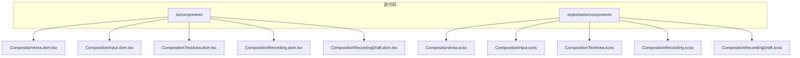
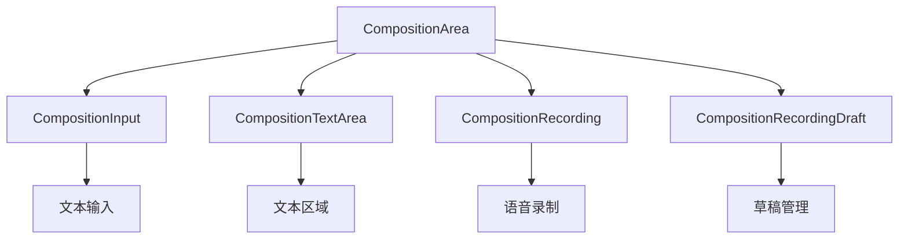
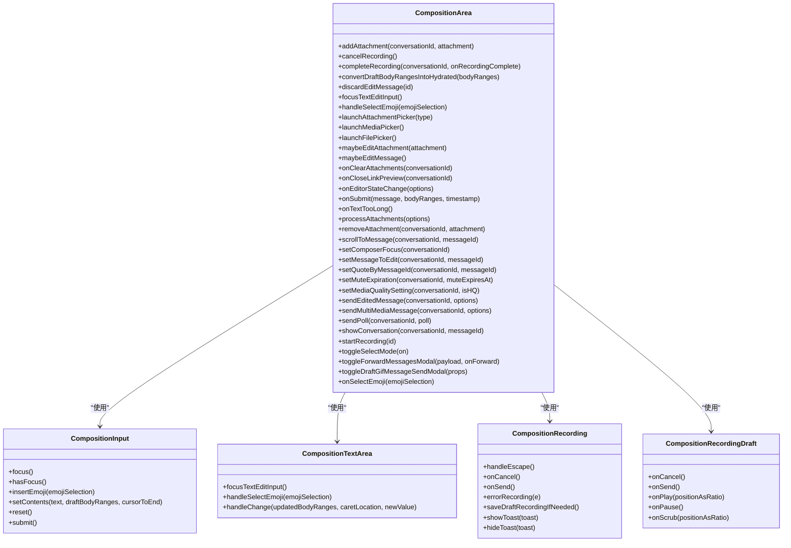
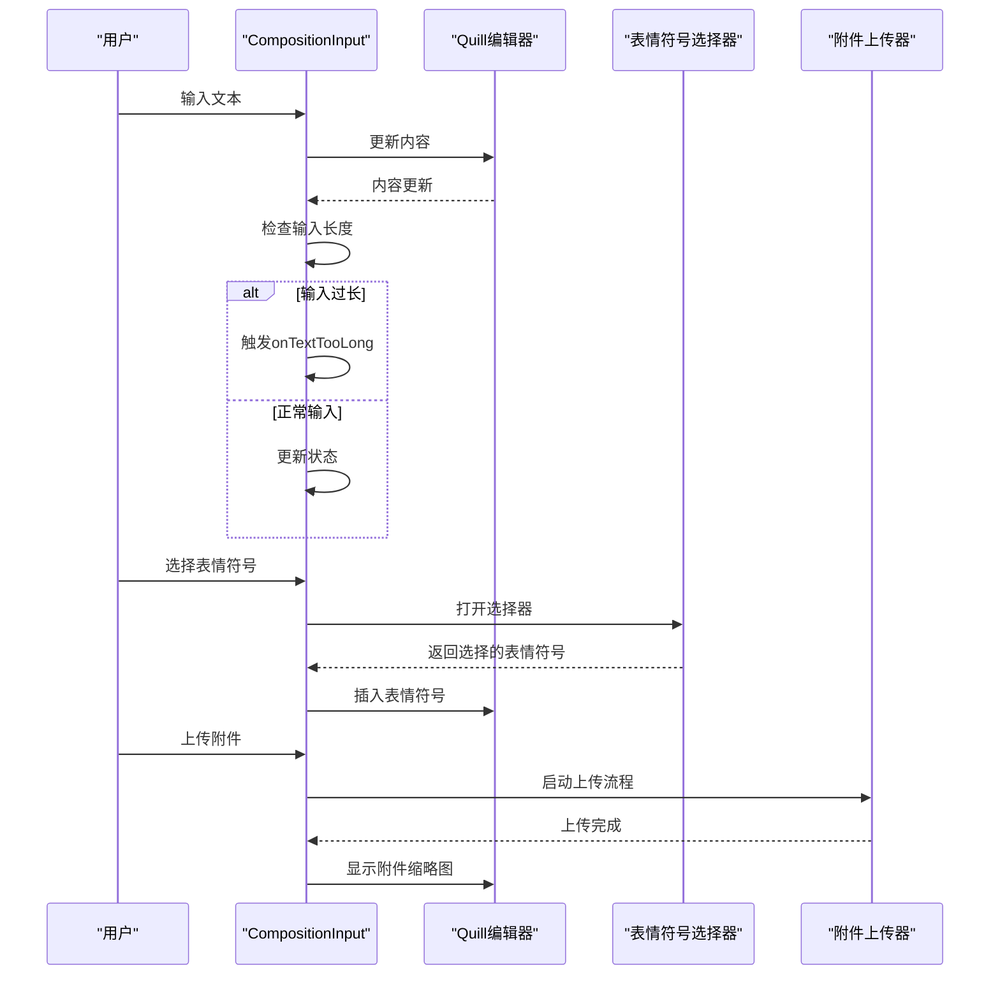
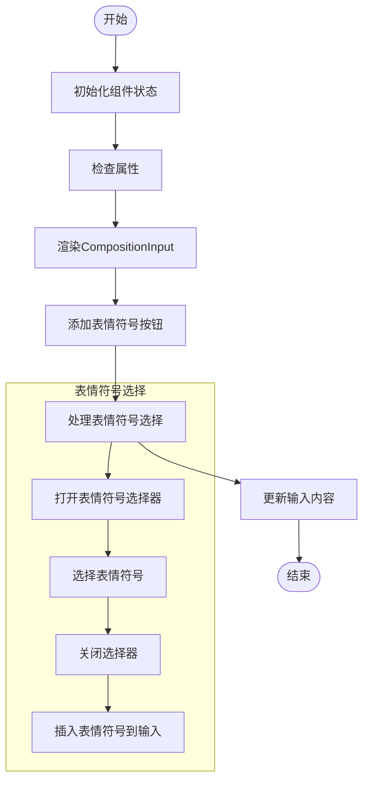
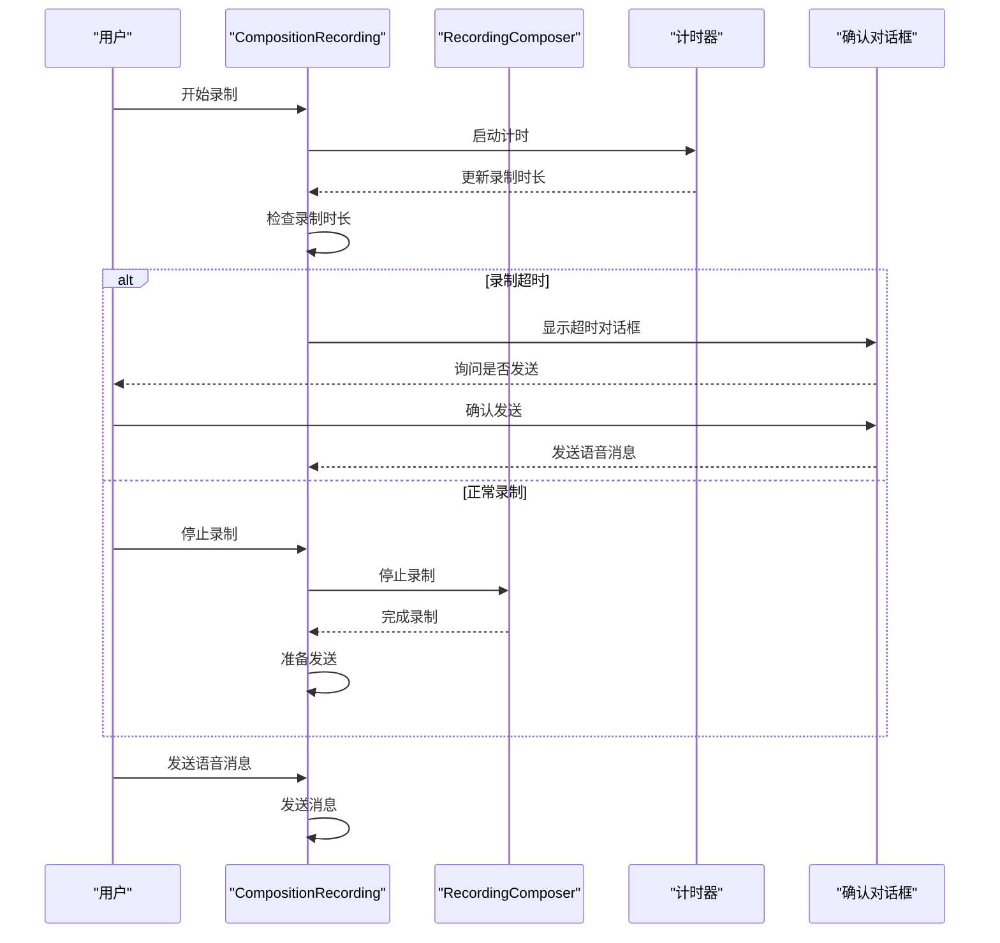
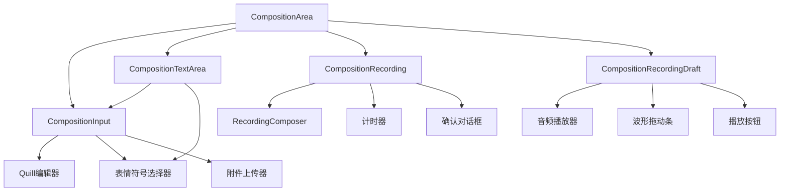

# 输入组件

<cite>
**本文档引用的文件**   
- [CompositionArea.dom.tsx](file://ts/components/CompositionArea.dom.tsx)
- [CompositionInput.dom.tsx](file://ts/components/CompositionInput.dom.tsx)
- [CompositionTextArea.dom.tsx](file://ts/components/CompositionTextArea.dom.tsx)
- [CompositionRecording.dom.tsx](file://ts/components/CompositionRecording.dom.tsx)
- [CompositionRecordingDraft.dom.tsx](file://ts/components/CompositionRecordingDraft.dom.tsx)
- [CompositionArea.scss](file://stylesheets/components/CompositionArea.scss)
- [CompositionInput.scss](file://stylesheets/components/CompositionInput.scss)
- [CompositionTextArea.scss](file://stylesheets/components/CompositionTextArea.scss)
- [CompositionRecording.scss](file://stylesheets/components/CompositionRecording.scss)
- [CompositionRecordingDraft.scss](file://stylesheets/components/CompositionRecordingDraft.scss)
</cite>

## 目录
1. [简介](#简介)
2. [项目结构](#项目结构)
3. [核心组件](#核心组件)
4. [架构概述](#架构概述)
5. [详细组件分析](#详细组件分析)
6. [依赖分析](#依赖分析)
7. [性能考量](#性能考量)
8. [故障排除指南](#故障排除指南)
9. [结论](#结论)

## 简介
Signal-Desktop的输入组件为用户提供了一个功能丰富且直观的界面，用于发送消息、附件和语音记录。这些组件包括CompositionArea、CompositionInput、CompositionTextArea和CompositionRecording，它们共同构成了应用程序的核心交互部分。本文档旨在全面解析这些组件的架构与实现，涵盖文本输入、表情符号选择、附件添加、语音录制和草稿保存等功能细节。

## 项目结构
Signal-Desktop的项目结构清晰地组织了各个组件和样式文件。输入组件主要位于`ts/components`目录下，而相应的样式文件则位于`stylesheets/components`目录中。这种分离有助于维护代码的可读性和可维护性。

**图源**
- [CompositionArea.dom.tsx](file://ts/components/CompositionArea.dom.tsx)
- [CompositionInput.dom.tsx](file://ts/components/CompositionInput.dom.tsx)
- [CompositionTextArea.dom.tsx](file://ts/components/CompositionTextArea.dom.tsx)
- [CompositionRecording.dom.tsx](file://ts/components/CompositionRecording.dom.tsx)
- [CompositionRecordingDraft.dom.tsx](file://ts/components/CompositionRecordingDraft.dom.tsx)
- [CompositionArea.scss](file://stylesheets/components/CompositionArea.scss)
- [CompositionInput.scss](file://stylesheets/components/CompositionInput.scss)
- [CompositionTextArea.scss](file://stylesheets/components/CompositionTextArea.scss)
- [CompositionRecording.scss](file://stylesheets/components/CompositionRecording.scss)
- [CompositionRecordingDraft.scss](file://stylesheets/components/CompositionRecordingDraft.scss)

**节源**
- [CompositionArea.dom.tsx](file://ts/components/CompositionArea.dom.tsx)
- [CompositionInput.dom.tsx](file://ts/components/CompositionInput.dom.tsx)
- [CompositionTextArea.dom.tsx](file://ts/components/CompositionTextArea.dom.tsx)
- [CompositionRecording.dom.tsx](file://ts/components/CompositionRecording.dom.tsx)
- [CompositionRecordingDraft.dom.tsx](file://ts/components/CompositionRecordingDraft.dom.tsx)
- [CompositionArea.scss](file://stylesheets/components/CompositionArea.scss)
- [CompositionInput.scss](file://stylesheets/components/CompositionInput.scss)
- [CompositionTextArea.scss](file://stylesheets/components/CompositionTextArea.scss)
- [CompositionRecording.scss](file://stylesheets/components/CompositionRecording.scss)
- [CompositionRecordingDraft.scss](file://stylesheets/components/CompositionRecordingDraft.scss)

## 核心组件
Signal-Desktop的输入组件由多个核心组件构成，每个组件都有其特定的功能和职责。这些组件通过紧密协作，提供了一个无缝的用户体验。

**节源**
- [CompositionArea.dom.tsx](file://ts/components/CompositionArea.dom.tsx)
- [CompositionInput.dom.tsx](file://ts/components/CompositionInput.dom.tsx)
- [CompositionTextArea.dom.tsx](file://ts/components/CompositionTextArea.dom.tsx)
- [CompositionRecording.dom.tsx](file://ts/components/CompositionRecording.dom.tsx)
- [CompositionRecordingDraft.dom.tsx](file://ts/components/CompositionRecordingDraft.dom.tsx)

## 架构概述
输入组件的整体架构设计遵循模块化原则，确保各组件之间的职责明确且易于维护。CompositionArea作为容器组件，负责协调其他组件的工作；CompositionInput和CompositionTextArea处理文本输入；CompositionRecording和CompositionRecordingDraft则专注于语音录制功能。

**图源**
- [CompositionArea.dom.tsx](file://ts/components/CompositionArea.dom.tsx)
- [CompositionInput.dom.tsx](file://ts/components/CompositionInput.dom.tsx)
- [CompositionTextArea.dom.tsx](file://ts/components/CompositionTextArea.dom.tsx)
- [CompositionRecording.dom.tsx](file://ts/components/CompositionRecording.dom.tsx)
- [CompositionRecordingDraft.dom.tsx](file://ts/components/CompositionRecordingDraft.dom.tsx)

**节源**
- [CompositionArea.dom.tsx](file://ts/components/CompositionArea.dom.tsx)
- [CompositionInput.dom.tsx](file://ts/components/CompositionInput.dom.tsx)
- [CompositionTextArea.dom.tsx](file://ts/components/CompositionTextArea.dom.tsx)
- [CompositionRecording.dom.tsx](file://ts/components/CompositionRecording.dom.tsx)
- [CompositionRecordingDraft.dom.tsx](file://ts/components/CompositionRecordingDraft.dom.tsx)

## 详细组件分析
### CompositionArea 分析
CompositionArea是输入组件的主容器，负责整合和管理其他子组件。它提供了文本输入、附件添加、语音录制和草稿保存等功能的统一界面。

#### 类图

**图源**
- [CompositionArea.dom.tsx](file://ts/components/CompositionArea.dom.tsx)
- [CompositionInput.dom.tsx](file://ts/components/CompositionInput.dom.tsx)
- [CompositionTextArea.dom.tsx](file://ts/components/CompositionTextArea.dom.tsx)
- [CompositionRecording.dom.tsx](file://ts/components/CompositionRecording.dom.tsx)
- [CompositionRecordingDraft.dom.tsx](file://ts/components/CompositionRecordingDraft.dom.tsx)

**节源**
- [CompositionArea.dom.tsx](file://ts/components/CompositionArea.dom.tsx)
- [CompositionInput.dom.tsx](file://ts/components/CompositionInput.dom.tsx)
- [CompositionTextArea.dom.tsx](file://ts/components/CompositionTextArea.dom.tsx)
- [CompositionRecording.dom.tsx](file://ts/components/CompositionRecording.dom.tsx)
- [CompositionRecordingDraft.dom.tsx](file://ts/components/CompositionRecordingDraft.dom.tsx)

### CompositionInput 分析
CompositionInput组件负责处理基本的文本输入功能，支持格式化、@提及和链接预览生成。它还集成了表情符号选择器和附件上传功能。

#### 序列图

**图源**
- [CompositionInput.dom.tsx](file://ts/components/CompositionInput.dom.tsx)

**节源**
- [CompositionInput.dom.tsx](file://ts/components/CompositionInput.dom.tsx)

### CompositionTextArea 分析
CompositionTextArea是一个增强版的文本输入区域，专为需要收集消息或标题的模态窗口设计。它支持表情符号选择和@提及自动补全，并提供了一个浮动的表情符号选择按钮。

#### 流程图

**图源**
- [CompositionTextArea.dom.tsx](file://ts/components/CompositionTextArea.dom.tsx)

**节源**
- [CompositionTextArea.dom.tsx](file://ts/components/CompositionTextArea.dom.tsx)

### CompositionRecording 分析
CompositionRecording组件专注于语音录制功能，允许用户录制并发送语音消息。它提供了录制计时器、取消和发送按钮，并在录制超时时显示确认对话框。

#### 序列图

**图源**
- [CompositionRecording.dom.tsx](file://ts/components/CompositionRecording.dom.tsx)

**节源**
- [CompositionRecording.dom.tsx](file://ts/components/CompositionRecording.dom.tsx)

## 依赖分析
输入组件之间存在紧密的依赖关系，确保功能的完整性和一致性。CompositionArea作为顶层组件，依赖于所有其他组件来实现完整的输入功能。

**图源**
- [CompositionArea.dom.tsx](file://ts/components/CompositionArea.dom.tsx)
- [CompositionInput.dom.tsx](file://ts/components/CompositionInput.dom.tsx)
- [CompositionTextArea.dom.tsx](file://ts/components/CompositionTextArea.dom.tsx)
- [CompositionRecording.dom.tsx](file://ts/components/CompositionRecording.dom.tsx)
- [CompositionRecordingDraft.dom.tsx](file://ts/components/CompositionRecordingDraft.dom.tsx)

**节源**
- [CompositionArea.dom.tsx](file://ts/components/CompositionArea.dom.tsx)
- [CompositionInput.dom.tsx](file://ts/components/CompositionInput.dom.tsx)
- [CompositionTextArea.dom.tsx](file://ts/components/CompositionTextArea.dom.tsx)
- [CompositionRecording.dom.tsx](file://ts/components/CompositionRecording.dom.tsx)
- [CompositionRecordingDraft.dom.tsx](file://ts/components/CompositionRecordingDraft.dom.tsx)

## 性能考量
为了确保输入组件的高性能，Signal-Desktop采用了多种优化策略。例如，使用React的useMemo和useCallback钩子来避免不必要的重新渲染，以及通过懒加载技术减少初始加载时间。

## 故障排除指南
在使用输入组件时，可能会遇到一些常见问题。以下是一些解决方案：

- **问题：输入框无法获得焦点**
  - **解决方法**：检查是否有其他组件阻止了焦点事件的传播，或者尝试手动调用`focus()`方法。

- **问题：表情符号选择器不显示**
  - **解决方法**：确保`emojiPickerOpen`状态正确更新，并检查CSS样式是否正确应用。

- **问题：语音录制失败**
  - **解决方法**：检查浏览器权限设置，确保麦克风访问被允许，并查看控制台日志以获取更多错误信息。

**节源**
- [CompositionArea.dom.tsx](file://ts/components/CompositionArea.dom.tsx)
- [CompositionInput.dom.tsx](file://ts/components/CompositionInput.dom.tsx)
- [CompositionTextArea.dom.tsx](file://ts/components/CompositionTextArea.dom.tsx)
- [CompositionRecording.dom.tsx](file://ts/components/CompositionRecording.dom.tsx)
- [CompositionRecordingDraft.dom.tsx](file://ts/components/CompositionRecordingDraft.dom.tsx)

## 结论
Signal-Desktop的输入组件通过精心设计的架构和高效的实现，为用户提供了一个强大且易用的消息输入体验。通过对这些组件的深入分析，我们可以更好地理解其工作原理，并在此基础上进行进一步的优化和扩展。