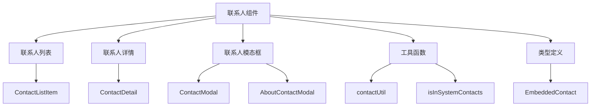
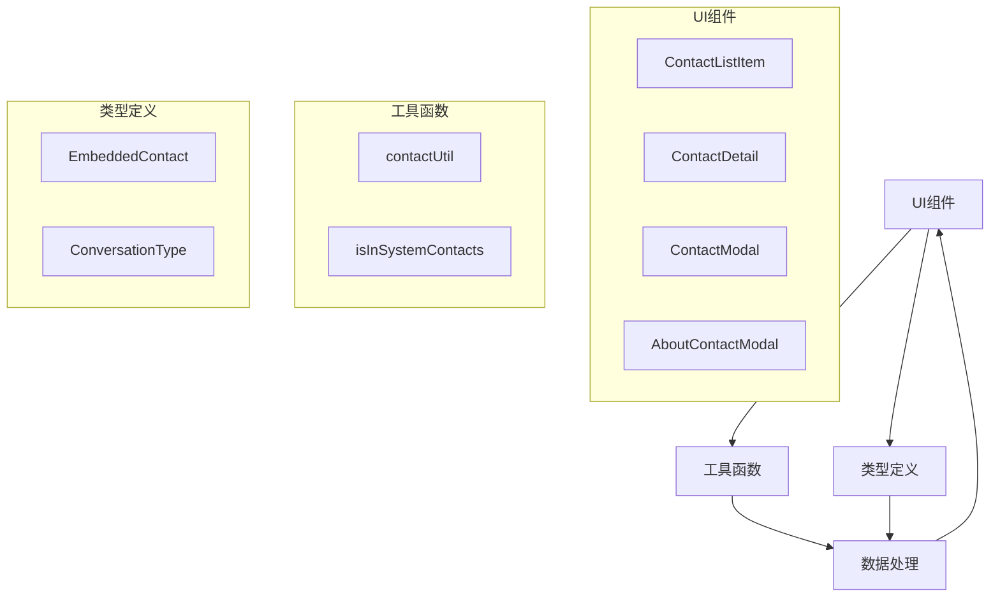
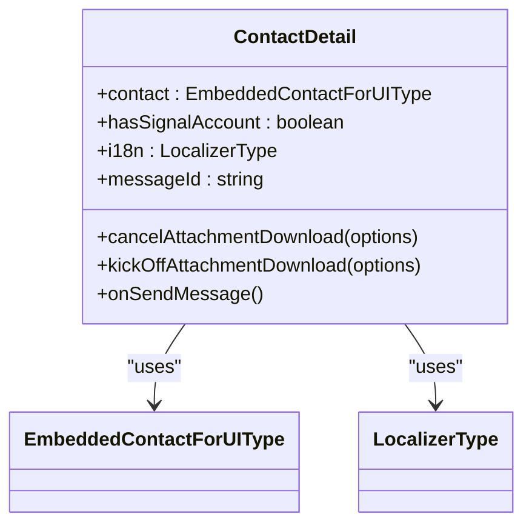
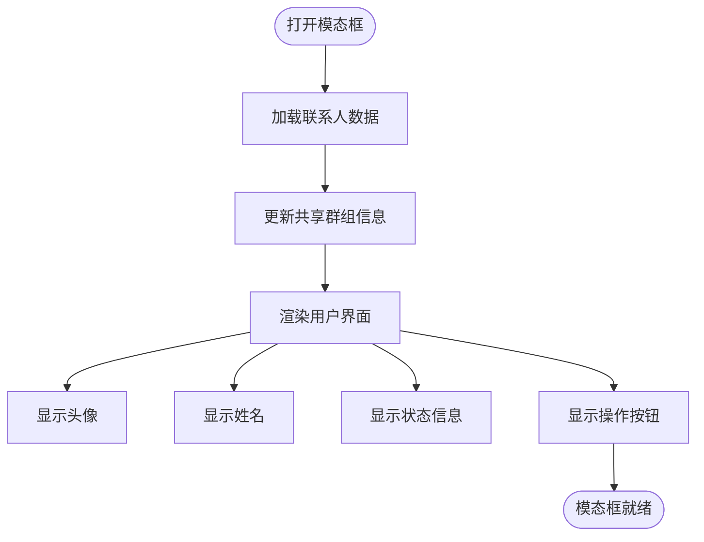
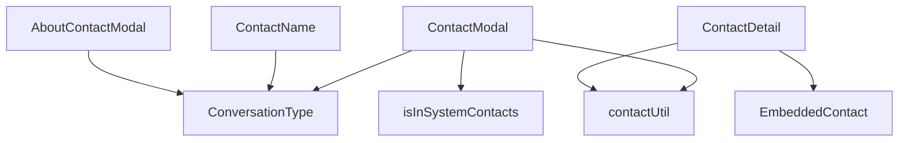

# 联系人组件

<cite>
**本文档中引用的文件**  
- [ContactListItem.dom.tsx](file://ts/components/conversationList/ContactListItem.dom.tsx)
- [ContactDetail.dom.tsx](file://ts/components/conversation/ContactDetail.dom.tsx)
- [ContactModal.dom.tsx](file://ts/components/conversation/ContactModal.dom.tsx)
- [AboutContactModal.dom.tsx](file://ts/components/conversation/AboutContactModal.dom.tsx)
- [ContactName.dom.tsx](file://ts/components/conversation/ContactName.dom.tsx)
- [ContactSpoofingReviewDialog.dom.tsx](file://ts/components/conversation/ContactSpoofingReviewDialog.dom.tsx)
- [ContactPill.dom.tsx](file://ts/components/ContactPill.dom.tsx)
- [ContactPills.dom.tsx](file://ts/components/ContactPills.dom.tsx)
- [contactUtil.dom.tsx](file://ts/components/conversation/contactUtil.dom.tsx)
- [isInSystemContacts.std.ts](file://ts/util/isInSystemContacts.std.ts)
- [EmbeddedContact.std.ts](file://ts/types/EmbeddedContact.std.js)
</cite>

## 目录
1. [简介](#简介)
2. [项目结构](#项目结构)
3. [核心组件](#核心组件)
4. [架构概述](#架构概述)
5. [详细组件分析](#详细组件分析)
6. [依赖分析](#依赖分析)
7. [性能考虑](#性能考虑)
8. [故障排除指南](#故障排除指南)
9. [结论](#结论)

## 简介
本文档详细描述了Signal-Desktop应用程序中的联系人组件。涵盖联系人列表、联系人详情、联系人模态框的视觉外观和用户交互模式。文档记录了ContactListItem、ContactDetail、ContactModal等核心组件的props、事件和状态管理机制。同时包括联系人搜索、选择、编辑等操作的实现方式，以及联系人头像、姓名、状态指示器的自定义选项。文档还详细说明了联系人验证、安全号码变更等安全相关UI的实现细节，并提供了无障碍访问指南和性能优化建议，如联系人列表的虚拟滚动实现。

## 项目结构
Signal-Desktop的联系人相关组件主要分布在`ts/components/conversation`和`ts/components/conversationList`目录中。核心UI组件包括ContactListItem（联系人列表项）、ContactDetail（联系人详情）、ContactModal（联系人模态框）等。这些组件与`ts/util`目录下的工具函数和`ts/types`目录下的类型定义紧密协作，实现了完整的联系人管理功能。



**Diagram sources**
- [ContactListItem.dom.tsx](file://ts/components/conversationList/ContactListItem.dom.tsx)
- [ContactDetail.dom.tsx](file://ts/components/conversation/ContactDetail.dom.tsx)
- [ContactModal.dom.tsx](file://ts/components/conversation/ContactModal.dom.tsx)
- [AboutContactModal.dom.tsx](file://ts/components/conversation/AboutContactModal.dom.tsx)

**Section sources**
- [ContactListItem.dom.tsx](file://ts/components/conversationList/ContactListItem.dom.tsx)
- [ContactDetail.dom.tsx](file://ts/components/conversation/ContactDetail.dom.tsx)
- [ContactModal.dom.tsx](file://ts/components/conversation/ContactModal.dom.tsx)

## 核心组件
Signal-Desktop的联系人系统由多个核心组件构成，包括ContactListItem用于显示联系人列表中的单个项目，ContactDetail用于展示嵌入式联系人的详细信息，ContactModal提供联系人详情的模态框视图，以及AboutContactModal用于显示联系人的完整信息。这些组件通过props接收数据和回调函数，实现了灵活的联系人管理和交互功能。

**Section sources**
- [ContactListItem.dom.tsx](file://ts/components/conversationList/ContactListItem.dom.tsx)
- [ContactDetail.dom.tsx](file://ts/components/conversation/ContactDetail.dom.tsx)
- [ContactModal.dom.tsx](file://ts/components/conversation/ContactModal.dom.tsx)
- [AboutContactModal.dom.tsx](file://ts/components/conversation/AboutContactModal.dom.tsx)

## 架构概述
Signal-Desktop的联系人组件采用分层架构设计，上层UI组件（如ContactModal）依赖于底层工具函数（如contactUtil）和类型定义（如EmbeddedContact）。组件间通过props传递数据和事件处理函数，实现了清晰的职责分离。联系人数据从ConversationType类型中获取，通过各种工具函数处理后，由UI组件渲染展示。



**Diagram sources**
- [ContactListItem.dom.tsx](file://ts/components/conversationList/ContactListItem.dom.tsx)
- [ContactDetail.dom.tsx](file://ts/components/conversation/ContactDetail.dom.tsx)
- [ContactModal.dom.tsx](file://ts/components/conversation/ContactModal.dom.tsx)
- [AboutContactModal.dom.tsx](file://ts/components/conversation/AboutContactModal.dom.tsx)
- [contactUtil.dom.tsx](file://ts/components/conversation/contactUtil.dom.tsx)
- [isInSystemContacts.std.ts](file://ts/util/isInSystemContacts.std.ts)
- [EmbeddedContact.std.ts](file://ts/types/EmbeddedContact.std.js)

## 详细组件分析
### ContactListItem 分析
ContactListItem组件负责在联系人列表中渲染单个联系人项。它通过props接收联系人数据和交互回调，展示了联系人的头像、姓名和状态信息。组件支持点击交互，允许用户选择或查看联系人详情。

**Section sources**
- [ContactListItem.dom.tsx](file://ts/components/conversationList/ContactListItem.dom.tsx)

### ContactDetail 分析
ContactDetail组件用于展示嵌入式联系人的详细信息，包括头像、姓名、电话号码、电子邮件和地址等。组件通过props接收联系人数据和国际化函数，支持下载联系人头像和发送消息等操作。



**Diagram sources**
- [ContactDetail.dom.tsx](file://ts/components/conversation/ContactDetail.dom.tsx)
- [EmbeddedContact.std.ts](file://ts/types/EmbeddedContact.std.js)

**Section sources**
- [ContactDetail.dom.tsx](file://ts/components/conversation/ContactDetail.dom.tsx)

### ContactModal 分析
ContactModal组件提供了一个模态框界面，用于显示联系人的详细信息和执行相关操作。用户可以通过该模态框查看联系人头像、发送消息、进行音视频通话、管理群组成员权限等。组件支持多种视图状态，包括默认视图、头像查看视图和徽章查看视图。

```mermaid
stateDiagram-v2
[*] --> Default
Default --> ShowingAvatar : "点击头像"
Default --> ShowingBadges : "点击徽章"
ShowingAvatar --> Default : "关闭"
ShowingBadges --> Default : "关闭"
```

**Diagram sources**
- [ContactModal.dom.tsx](file://ts/components/conversation/ContactModal.dom.tsx)

**Section sources**
- [ContactModal.dom.tsx](file://ts/components/conversation/ContactModal.dom.tsx)

### AboutContactModal 分析
AboutContactModal组件用于显示联系人的完整信息，包括头像、姓名、个人简介、联系方式、共享群组等。该组件还提供了安全验证、信号连接、系统联系人等状态的可视化展示。用户可以通过该界面查看联系人的详细资料和执行相关操作。



**Diagram sources**
- [AboutContactModal.dom.tsx](file://ts/components/conversation/AboutContactModal.dom.tsx)

**Section sources**
- [AboutContactModal.dom.tsx](file://ts/components/conversation/AboutContactModal.dom.tsx)

## 依赖分析
联系人组件依赖于多个内部模块和工具函数。主要依赖包括ConversationType类型用于表示联系人数据，EmbeddedContact类型用于嵌入式联系人信息，以及各种工具函数如contactUtil用于渲染联系人信息，isInSystemContacts用于检查联系人是否在系统联系人中。



**Diagram sources**
- [ContactModal.dom.tsx](file://ts/components/conversation/ContactModal.dom.tsx)
- [ContactDetail.dom.tsx](file://ts/components/conversation/ContactDetail.dom.tsx)
- [ContactName.dom.tsx](file://ts/components/conversation/ContactName.dom.tsx)
- [AboutContactModal.dom.tsx](file://ts/components/conversation/AboutContactModal.dom.tsx)
- [contactUtil.dom.tsx](file://ts/components/conversation/contactUtil.dom.tsx)
- [isInSystemContacts.std.ts](file://ts/util/isInSystemContacts.std.ts)

**Section sources**
- [ContactModal.dom.tsx](file://ts/components/conversation/ContactModal.dom.tsx)
- [ContactDetail.dom.tsx](file://ts/components/conversation/ContactDetail.dom.tsx)
- [ContactName.dom.tsx](file://ts/components/conversation/ContactName.dom.tsx)
- [AboutContactModal.dom.tsx](file://ts/components/conversation/AboutContactModal.dom.tsx)

## 性能考虑
为了优化联系人列表的性能，Signal-Desktop采用了虚拟滚动技术，只渲染可见区域的联系人项，大大减少了DOM节点数量和内存占用。此外，联系人头像采用懒加载策略，只有在需要时才开始下载，避免了不必要的网络请求和资源消耗。组件还使用了React的useCallback和useMemo等优化技术，减少了不必要的重新渲染。

## 故障排除指南
当联系人组件出现问题时，可以检查以下常见问题：联系人头像无法显示可能是由于网络问题或头像URL无效；联系人信息不完整可能是由于数据同步问题；模态框无法正常关闭可能是由于事件处理函数未正确绑定。对于安全相关的问题，如安全号码变更提示，应确保加密库正常工作且密钥管理正确。

**Section sources**
- [ContactModal.dom.tsx](file://ts/components/conversation/ContactModal.dom.tsx)
- [SafetyNumberChangeDialog.scss](file://stylesheets/components/SafetyNumberChangeDialog.scss)

## 结论
Signal-Desktop的联系人组件设计精良，功能完整，提供了丰富的联系人管理和交互功能。通过合理的架构设计和性能优化，确保了良好的用户体验。组件的模块化设计使得功能扩展和维护更加容易，为未来的功能迭代奠定了坚实的基础。