# 备份组件

<cite>
**本文档引用的文件**  
- [PreferencesBackupDetails.dom.tsx](file://ts/components/PreferencesBackupDetails.dom.tsx)
- [PreferencesBackups.dom.tsx](file://ts/components/PreferencesBackups.dom.tsx)
- [BackupMediaDownloadProgressSettings.dom.tsx](file://ts/components/BackupMediaDownloadProgressSettings.dom.tsx)
- [PreferencesLocalBackups.dom.tsx](file://ts/components/PreferencesLocalBackups.dom.tsx)
- [export.preload.ts](file://ts/services/backups/export.preload.ts)
- [crypto.preload.ts](file://ts/services/backups/crypto.preload.ts)
- [BackupMediaDownloadCancelConfirmationDialog.dom.tsx](file://ts/components/BackupMediaDownloadCancelConfirmationDialog.dom.tsx)
- [InstallScreenBackupImportStep.dom.tsx](file://ts/components/installScreen/InstallScreenBackupImportStep.dom.tsx)
- [BackupMediaDownloadProgressSettings.scss](file://stylesheets/components/BackupMediaDownloadProgressSettings.scss)
</cite>

## 目录
1. [简介](#简介)
2. [用户界面与交互](#用户界面与交互)
3. [核心组件分析](#核心组件分析)
4. [状态管理与事件处理](#状态管理与事件处理)
5. [备份恢复功能](#备份恢复功能)
6. [加密与安全机制](#加密与安全机制)
7. [进度跟踪与错误处理](#进度跟踪与错误处理)
8. [无障碍与响应式设计](#无障碍与响应式设计)
9. [结论](#结论)

## 简介

Signal-Desktop的备份组件提供了一套完整的本地和云备份解决方案，允许用户安全地备份和恢复消息及媒体文件。该系统通过加密、进度跟踪和错误恢复机制确保数据的完整性和安全性。备份功能分为本地备份和云备份两种模式，用户可以在设置中进行配置和管理。

**Section sources**
- [PreferencesBackups.dom.tsx](file://ts/components/PreferencesBackups.dom.tsx)

## 用户界面与交互

### 备份设置界面布局

备份设置界面采用分层结构，分为远程备份和本地备份两个主要部分。远程备份部分显示当前的备份计划（免费或付费）和管理按钮。本地备份部分提供文件夹选择和备份密钥查看功能。界面使用`AxoButton`组件提供一致的按钮样式，并通过`FlowingControl`布局实现响应式设计。

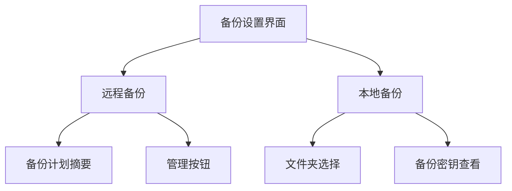

**Diagram sources**
- [PreferencesBackups.dom.tsx](file://ts/components/PreferencesBackups.dom.tsx)

### 备份进度条与下载状态

备份进度条在多个场景中使用，包括备份导入和媒体下载。`ProgressBar`组件用于显示进度，支持不确定进度（`fractionComplete=null`）和确定进度两种模式。媒体下载进度显示在`PreferencesBackupDetails`页面，包含暂停、恢复和取消操作。

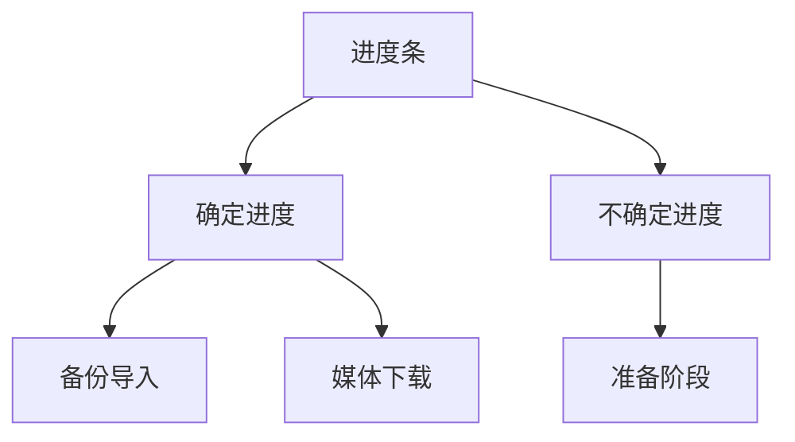

**Diagram sources**
- [InstallScreenBackupImportStep.dom.tsx](file://ts/components/installScreen/InstallScreenBackupImportStep.dom.tsx)
- [BackupMediaDownloadProgressSettings.dom.tsx](file://ts/components/BackupMediaDownloadProgressSettings.dom.tsx)

## 核心组件分析

### PreferencesBackupDetails 组件

`PreferencesBackupDetails`组件负责显示备份的详细信息，包括创建时间、订阅状态和媒体下载进度。该组件根据备份层级（免费或付费）显示不同的摘要信息。

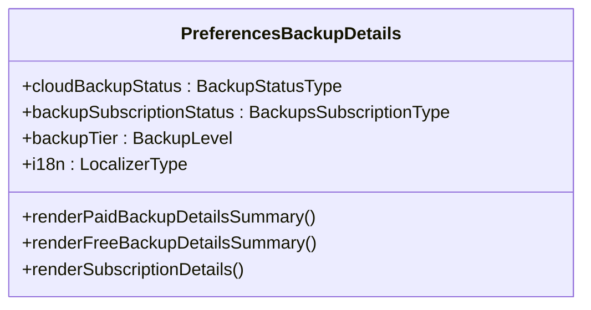

**Diagram sources**
- [PreferencesBackupDetails.dom.tsx](file://ts/components/PreferencesBackupDetails.dom.tsx)

### BackupMediaDownloadProgressSettings 组件

`BackupMediaDownloadProgressSettings`组件显示媒体下载的进度信息，包括已完成字节数、总字节数和暂停状态。组件提供暂停、恢复和取消操作的按钮。

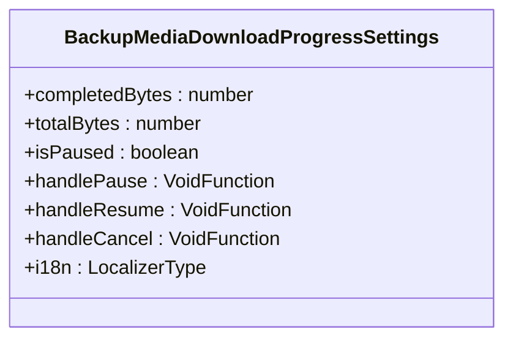

**Diagram sources**
- [BackupMediaDownloadProgressSettings.dom.tsx](file://ts/components/BackupMediaDownloadProgressSettings.dom.tsx)

## 状态管理与事件处理

### Props 与状态管理

`PreferencesBackupDetails`组件的props包括云备份状态、订阅状态、备份层级和本地化函数。组件内部使用`useState`管理媒体下载进度的显示状态。

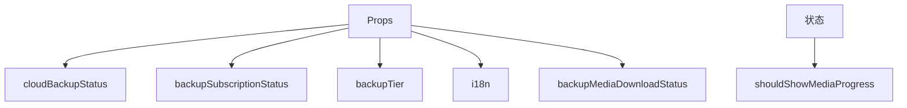

**Diagram sources**
- [PreferencesBackupDetails.dom.tsx](file://ts/components/PreferencesBackupDetails.dom.tsx)

### 事件处理

组件通过回调函数处理用户交互事件，如暂停、恢复和取消媒体下载。这些函数作为props传递给子组件。

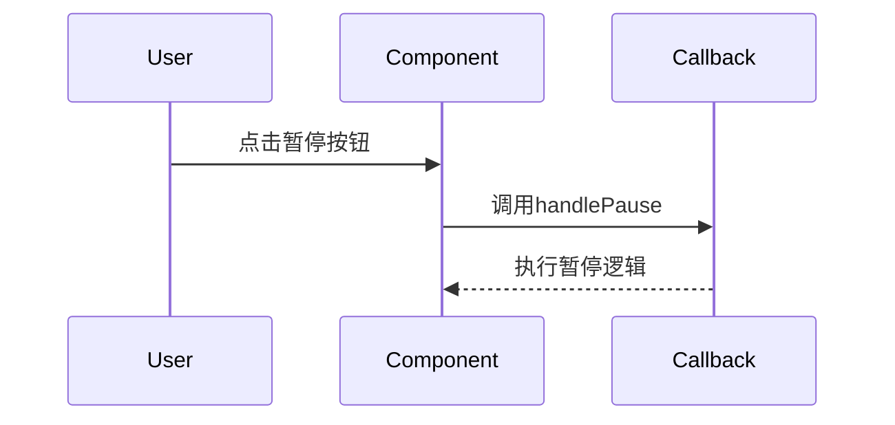

**Diagram sources**
- [BackupMediaDownloadProgressSettings.dom.tsx](file://ts/components/BackupMediaDownloadProgressSettings.dom.tsx)

## 备份恢复功能

### 本地备份

本地备份功能允许用户选择备份文件夹并查看备份密钥。`PreferencesLocalBackups`组件管理本地备份的设置流程，包括文件夹选择和密钥确认。

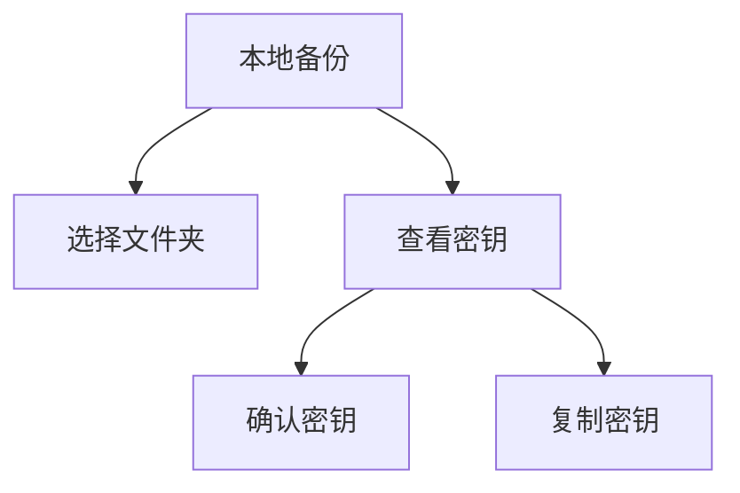

**Diagram sources**
- [PreferencesLocalBackups.dom.tsx](file://ts/components/PreferencesLocalBackups.dom.tsx)

### 备份恢复

备份恢复功能在安装过程中使用`InstallScreenBackupImportStep`组件实现。该组件显示恢复进度并处理各种错误情况。

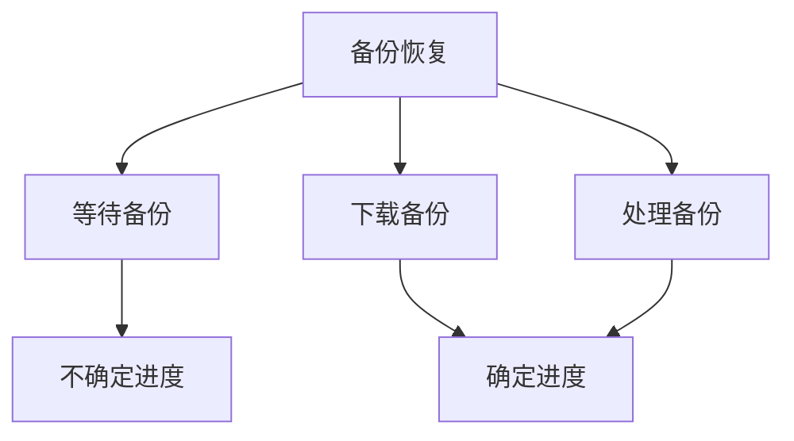

**Diagram sources**
- [InstallScreenBackupImportStep.dom.tsx](file://ts/components/installScreen/InstallScreenBackupImportStep.dom.tsx)

## 加密与安全机制

### 加密实现

备份系统使用`libsignal-client`库进行加密。`getBackupKey`函数从账户熵池派生备份密钥，`getBackupMediaRootKey`获取媒体根密钥。

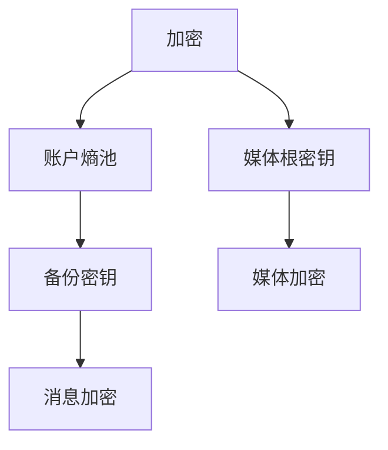

**Diagram sources**
- [crypto.preload.ts](file://ts/services/backups/crypto.preload.ts)

### 安全策略

备份文件存储在用户指定的本地文件夹中，媒体文件使用AES-256加密。备份密钥需要操作系统身份验证才能查看。

**Section sources**
- [crypto.preload.ts](file://ts/services/backups/crypto.preload.ts)
- [PreferencesLocalBackups.dom.tsx](file://ts/components/PreferencesLocalBackups.dom.tsx)

## 进度跟踪与错误处理

### 进度跟踪

系统使用`roundFractionForProgressBar`函数计算进度分数，确保进度条平滑更新。`BackupMediaDownloadProgressSettings`组件实时显示下载进度。

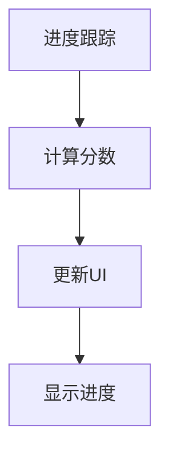

**Diagram sources**
- [BackupMediaDownloadProgressSettings.dom.tsx](file://ts/components/BackupMediaDownloadProgressSettings.dom.tsx)

### 错误处理

错误处理通过`ConfirmationDialog`组件实现，显示错误信息并提供重试或取消选项。`BackupMediaDownloadCancelConfirmationDialog`专门处理取消下载的确认。

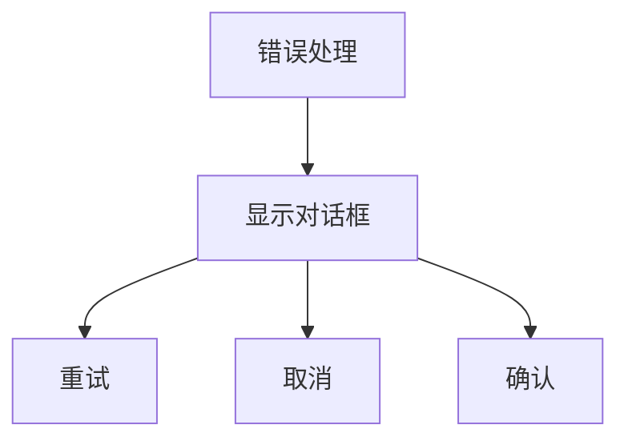

**Diagram sources**
- [BackupMediaDownloadCancelConfirmationDialog.dom.tsx](file://ts/components/BackupMediaDownloadCancelConfirmationDialog.dom.tsx)

## 无障碍与响应式设计

### 无障碍支持

组件使用`aria-label`属性提供无障碍支持，确保屏幕阅读器能够正确读取界面元素。`BackupMediaDownloadProgressSettings`组件为进度条和按钮提供适当的标签。

**Section sources**
- [BackupMediaDownloadProgressSettings.dom.tsx](file://ts/components/BackupMediaDownloadProgressSettings.dom.tsx)

### 响应式设计

界面使用CSS类和Flexbox布局实现响应式设计，确保在不同屏幕尺寸下都能良好显示。`Preferences__flow-button`类用于控制按钮的布局。

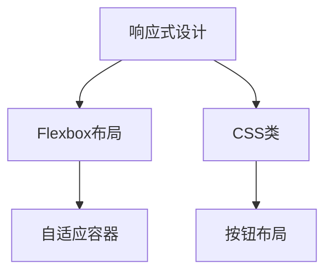

**Diagram sources**
- [BackupMediaDownloadProgressSettings.scss](file://stylesheets/components/BackupMediaDownloadProgressSettings.scss)

## 结论

Signal-Desktop的备份组件提供了一套完整、安全且用户友好的备份解决方案。通过清晰的界面设计、强大的加密机制和完善的错误处理，确保用户能够轻松地备份和恢复重要数据。系统支持本地和云备份两种模式，满足不同用户的需求。