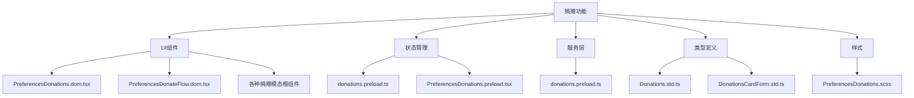
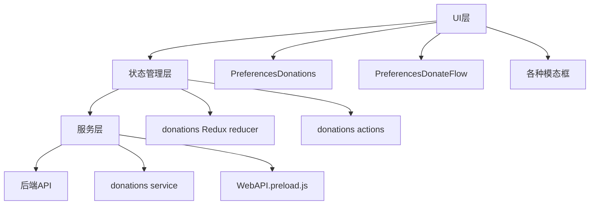
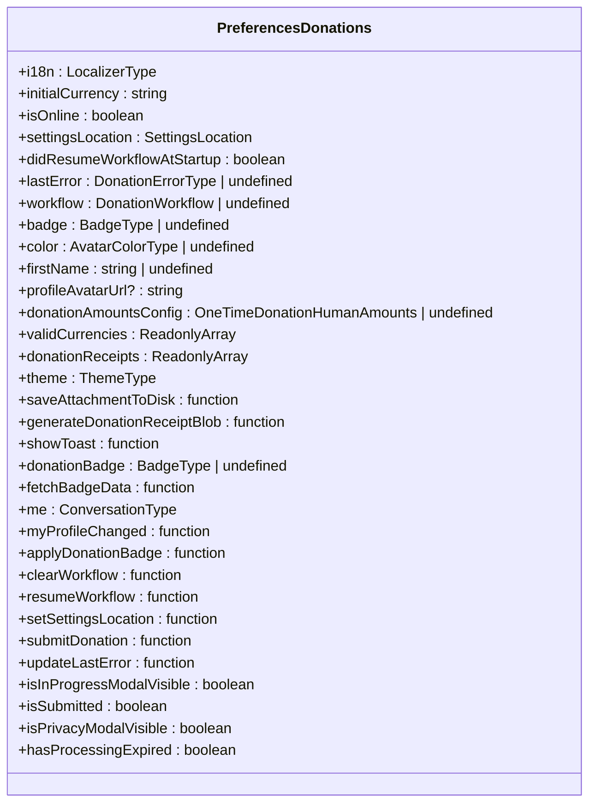
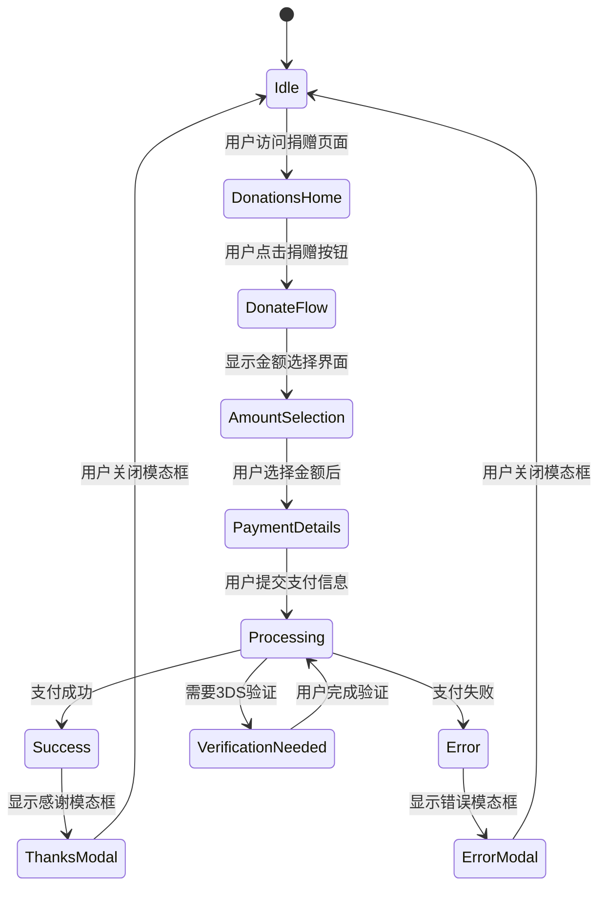
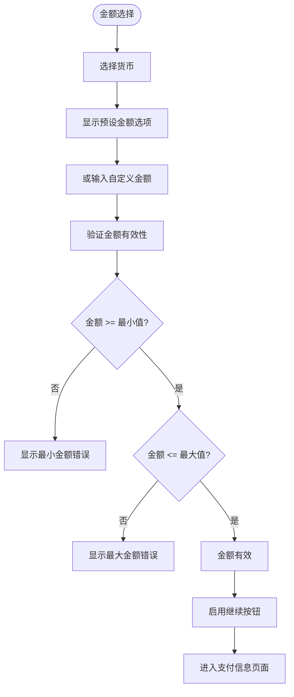
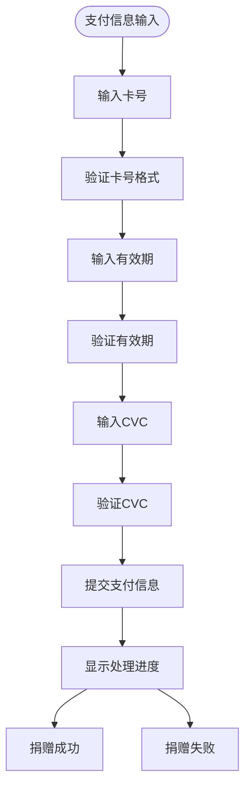
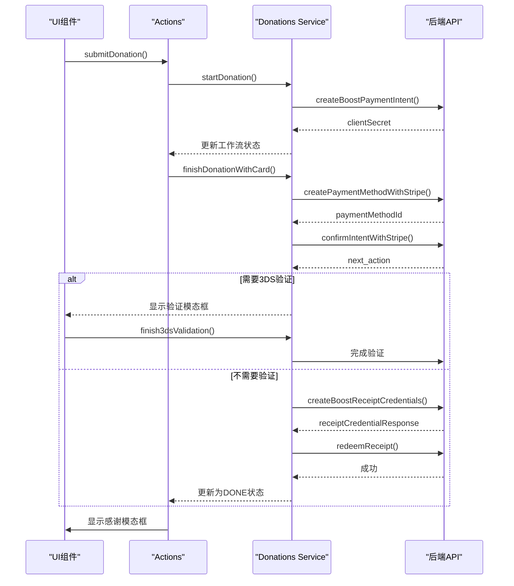
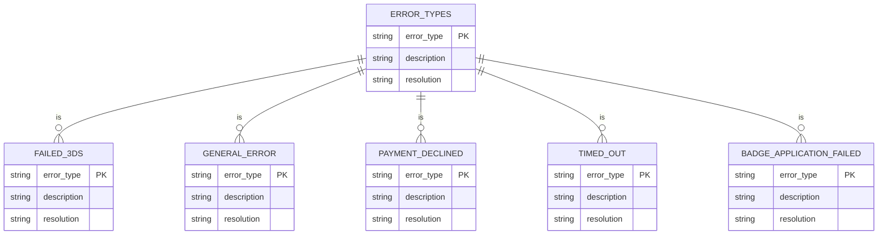
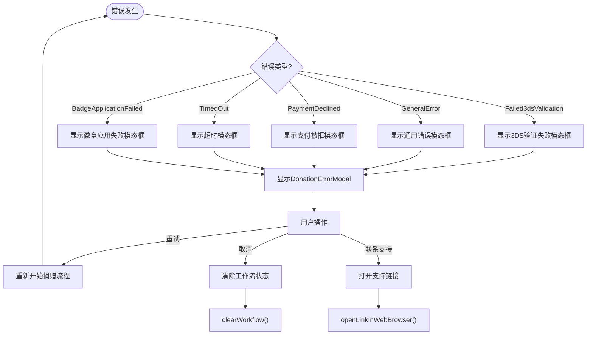

# 捐赠组件

<cite>
**本文档引用的文件**  
- [PreferencesDonations.dom.tsx](file://ts/components/PreferencesDonations.dom.tsx)
- [PreferencesDonateFlow.dom.tsx](file://ts/components/PreferencesDonateFlow.dom.tsx)
- [DonationErrorModal.dom.tsx](file://ts/components/DonationErrorModal.dom.tsx)
- [DonationProgressModal.dom.tsx](file://ts/components/DonationProgressModal.dom.tsx)
- [DonationThanksModal.dom.tsx](file://ts/components/DonationThanksModal.dom.tsx)
- [DonationVerificationModal.dom.tsx](file://ts/components/DonationVerificationModal.dom.tsx)
- [DonationStillProcessingModal.dom.tsx](file://ts/components/DonationStillProcessingModal.dom.tsx)
- [DonationInterruptedModal.dom.tsx](file://ts/components/DonationInterruptedModal.dom.tsx)
- [DonationPrivacyInformationModal.dom.tsx](file://ts/components/DonationPrivacyInformationModal.dom.tsx)
- [donations.preload.ts](file://ts/state/ducks/donations.preload.ts)
- [donations.preload.ts](file://ts/services/donations.preload.ts)
- [Donations.std.ts](file://ts/types/Donations.std.ts)
- [DonationsCardForm.std.ts](file://ts/types/DonationsCardForm.std.ts)
- [PreferencesDonations.scss](file://stylesheets/components/PreferencesDonations.scss)
- [PreferencesDonations.preload.tsx](file://ts/state/smart/PreferencesDonations.preload.tsx)
- [generateDonationReceipt.dom.ts](file://ts/util/generateDonationReceipt.dom.ts)
</cite>

## 目录
1. [简介](#简介)
2. [项目结构](#项目结构)
3. [核心组件](#核心组件)
4. [架构概述](#架构概述)
5. [详细组件分析](#详细组件分析)
6. [依赖分析](#依赖分析)
7. [性能考虑](#性能考虑)
8. [故障排除指南](#故障排除指南)
9. [结论](#结论)

## 简介
本文档详细描述了Signal-Desktop应用程序中的捐赠功能。该功能允许用户通过一次性捐赠支持Signal项目，包括捐赠界面的视觉布局、捐赠表单、支付方式选择和进度指示器的用户交互模式。文档涵盖了PreferencesDonations组件的props、事件和状态管理机制，以及与后端捐赠服务集成的实现细节。

## 项目结构
捐赠功能主要由多个组件和状态管理模块组成，分布在不同的目录中。核心组件位于`ts/components`目录下，状态管理逻辑位于`ts/state/ducks`和`ts/services`目录中，样式文件位于`stylesheets/components`目录下。



**Diagram sources**
- [PreferencesDonations.dom.tsx](file://ts/components/PreferencesDonations.dom.tsx)
- [donations.preload.ts](file://ts/state/ducks/donations.preload.ts)
- [donations.preload.ts](file://ts/services/donations.preload.ts)
- [Donations.std.ts](file://ts/types/Donations.std.ts)
- [PreferencesDonations.scss](file://stylesheets/components/PreferencesDonations.scss)

**Section sources**
- [PreferencesDonations.dom.tsx](file://ts/components/PreferencesDonations.dom.tsx)
- [donations.preload.ts](file://ts/state/ducks/donations.preload.ts)
- [donations.preload.ts](file://ts/services/donations.preload.ts)
- [Donations.std.ts](file://ts/types/Donations.std.ts)
- [PreferencesDonations.scss](file://stylesheets/components/PreferencesDonations.scss)

## 核心组件
捐赠功能的核心组件包括PreferencesDonations（主捐赠界面）、PreferencesDonateFlow（捐赠流程）以及各种模态框组件，如捐赠错误、进度、感谢和验证模态框。这些组件共同构成了完整的捐赠用户体验。

**Section sources**
- [PreferencesDonations.dom.tsx](file://ts/components/PreferencesDonations.dom.tsx)
- [PreferencesDonateFlow.dom.tsx](file://ts/components/PreferencesDonateFlow.dom.tsx)
- [DonationErrorModal.dom.tsx](file://ts/components/DonationErrorModal.dom.tsx)
- [DonationProgressModal.dom.tsx](file://ts/components/DonationProgressModal.dom.tsx)
- [DonationThanksModal.dom.tsx](file://ts/components/DonationThanksModal.dom.tsx)

## 架构概述
捐赠功能采用分层架构，包括UI层、状态管理层和服务层。UI层负责展示和用户交互，状态管理层管理捐赠流程的状态，服务层处理与后端API的通信。



**Diagram sources**
- [PreferencesDonations.dom.tsx](file://ts/components/PreferencesDonations.dom.tsx)
- [PreferencesDonateFlow.dom.tsx](file://ts/components/PreferencesDonateFlow.dom.tsx)
- [donations.preload.ts](file://ts/state/ducks/donations.preload.ts)
- [donations.preload.ts](file://ts/services/donations.preload.ts)

## 详细组件分析

### PreferencesDonations组件分析
PreferencesDonations是捐赠功能的主界面组件，负责展示捐赠入口、处理用户导航和管理各种模态框的显示。

#### 组件属性和状态


**Diagram sources**
- [PreferencesDonations.dom.tsx](file://ts/components/PreferencesDonations.dom.tsx#L65-L116)

#### 捐赠流程状态管理


**Diagram sources**
- [PreferencesDonations.dom.tsx](file://ts/components/PreferencesDonations.dom.tsx#L616-L800)
- [PreferencesDonateFlow.dom.tsx](file://ts/components/PreferencesDonateFlow.dom.tsx#L100-L108)

### PreferencesDonateFlow组件分析
PreferencesDonateFlow组件管理捐赠流程的详细步骤，包括金额选择和支付信息输入。

#### 金额选择流程


**Diagram sources**
- [PreferencesDonateFlow.dom.tsx](file://ts/components/PreferencesDonateFlow.dom.tsx#L295-L604)

#### 支付信息输入流程


**Diagram sources**
- [PreferencesDonateFlow.dom.tsx](file://ts/components/PreferencesDonateFlow.dom.tsx#L612-L773)

### 捐赠服务流程分析
捐赠服务层处理与后端API的通信，管理捐赠流程的各个步骤。

#### 捐赠服务调用流程


**Diagram sources**
- [donations.preload.ts](file://ts/services/donations.preload.ts#L145-L225)
- [donations.preload.ts](file://ts/state/ducks/donations.preload.ts#L153-L189)

## 依赖分析
捐赠功能依赖于多个内部和外部模块，包括UI组件库、状态管理、加密服务和第三方支付处理。

```mermaid
graph TD
Donation[捐赠功能] --> React[React]
Donation --> Redux[Redux]
Donation --> ZKGroup[@signalapp/libsignal-client/zkgroup]
Donation --> Stripe[Stripe]
Donation --> UUID[uuid]
Donation --> CardValidator[card-validator]
Donation --> CreditCardType[credit-card-type]
Donation --> SignalComponents[Signal UI组件]
Donation --> SignalState[Signal状态管理]
Donation --> SignalServices[Signal服务]
Donation --> SignalTypes[Signal类型定义]
Donation --> SignalUtils[Signal工具函数]
SignalComponents --> ReactAria[react-aria-components]
SignalState --> Redux[Redux]
SignalServices --> WebAPI[WebAPI.preload.js]
SignalTypes --> Zod[zod]
SignalUtils --> Crypto[Crypto.node.ts]
```

**Diagram sources**
- [package.json](file://package.json)
- [PreferencesDonations.dom.tsx](file://ts/components/PreferencesDonations.dom.tsx#L4-L35)
- [donations.preload.ts](file://ts/services/donations.preload.ts#L6-L15)

**Section sources**
- [package.json](file://package.json)
- [PreferencesDonations.dom.tsx](file://ts/components/PreferencesDonations.dom.tsx)
- [donations.preload.ts](file://ts/services/donations.preload.ts)

## 性能考虑
捐赠功能在设计时考虑了多个性能因素，包括异步操作管理、错误处理和用户体验优化。

### 异步操作管理
- 使用`exponentialBackoffSleepTime`实现指数退避重试机制
- 使用`waitForOnline`确保在网络连接恢复后继续捐赠流程
- 使用`runDonationAbortController`允许取消正在进行的捐赠操作

### 状态持久化
- 捐赠工作流状态存储在Redux中，并通过`WORKFLOW_STORAGE_KEY`持久化
- 使用`isOlderThan`检查工作流是否过期（超过90天）
- 在应用启动时自动恢复未完成的捐赠流程

### 用户体验优化
- 使用模态框逐步引导用户完成捐赠流程
- 在关键步骤提供清晰的反馈和错误信息
- 支持离线状态下的捐赠操作（在网络恢复后自动继续）

**Section sources**
- [donations.preload.ts](file://ts/services/donations.preload.ts#L266-L468)
- [donations.preload.ts](file://ts/services/donations.preload.ts#L86-L140)

## 故障排除指南

### 常见错误类型


**Diagram sources**
- [Donations.std.ts](file://ts/types/Donations.std.ts#L20-L31)

### 错误处理流程


**Diagram sources**
- [PreferencesDonations.dom.tsx](file://ts/components/PreferencesDonations.dom.tsx#L621-L637)
- [DonationErrorModal.dom.tsx](file://ts/components/DonationErrorModal.dom.tsx)

### 状态管理问题
当遇到捐赠状态管理问题时，可以检查以下方面：

1. **工作流状态同步**：确保Redux状态与本地存储的工作流状态一致
2. **时间戳验证**：检查工作流时间戳是否过期（超过90天）
3. **并发控制**：确保没有多个捐赠操作同时进行
4. **错误状态清理**：在适当的时候清除错误状态

```typescript
// 示例：清除捐赠工作流
await clearDonation();
setSettingsLocation({ page: SettingsPage.Donations });
showToast({ toastType: ToastType.DonationCanceled });
```

**Section sources**
- [donations.preload.ts](file://ts/services/donations.preload.ts#L213-L216)
- [PreferencesDonations.dom.tsx](file://ts/components/PreferencesDonations.dom.tsx#L646-L648)

## 结论
Signal-Desktop的捐赠功能提供了一个完整、安全且用户友好的捐赠体验。通过分层架构设计，将UI、状态管理和服务逻辑分离，确保了代码的可维护性和可扩展性。功能实现了完整的捐赠流程，包括金额选择、支付信息输入、3DS验证、收据生成和徽章应用。错误处理机制完善，能够处理各种可能的错误情况，并为用户提供清晰的反馈。整体设计考虑了性能优化和用户体验，是一个成熟可靠的捐赠解决方案。