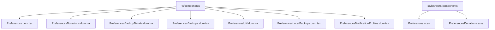
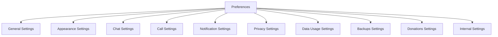
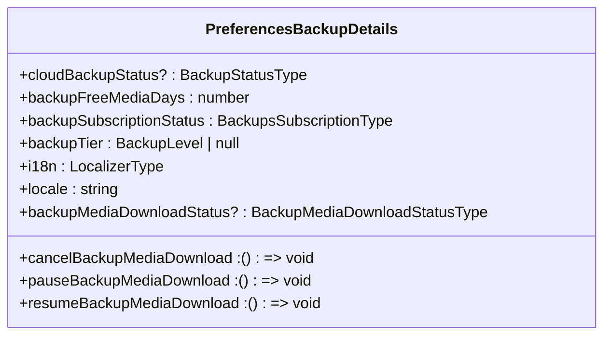

# 设置组件

<cite>
**本文档引用的文件**   
- [Preferences.dom.tsx](file://ts/components/Preferences.dom.tsx)
- [PreferencesDonations.dom.tsx](file://ts/components/PreferencesDonations.dom.tsx)
- [PreferencesBackupDetails.dom.tsx](file://ts/components/PreferencesBackupDetails.dom.tsx)
- [PreferencesBackups.dom.tsx](file://ts/components/PreferencesBackups.dom.tsx)
- [Preferences.scss](file://stylesheets/components/Preferences.scss)
- [PreferencesDonations.scss](file://stylesheets/components/PreferencesDonations.scss)
- [PreferencesUtil.dom.tsx](file://ts/components/PreferencesUtil.dom.tsx)
- [PreferencesLocalBackups.dom.tsx](file://ts/components/PreferencesLocalBackups.dom.tsx)
- [PreferencesNotificationProfiles.dom.tsx](file://ts/components/PreferencesNotificationProfiles.dom.tsx)
- [Nav.std.js](file://ts/types/Nav.std.js)
- [Storage.d.ts](file://ts/types/Storage.d.ts)
- [backups.node.js](file://ts/types/backups.node.js)
</cite>

## 目录
1. [简介](#简介)
2. [项目结构](#项目结构)
3. [核心组件](#核心组件)
4. [架构概述](#架构概述)
5. [详细组件分析](#详细组件分析)
6. [依赖分析](#依赖分析)
7. [性能考虑](#性能考虑)
8. [故障排除指南](#故障排除指南)
9. [结论](#结论)

## 简介
Signal-Desktop的设置组件为用户提供了一个全面的界面，用于管理应用程序的各种偏好设置。该组件包括多个功能区域，如常规设置、外观、聊天、通话、通知、隐私、数据使用、备份和捐赠等。用户可以通过直观的导航标签和表单控件来调整这些设置，以满足个人需求。此外，设置组件还支持无障碍访问和响应式设计，确保所有用户都能轻松使用。

## 项目结构
Signal-Desktop的项目结构清晰地组织了各个功能模块。设置组件主要位于`ts/components`目录下，相关的样式文件则存放在`stylesheets/components`目录中。以下是设置组件的主要文件结构：



**Diagram sources**
- [Preferences.dom.tsx](file://ts/components/Preferences.dom.tsx)
- [PreferencesDonations.dom.tsx](file://ts/components/PreferencesDonations.dom.tsx)
- [PreferencesBackupDetails.dom.tsx](file://ts/components/PreferencesBackupDetails.dom.tsx)
- [PreferencesBackups.dom.tsx](file://ts/components/PreferencesBackups.dom.tsx)
- [PreferencesUtil.dom.tsx](file://ts/components/PreferencesUtil.dom.tsx)
- [PreferencesLocalBackups.dom.tsx](file://ts/components/PreferencesLocalBackups.dom.tsx)
- [PreferencesNotificationProfiles.dom.tsx](file://ts/components/PreferencesNotificationProfiles.dom.tsx)
- [Preferences.scss](file://stylesheets/components/Preferences.scss)
- [PreferencesDonations.scss](file://stylesheets/components/PreferencesDonations.scss)

**Section sources**
- [Preferences.dom.tsx](file://ts/components/Preferences.dom.tsx)
- [PreferencesDonations.dom.tsx](file://ts/components/PreferencesDonations.dom.tsx)
- [PreferencesBackupDetails.dom.tsx](file://ts/components/PreferencesBackupDetails.dom.tsx)
- [PreferencesBackups.dom.tsx](file://ts/components/PreferencesBackups.dom.tsx)
- [PreferencesUtil.dom.tsx](file://ts/components/PreferencesUtil.dom.tsx)
- [PreferencesLocalBackups.dom.tsx](file://ts/components/PreferencesLocalBackups.dom.tsx)
- [PreferencesNotificationProfiles.dom.tsx](file://ts/components/PreferencesNotificationProfiles.dom.tsx)
- [Preferences.scss](file://stylesheets/components/Preferences.scss)
- [PreferencesDonations.scss](file://stylesheets/components/PreferencesDonations.scss)

## 核心组件
设置组件的核心功能由多个React组件实现，每个组件负责特定的设置类别。主要组件包括`Preferences`、`PreferencesDonations`、`PreferencesBackupDetails`等。这些组件通过props传递数据和事件处理器，实现了状态管理和用户交互。

**Section sources**
- [Preferences.dom.tsx](file://ts/components/Preferences.dom.tsx)
- [PreferencesDonations.dom.tsx](file://ts/components/PreferencesDonations.dom.tsx)
- [PreferencesBackupDetails.dom.tsx](file://ts/components/PreferencesBackupDetails.dom.tsx)

## 架构概述
设置组件的架构设计遵循了模块化和可扩展的原则。主组件`Preferences`作为容器，负责渲染不同的设置页面，并通过`renderDonationsPane`、`renderNotificationProfilesHome`等函数传递子组件。每个子组件独立处理其特定的设置逻辑，如捐赠设置、备份设置等。



**Diagram sources**
- [Preferences.dom.tsx](file://ts/components/Preferences.dom.tsx)

**Section sources**
- [Preferences.dom.tsx](file://ts/components/Preferences.dom.tsx)

## 详细组件分析

### Preferences 组件分析
`Preferences`组件是设置界面的主入口，负责管理所有设置页面的导航和状态。它通过`settingsLocation`属性确定当前显示的页面，并根据不同的页面类型渲染相应的子组件。

#### Props 和状态管理
`Preferences`组件接收大量的props，包括用户信息、设备设置、通知设置等。这些props通过`PropsType`接口定义，确保类型安全。组件内部使用`useState`和`useEffect`钩子来管理状态和副作用。

```mermaid
classDiagram
class Preferences {
+accountEntropyPool : string | undefined
+autoDownloadAttachment : AutoDownloadAttachmentType
+backupFeatureEnabled : boolean
+backupFreeMediaDays : number
+backupKeyViewed : boolean
+backupLocalBackupsEnabled : boolean
+backupTier : BackupLevel | null
+localBackupFolder : string | undefined
+chatFoldersFeatureEnabled : boolean
+currentChatFoldersCount : number
+cloudBackupStatus? : BackupStatusType
+backupSubscriptionStatus : BackupsSubscriptionType
+backupMediaDownloadStatus? : BackupMediaDownloadStatusType
+pauseBackupMediaDownload : VoidFunction
+cancelBackupMediaDownload : VoidFunction
+resumeBackupMediaDownload : VoidFunction
+blockedCount : number
+customColors : Record<string, CustomColorType>
+defaultConversationColor : DefaultConversationColorType
+deviceName? : string
+emojiSkinToneDefault : EmojiSkinTone
+hasAnyCurrentCustomChatFolders : boolean
+hasAudioNotifications? : boolean
+hasAutoConvertEmoji : boolean
+hasAutoDownloadUpdate : boolean
+hasAutoLaunch : boolean | undefined
+hasCallNotifications : boolean
+hasCallRingtoneNotification : boolean
+hasContentProtection : boolean | undefined
+hasCountMutedConversations : boolean
+hasHideMenuBar? : boolean
+hasIncomingCallNotifications : boolean
+hasLinkPreviews : boolean
+hasMediaCameraPermissions : boolean | undefined
+hasMediaPermissions : boolean | undefined
+hasMessageAudio : boolean
+hasMinimizeToAndStartInSystemTray : boolean | undefined
+hasMinimizeToSystemTray : boolean | undefined
+hasNotificationAttention : boolean
+hasNotifications : boolean
+hasReadReceipts : boolean
+hasRelayCalls? : boolean
+hasSpellCheck : boolean | undefined
+hasStoriesDisabled : boolean
+hasTextFormatting : boolean
+hasTypingIndicators : boolean
+hasKeepMutedChatsArchived : boolean
+settingsLocation : SettingsLocation
+lastSyncTime? : number
+notificationContent : NotificationSettingType
+phoneNumber : string | undefined
+selectedCamera? : string
+selectedMicrophone? : AudioDevice
+selectedSpeaker? : AudioDevice
+sentMediaQualitySetting : SentMediaQualitySettingType
+themeSetting : ThemeSettingType | undefined
+universalExpireTimer : DurationInSeconds
+whoCanFindMe : PhoneNumberDiscoverability
+whoCanSeeMe : PhoneNumberSharingMode
+zoomFactor : ZoomFactorType | undefined
+availableLocales : ReadonlyArray<string>
+localeOverride : string | null | undefined
+preferredSystemLocales : ReadonlyArray<string>
+resolvedLocale : string
+badge : BadgeType | undefined
+hasFailedStorySends : boolean
+initialSpellCheckSetting : boolean
+me : ConversationType
+navTabsCollapsed : boolean
+otherTabsUnreadStats : UnreadStats
+preferredWidthFromStorage : number
+shouldShowUpdateDialog : boolean
+theme : ThemeType
+notificationProfileCount : number
+isAutoDownloadUpdatesSupported : boolean
+isAutoLaunchSupported : boolean
+isContentProtectionNeeded : boolean
+isContentProtectionSupported : boolean
+isHideMenuBarSupported : boolean
+isNotificationAttentionSupported : boolean
+isPlaintextExportEnabled : boolean
+isSyncSupported : boolean
+isSystemTraySupported : boolean
+isMinimizeToAndStartInSystemTraySupported : boolean
+isInternalUser : boolean
+availableCameras : Array<Pick<MediaDeviceInfo, 'deviceId' | 'groupId' | 'kind' | 'label'>>
+donationReceipts : ReadonlyArray<DonationReceipt>
+renderDonationsPane : (options : { contentsRef : MutableRefObject<HTMLDivElement | null>; settingsLocation : SettingsLocation; setSettingsLocation : (settingsLocation : SettingsLocation) => void; }) => JSX.Element
+renderNotificationProfilesHome : (props : SmartNotificationProfilesProps) => JSX.Element
+renderNotificationProfilesCreateFlow : (props : SmartNotificationProfilesProps) => JSX.Element
+renderProfileEditor : (options : { contentsRef : MutableRefObject<HTMLDivElement | null>; }) => JSX.Element
+renderToastManager : (_ : Readonly<{ containerWidthBreakpoint : WidthBreakpoint }>) => JSX.Element
+renderUpdateDialog : (_ : Readonly<{ containerWidthBreakpoint : WidthBreakpoint }>) => JSX.Element
+renderPreferencesChatFoldersPage : (props : SmartPreferencesChatFoldersPageProps) => JSX.Element
+renderPreferencesEditChatFolderPage : (props : SmartPreferencesEditChatFolderPageProps) => JSX.Element
+addCustomColor : (color : CustomColorType) => unknown
+doDeleteAllData : () => unknown
+editCustomColor : (colorId : string, color : CustomColorType) => unknown
+exportLocalBackup : () => Promise<BackupValidationResultType>
+getMessageCountBySchemaVersion : () => Promise<MessageCountBySchemaVersionType>
+getMessageSampleForSchemaVersion : (version : number) => Promise<Array<MessageAttributesType>>
+resumeBackupMediaDownload : () => void
+pauseBackupMediaDownload : () => void
+getConversationsWithCustomColor : (colorId : string) => Array<ConversationType>
+makeSyncRequest : () => unknown
+onStartUpdate : () => unknown
+pickLocalBackupFolder : () => Promise<string | undefined>
+refreshCloudBackupStatus : () => void
+refreshBackupSubscriptionStatus : () => void
+removeCustomColor : (colorId : string) => unknown
+removeCustomColorOnConversations : (colorId : string) => unknown
+promptOSAuth : (reason : PromptOSAuthReasonType) => Promise<PromptOSAuthResultType>
+resetAllChatColors : () => unknown
+resetDefaultChatColor : () => unknown
+savePreferredLeftPaneWidth : (_ : number) => void
+setGlobalDefaultConversationColor : (color : ConversationColorType, customColorData? : { id : string; value : CustomColorType; }) => unknown
+setSettingsLocation : (settingsLocation : SettingsLocation) => unknown
+showToast : (toast : AnyToast) => unknown
+startPlaintextExport : () => unknown
+validateBackup : () => Promise<BackupValidationResultType>
+internalAddDonationReceipt : (receipt : DonationReceipt) => void
+saveAttachmentToDisk : (options : { data : Uint8Array; name : string; baseDir? : string | undefined; }) => Promise<{ fullPath : string; name : string } | null>
+generateDonationReceiptBlob : (receipt : DonationReceipt, i18n : LocalizerType) => Promise<Blob>
+onAudioNotificationsChange : CheckboxChangeHandlerType
+onAutoConvertEmojiChange : CheckboxChangeHandlerType
+onAutoDownloadAttachmentChange : (setting : AutoDownloadAttachmentType) => unknown
+onAutoDownloadUpdateChange : CheckboxChangeHandlerType
+onAutoLaunchChange : CheckboxChangeHandlerType
+onBackupKeyViewedChange : (keyViewed : boolean) => void
+onCallNotificationsChange : CheckboxChangeHandlerType
+onCallRingtoneNotificationChange : CheckboxChangeHandlerType
+onContentProtectionChange : CheckboxChangeHandlerType
+onCountMutedConversationsChange : CheckboxChangeHandlerType
+onEmojiSkinToneDefaultChange : (emojiSkinTone : EmojiSkinTone) => void
+onHasStoriesDisabledChanged : SelectChangeHandlerType<boolean>
+onHideMenuBarChange : CheckboxChangeHandlerType
+onIncomingCallNotificationsChange : CheckboxChangeHandlerType
+onKeepMutedChatsArchivedChange : CheckboxChangeHandlerType
+onLastSyncTimeChange : (time : number) => unknown
+onLocaleChange : (locale : string | null | undefined) => void
+onMediaCameraPermissionsChange : CheckboxChangeHandlerType
+onMediaPermissionsChange : CheckboxChangeHandlerType
+onMessageAudioChange : CheckboxChangeHandlerType
+onMinimizeToAndStartInSystemTrayChange : CheckboxChangeHandlerType
+onMinimizeToSystemTrayChange : CheckboxChangeHandlerType
+onNotificationAttentionChange : CheckboxChangeHandlerType
+onNotificationContentChange : SelectChangeHandlerType<NotificationSettingType>
+onNotificationsChange : CheckboxChangeHandlerType
+onRelayCallsChange : CheckboxChangeHandlerType
+onSelectedCameraChange : SelectChangeHandlerType<string | undefined>
+onSelectedMicrophoneChange : SelectChangeHandlerType<AudioDevice | undefined>
+onSelectedSpeakerChange : SelectChangeHandlerType<AudioDevice | undefined>
+onSentMediaQualityChange : SelectChangeHandlerType<SentMediaQualityType>
+onSpellCheckChange : CheckboxChangeHandlerType
+onTextFormattingChange : CheckboxChangeHandlerType
+onThemeChange : SelectChangeHandlerType<ThemeType>
+onToggleNavTabsCollapse : (navTabsCollapsed : boolean) => void
+onUniversalExpireTimerChange : SelectChangeHandlerType<number>
+onWhoCanSeeMeChange : SelectChangeHandlerType<PhoneNumberSharingMode>
+onWhoCanFindMeChange : SelectChangeHandlerType<PhoneNumberDiscoverability>
+onZoomFactorChange : SelectChangeHandlerType<ZoomFactorType>
+internalDeleteAllMegaphones : () => Promise<number>
+__dangerouslyRunAbitraryReadOnlySqlQuery : (readonlySqlQuery : string) => Promise<ReadonlyArray<RowType<object>>>
+callQualitySurveyCooldownDisabled : boolean
+setCallQualitySurveyCooldownDisabled : (value : boolean) => void
+i18n : LocalizerType
}
```

**Diagram sources**
- [Preferences.dom.tsx](file://ts/components/Preferences.dom.tsx)

**Section sources**
- [Preferences.dom.tsx](file://ts/components/Preferences.dom.tsx)

### PreferencesDonations 组件分析
`PreferencesDonations`组件负责管理用户的捐赠设置。它提供了捐赠历史、捐赠流程和捐赠确认等功能。

#### Props 和事件
`PreferencesDonations`组件接收多个props，包括捐赠金额、货币类型、捐赠状态等。这些props通过`PropsType`接口定义，确保类型安全。组件内部使用`useState`和`useEffect`钩子来管理状态和副作用。

```mermaid
classDiagram
class PreferencesDonations {
+contentsRef : MutableRefObject<HTMLDivElement | null>
+i18n : LocalizerType
+initialCurrency : string
+isOnline : boolean
+settingsLocation : SettingsLocation
+didResumeWorkflowAtStartup : boolean
+lastError : DonationErrorType | undefined
+workflow : DonationWorkflow | undefined
+badge : BadgeType | undefined
+color : AvatarColorType | undefined
+firstName : string | undefined
+profileAvatarUrl? : string
+donationAmountsConfig : OneTimeDonationHumanAmounts | undefined
+validCurrencies : ReadonlyArray<string>
+donationReceipts : ReadonlyArray<DonationReceipt>
+theme : ThemeType
+saveAttachmentToDisk : (options : { data : Uint8Array; name : string; baseDir? : string | undefined; }) => Promise<{ fullPath : string; name : string } | null>
+generateDonationReceiptBlob : (receipt : DonationReceipt, i18n : LocalizerType) => Promise<Blob>
+showToast : (toast : AnyToast) => void
+donationBadge : BadgeType | undefined
+fetchBadgeData : () => Promise<BadgeType | undefined>
+me : ConversationType
+myProfileChanged : (profileData : ProfileDataType, avatarUpdateOptions : AvatarUpdateOptionsType) => void
+applyDonationBadge : (args : { badge : BadgeType | undefined; applyBadge : boolean; onComplete : (error? : Error) => void; }) => void
+clearWorkflow : () => void
+resumeWorkflow : () => void
+setSettingsLocation : (settingsLocation : SettingsLocation) => void
+submitDonation : (payload : SubmitDonationType) => void
+updateLastError : (error : DonationErrorType | undefined) => void
}
```

**Diagram sources**
- [PreferencesDonations.dom.tsx](file://ts/components/PreferencesDonations.dom.tsx)

**Section sources**
- [PreferencesDonations.dom.tsx](file://ts/components/PreferencesDonations.dom.tsx)

### PreferencesBackupDetails 组件分析
`PreferencesBackupDetails`组件负责显示备份的详细信息，包括备份状态、订阅状态和媒体下载进度。

#### Props 和状态管理
`PreferencesBackupDetails`组件接收多个props，包括云备份状态、备份免费天数、备份订阅状态等。这些props通过`PropsType`接口定义，确保类型安全。组件内部使用`useState`和`useEffect`钩子来管理状态和副作用。



**Diagram sources**
- [PreferencesBackupDetails.dom.tsx](file://ts/components/PreferencesBackupDetails.dom.tsx)

**Section sources**
- [PreferencesBackupDetails.dom.tsx](file://ts/components/PreferencesBackupDetails.dom.tsx)

## 依赖分析
设置组件依赖于多个外部库和内部模块。主要依赖包括`react`、`lodash`、`classnames`等。这些依赖通过`import`语句引入，并在组件中使用。

```mermaid
graph TD
A[Preferences] --> B[react]
A --> C[lodash]
A --> D[classnames]
A --> E[@formatjs/intl-localematcher]
A --> F[./ChatColorPicker.dom.js]
A --> G[./Checkbox.dom.js]
A --> H[./ConfirmationDialog.dom.js]
A --> I[./DisappearingTimeDialog.dom.js]
A --> J[../util/phoneNumberDiscoverability.std.js]
A --> K[../types/PhoneNumberSharingMode.std.js]
A --> L[./Select.dom.js]
A --> M[../util/getCustomColorStyle.dom.js]
A --> N[../util/expirationTimer.std.js]
A --> O[../util/durations/index.std.js]
A --> P[../util/focusableSelectors.std.js]
A --> Q[./Modal.dom.js]
A --> R[./SearchInput.dom.js]
A --> S[../util/removeDiacritics.std.js]
A --> T[../util/assert.std.js]
A --> U[./I18n.dom.js]
A --> V[./fun/FunSkinTones.dom.js]
A --> W[./fun/data/emojis.std.js]
A --> X[./PreferencesUtil.dom.js]
A --> Y[./PreferencesBackups.dom.js]
A --> Z[./PreferencesInternal.dom.js]
AA[./fun/FunEmojiLocalizationProvider.dom.js]
AB[./Avatar.dom.js]
AC[./NavSidebar.dom.js]
AD[../types/Nav.std.js]
AE[../types/Storage.d.ts]
AF[../types/StorageUIKeys.std.js]
AG[../types/Toast.dom.js]
AH[../state/ducks/conversations.preload.js]
AI[../types/Colors.std.js]
AJ[../types/Util.std.js]
AK[../types/backups.node.js]
AL[../util/countUnreadStats.std.js]
AM[../badges/types.std.js]
AN[../sql/Interface.std.js]
AO[../model-types.d.ts]
AP[../types/PreferencesBackupPage.std.js]
AQ[../util/os/promptOSAuthMain.main.js]
AR[../types/Donations.std.js]
AS[../types/ChatFolder.std.js]
AT[../state/smart/PreferencesEditChatFolderPage.preload.js]
AU[../state/smart/PreferencesChatFoldersPage.preload.js]
AV[../state/smart/PreferencesDonations.preload.js]
AW[../state/smart/PreferencesNotificationProfiles.preload.js]
AX[../axo/AxoButton.dom.js]
```

**Diagram sources**
- [Preferences.dom.tsx](file://ts/components/Preferences.dom.tsx)

**Section sources**
- [Preferences.dom.tsx](file://ts/components/Preferences.dom.tsx)

## 性能考虑
设置组件在设计时考虑了性能优化。例如，使用`useMemo`和`useCallback`钩子来避免不必要的重新渲染。此外，组件通过`useEffect`钩子管理副作用，确保在适当的时候执行清理操作。

## 故障排除指南
如果用户在使用设置组件时遇到问题，可以参考以下故障排除步骤：
1. 检查网络连接是否正常。
2. 确认应用程序是否有足够的权限访问所需资源。
3. 清除缓存并重启应用程序。
4. 检查是否有最新的更新可用。

**Section sources**
- [Preferences.dom.tsx](file://ts/components/Preferences.dom.tsx)
- [PreferencesDonations.dom.tsx](file://ts/components/PreferencesDonations.dom.tsx)
- [PreferencesBackupDetails.dom.tsx](file://ts/components/PreferencesBackupDetails.dom.tsx)

## 结论
Signal-Desktop的设置组件提供了一个功能丰富且用户友好的界面，使用户能够轻松管理各种偏好设置。通过模块化的设计和高效的性能优化，该组件确保了良好的用户体验。未来的工作可以进一步增强无障碍访问支持和响应式设计，以满足更多用户的需求。