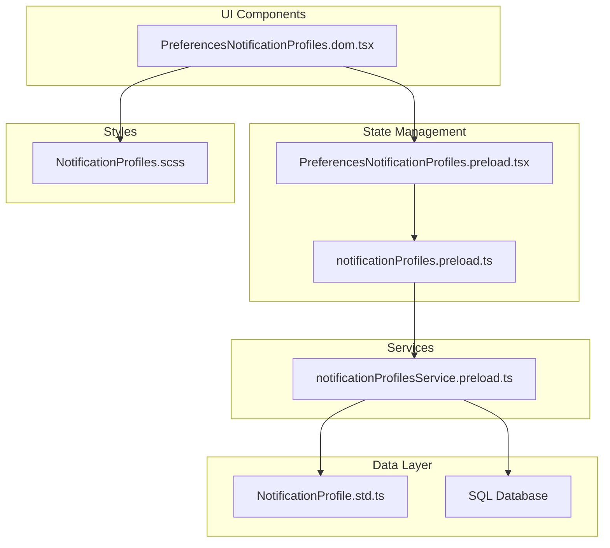
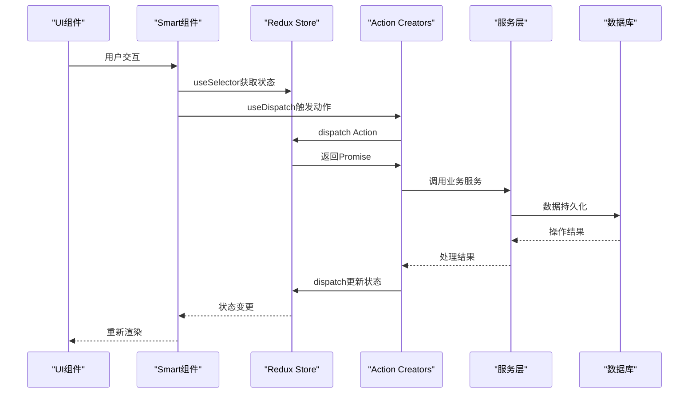
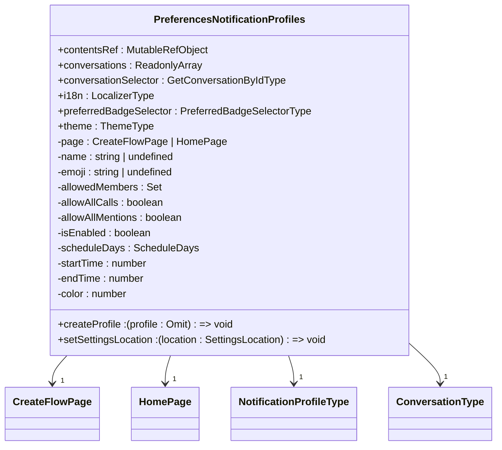
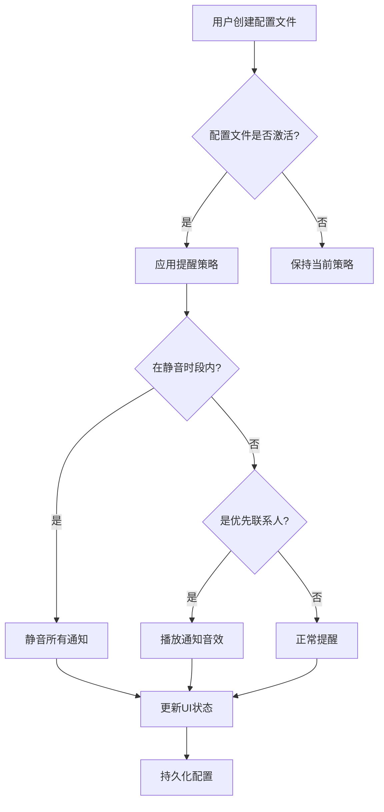
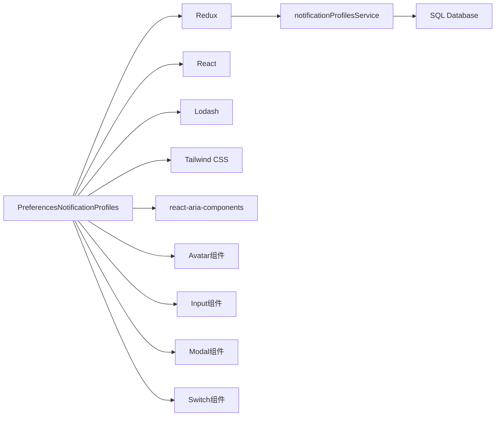

# 通知组件

<cite>
**本文档中引用的文件**   
- [PreferencesNotificationProfiles.dom.tsx](file://ts/components/PreferencesNotificationProfiles.dom.tsx)
- [PreferencesNotificationProfiles.preload.tsx](file://ts/state/smart/PreferencesNotificationProfiles.preload.tsx)
- [notificationProfilesService.preload.ts](file://ts/services/notificationProfilesService.preload.ts)
- [notificationProfiles.preload.ts](file://ts/state/ducks/notificationProfiles.preload.ts)
- [NotificationProfile.std.ts](file://ts/types/NotificationProfile.std.ts)
- [NotificationProfiles.scss](file://stylesheets/components/NotificationProfiles.scss)
- [notifications.preload.ts](file://ts/services/notifications.preload.ts)
</cite>

## 目录
1. [简介](#简介)
2. [项目结构](#项目结构)
3. [核心组件](#核心组件)
4. [架构概述](#架构概述)
5. [详细组件分析](#详细组件分析)
6. [依赖分析](#依赖分析)
7. [性能考虑](#性能考虑)
8. [故障排除指南](#故障排除指南)
9. [结论](#结论)

## 简介
Signal-Desktop的通知组件为用户提供了一套完整的通知配置系统，允许用户创建和管理多个通知配置文件。该系统支持基于时间表的自动通知控制、自定义提醒规则和跨设备同步功能。通知配置界面采用分步引导式设计，帮助用户轻松设置工作、睡眠、驾驶等不同场景下的通知策略。系统通过Redux状态管理、服务层抽象和数据库持久化实现了完整的数据流闭环，确保了配置的可靠性和一致性。

## 项目结构
Signal-Desktop的通知组件分布在多个目录中，形成了清晰的分层架构。核心UI组件位于`ts/components`目录下，状态管理逻辑在`ts/state`目录中实现，服务层功能位于`ts/services`目录，而类型定义则统一存放在`ts/types`目录。样式文件采用Sass预处理器，位于`stylesheets/components`目录下。这种分层结构确保了关注点分离，便于维护和扩展。

**图源**
- [PreferencesNotificationProfiles.dom.tsx](file://ts/components/PreferencesNotificationProfiles.dom.tsx)
- [PreferencesNotificationProfiles.preload.tsx](file://ts/state/smart/PreferencesNotificationProfiles.preload.tsx)
- [notificationProfilesService.preload.ts](file://ts/services/notificationProfilesService.preload.ts)
- [NotificationProfile.std.ts](file://ts/types/NotificationProfile.std.ts)
- [NotificationProfiles.scss](file://stylesheets/components/NotificationProfiles.scss)

**本节来源**
- [ts/components/PreferencesNotificationProfiles.dom.tsx](file://ts/components/PreferencesNotificationProfiles.dom.tsx)
- [ts/state/smart/PreferencesNotificationProfiles.preload.tsx](file://ts/state/smart/PreferencesNotificationProfiles.preload.tsx)
- [ts/services/notificationProfilesService.preload.ts](file://ts/services/notificationProfilesService.preload.ts)
- [ts/types/NotificationProfile.std.ts](file://ts/types/NotificationProfile.std.ts)
- [stylesheets/components/NotificationProfiles.scss](file://stylesheets/components/NotificationProfiles.scss)

## 核心组件
通知组件的核心是`PreferencesNotificationProfiles`系列组件，它们构成了用户交互的主要界面。该组件系统包括创建流程、主界面、编辑页面等多个子组件，通过状态机模式管理用户导航流程。组件采用React函数式编程范式，充分利用Hooks进行状态管理和副作用处理。视觉设计遵循Signal的设计语言，采用圆角卡片、阴影和渐变色等元素，提供现代而直观的用户体验。

**本节来源**
- [ts/components/PreferencesNotificationProfiles.dom.tsx](file://ts/components/PreferencesNotificationProfiles.dom.tsx)
- [ts/state/smart/PreferencesNotificationProfiles.preload.tsx](file://ts/state/smart/PreferencesNotificationProfiles.preload.tsx)

## 架构概述
通知组件的架构采用典型的分层模式，从UI层到服务层再到数据层形成了清晰的数据流。UI组件通过Smart组件连接到Redux状态，状态更新通过Action Creator触发Reducer变更，同时调用服务层进行业务逻辑处理和数据持久化。这种架构确保了UI与业务逻辑的解耦，提高了代码的可测试性和可维护性。

**图源**
- [ts/components/PreferencesNotificationProfiles.dom.tsx](file://ts/components/PreferencesNotificationProfiles.dom.tsx)
- [ts/state/smart/PreferencesNotificationProfiles.preload.tsx](file://ts/state/smart/PreferencesNotificationProfiles.preload.tsx)
- [ts/state/ducks/notificationProfiles.preload.ts](file://ts/state/ducks/notificationProfiles.preload.ts)
- [ts/services/notificationProfilesService.preload.ts](file://ts/services/notificationProfilesService.preload.ts)

## 详细组件分析

### PreferencesNotificationProfiles组件分析
`PreferencesNotificationProfiles`组件是通知配置系统的核心UI组件，负责呈现用户界面和处理用户交互。该组件采用模块化设计，将复杂的配置流程分解为多个独立的页面组件，包括名称设置、允许列表、时间表设置等。通过使用React的useState和useEffect Hooks，组件能够精确管理内部状态和生命周期。

#### 组件属性和状态管理
该组件通过props接收外部传入的数据和回调函数，包括会话列表、本地化函数、主题信息等。内部状态通过多个useState Hook管理，包括当前页面、配置文件名称、表情符号、允许成员列表、时间表设置等。状态更新采用不可变模式，确保状态变更的可预测性和调试友好性。

**图源**
- [ts/components/PreferencesNotificationProfiles.dom.tsx](file://ts/components/PreferencesNotificationProfiles.dom.tsx)

#### 创建和编辑通知配置文件
创建和编辑通知配置文件的功能通过分步向导实现。创建流程分为四个步骤：命名、设置允许列表、配置时间表和完成。每个步骤都有专门的页面组件处理，确保了代码的可维护性和可扩展性。编辑功能复用创建流程的组件，通过isEditing标志区分创建和编辑模式，减少了代码重复。

**本节来源**
- [ts/components/PreferencesNotificationProfiles.dom.tsx](file://ts/components/PreferencesNotificationProfiles.dom.tsx)

### 通知配置文件服务集成
通知组件与系统通知服务的集成通过`notificationProfilesService`实现。该服务层负责处理通知权限、声音播放和提醒策略等系统级功能。通过抽象服务接口，UI组件无需直接与操作系统API交互，提高了代码的可移植性和可测试性。

#### 通知权限处理
服务层提供了统一的API来检查和请求通知权限。在支持的平台上，服务会自动处理权限请求流程，并在权限状态变更时通知UI组件更新界面。对于不支持通知的平台，服务提供降级方案，确保应用的稳定运行。

#### 声音播放和提醒策略
声音播放功能通过平台特定的音频API实现，支持自定义通知音效。提醒策略根据当前激活的通知配置文件动态调整，包括静音时段、优先联系人提醒等。服务层还实现了音量渐变、振动模式等高级功能，提供丰富的用户体验。

**图源**
- [ts/services/notificationProfilesService.preload.ts](file://ts/services/notificationProfilesService.preload.ts)
- [ts/services/notifications.preload.ts](file://ts/services/notifications.preload.ts)

**本节来源**
- [ts/services/notificationProfilesService.preload.ts](file://ts/services/notificationProfilesService.preload.ts)
- [ts/services/notifications.preload.ts](file://ts/services/notifications.preload.ts)

### 通知配置文件适用场景和切换逻辑
通知系统支持多种预设场景，如工作、睡眠、驾驶和专注模式。每种场景都有相应的默认配置，用户可以根据需要进行自定义。场景切换逻辑基于时间表和手动激活两种方式，系统会根据当前时间和用户选择自动应用相应的通知策略。

#### 场景适用性分析
- **工作场景**：默认设置为工作日9:00-17:00，允许所有来电和提及，适合办公室环境
- **睡眠场景**：默认设置为周末全天，静音所有通知，仅允许紧急来电，适合夜间休息
- **驾驶场景**：默认设置为通勤时段，简化通知内容，支持语音播报，适合驾驶环境
- **专注场景**：默认设置为全天，仅允许特定联系人通知，适合深度工作

#### 切换逻辑实现
场景切换通过Redux状态管理实现，当用户激活某个配置文件时，系统会更新全局状态并通知所有相关组件。切换逻辑考虑了优先级规则，确保高优先级的通知（如紧急来电）不会被低优先级的配置文件阻止。系统还支持临时覆盖功能，允许用户在特定时段内临时改变通知行为。

**本节来源**
- [ts/state/ducks/notificationProfiles.preload.ts](file://ts/state/ducks/notificationProfiles.preload.ts)
- [ts/types/NotificationProfile.std.ts](file://ts/types/NotificationProfile.std.ts)

## 依赖分析
通知组件依赖于多个内部和外部模块，形成了复杂的依赖网络。核心依赖包括Redux状态管理、SQL数据库持久化、国际化支持和UI组件库。通过依赖注入和适配器模式，组件与这些依赖保持松耦合，便于单元测试和模块替换。

**图源**
- [ts/components/PreferencesNotificationProfiles.dom.tsx](file://ts/components/PreferencesNotificationProfiles.dom.tsx)
- [ts/state/smart/PreferencesNotificationProfiles.preload.tsx](file://ts/state/smart/PreferencesNotificationProfiles.preload.tsx)
- [ts/state/ducks/notificationProfiles.preload.ts](file://ts/state/ducks/notificationProfiles.preload.ts)

**本节来源**
- [ts/components/PreferencesNotificationProfiles.dom.tsx](file://ts/components/PreferencesNotificationProfiles.dom.tsx)
- [ts/state/smart/PreferencesNotificationProfiles.preload.tsx](file://ts/state/smart/PreferencesNotificationProfiles.preload.tsx)
- [ts/state/ducks/notificationProfiles.preload.ts](file://ts/state/ducks/notificationProfiles.preload.ts)

## 性能考虑
通知组件在性能方面进行了多项优化。通过使用React.memo对Smart组件进行记忆化，避免了不必要的重新渲染。对于大型会话列表，组件采用虚拟滚动技术，只渲染可见区域的项目，显著提升了滚动性能。状态更新采用防抖和节流技术，减少频繁的状态变更对UI性能的影响。数据库查询经过优化，使用索引和缓存机制，确保配置文件的快速加载和响应。

## 故障排除指南
常见问题包括配置文件无法同步、通知权限请求失败和界面显示异常。对于同步问题，应检查网络连接和存储服务状态；对于权限问题，需确认操作系统设置中的通知权限；对于显示异常，可尝试清除缓存或重启应用。开发人员应关注Redux DevTools中的状态变更日志，以及浏览器控制台中的错误信息，这些是诊断问题的重要线索。

**本节来源**
- [ts/state/ducks/notificationProfiles.preload.ts](file://ts/state/ducks/notificationProfiles.preload.ts)
- [ts/services/notificationProfilesService.preload.ts](file://ts/services/notificationProfilesService.preload.ts)

## 结论
Signal-Desktop的通知组件是一个功能完整、架构清晰的系统，为用户提供了灵活的通知管理能力。通过分层架构和模块化设计，组件实现了高内聚低耦合，便于维护和扩展。未来可以考虑增加机器学习驱动的智能通知建议、更精细的上下文感知功能，以及与其他应用的通知系统集成，进一步提升用户体验。