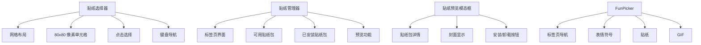
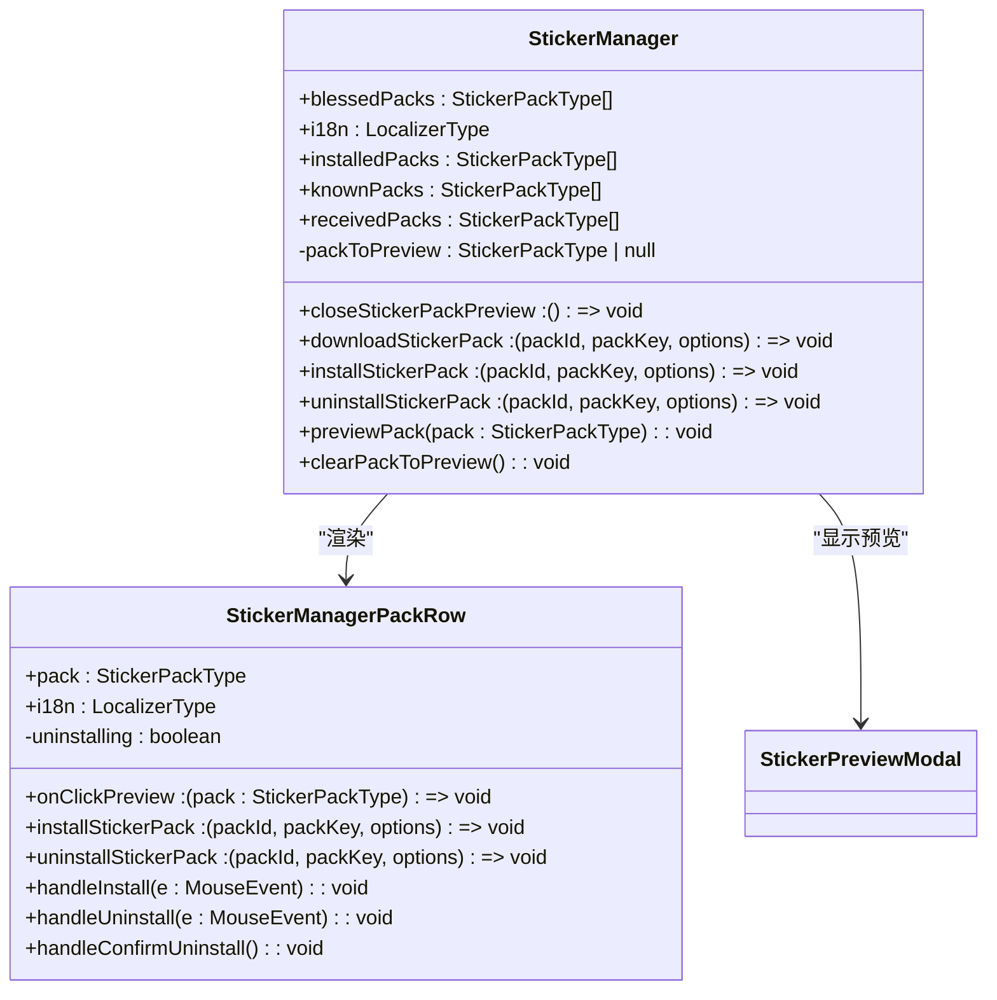
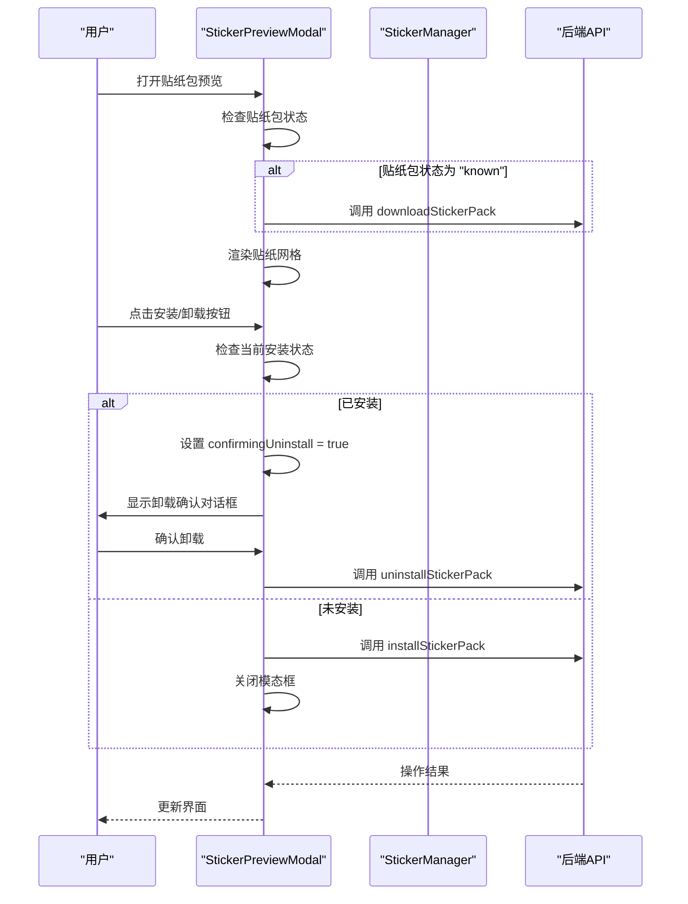
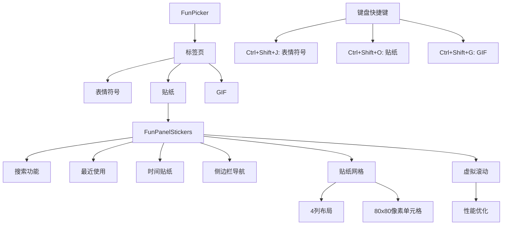
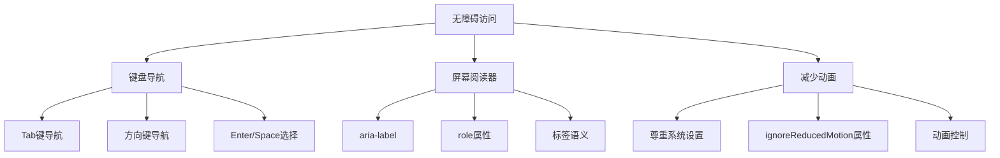
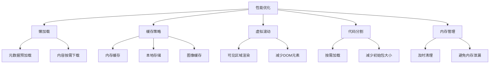
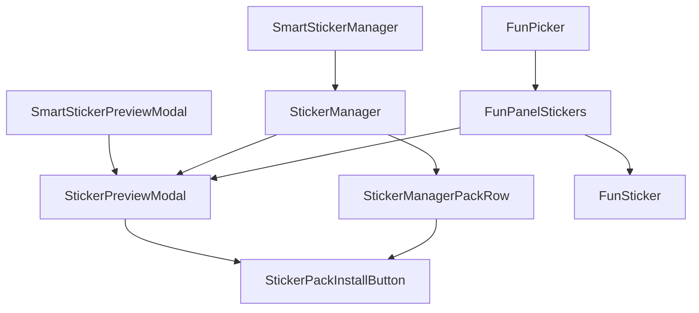
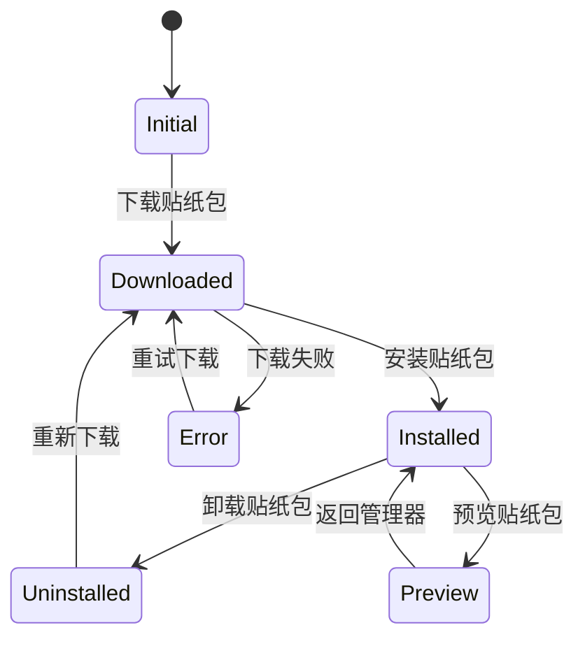

# 贴纸组件

<cite>
**本文档中引用的文件**  
- [StickerManager.dom.tsx](file://ts/components/stickers/StickerManager.dom.tsx)
- [StickerPreviewModal.dom.tsx](file://ts/components/stickers/StickerPreviewModal.dom.tsx)
- [FunPicker.dom.tsx](file://ts/components/fun/FunPicker.dom.tsx)
- [FunPanelStickers.dom.tsx](file://ts/components/fun/panels/FunPanelStickers.dom.tsx)
- [FunSticker.dom.tsx](file://ts/components/fun/FunSticker.dom.tsx)
- [StickerManagerPackRow.dom.tsx](file://ts/components/stickers/StickerManagerPackRow.dom.tsx)
- [StickerPackInstallButton.dom.tsx](file://ts/components/stickers/StickerPackInstallButton.dom.tsx)
- [FunProvider.dom.tsx](file://ts/components/fun/FunProvider.dom.tsx)
- [SmartStickerManager.preload.tsx](file://ts/state/smart/StickerManager.preload.tsx)
- [SmartStickerPreviewModal.preload.tsx](file://ts/state/smart/StickerPreviewModal.preload.tsx)
</cite>

## 目录
1. [简介](#简介)
2. [核心组件](#核心组件)
3. [视觉外观与用户交互](#视觉外观与用户交互)
4. [贴纸管理器](#贴纸管理器)
5. [贴纸预览模态框](#贴纸预览模态框)
6. [FunPicker 集成](#funpicker-集成)
7. [贴纸动画与交互](#贴纸动画与交互)
8. [搜索与发送功能](#搜索与发送功能)
9. [无障碍访问](#无障碍访问)
10. [性能优化](#性能优化)
11. [附录](#附录)

## 简介
Signal-Desktop 的贴纸系统提供了一套完整的贴纸管理、预览和发送功能。该系统包含贴纸选择器、贴纸管理器和贴纸预览模态框等核心组件，支持贴纸包的安装、卸载、搜索和发送。贴纸与表情符号、GIF 集成在统一的 FunPicker 组件中，为用户提供一致的交互体验。

## 核心组件
贴纸系统由多个核心组件构成，包括贴纸管理器（StickerManager）、贴纸预览模态框（StickerPreviewModal）、FunPicker 和贴纸面板（FunPanelStickers）。这些组件通过 React 的状态管理和事件处理机制协同工作，实现完整的贴纸功能。

**Section sources**
- [StickerManager.dom.tsx](file://ts/components/stickers/StickerManager.dom.tsx)
- [StickerPreviewModal.dom.tsx](file://ts/components/stickers/StickerPreviewModal.dom.tsx)
- [FunPicker.dom.tsx](file://ts/components/fun/FunPicker.dom.tsx)
- [FunPanelStickers.dom.tsx](file://ts/components/fun/panels/FunPanelStickers.dom.tsx)

## 视觉外观与用户交互
贴纸选择器采用网格布局显示贴纸，每个贴纸以 80x80 像素的单元格呈现。用户可以通过点击或键盘导航选择贴纸。贴纸管理器提供标签页界面，分为“可用”和“已安装”两个视图，用户可以浏览、预览和管理贴纸包。

贴纸预览模态框显示贴纸包的详细信息，包括封面、标题、作者和所有贴纸。用户可以通过点击安装或卸载按钮来管理贴纸包。FunPicker 组件提供标签页导航，允许用户在表情符号、贴纸和 GIF 之间切换。



**Diagram sources**
- [FunPanelStickers.dom.tsx](file://ts/components/fun/panels/FunPanelStickers.dom.tsx)
- [StickerManager.dom.tsx](file://ts/components/stickers/StickerManager.dom.tsx)
- [StickerPreviewModal.dom.tsx](file://ts/components/stickers/StickerPreviewModal.dom.tsx)

## 贴纸管理器
StickerManager 组件是贴纸系统的核心管理界面，负责展示和管理所有贴纸包。它接收多个 props 来控制其行为和显示内容。

### Props
- `blessedPacks`: 系统推荐的贴纸包数组
- `closeStickerPackPreview`: 关闭贴纸包预览的回调函数
- `downloadStickerPack`: 下载贴纸包的回调函数
- `i18n`: 国际化函数
- `installStickerPack`: 安装贴纸包的回调函数
- `installedPacks`: 已安装贴纸包数组
- `knownPacks`: 已知贴纸包数组
- `receivedPacks`: 收到的贴纸包数组
- `uninstallStickerPack`: 卸载贴纸包的回调函数

### 状态管理
组件使用 React.useState 管理当前预览的贴纸包（packToPreview）。当组件首次加载时，会自动下载所有已知贴纸包，并通过 setTimeout 确保焦点正确设置。

### 事件处理
- `previewPack`: 设置当前预览的贴纸包
- `clearPackToPreview`: 清除当前预览的贴纸包



**Diagram sources**
- [StickerManager.dom.tsx](file://ts/components/stickers/StickerManager.dom.tsx)
- [StickerManagerPackRow.dom.tsx](file://ts/components/stickers/StickerManagerPackRow.dom.tsx)

**Section sources**
- [StickerManager.dom.tsx](file://ts/components/stickers/StickerManager.dom.tsx)
- [StickerManagerPackRow.dom.tsx](file://ts/components/stickers/StickerManagerPackRow.dom.tsx)

## 贴纸预览模态框
StickerPreviewModal 组件提供贴纸包的详细预览功能，允许用户查看贴纸包的所有贴纸并进行安装或卸载操作。

### Props
- `onClose`: 关闭模态框的回调函数
- `closeStickerPackPreview`: 关闭贴纸包预览的回调函数
- `downloadStickerPack`: 下载贴纸包的回调函数
- `installStickerPack`: 安装贴纸包的回调函数
- `uninstallStickerPack`: 卸载贴纸包的回调函数
- `pack`: 当前预览的贴纸包
- `i18n`: 国际化函数

### 状态管理
组件使用 React.useState 管理卸载确认状态（confirmingUninstall）。当贴纸包状态为 "known" 时，会自动触发下载。

### 事件处理
- `handleToggleInstall`: 切换安装状态，显示卸载确认对话框
- `handleUninstall`: 执行卸载操作
- `handleClose`: 关闭模态框



**Diagram sources**
- [StickerPreviewModal.dom.tsx](file://ts/components/stickers/StickerPreviewModal.dom.tsx)

**Section sources**
- [StickerPreviewModal.dom.tsx](file://ts/components/stickers/StickerPreviewModal.dom.tsx)

## FunPicker 集成
FunPicker 组件是 Signal-Desktop 中表情符号、贴纸和 GIF 的统一选择器，通过标签页方式集成这三种内容类型。

### Props
- `open`: 控制选择器是否打开
- `onOpenChange`: 打开状态变化的回调函数
- `onSelectEmoji`: 选择表情符号的回调函数
- `onSelectSticker`: 选择贴纸的回调函数
- `onSelectGif`: 选择 GIF 的回调函数
- `onAddStickerPack`: 添加贴纸包的回调函数
- `placement`: 弹出位置
- `theme`: 主题类型
- `children`: 触发选择器的子元素

### 贴纸面板 (FunPanelStickers)
FunPanelStickers 是 FunPicker 中负责贴纸显示的组件，具有以下特性：
- 支持搜索功能，通过表情符号关键词查找相关贴纸
- 显示最近使用的贴纸
- 支持时间贴纸（数字和模拟时钟）
- 提供侧边栏导航，快速切换不同贴纸包

### 状态管理
组件使用多个 useState 钩子管理状态：
- `focusedCellKey`: 当前聚焦的单元格键
- `searchInput`: 搜索输入框内容
- `selectedSection`: 当前选中的章节



**Diagram sources**
- [FunPicker.dom.tsx](file://ts/components/fun/FunPicker.dom.tsx)
- [FunPanelStickers.dom.tsx](file://ts/components/fun/panels/FunPanelStickers.dom.tsx)

**Section sources**
- [FunPicker.dom.tsx](file://ts/components/fun/FunPicker.dom.tsx)
- [FunPanelStickers.dom.tsx](file://ts/components/fun/panels/FunPanelStickers.dom.tsx)

## 贴纸动画与交互
Signal-Desktop 的贴纸系统支持丰富的动画和交互功能，包括贴纸缩放、触摸交互和时间贴纸的实时更新。

### 贴纸缩放
贴纸在选择时支持缩放交互，用户可以通过点击或触摸来查看贴纸的详细信息。系统使用 CSS transform 属性实现平滑的缩放动画。

### 触摸交互
对于触摸设备，系统优化了触摸目标大小，确保用户能够轻松选择贴纸。每个贴纸单元格都有足够的触摸区域，并提供视觉反馈。

### 时间贴纸
系统提供两种时间贴纸：数字时钟和模拟时钟。这些贴纸具有以下特点：
- 实时更新：每秒更新显示的时间
- 数字时钟：显示当前小时和分钟
- 模拟时钟：显示时针和分针，角度随时间变化

```mermaid
classDiagram
class FunSticker {
+src : string
+size : number
+ignoreReducedMotion : boolean
+role : string
+aria-label : string
}
class DigitalTimeSticker {
+size : number
-digitalTime : string
+getDigitalTime() : string
+setDigitalTime() : void
}
class AnalogTimeSticker {
+size : number
-analogTime : {hour : number, minute : number}
+getAnalogTime() : {hour, minute}
+setAnalogTime() : void
}
FunSticker <|-- DigitalTimeSticker
FunSticker <|-- AnalogTimeSticker
DigitalTimeSticker --> setInterval : "每秒更新"
AnalogTimeSticker --> setInterval : "每秒更新"
```

**Diagram sources**
- [FunSticker.dom.tsx](file://ts/components/fun/FunSticker.dom.tsx)
- [FunPanelStickers.dom.tsx](file://ts/components/fun/panels/FunPanelStickers.dom.tsx)

**Section sources**
- [FunSticker.dom.tsx](file://ts/components/fun/FunSticker.dom.tsx)
- [FunPanelStickers.dom.tsx](file://ts/components/fun/panels/FunPanelStickers.dom.tsx)

## 搜索与发送功能
贴纸系统提供强大的搜索和发送功能，允许用户快速找到并发送贴纸。

### 搜索功能
用户可以通过输入表情符号关键词来搜索相关贴纸。系统使用 useFunEmojiSearch 钩子进行搜索，匹配贴纸的 emoji 属性。

### 发送功能
当用户选择贴纸时，系统通过 onSelectSticker 回调函数通知父组件，然后将贴纸信息发送到聊天窗口。

### 代码示例
```typescript
// 贴纸选择回调
const handleSelectSticker = (stickerSelection: FunStickerSelection) => {
  // 发送贴纸到聊天窗口
  sendMessage({
    sticker: {
      packId: stickerSelection.stickerPackId,
      stickerId: stickerSelection.stickerId,
      url: stickerSelection.stickerUrl
    }
  });
};

// 贴纸包安装
const handleInstallStickerPack = (packId: string, packKey: string) => {
  installStickerPack(packId, packKey, { actionSource: 'ui' });
};

// 贴纸包卸载
const handleUninstallStickerPack = (packId: string, packKey: string) => {
  uninstallStickerPack(packId, packKey, { actionSource: 'ui' });
};
```

**Section sources**
- [FunPanelStickers.dom.tsx](file://ts/components/fun/panels/FunPanelStickers.dom.tsx)
- [StickerManager.dom.tsx](file://ts/components/stickers/StickerManager.dom.tsx)

## 无障碍访问
贴纸系统遵循无障碍访问最佳实践，确保所有用户都能方便地使用贴纸功能。

### 键盘导航
系统支持完整的键盘导航：
- 使用 Tab 键在不同元素间移动
- 使用方向键在贴纸网格中导航
- 使用 Enter 或 Space 键选择贴纸

### 屏幕阅读器支持
每个贴纸都提供适当的 aria-label 属性，通常使用贴纸的 emoji 描述。模态框和对话框都有正确的 aria 属性，确保屏幕阅读器能够正确识别。

### 减少动画
系统尊重用户的减少动画偏好，当用户启用了减少动画设置时，贴纸动画会被自动禁用。



**Diagram sources**
- [FunSticker.dom.tsx](file://ts/components/fun/FunSticker.dom.tsx)
- [FunPanelStickers.dom.tsx](file://ts/components/fun/panels/FunPanelStickers.dom.tsx)

**Section sources**
- [FunSticker.dom.tsx](file://ts/components/fun/FunSticker.dom.tsx)
- [FunPanelStickers.dom.tsx](file://ts/components/fun/panels/FunPanelStickers.dom.tsx)

## 性能优化
贴纸系统采用多种性能优化策略，确保在大量贴纸情况下仍能流畅运行。

### 懒加载
系统实现贴纸的懒加载，只有当贴纸包被预览或使用时才下载其内容。StickerManager 组件在首次加载时会自动下载所有已知贴纸包的元数据，但不会下载完整的贴纸图像。

### 缓存策略
系统使用多级缓存策略：
- 内存缓存：存储最近使用的贴纸和贴纸包信息
- 本地存储：持久化已安装的贴纸包信息
- 图像缓存：利用浏览器的图像缓存机制

### 虚拟滚动
FunPanelStickers 组件使用虚拟滚动技术，只渲染当前可见区域的贴纸，大大减少了 DOM 元素数量，提高了渲染性能。

### 代码分割
贴纸相关组件采用代码分割，只有在用户打开贴纸选择器时才加载相关代码，减少了初始加载时间。



**Diagram sources**
- [FunPanelStickers.dom.tsx](file://ts/components/fun/panels/FunPanelStickers.dom.tsx)
- [StickerManager.dom.tsx](file://ts/components/stickers/StickerManager.dom.tsx)

**Section sources**
- [FunPanelStickers.dom.tsx](file://ts/components/fun/panels/FunPanelStickers.dom.tsx)
- [StickerManager.dom.tsx](file://ts/components/stickers/StickerManager.dom.tsx)

## 附录
### 组件关系图


**Diagram sources**
- [SmartStickerManager.preload.tsx](file://ts/state/smart/StickerManager.preload.tsx)
- [SmartStickerPreviewModal.preload.tsx](file://ts/state/smart/StickerPreviewModal.preload.tsx)

### 状态转换图


**Diagram sources**
- [StickerManager.dom.tsx](file://ts/components/stickers/StickerManager.dom.tsx)
- [StickerPreviewModal.dom.tsx](file://ts/components/stickers/StickerPreviewModal.dom.tsx)