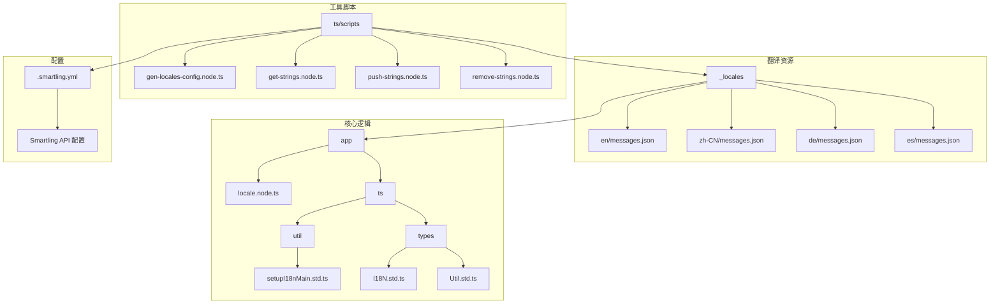
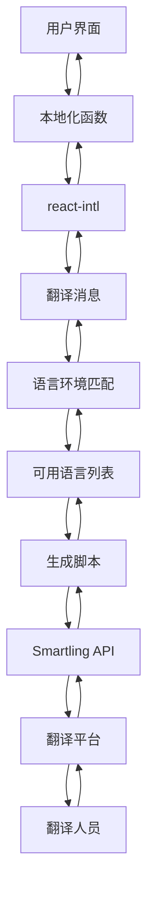
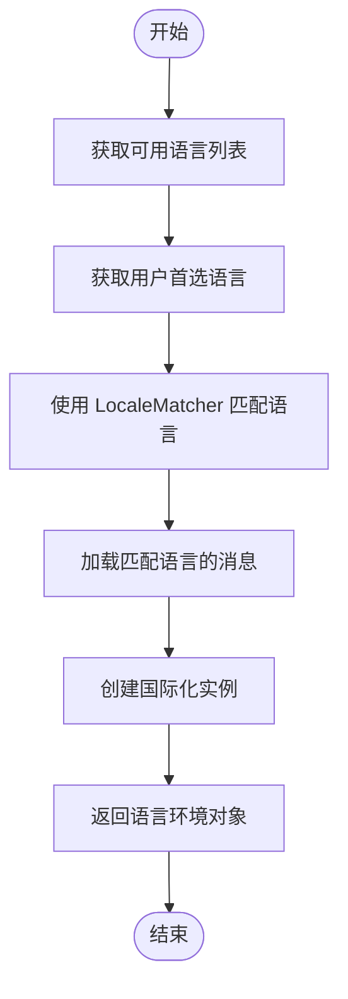
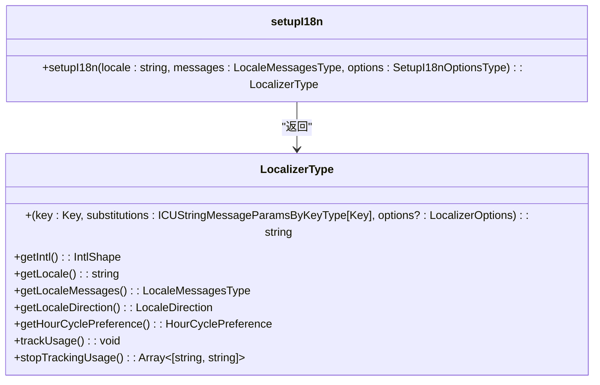
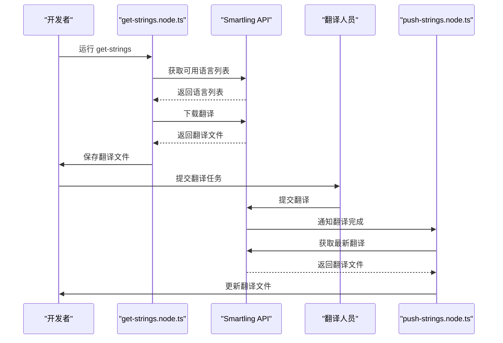
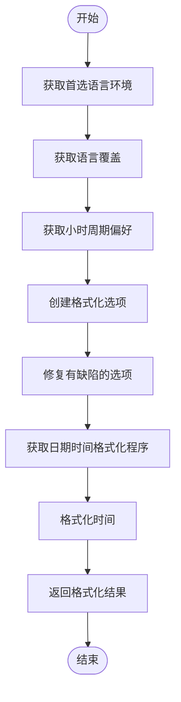

# 国际化支持

<cite>
**本文档中引用的文件**  
- [_locales](file://_locales)
- [app\locale.node.ts](file://app/locale.node.ts)
- [ts\util\setupI18nMain.std.ts](file://ts/util/setupI18nMain.std.ts)
- [ts\types\I18N.std.ts](file://ts/types/I18N.std.ts)
- [ts\types\Util.std.ts](file://ts/types/Util.std.ts)
- [ts\scripts\gen-locales-config.node.ts](file://ts/scripts/gen-locales-config.node.ts)
- [ts\scripts\get-strings.node.ts](file://ts/scripts/get-strings.node.ts)
- [ts\scripts\push-strings.node.ts](file://ts/scripts/push-strings.node.ts)
- [ts\scripts\remove-strings.node.ts](file://ts/scripts/remove-strings.node.ts)
- [.smartling.yml](file://.smartling.yml)
- [ts\util\smartling.node.ts](file://ts/util/smartling.node.ts)
- [ts\util\formatTimestamp.dom.ts](file://ts/util/formatTimestamp.dom.ts)
</cite>

## 目录
1. [简介](#简介)
2. [项目结构](#项目结构)
3. [核心组件](#核心组件)
4. [架构概述](#架构概述)
5. [详细组件分析](#详细组件分析)
6. [依赖分析](#依赖分析)
7. [性能考虑](#性能考虑)
8. [故障排除指南](#故障排除指南)
9. [结论](#结论)

## 简介
Signal-Desktop 的国际化支持系统旨在为全球用户提供多语言体验。该系统基于现代国际化标准，使用 `react-intl` 和 `@formatjs` 库来处理翻译、格式化和本地化。它支持超过 50 种语言，并通过自动化流程与 Smartling 翻译平台集成。系统实现了动态语言切换、区域特定格式（如日期/时间、数字）处理以及双向文本（RTL/LTR）支持。本文档详细说明了 Signal-Desktop 的多语言实现机制、翻译流程和本地化策略。

## 项目结构
Signal-Desktop 的国际化系统采用模块化设计，将翻译资源、核心逻辑和工具脚本分离。翻译文件存储在 `_locales` 目录中，每个语言都有独立的子目录。核心国际化逻辑位于 `app` 和 `ts` 目录中，而自动化脚本则集中在 `ts/scripts` 目录下。



**图示来源**
- [app\locale.node.ts](file://app/locale.node.ts#L1-L219)
- [ts\util\setupI18nMain.std.ts](file://ts/util/setupI18nMain.std.ts#L1-L185)
- [ts\types\I18N.std.ts](file://ts/types/I18N.std.ts#L1-L44)
- [ts\scripts\gen-locales-config.node.ts](file://ts/scripts/gen-locales-config.node.ts#L1-L63)

## 核心组件
Signal-Desktop 的国际化系统由几个核心组件构成：`locale.node.ts` 负责加载和匹配语言环境，`setupI18nMain.std.ts` 提供国际化的本地化函数，`I18N.std.ts` 定义了相关的类型，而 `Util.std.ts` 提供了本地化类型定义。这些组件协同工作，实现了完整的国际化功能。

**本节来源**
- [app\locale.node.ts](file://app/locale.node.ts#L1-L219)
- [ts\util\setupI18nMain.std.ts](file://ts/util/setupI18nMain.std.ts#L1-L185)
- [ts\types\I18N.std.ts](file://ts/types/I18N.std.ts#L1-L44)
- [ts\types\Util.std.ts](file://ts/types/Util.std.ts#L1-L134)

## 架构概述
Signal-Desktop 的国际化架构采用分层设计，从底层的翻译资源到上层的应用逻辑，每一层都有明确的职责。系统首先通过 `gen-locales-config.node.ts` 脚本生成可用语言列表，然后在应用启动时通过 `locale.node.ts` 加载匹配的语言环境。`setupI18nMain.std.ts` 提供了本地化函数，供应用的各个部分使用。



**图示来源**
- [app\locale.node.ts](file://app/locale.node.ts#L125-L218)
- [ts\util\setupI18nMain.std.ts](file://ts/util/setupI18nMain.std.ts#L116-L184)
- [ts\scripts\gen-locales-config.node.ts](file://ts/scripts/gen-locales-config.node.ts#L18-L62)

## 详细组件分析

### 语言环境加载与匹配
Signal-Desktop 使用 `locale.node.ts` 文件中的 `load` 函数来加载和匹配语言环境。该函数接收用户的首选语言列表，并使用 `@formatjs/intl-localematcher` 库来找到最匹配的可用语言。



**图示来源**
- [app\locale.node.ts](file://app/locale.node.ts#L125-L218)

### 本地化函数实现
`setupI18nMain.std.ts` 文件中的 `setupI18n` 函数是国际化系统的核心。它创建并返回一个本地化函数，该函数可以用于格式化消息、获取当前语言环境等。



**图示来源**
- [ts\util\setupI18nMain.std.ts](file://ts/util/setupI18nMain.std.ts#L116-L184)
- [ts\types\Util.std.ts](file://ts/types/Util.std.ts#L36-L55)

### 翻译流程
Signal-Desktop 的翻译流程涉及多个步骤，从提取待翻译的字符串到将翻译结果集成回应用。



**图示来源**
- [ts\scripts\get-strings.node.ts](file://ts/scripts/get-strings.node.ts#L1-L152)
- [ts\scripts\push-strings.node.ts](file://ts/scripts/push-strings.node.ts#L1-L48)
- [ts\util\smartling.node.ts](file://ts/util/smartling.node.ts#L1-L41)

### 区域特定格式处理
Signal-Desktop 使用 `formatTimestamp.dom.ts` 文件中的函数来处理日期和时间的区域特定格式。



**图示来源**
- [ts\util\formatTimestamp.dom.ts](file://ts/util/formatTimestamp.dom.ts#L1-L82)

## 依赖分析
Signal-Desktop 的国际化系统依赖于多个外部库和工具。主要依赖包括 `react-intl` 用于消息格式化，`@formatjs/intl-localematcher` 用于语言环境匹配，以及 `Smartling` 用于翻译管理。

```mermaid
graph TD
A[Signal-Desktop] --> B[react-intl]
A --> C[@formatjs/intl-localematcher]
A --> D[Smartling API]
A --> E[zod]
A --> F[lodash]
B --> G[FormatJS]
C --> G
D --> H[翻译平台]
E --> I[类型验证]
F --> J[实用函数]
```

**图示来源**
- [app\locale.node.ts](file://app/locale.node.ts#L4-L8)
- [ts\util\setupI18nMain.std.ts](file://ts/util/setupI18nMain.std.ts#L4-L5)
- [ts\util\smartling.node.ts](file://ts/util/smartling.node.ts#L4-L5)

## 性能考虑
Signal-Desktop 的国际化系统在性能方面进行了优化。例如，`setupI18nMain.std.ts` 中的 `createCachedIntl` 函数使用缓存来避免重复创建 `Intl` 实例。此外，`locale.node.ts` 中的 `load` 函数在打包版本中使用压缩的翻译文件来减少加载时间。

## 故障排除指南
在使用 Signal-Desktop 的国际化系统时，可能会遇到一些常见问题。以下是一些解决方案：

1. **翻译未更新**：确保运行了 `get-strings` 脚本来获取最新的翻译。
2. **语言环境不匹配**：检查 `gen-locales-config.node.ts` 脚本是否正确生成了可用语言列表。
3. **格式化错误**：确保 `formatTimestamp.dom.ts` 中的格式化选项正确设置。
4. **Smartling 连接问题**：检查 `.smartling.yml` 文件中的配置是否正确。

**本节来源**
- [ts\scripts\get-strings.node.ts](file://ts/scripts/get-strings.node.ts#L1-L152)
- [ts\scripts\gen-locales-config.node.ts](file://ts/scripts/gen-locales-config.node.ts#L1-L63)
- [ts\util\formatTimestamp.dom.ts](file://ts/util/formatTimestamp.dom.ts#L1-L82)
- [.smartling.yml](file://.smartling.yml#L1-L8)

## 结论
Signal-Desktop 的国际化支持系统是一个功能完整、设计良好的多语言实现。它通过模块化设计、自动化流程和与专业翻译平台的集成，为全球用户提供了高质量的本地化体验。系统不仅支持基本的文本翻译，还处理了复杂的区域特定格式和双向文本支持。通过本文档，开发者可以深入了解 Signal-Desktop 的国际化机制，并有效地维护和扩展其多语言支持。