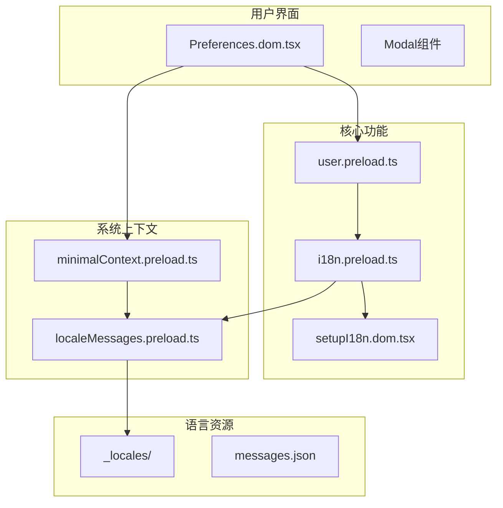
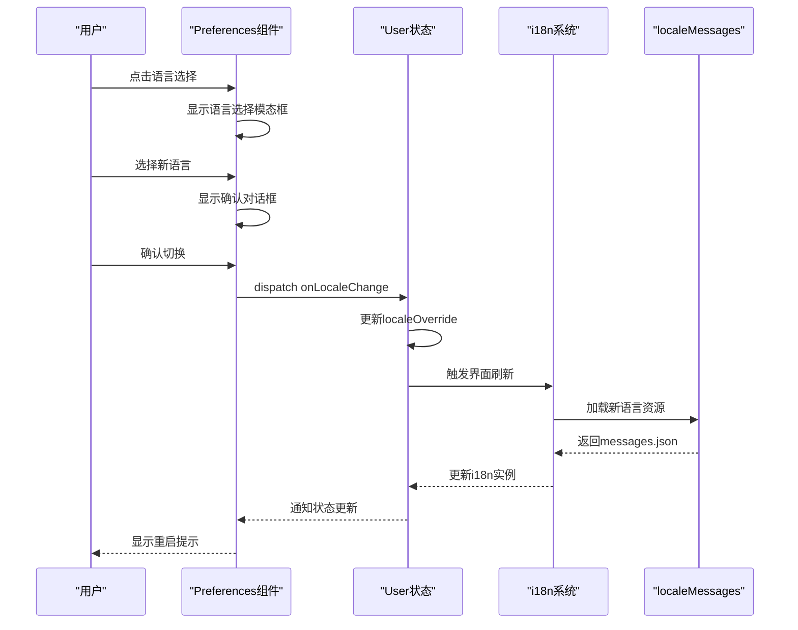
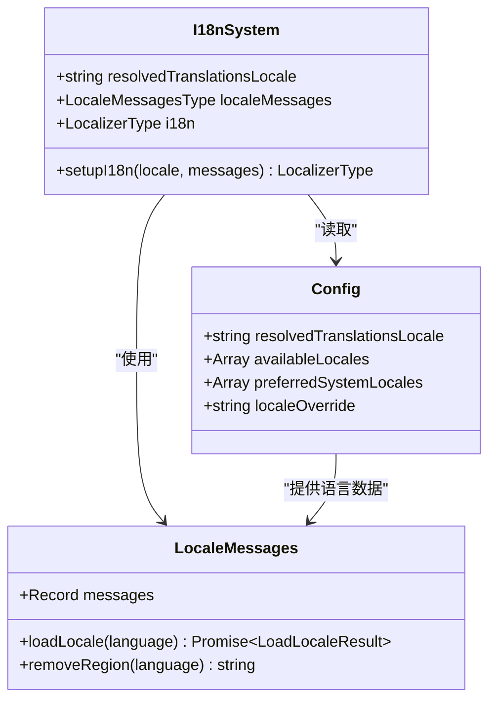
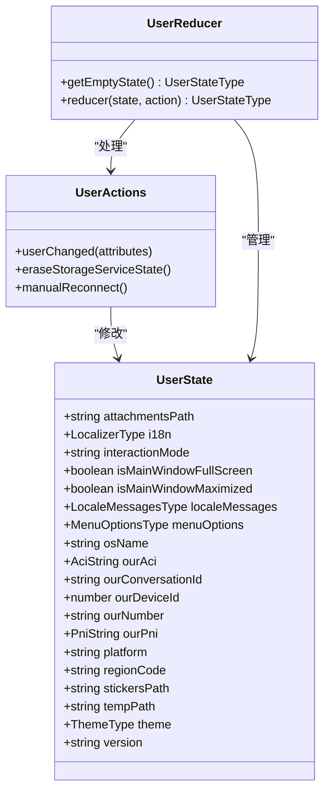
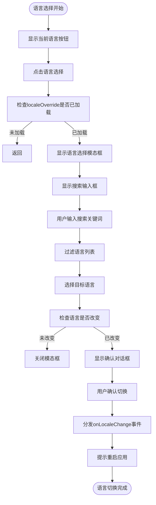
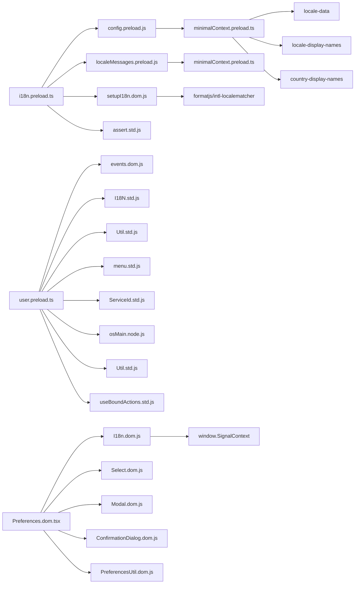

# 动态语言切换

<cite>
**本文档引用的文件**   
- [i18n.preload.ts](file://ts/context/i18n.preload.ts)
- [user.preload.ts](file://ts/state/ducks/user.preload.ts)
- [Preferences.dom.tsx](file://ts/components/Preferences.dom.tsx)
- [setupI18n.dom.tsx](file://ts/util/setupI18n.dom.tsx)
- [localeMessages.preload.ts](file://ts/context/localeMessages.preload.ts)
- [minimalContext.preload.ts](file://ts/windows/minimalContext.preload.ts)
- [locale.node.ts](file://app/locale.node.ts)
</cite>

## 目录
1. [简介](#简介)
2. [项目结构](#项目结构)
3. [核心组件](#核心组件)
4. [架构概述](#架构概述)
5. [详细组件分析](#详细组件分析)
6. [依赖分析](#依赖分析)
7. [性能考虑](#性能考虑)
8. [故障排除指南](#故障排除指南)
9. [结论](#结论)

## 简介
本文档详细说明Signal-Desktop中动态语言切换功能的实现机制。该功能允许用户在应用程序中更改界面语言，系统会相应地更新所有文本元素并持久化用户的语言偏好设置。文档涵盖语言状态管理、事件通知、界面刷新机制，以及如何通过Redux状态管理持久化用户偏好。同时描述了Preferences组件中语言选择界面的实现，包括语言列表展示和选择逻辑，并提供界面元素重新渲染的优化策略。

## 项目结构
Signal-Desktop的项目结构组织良好，语言相关功能主要分布在多个关键目录中。国际化（i18n）功能的核心实现位于`ts/context/`目录下，而用户界面组件则位于`ts/components/`目录中。语言资源文件存储在根目录的`_locales/`文件夹中，每个支持的语言都有独立的子文件夹。

**图示来源**
- [i18n.preload.ts](file://ts/context/i18n.preload.ts)
- [user.preload.ts](file://ts/state/ducks/user.preload.ts)
- [Preferences.dom.tsx](file://ts/components/Preferences.dom.tsx)
- [minimalContext.preload.ts](file://ts/windows/minimalContext.preload.ts)
- [localeMessages.preload.ts](file://ts/context/localeMessages.preload.ts)

**本节来源**
- [ts/context/i18n.preload.ts](file://ts/context/i18n.preload.ts)
- [ts/state/ducks/user.preload.ts](file://ts/state/ducks/user.preload.ts)
- [ts/components/Preferences.dom.tsx](file://ts/components/Preferences.dom.tsx)

## 核心组件
动态语言切换功能的核心组件包括语言状态管理器、用户偏好持久化机制和语言选择界面。`i18n.preload.ts`文件负责初始化国际化系统，`user.preload.ts`处理用户状态和偏好，而`Preferences.dom.tsx`实现了用户界面交互。这些组件协同工作，确保语言切换过程的流畅性和一致性。

**本节来源**
- [i18n.preload.ts](file://ts/context/i18n.preload.ts)
- [user.preload.ts](file://ts/state/ducks/user.preload.ts)
- [Preferences.dom.tsx](file://ts/components/Preferences.dom.tsx)

## 架构概述
Signal-Desktop的语言切换架构采用分层设计，从底层的语言资源加载到上层的用户界面更新，形成了完整的数据流。系统首先通过`locale.node.ts`加载可用的语言资源，然后在预加载上下文中初始化i18n系统，最后通过React组件树传播语言状态变化。

**图示来源**
- [Preferences.dom.tsx](file://ts/components/Preferences.dom.tsx)
- [user.preload.ts](file://ts/state/ducks/user.preload.ts)
- [i18n.preload.ts](file://ts/context/i18n.preload.ts)
- [localeMessages.preload.ts](file://ts/context/localeMessages.preload.ts)

## 详细组件分析

### i18n系统分析
i18n系统是Signal-Desktop国际化功能的核心，负责管理所有语言相关的状态和操作。系统通过`setupI18n`函数初始化，接收当前语言和消息资源作为参数，创建一个可全局访问的i18n实例。

**图示来源**
- [i18n.preload.ts](file://ts/context/i18n.preload.ts)
- [setupI18n.dom.tsx](file://ts/util/setupI18n.dom.tsx)
- [localeMessages.preload.ts](file://ts/context/localeMessages.preload.ts)

**本节来源**
- [i18n.preload.ts](file://ts/context/i18n.preload.ts)
- [setupI18n.dom.tsx](file://ts/util/setupI18n.dom.tsx)

### 用户状态管理分析
用户状态管理组件负责持久化用户的语言偏好设置，使用Redux模式管理应用状态。`user.preload.ts`文件定义了用户相关的状态类型、动作和reducer，确保语言偏好在应用重启后仍然保持。

**图示来源**
- [user.preload.ts](file://ts/state/ducks/user.preload.ts)

**本节来源**
- [user.preload.ts](file://ts/state/ducks/user.preload.ts)

### 语言选择界面分析
Preferences组件实现了语言选择的用户界面，提供直观的交互体验。界面包含语言选择控件、搜索功能和确认流程，确保用户能够轻松地切换应用语言。

**图示来源**
- [Preferences.dom.tsx](file://ts/components/Preferences.dom.tsx)

**本节来源**
- [Preferences.dom.tsx](file://ts/components/Preferences.dom.tsx)

## 依赖分析
动态语言切换功能依赖于多个核心模块和外部库，形成了复杂的依赖关系网络。这些依赖确保了语言切换功能的完整性和可靠性。

**图示来源**
- [i18n.preload.ts](file://ts/context/i18n.preload.ts)
- [user.preload.ts](file://ts/state/ducks/user.preload.ts)
- [Preferences.dom.tsx](file://ts/components/Preferences.dom.tsx)
- [minimalContext.preload.ts](file://ts/windows/minimalContext.preload.ts)

**本节来源**
- [i18n.preload.ts](file://ts/context/i18n.preload.ts)
- [user.preload.ts](file://ts/state/ducks/user.preload.ts)
- [Preferences.dom.tsx](file://ts/components/Preferences.dom.tsx)
- [minimalContext.preload.ts](file://ts/windows/minimalContext.preload.ts)

## 性能考虑
在实现动态语言切换功能时，Signal-Desktop考虑了多项性能优化策略，以确保用户体验的流畅性。系统通过预加载语言资源、缓存显示名称和优化重新渲染过程来提高性能。

语言切换过程中，系统避免了不必要的重绘，通过合理的状态管理和组件更新策略，只重新渲染受影响的界面元素。滚动位置的保持通过React的key机制和组件生命周期管理来实现，确保用户在切换语言后能够回到之前浏览的位置。

此外，系统采用了惰性加载策略，只在需要时加载特定语言的资源文件，减少了初始加载时间。语言资源的缓存机制也避免了重复的网络请求或文件读取操作，提高了整体性能。

## 故障排除指南
在使用动态语言切换功能时，可能会遇到一些常见问题。以下是一些故障排除建议：

1. **语言切换后界面未更新**：确保应用已正确重启。语言切换需要重启应用才能完全生效。
2. **某些文本未翻译**：检查所选语言的messages.json文件是否完整，可能存在缺失的翻译条目。
3. **语言选择界面无法打开**：确认localeOverride设置已正确加载，可能需要检查应用配置。
4. **性能问题**：如果语言切换导致性能下降，检查是否有过多的重新渲染，可能需要优化组件的shouldComponentUpdate逻辑。

**本节来源**
- [Preferences.dom.tsx](file://ts/components/Preferences.dom.tsx)
- [i18n.preload.ts](file://ts/context/i18n.preload.ts)
- [user.preload.ts](file://ts/state/ducks/user.preload.ts)

## 结论
Signal-Desktop的动态语言切换功能通过精心设计的架构实现了流畅的用户体验。系统采用分层架构，将语言状态管理、用户偏好持久化和界面更新分离，确保了代码的可维护性和扩展性。通过Redux模式管理用户状态，语言偏好设置能够跨会话持久化。

语言选择界面提供了直观的用户体验，包含搜索功能和确认流程，降低了用户误操作的风险。性能优化策略确保了语言切换过程的流畅性，避免了不必要的重绘和性能瓶颈。

整体而言，该功能展示了Signal-Desktop在国际化支持方面的成熟实现，为全球用户提供了本地化的使用体验。未来可以考虑增加实时预览功能，让用户在确认前就能看到语言切换的效果，进一步提升用户体验。