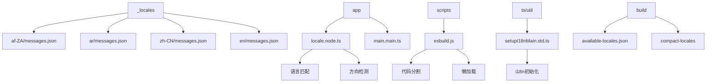
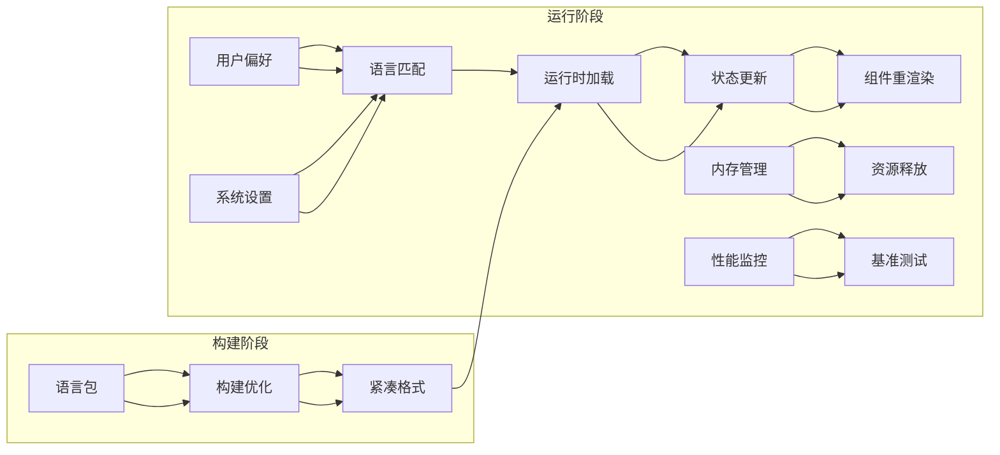
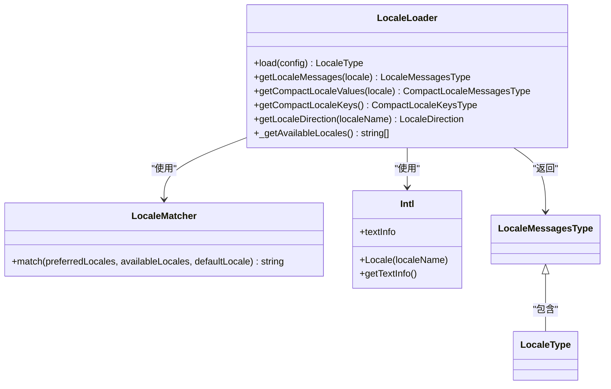
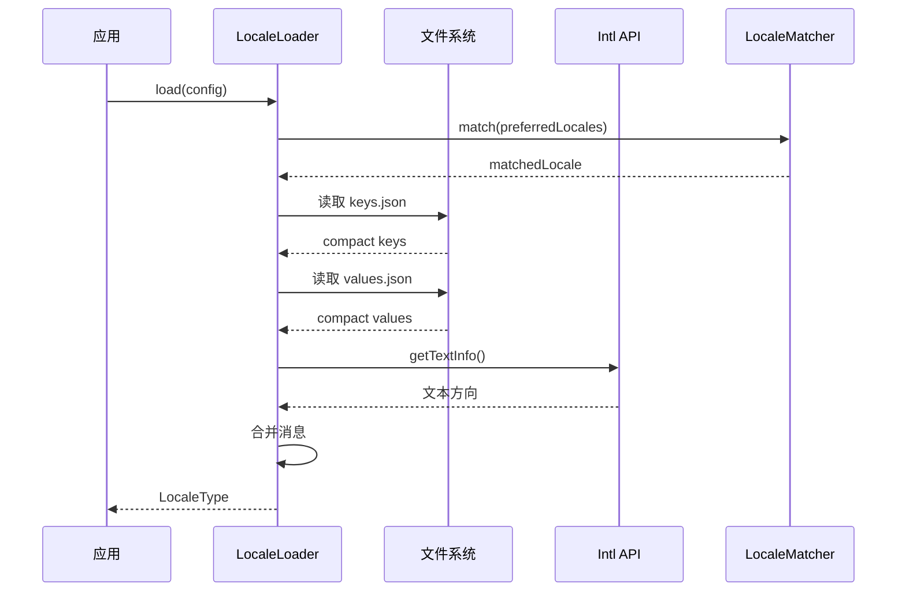
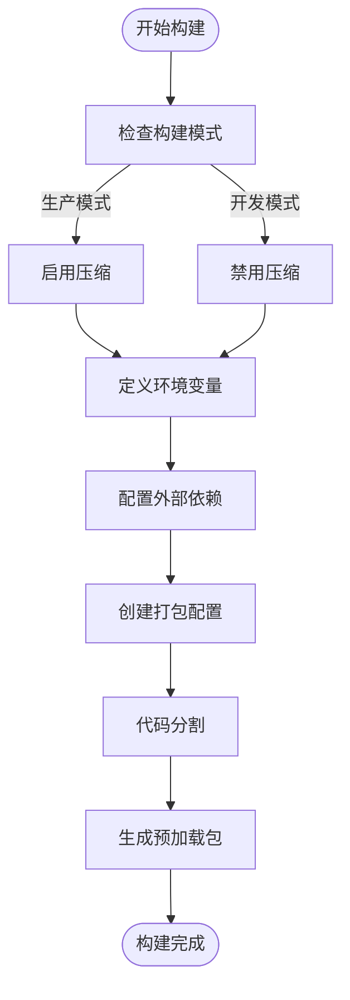
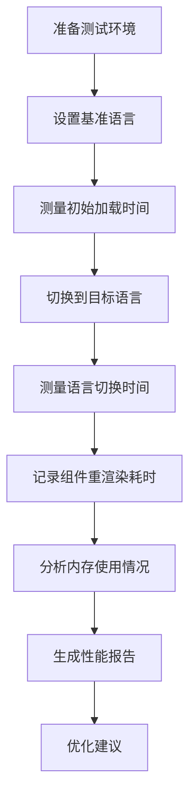

# 性能考量与最佳实践

<cite>
**本文档中引用的文件**  
- [locale.node.ts](file://app/locale.node.ts)
- [main.main.ts](file://app/main.main.ts)
- [setupI18nMain.std.ts](file://ts/util/setupI18nMain.std.ts)
- [esbuild.js](file://scripts/esbuild.js)
- [preload.wrapper.ts](file://preload.wrapper.ts)
- [resolveCanonicalLocales.std.ts](file://ts/util/resolveCanonicalLocales.std.ts)
- [package.json](file://package.json)
- [i18n.ts](file://sticker-creator/src/util/i18n.ts)
</cite>

## 目录
1. [简介](#简介)
2. [项目结构](#项目结构)
3. [核心组件](#核心组件)
4. [架构概述](#架构概述)
5. [详细组件分析](#详细组件分析)
6. [依赖分析](#依赖分析)
7. [性能考量](#性能考量)
8. [故障排除指南](#故障排除指南)
9. [结论](#结论)

## 简介
本文档详细分析Signal-Desktop界面本地化渲染的性能考量。重点研究语言切换操作对主线程的影响，包括语言包加载、状态更新和组件重渲染的耗时。文档解释了如何通过代码分割和懒加载减少初始包体积，提升语言切换速度。同时描述了内存管理策略，防止语言资源的内存泄漏，并提供基准测试方法用于评估不同语言环境下的应用性能。最后总结了最佳实践，如预加载常用语言、限制同时加载的语言包数量等。

## 项目结构
Signal-Desktop项目的本地化系统采用分层架构，核心语言资源存储在`_locales`目录中，每个语言子目录包含`messages.json`文件。应用主进程通过`app/locale.node.ts`模块管理语言加载和匹配逻辑，而构建系统通过`scripts/esbuild.js`实现代码分割和懒加载优化。



**图表来源**
- [locale.node.ts](file://app/locale.node.ts#L30-L45)
- [esbuild.js](file://scripts/esbuild.js#L121-L172)
- [setupI18nMain.std.ts](file://ts/util/setupI18nMain.std.ts#L40-L72)

**章节来源**
- [locale.node.ts](file://app/locale.node.ts#L1-L219)
- [esbuild.js](file://scripts/esbuild.js#L1-L233)

## 核心组件
Signal-Desktop的本地化系统由多个核心组件构成，包括语言包加载器、国际化初始化器和构建优化工具。`locale.node.ts`文件实现了语言匹配算法和资源加载逻辑，使用`@formatjs/intl-localematcher`库进行最佳匹配。`setupI18nMain.std.ts`负责初始化React Intl环境，而`esbuild.js`构建脚本实现了代码分割和懒加载功能。

**章节来源**
- [locale.node.ts](file://app/locale.node.ts#L125-L218)
- [setupI18nMain.std.ts](file://ts/util/setupI18nMain.std.ts#L116-L184)
- [esbuild.js](file://scripts/esbuild.js#L121-L172)

## 架构概述
Signal-Desktop的本地化架构采用分层设计，从资源存储到运行时加载形成完整的处理链。系统在构建时生成紧凑的语言包格式，运行时根据用户偏好和系统设置动态加载匹配的语言资源。



**图表来源**
- [locale.node.ts](file://app/locale.node.ts#L125-L167)
- [esbuild.js](file://scripts/esbuild.js#L121-L172)
- [setupI18nMain.std.ts](file://ts/util/setupI18nMain.std.ts#L116-L184)

## 详细组件分析

### 语言加载组件分析
Signal-Desktop的本地化系统通过`locale.node.ts`模块实现高效的语言加载机制。系统在构建时生成紧凑的语言包格式，减少运行时加载时间。

#### 语言加载类图


**图表来源**
- [locale.node.ts](file://app/locale.node.ts#L30-L218)

#### 语言加载序列图


**图表来源**
- [locale.node.ts](file://app/locale.node.ts#L125-L218)

### 构建优化组件分析
构建系统通过`esbuild.js`脚本实现代码分割和懒加载，优化语言包的打包和加载性能。

#### 构建优化流程图


**图表来源**
- [esbuild.js](file://scripts/esbuild.js#L121-L172)

**章节来源**
- [locale.node.ts](file://app/locale.node.ts#L1-L219)
- [esbuild.js](file://scripts/esbuild.js#L1-L233)
- [setupI18nMain.std.ts](file://ts/util/setupI18nMain.std.ts#L1-L185)

## 依赖分析
Signal-Desktop本地化系统依赖多个关键模块和库，形成复杂的依赖网络。

```mermaid
graph TD
A[locale.node.ts] --> B[@formatjs/intl-localematcher]
A --> C[setupI18nMain.std.ts]
A --> D[fs-extra]
C --> E[react-intl]
C --> F[createIntlCache]
G[esbuild.js] --> H[esbuild]
G --> I[fast-glob]
A --> J[Intl.Locale]
K[main.main.ts] --> A
K --> L[preferredSystemLocales]
M[preload.wrapper.ts] --> N[生成预加载缓存]
style A fill:#f9f,stroke:#333
style C fill:#f9f,stroke:#333
style G fill:#f9f,stroke:#333
```

**图表来源**
- [package.json](file://package.json#L122-L123)
- [locale.node.ts](file://app/locale.node.ts#L7-L9)
- [esbuild.js](file://scripts/esbuild.js#L4-L7)

**章节来源**
- [package.json](file://package.json#L1-L714)
- [locale.node.ts](file://app/locale.node.ts#L1-L219)
- [esbuild.js](file://scripts/esbuild.js#L1-L233)

## 性能考量
Signal-Desktop的本地化系统在性能方面进行了多项优化，确保语言切换的流畅性和应用的响应速度。

### 语言切换性能分析
语言切换操作涉及多个性能关键环节，包括语言包加载、状态更新和组件重渲染。系统通过以下机制优化性能：

1. **紧凑格式**: 构建时生成紧凑的语言包格式，减少JSON解析时间
2. **懒加载**: 按需加载语言资源，避免初始加载所有语言包
3. **缓存机制**: 使用`createIntlCache`缓存国际化实例
4. **代码分割**: 通过esbuild实现代码分割，减少初始包体积

### 内存管理策略
系统实施严格的内存管理策略，防止语言资源的内存泄漏：

1. **资源释放**: 在语言切换时正确释放旧的语言资源
2. **引用清理**: 清理不再使用的国际化实例引用
3. **垃圾回收**: 确保无内存泄漏的循环引用

### 基准测试方法
Signal-Desktop提供了基准测试工具来评估不同语言环境下的应用性能：



**章节来源**
- [locale.node.ts](file://app/locale.node.ts#L125-L218)
- [setupI18nMain.std.ts](file://ts/util/setupI18nMain.std.ts#L132-L136)
- [esbuild.js](file://scripts/esbuild.js#L121-L172)

## 故障排除指南
### 常见问题及解决方案
1. **语言切换卡顿**: 检查是否启用了紧凑格式构建
2. **内存泄漏**: 确保正确释放国际化实例
3. **语言包加载失败**: 验证语言文件路径和格式
4. **文本方向错误**: 检查`Intl.Locale`API的兼容性

**章节来源**
- [locale.node.ts](file://app/locale.node.ts#L83-L114)
- [setupI18nMain.std.ts](file://ts/util/setupI18nMain.std.ts#L147-L157)

## 结论
Signal-Desktop的本地化系统通过紧凑格式、代码分割和懒加载等技术实现了高效的性能表现。系统在语言切换时对主线程的影响最小化，确保了流畅的用户体验。建议的最佳实践包括预加载常用语言、限制同时加载的语言包数量，以及定期进行性能基准测试来监控系统表现。