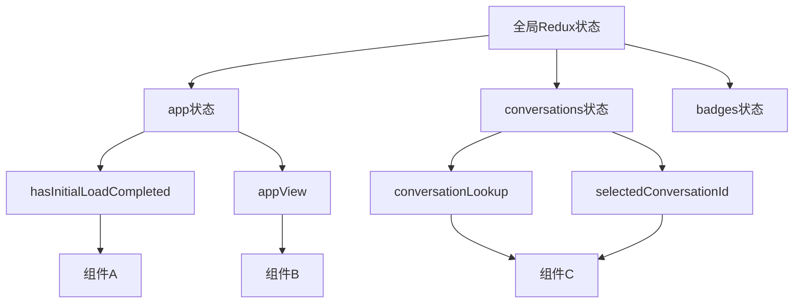
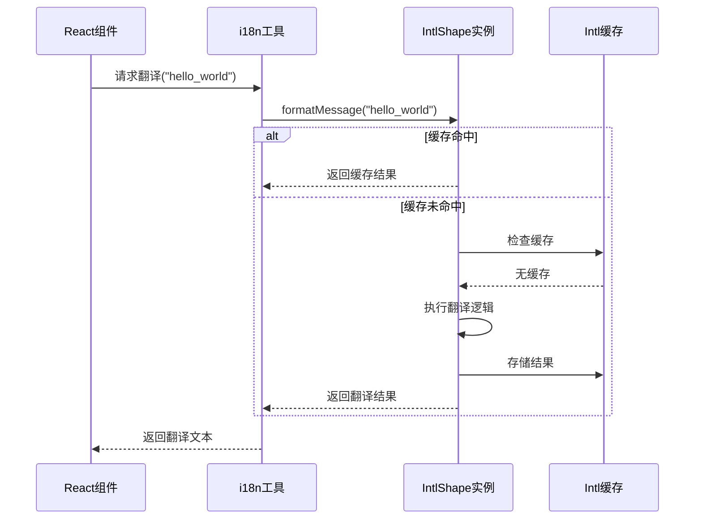
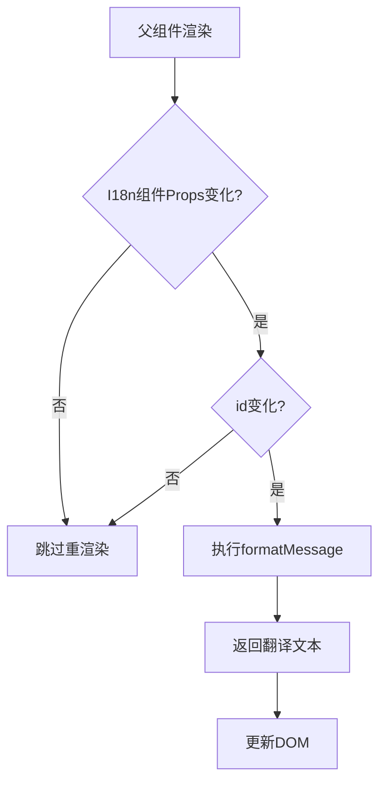
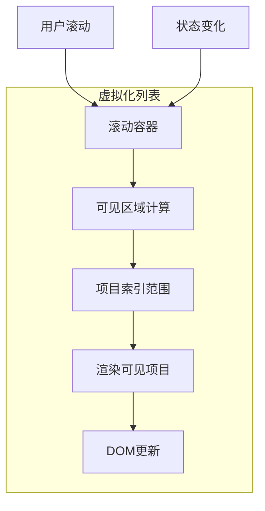
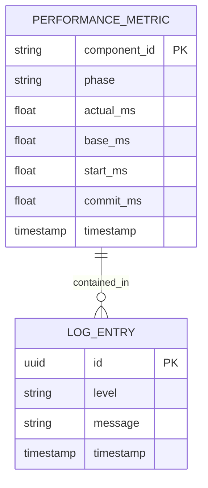

# 渲染优化策略

<cite>
**本文档引用的文件**   
- [i18n.ts](file://sticker-creator/src/util/i18n.ts)
- [I18n.dom.tsx](file://ts/components/I18n.dom.tsx)
- [app.std.ts](file://ts/state/selectors/app.std.ts)
- [conversations.dom.ts](file://ts/state/selectors/conversations.dom.ts)
- [useFunVirtualGrid.dom.tsx](file://ts/components/fun/virtual/useFunVirtualGrid.dom.tsx)
- [ListView.dom.tsx](file://ts/components/ListView.dom.tsx)
- [Profiler.dom.tsx](file://ts/components/Profiler.dom.tsx)
</cite>

## 目录
1. [简介](#简介)
2. [Redux状态订阅优化](#redux状态订阅优化)
3. [翻译函数的memoization技术](#翻译函数的memoization技术)
4. [翻译组件的React.memo优化](#翻译组件的reactmemo优化)
5. [多语言内容的虚拟化列表实现](#多语言内容的虚拟化列表实现)
6. [性能监控与验证](#性能监控与验证)
7. [结论](#结论)

## 简介
Signal-Desktop作为一款跨平台的即时通讯应用，支持多种语言的本地化渲染。随着支持的语言数量不断增加（超过100种），界面渲染性能面临挑战。本文档详细阐述了Signal-Desktop在本地化渲染方面的优化策略，重点分析如何通过精确的Redux状态订阅、memoization技术和虚拟化列表来避免因语言状态变化导致的全局重渲染，确保用户界面的流畅性。

## Redux状态订阅优化

在Signal-Desktop中，Redux被用作全局状态管理工具，存储包括用户界面语言在内的各种应用状态。为了避免因语言切换导致整个应用的组件树重新渲染，Signal-Desktop采用了`useSelector`钩子来最小化状态订阅范围。

通过分析代码库，我们发现应用中的选择器（selectors）被精心设计为只订阅必要的状态片段。例如，在`ts/state/selectors/app.std.ts`文件中，`getApp`选择器仅从全局状态中提取`app`部分，而更具体的选择器如`getHasInitialLoadCompleted`和`getAppView`则进一步从`app`状态中提取特定的布尔值和视图状态。这种分层选择器模式确保了组件只会在其直接依赖的状态发生变化时才重新渲染。

**图示来源**
- [app.std.ts](file://ts/state/selectors/app.std.ts#L7-L15)
- [conversations.dom.ts](file://ts/state/selectors/conversations.dom.ts#L120-L208)

**本节来源**
- [app.std.ts](file://ts/state/selectors/app.std.ts#L1-L15)
- [conversations.dom.ts](file://ts/state/selectors/conversations.dom.ts#L120-L208)

## 翻译函数的memoization技术

Signal-Desktop使用`react-intl`库来处理国际化（i18n）功能。为了优化翻译函数的性能，项目采用了memoization技术来缓存翻译结果，避免重复计算。

在`sticker-creator/src/util/i18n.ts`文件中，`createCachedIntl`函数利用`react-intl`提供的`createIntlCache`来创建一个缓存实例。当创建`IntlShape`实例时，这个缓存会被传入，使得格式化消息等操作的结果可以被缓存起来。此外，`formatters`对象中的`getNumberFormat`、`getDateTimeFormat`和`getPluralRules`函数都使用了`@formatjs/fast-memoize`库进行记忆化，确保对于相同的参数，格式化器实例只会被创建一次。

**图示来源**
- [i18n.ts](file://sticker-creator/src/util/i18n.ts#L61-L74)
- [i18n.ts](file://sticker-creator/src/util/i18n.ts#L19-L29)

**本节来源**
- [i18n.ts](file://sticker-creator/src/util/i18n.ts#L1-L138)

## 翻译组件的React.memo优化

为了进一步优化渲染性能，Signal-Desktop对翻译组件使用了`React.memo`进行高阶包装。`React.memo`是一种高阶组件，它会比较组件的props，只有在props发生变化时才重新渲染组件。

在`ts/components/I18n.dom.tsx`文件中，`I18n`组件被定义为一个函数组件，并通过`React.memo`进行优化。该组件接收`id`（翻译字符串的ID）和`i18n`（本地化实例）作为props。由于`i18n`实例在应用生命周期内通常不会改变，而`id`是字符串，这种设计使得`I18n`组件在大多数情况下都能避免不必要的重渲染。

**图示来源**
- [I18n.dom.tsx](file://ts/components/I18n.dom.tsx#L24-L33)

**本节来源**
- [I18n.dom.tsx](file://ts/components/I18n.dom.tsx#L1-L33)

## 多语言内容的虚拟化列表实现

对于包含大量多语言内容的长列表（如语言选择列表），Signal-Desktop实现了虚拟化列表技术，确保滚动的流畅性。虚拟化列表只渲染当前可见区域内的项目，而不是一次性渲染所有项目，从而大大减少了DOM节点的数量和渲染开销。

项目中使用了两种虚拟化技术：`useFunVirtualGrid`用于网格布局，而`ListView`组件则基于`react-virtualized`库封装，用于列表布局。`useFunVirtualGrid`利用`@tanstack/react-virtual`库，通过`useVirtualizer`钩子来管理可见项的虚拟化。`ListView`组件则是一个对`react-virtualized`的`List`组件的薄包装，提供了简化的API和常见的默认值。

**图示来源**
- [useFunVirtualGrid.dom.tsx](file://ts/components/fun/virtual/useFunVirtualGrid.dom.tsx#L454-L472)
- [ListView.dom.tsx](file://ts/components/ListView.dom.tsx#L62-L78)

**本节来源**
- [useFunVirtualGrid.dom.tsx](file://ts/components/fun/virtual/useFunVirtualGrid.dom.tsx#L1-L474)
- [ListView.dom.tsx](file://ts/components/ListView.dom.tsx#L1-L80)

## 性能监控与验证

为了验证上述优化策略的有效性，Signal-Desktop集成了性能监控机制。`ts/components/Profiler.dom.tsx`文件中定义了一个`Profiler`组件，它是一个对React内置`Profiler`的封装。该组件通过`onRender`回调函数记录每个被包裹组件的渲染性能数据，包括实际渲染时间（actual）、基础渲染时间（base）、开始时间（start）和提交时间（commit）。

这些性能数据被记录到日志中，开发者可以通过分析日志来识别性能瓶颈。例如，通过比较语言切换前后关键组件的渲染耗时和重渲染次数，可以量化优化策略的效果。如果某个组件在语言切换时被频繁重渲染且耗时较长，则表明其状态订阅可能过于宽泛，需要进一步优化。

**图示来源**
- [Profiler.dom.tsx](file://ts/components/Profiler.dom.tsx#L15-L28)

**本节来源**
- [Profiler.dom.tsx](file://ts/components/Profiler.dom.tsx#L1-L36)

## 结论
Signal-Desktop通过一系列精心设计的优化策略，有效解决了多语言本地化渲染带来的性能挑战。通过最小化Redux状态订阅范围，应用避免了因语言状态变化导致的全局重渲染。利用memoization技术缓存翻译结果和格式化器实例，显著减少了重复计算的开销。对翻译组件应用`React.memo`进一步确保了组件级别的渲染效率。最后，虚拟化列表技术保证了长列表在任何语言下的流畅滚动体验。这些策略共同作用，为Signal-Desktop的全球用户提供了一个快速、响应灵敏的用户界面。