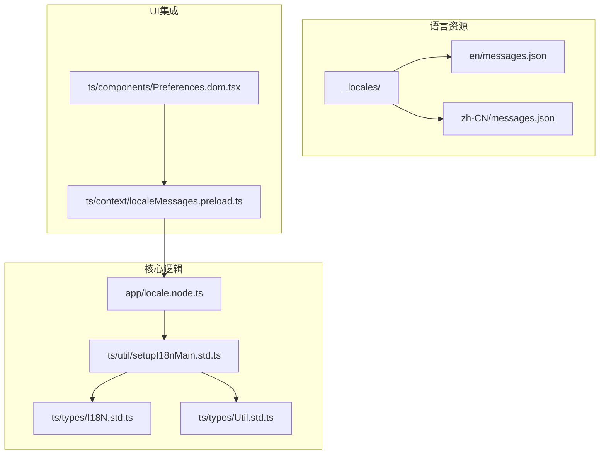
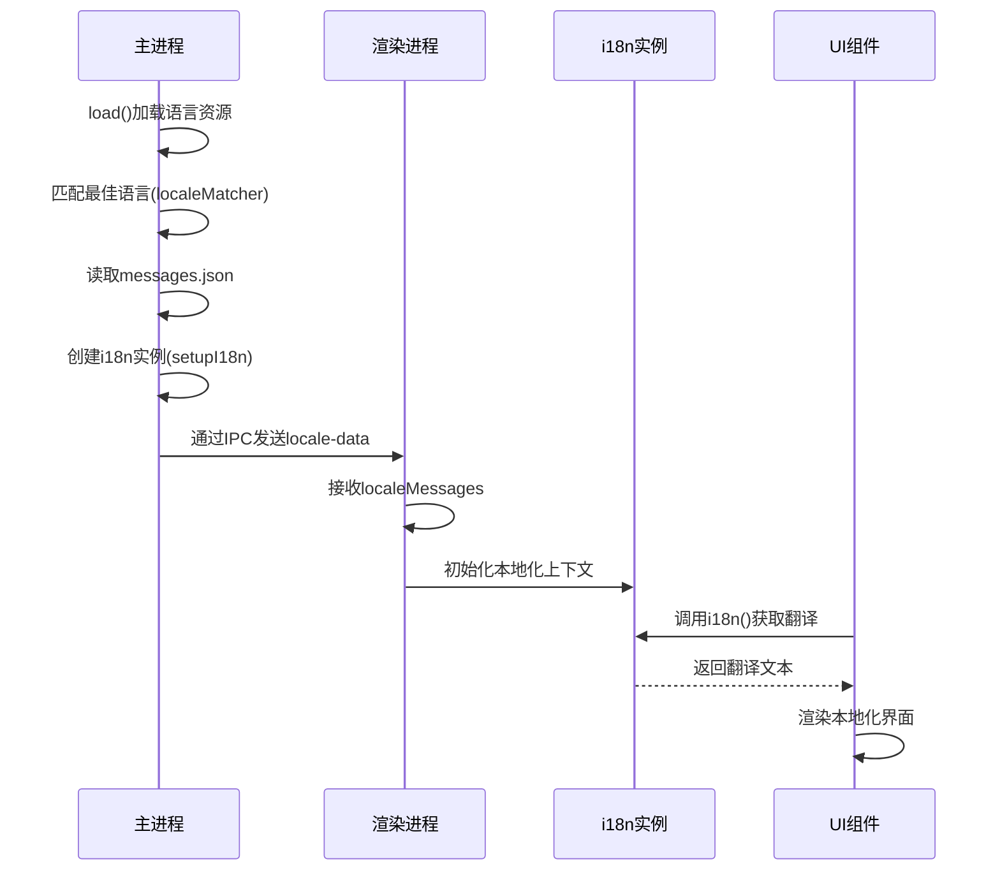
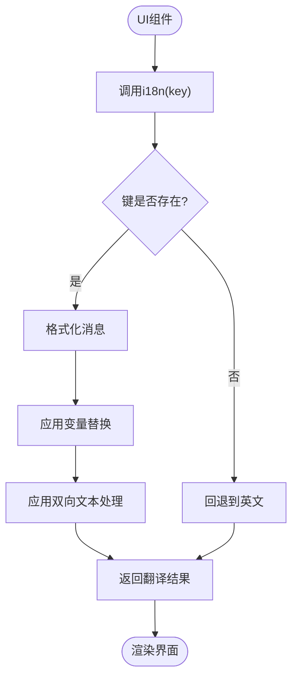
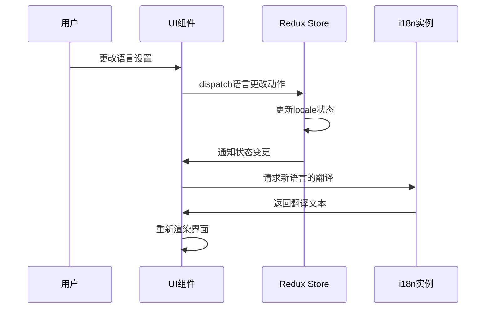
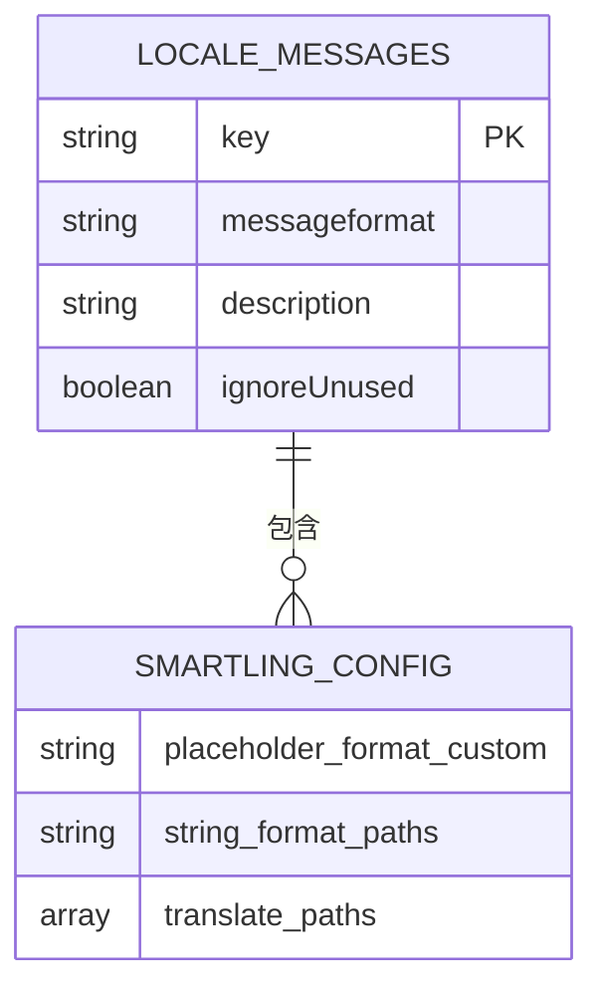
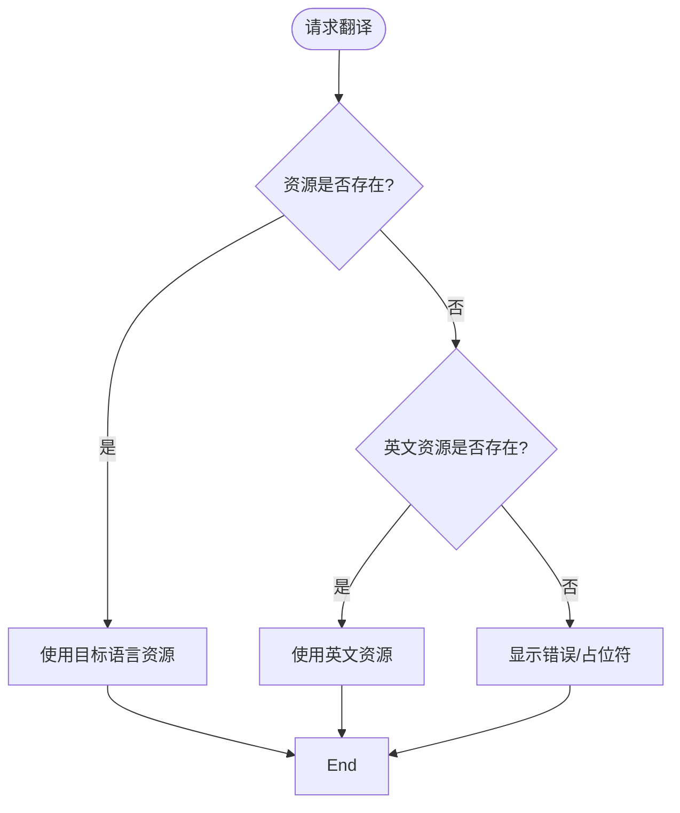

# 界面本地化渲染

<cite>
**本文档中引用的文件**  
- [locale.node.ts](file://app/locale.node.ts)
- [setupI18nMain.std.ts](file://ts/util/setupI18nMain.std.ts)
- [I18N.std.ts](file://ts/types/I18N.std.ts)
- [Util.std.ts](file://ts/types/Util.std.ts)
- [localeMessages.preload.ts](file://ts/context/localeMessages.preload.ts)
- [Preferences.dom.tsx](file://ts/components/Preferences.dom.tsx)
- [minimalContext.preload.ts](file://ts/windows/minimalContext.preload.ts)
- [messages.json](file://_locales/en/messages.json)
</cite>

## 目录
1. [简介](#简介)
2. [项目结构](#项目结构)
3. [核心组件](#核心组件)
4. [架构概述](#架构概述)
5. [详细组件分析](#详细组件分析)
6. [依赖分析](#依赖分析)
7. [性能考虑](#性能考虑)
8. [故障排除指南](#故障排除指南)
9. [结论](#结论)

## 简介
本文档详细说明Signal-Desktop应用程序中界面本地化渲染的实现机制。重点阐述i18n实例中的本地化函数（如`getIntl`、`getLocaleMessages`）如何被UI组件调用以获取翻译文本，React组件如何订阅Redux中的语言状态变化并在语言切换时高效重新渲染，以及`localeMessages`数据结构的设计原理。同时涵盖动态语言加载支持、优化策略（如避免不必要的重绘、保持滚动位置和组件状态）和错误处理机制（当请求的语言资源缺失时的降级行为）。

## 项目结构
Signal-Desktop的本地化系统采用分层架构，核心文件分布在多个目录中。语言资源存储在`_locales`目录下，每个语言子目录包含`messages.json`文件。本地化逻辑主要在`app`和`ts`目录中实现，其中`app/locale.node.ts`负责语言加载和匹配，`ts/util/setupI18nMain.std.ts`提供i18n实例的创建和管理。



**图示来源**  
- [locale.node.ts](file://app/locale.node.ts)
- [setupI18nMain.std.ts](file://ts/util/setupI18nMain.std.ts)
- [I18N.std.ts](file://ts/types/I18N.std.ts)
- [Util.std.ts](file://ts/types/Util.std.ts)
- [localeMessages.preload.ts](file://ts/context/localeMessages.preload.ts)
- [Preferences.dom.tsx](file://ts/components/Preferences.dom.tsx)

**本节来源**  
- [app](file://app)
- [ts](file://ts)
- [_locales](file://_locales)

## 核心组件
Signal-Desktop的本地化系统由几个关键组件构成：`locale.node.ts`负责语言环境的初始化和加载，`setupI18nMain.std.ts`创建和配置i18n实例，`localeMessages.preload.ts`通过IPC机制将语言数据传递给渲染进程。这些组件协同工作，确保应用程序能够根据用户偏好正确显示本地化内容。

**本节来源**  
- [locale.node.ts](file://app/locale.node.ts#L1-L219)
- [setupI18nMain.std.ts](file://ts/util/setupI18nMain.std.ts#L1-L185)
- [localeMessages.preload.ts](file://ts/context/localeMessages.preload.ts#L1-L11)

## 架构概述
Signal-Desktop的本地化架构采用客户端-服务器模式，主进程负责语言资源的加载和解析，渲染进程通过IPC通信获取本地化数据。系统使用`react-intl`作为国际化框架，通过Redux状态管理实现语言状态的全局订阅和响应。



**图示来源**  
- [locale.node.ts](file://app/locale.node.ts#L125-L218)
- [setupI18nMain.std.ts](file://ts/util/setupI18nMain.std.ts#L116-L184)
- [localeMessages.preload.ts](file://ts/context/localeMessages.preload.ts#L6-L10)

## 详细组件分析

### 本地化函数调用分析
UI组件通过调用i18n实例的方法来获取翻译文本。系统提供了多种方法来访问本地化功能，包括直接字符串翻译、获取完整i18n实例和访问原始消息数据。

#### 本地化函数调用流程


**图示来源**  
- [setupI18nMain.std.ts](file://ts/util/setupI18nMain.std.ts#L140-L157)
- [Util.std.ts](file://ts/types/Util.std.ts#L36-L55)

#### i18n实例方法
系统提供了多个方法来访问本地化功能：

| 方法 | 描述 | 来源 |
|------|------|------|
| `i18n(key, substitutions)` | 根据键获取翻译文本，支持变量替换 | [Util.std.ts](file://ts/types/Util.std.ts#L37-L45) |
| `getIntl()` | 获取底层react-intl的IntlShape实例 | [setupI18nMain.std.ts](file://ts/util/setupI18nMain.std.ts#L159-L161) |
| `getLocale()` | 获取当前语言代码 | [setupI18nMain.std.ts](file://ts/util/setupI18nMain.std.ts#L162-L163) |
| `getLocaleMessages()` | 获取完整的本地化消息对象 | [setupI18nMain.std.ts](file://ts/util/setupI18nMain.std.ts#L163-L164) |
| `getLocaleDirection()` | 获取文本方向（ltr/rtl） | [setupI18nMain.std.ts](file://ts/util/setupI18nMain.std.ts#L164-L165) |

**本节来源**  
- [setupI18nMain.std.ts](file://ts/util/setupI18nMain.std.ts#L140-L184)
- [Util.std.ts](file://ts/types/Util.std.ts#L36-L55)

### Redux状态订阅分析
React组件通过订阅Redux中的语言状态变化来实现高效的重新渲染。当用户更改语言设置时，系统会触发状态更新，所有订阅的组件将自动重新渲染以显示新的本地化内容。

#### 状态订阅流程


**图示来源**  
- [Preferences.dom.tsx](file://ts/components/Preferences.dom.tsx#L921-L1023)
- [minimalContext.preload.ts](file://ts/windows/minimalContext.preload.ts#L68-L71)

### localeMessages数据结构分析
`localeMessages`数据结构设计用于支持动态语言加载和高效的资源管理。它采用键值对的形式存储翻译消息，并包含元数据以支持高级i18n功能。

#### 数据结构设计


数据结构特点：
- **键值对设计**：每个翻译项由唯一键标识，值为包含`messageformat`属性的对象
- **元数据支持**：可选的`description`字段提供翻译上下文，`ignoreUnused`用于标记不应检查未使用状态的条目
- **Smartling集成**：特殊的`smartling`键包含本地化平台的配置信息
- **降级机制**：系统始终以英文为基础，确保即使目标语言资源缺失也能正常显示

**本节来源**  
- [I18N.std.ts](file://ts/types/I18N.std.ts#L19-L30)
- [messages.json](file://_locales/en/messages.json)

## 依赖分析
本地化系统依赖于多个核心模块和第三方库，这些依赖关系确保了系统的完整性和功能性。

```mermaid
graph TD
ReactIntl[react-intl] --> SetupI18n
Lodash[lodash] --> LocaleNode
FormatJS[@formatjs/intl-localematcher] --> LocaleNode
Zod[zod] --> LocaleNode
Electron[electron] --> LocaleMessages
SetupI18n --> LocaleNode
LocaleNode --> LocaleMessages
LocaleMessages --> UIComponents
style ReactIntl fill:#f9f,stroke:#333
style Lodash fill:#f9f,stroke:#333
style FormatJS fill:#f9f,stroke:#333
style Zod fill:#f9f,stroke:#333
style Electron fill:#f9f,stroke:#333
```

**图示来源**  
- [package.json](file://package.json)
- [locale.node.ts](file://app/locale.node.ts#L7-L8)
- [setupI18nMain.std.ts](file://ts/util/setupI18nMain.std.ts#L5)

## 性能考虑
Signal-Desktop的本地化系统实现了多项优化策略，以确保在语言切换时的高性能表现。

### 优化策略
1. **消息缓存**：使用`createIntlCache`缓存已格式化的消息，避免重复计算
2. **紧凑格式**：在打包版本中使用`keys.json`和`values.json`的紧凑格式，减少文件大小和加载时间
3. **惰性加载**：仅在需要时加载语言资源，减少启动时间
4. **状态保持**：在语言切换时保持组件状态和滚动位置，提供无缝的用户体验

### 避免不必要重绘
系统通过以下机制避免不必要的重绘：
- 使用`React.memo`对纯展示组件进行记忆化
- 在`shouldComponentUpdate`中精确比较语言状态变化
- 批量处理语言相关的状态更新

**本节来源**  
- [setupI18nMain.std.ts](file://ts/util/setupI18nMain.std.ts#L45-L46)
- [locale.node.ts](file://app/locale.node.ts#L167-L191)

## 故障排除指南
当本地化系统出现问题时，可以参考以下常见问题和解决方案。

### 错误处理机制
系统实现了完善的错误处理机制，确保在语言资源缺失时仍能正常运行：

1. **降级行为**：
   - 始终以英文作为基础语言
   - 当目标语言的特定条目缺失时，自动回退到英文版本
   - 记录缺失翻译的警告日志

2. **异常处理**：
   - 在`formatMessage`中捕获格式化错误
   - 对无效的语言代码进行规范化处理
   - 提供默认的文本方向（ltr）作为安全回退

3. **调试工具**：
   - 提供`trackUsage`和`stopTrackingUsage`方法用于调试翻译使用情况
   - 在开发环境中显示详细的错误信息



**本节来源**  
- [setupI18nMain.std.ts](file://ts/util/setupI18nMain.std.ts#L154-L155)
- [locale.node.ts](file://app/locale.node.ts#L196-L197)

## 结论
Signal-Desktop的界面本地化渲染系统是一个精心设计的架构，它结合了现代i18n最佳实践和性能优化策略。通过`react-intl`框架和Redux状态管理，系统实现了高效的本地化内容渲染和响应式语言切换。`localeMessages`数据结构的设计既灵活又健壮，支持动态语言加载和多层级的降级机制。系统的优化策略确保了即使在频繁的语言切换场景下也能保持流畅的用户体验。整体架构体现了高内聚、低耦合的设计原则，为未来的功能扩展和维护提供了良好的基础。