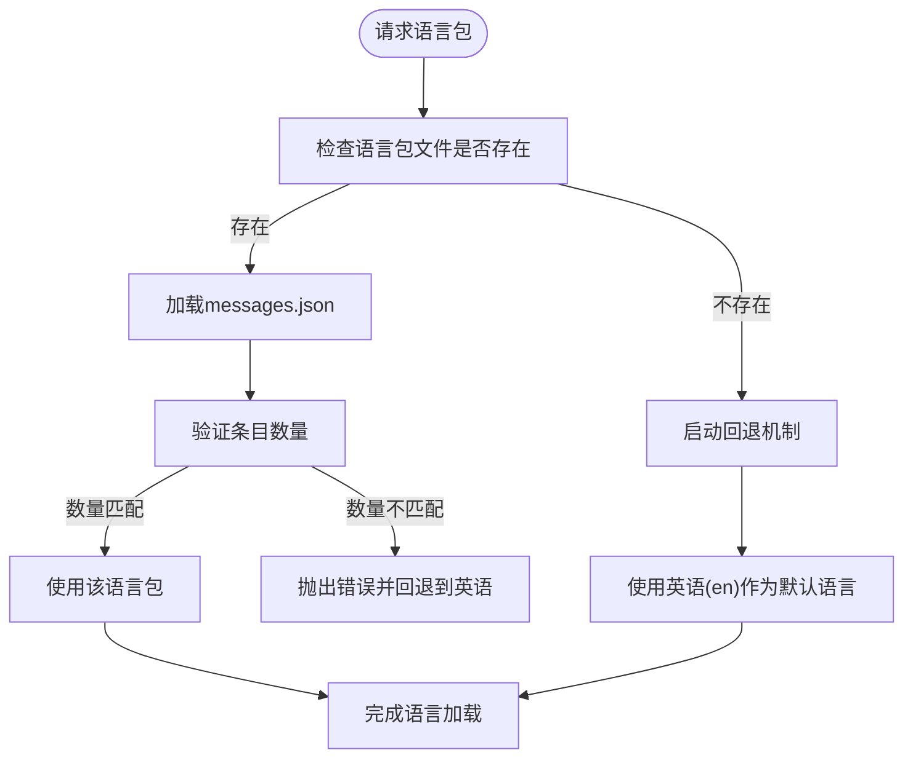
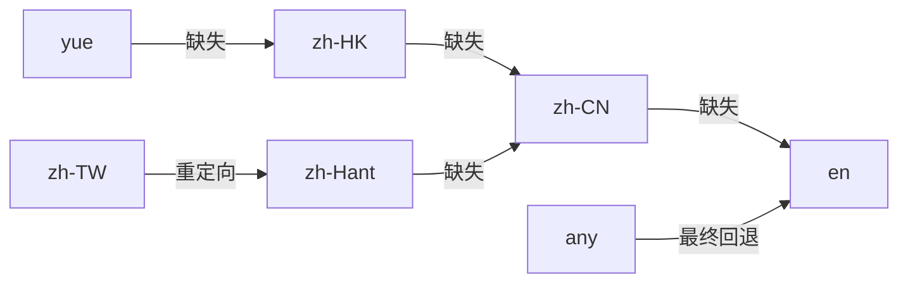
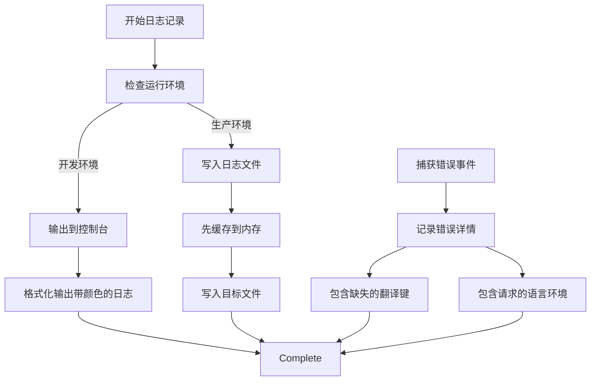
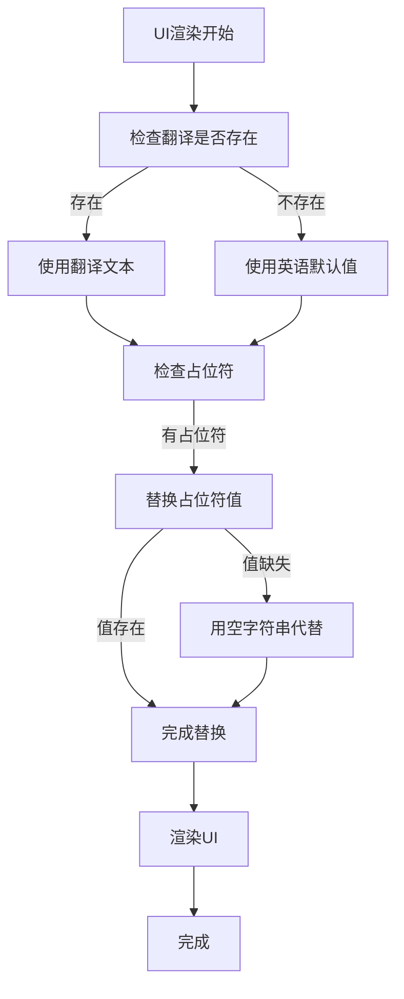

# 错误处理与降级机制

<cite>
**本文档引用文件**  
- [locale.node.ts](file://app/locale.node.ts)
- [setupI18nMain.std.ts](file://ts/util/setupI18nMain.std.ts)
- [log.std.ts](file://ts/logging/log.std.ts)
- [I18n.std.ts](file://ts/types/I18N.std.ts)
- [resolveCanonicalLocales.std.ts](file://ts/util/resolveCanonicalLocales.std.ts)
- [_locales](file://_locales)
</cite>

## 目录
1. [引言](#引言)
2. [语言包缺失处理机制](#语言包缺失处理机制)
3. [回退语言机制实现逻辑](#回退语言机制实现逻辑)
4. [错误日志收集方式](#错误日志收集方式)
5. [开发者工具与未翻译内容高亮](#开发者工具与未翻译内容高亮)
6. [默认值与占位符保证UI完整性](#默认值与占位符保证ui完整性)
7. [总结](#总结)

## 引言
Signal-Desktop的本地化渲染系统设计了完善的错误处理与降级机制，确保在请求的语言包缺失或翻译键不存在时，用户界面仍能正常显示且不崩溃。本系统通过多层回退策略、详细的错误日志记录以及开发者辅助工具，实现了高可用性和可维护性的国际化支持。

**Section sources**
- [locale.node.ts](file://app/locale.node.ts#L1-L219)
- [setupI18nMain.std.ts](file://ts/util/setupI18nMain.std.ts#L1-L185)

## 语言包缺失处理机制
当请求的语言包缺失时，Signal-Desktop采用严格的错误处理流程。系统首先尝试加载请求的本地化文件，若失败则立即启动回退机制。核心逻辑位于`app/locale.node.ts`中的`load`函数，该函数通过`getLocaleMessages`尝试读取指定语言的`messages.json`文件。如果文件不存在或读取失败，系统不会抛出致命错误，而是通过回退到英语（en）来保证基本功能可用。

在打包版本中，系统使用压缩格式的`values.json`和`keys.json`来提高加载效率。系统会验证目标语言条目数量与英语条目数量是否一致，若不一致则抛出错误，防止部分翻译导致的UI错乱。

**Diagram sources**
- [locale.node.ts](file://app/locale.node.ts#L30-L45)
- [locale.node.ts](file://app/locale.node.ts#L167-L197)

**Section sources**
- [locale.node.ts](file://app/locale.node.ts#L30-L45)
- [locale.node.ts](file://app/locale.node.ts#L167-L197)

## 回退语言机制实现逻辑
Signal-Desktop的回退语言机制基于`@formatjs/intl-localematcher`库实现，遵循标准的区域设置匹配算法。当用户请求特定语言时，系统会按照优先级进行匹配和回退。

对于中文语言，系统实现了精细的回退策略：
- `zh-HK`（香港）优先使用本地翻译，若缺失则回退到`zh-CN`（中国大陆）
- `zh-CN`作为简体中文标准，是大多数中文用户的最终回退目标
- 所有中文变体最终都会回退到`en`（英语）作为最终保障

该机制在`locale.node.ts`的`load`函数中通过`LocaleMatcher.match`方法实现，采用"best fit"算法确保最合适的匹配结果。系统还通过`resolveCanonicalLocales.std.ts`对输入的区域设置进行规范化处理，过滤无效的locale并确保其符合标准格式。

**Diagram sources**
- [locale.node.ts](file://app/locale.node.ts#L154-L159)
- [resolveCanonicalLocales.std.ts](file://ts/util/resolveCanonicalLocales.std.ts#L4-L19)

**Section sources**
- [locale.node.ts](file://app/locale.node.ts#L154-L159)
- [ts/scripts/get-strings.node.ts](file://ts/scripts/get-strings.node.ts#L15-L31)
- [resolveCanonicalLocales.std.ts](file://ts/util/resolveCanonicalLocales.std.ts#L4-L19)

## 错误日志收集方式
Signal-Desktop通过结构化的日志系统收集所有与本地化相关的错误信息。系统使用`pino`日志库，在`ts/logging/log.std.ts`中定义了完整的日志记录机制。

当发生语言包加载错误时，系统会记录以下关键信息：
- 缺失的翻译键（missing translation key）
- 请求的语言环境（requested locale）
- 匹配过程中的所有尝试（matched locale）
- 具体的错误堆栈信息

日志记录通过`setupI18nMain.std.ts`中的`strictAssert`断言实现，当检测到缺失的翻译键时，会抛出带有详细信息的错误。这些错误会被全局错误处理器捕获并记录到应用日志中，便于开发团队分析和修复。

**Diagram sources**
- [log.std.ts](file://ts/logging/log.std.ts#L160-L200)
- [setupI18nMain.std.ts](file://ts/util/setupI18nMain.std.ts#L154-L157)

**Section sources**
- [log.std.ts](file://ts/logging/log.std.ts#L1-L244)
- [setupI18nMain.std.ts](file://ts/util/setupI18nMain.std.ts#L154-L157)

## 开发者工具与未翻译内容高亮
为了帮助开发者识别未翻译的内容，Signal-Desktop提供了专门的开发工具。在开发环境中，系统会高亮显示所有未翻译的字符串，使开发者能够快速定位需要翻译的内容。

该功能通过`setupI18nMain.std.ts`中的`localizer`函数实现。当调用`i18n`函数请求一个不存在的翻译键时，系统会通过`strictAssert`断言检测到`result !== key`不成立，从而抛出错误。在开发模式下，这个错误会被捕获并以可视化方式呈现，通常是在UI上以特殊颜色或边框高亮显示。

此外，系统还支持通过环境变量和本地存储配置调试模式，开发者可以使用`localStorage.debug`来控制哪些模块的日志输出，便于针对性地调试本地化问题。

**Section sources**
- [setupI18nMain.std.ts](file://ts/util/setupI18nMain.std.ts#L140-L157)
- [log.std.ts](file://ts/logging/log.std.ts#L127-L158)

## 默认值与占位符保证UI完整性
Signal-Desktop通过多种机制确保UI的完整性，防止因翻译错误导致界面崩溃：

1. **默认值机制**：每个翻译键都有对应的英语默认值，存储在`_locales/en/messages.json`中。当特定语言的翻译缺失时，系统自动使用英语作为回退。

2. **占位符处理**：对于带有变量的翻译字符串，系统实现了安全的占位符替换机制。即使某个占位符值缺失，系统也会用空字符串代替，而不是抛出错误。

3. **空值保护**：在`sticker-creator/src/contexts/I18n.tsx`中，当找不到特定键的翻译时，系统返回空字符串而不是`null`或`undefined`，避免了React渲染时的类型错误。

4. **双向文本隔离**：通过`bidiIsolate`和`bidiStrip`函数处理双向文本，防止RTL（从右到左）语言导致的布局混乱。

这些机制共同确保了即使在最坏的情况下（所有翻译都缺失），用户界面仍然可以正常显示和操作，只是以英语呈现。

**Diagram sources**
- [setupI18nMain.std.ts](file://ts/util/setupI18nMain.std.ts#L74-L99)
- [I18n.tsx](file://sticker-creator/src/contexts/I18n.tsx#L56-L60)

**Section sources**
- [setupI18nMain.std.ts](file://ts/util/setupI18nMain.std.ts#L74-L99)
- [I18n.tsx](file://sticker-creator/src/contexts/I18n.tsx#L56-L60)
- [locale.node.ts](file://app/locale.node.ts#L196)

## 总结
Signal-Desktop的本地化错误处理机制体现了高可靠性的设计原则。通过多层回退策略、详细的错误日志、开发者辅助工具和UI完整性保护，系统确保了在全球化环境下的稳定运行。这种设计不仅提升了用户体验，也为多语言支持的维护提供了强有力的技术保障。