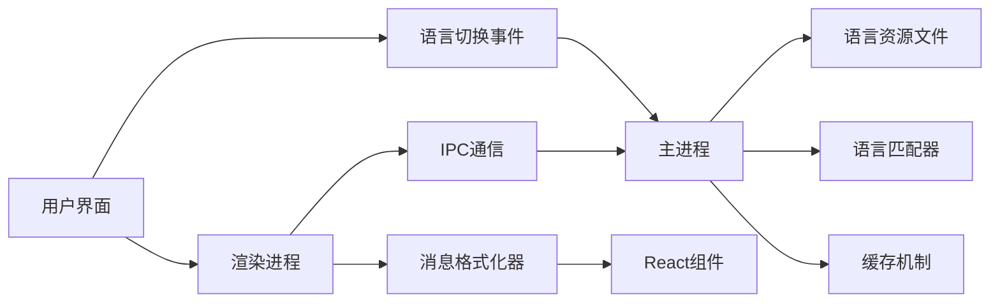
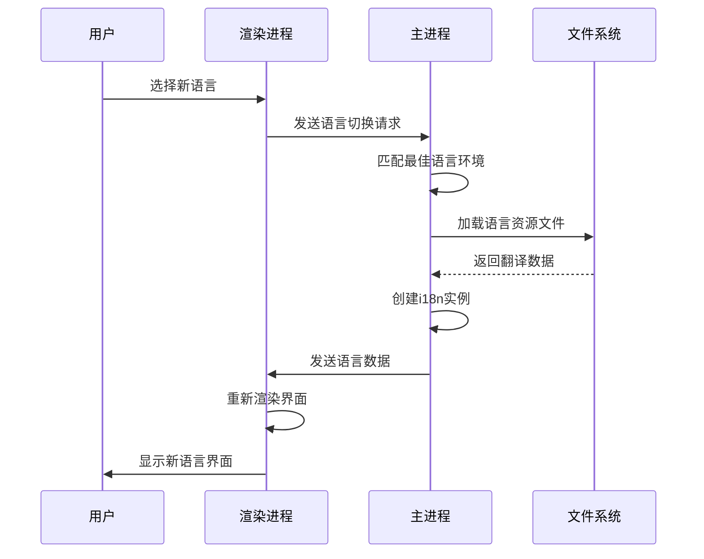
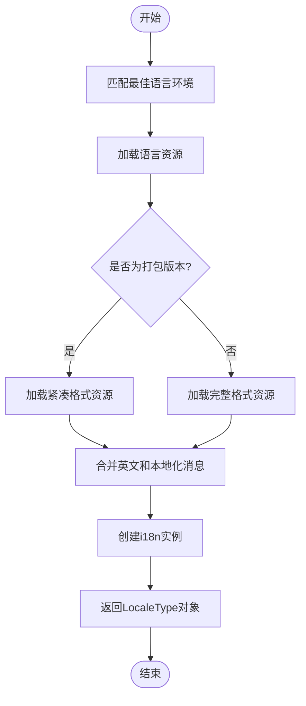
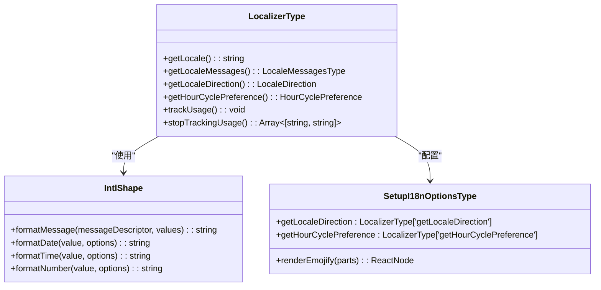

# i18n实例重初始化

<cite>
**本文档引用的文件**  
- [locale.node.ts](file://app/locale.node.ts)
- [setupI18nMain.std.ts](file://ts/util/setupI18nMain.std.ts)
- [context.preload.ts](file://ts/context/i18n.preload.ts)
- [localeMessages.preload.ts](file://ts/context/localeMessages.preload.ts)
- [minimalContext.preload.ts](file://ts/windows/minimalContext.preload.ts)
- [main.main.ts](file://app/main.main.ts)
- [I18N.std.ts](file://ts/types/I18N.std.ts)
- [Util.std.ts](file://ts/types/Util.std.ts)
</cite>

## 目录
1. [简介](#简介)
2. [项目结构](#项目结构)
3. [核心组件](#核心组件)
4. [架构概述](#架构概述)
5. [详细组件分析](#详细组件分析)
6. [依赖分析](#依赖分析)
7. [性能考虑](#性能考虑)
8. [故障排除指南](#故障排除指南)
9. [结论](#结论)

## 简介
本文档详细描述了Signal-Desktop应用程序中i18n实例在语言切换后的重初始化过程。文档涵盖了消息格式化库的重新配置、语言包的加载与缓存机制、国际化字符串的解析与替换流程，以及如何确保界面文本正确显示为目标语言。通过分析相关代码文件，本文档提供了i18n系统的工作原理和实现细节。

## 项目结构
Signal-Desktop项目的国际化功能主要由以下几个部分组成：
- `_locales` 目录：包含所有支持语言的翻译文件（messages.json）
- `app` 目录：包含主进程中的国际化相关逻辑
- `ts` 目录：包含类型定义和工具函数
- `components` 目录：包含UI组件的国际化支持

国际化资源按照语言代码组织在 `_locales` 目录下，每个语言子目录包含一个 `messages.json` 文件，存储该语言的所有翻译字符串。


**图示来源**  
- [app/locale.node.ts](file://app/locale.node.ts#L30-L34)
- [_locales](file://_locales)

**章节来源**  
- [app/locale.node.ts](file://app/locale.node.ts#L1-L219)
- [_locales](file://_locales)

## 核心组件
Signal-Desktop的i18n系统由多个核心组件构成，包括语言匹配器、消息加载器、格式化器和缓存机制。系统使用 `@formatjs/intl-localematcher` 库来匹配最佳语言环境，并通过 `react-intl` 库进行消息格式化。

当用户切换语言时，系统会重新初始化i18n实例，加载新的语言资源，并更新所有界面文本。这个过程涉及主进程和渲染进程之间的通信，确保语言切换的原子性和一致性。

**章节来源**  
- [locale.node.ts](file://app/locale.node.ts#L125-L218)
- [setupI18nMain.std.ts](file://ts/util/setupI18nMain.std.ts#L116-L184)

## 架构概述
Signal-Desktop的i18n架构采用主从模式，主进程负责语言资源的加载和管理，渲染进程通过IPC通信获取语言数据。这种架构设计确保了语言资源的一致性和高效性。



**图示来源**  
- [main.main.ts](file://app/main.main.ts#L2872-L2886)
- [minimalContext.preload.ts](file://ts/windows/minimalContext.preload.ts#L68-L71)
- [locale.node.ts](file://app/locale.node.ts#L125-L218)

## 详细组件分析

### i18n实例初始化分析
i18n实例的初始化过程始于主进程的 `locale.node.ts` 文件中的 `load` 函数。该函数负责加载指定语言的翻译资源，并创建i18n实例。



**图示来源**  
- [locale.node.ts](file://app/locale.node.ts#L125-L218)
- [main.main.ts](file://app/main.main.ts#L2872-L2886)
- [minimalContext.preload.ts](file://ts/windows/minimalContext.preload.ts#L68-L71)

#### 语言匹配与加载
语言匹配过程使用 `@formatjs/intl-localematcher` 库的 `match` 函数，根据用户的首选语言列表和系统支持的语言列表，找到最佳匹配的语言环境。



**图示来源**  
- [locale.node.ts](file://app/locale.node.ts#L154-L197)
- [setupI18nMain.std.ts](file://ts/util/setupI18nMain.std.ts#L116-L137)

**章节来源**  
- [locale.node.ts](file://app/locale.node.ts#L125-L218)
- [setupI18nMain.std.ts](file://ts/util/setupI18nMain.std.ts#L116-L184)

### 消息格式化器分析
消息格式化器是i18n系统的核心组件，负责将翻译字符串中的占位符替换为实际值，并处理复数、选择等复杂格式化需求。



**图示来源**  
- [Util.std.ts](file://ts/types/Util.std.ts)
- [setupI18nMain.std.ts](file://ts/util/setupI18nMain.std.ts#L34-L38)
- [I18N.std.ts](file://ts/types/I18N.std.ts)

## 依赖分析
i18n系统依赖于多个外部库和内部模块，这些依赖关系确保了系统的功能完整性和可维护性。

```mermaid
graph TD
A[i18n系统] --> B[@formatjs/intl-localematcher]
A --> C[react-intl]
A --> D[lodash]
A --> E[zod]
A --> F[node:path]
A --> G[node:fs]
A --> H[Intl.Locale]
B --> I[语言匹配算法]
C --> J[消息格式化]
D --> K[对象合并]
E --> L[数据验证]
F --> M[路径处理]
G --> N[文件读取]
H --> O[区域设置信息]
```

**图示来源**  
- [locale.node.ts](file://app/locale.node.ts#L4-L8)
- [setupI18nMain.std.ts](file://ts/util/setupI18nMain.std.ts#L4-L5)
- [I18N.std.ts](file://ts/types/I18N.std.ts#L4)

**章节来源**  
- [locale.node.ts](file://app/locale.node.ts#L1-L219)
- [setupI18nMain.std.ts](file://ts/util/setupI18nMain.std.ts#L1-L185)

## 性能考虑
i18n系统的性能优化主要体现在以下几个方面：

1. **资源压缩**：在打包版本中，使用紧凑格式的 `values.json` 和 `keys.json` 文件，减少文件大小和加载时间。
2. **缓存机制**：使用 `createIntlCache` 创建缓存，避免重复创建格式化器实例。
3. **按需加载**：只在需要时加载语言资源，减少内存占用。
4. **异步处理**：在可能的情况下使用异步操作，避免阻塞主线程。

这些优化措施确保了i18n系统在各种设备上都能快速响应语言切换请求，提供流畅的用户体验。

## 故障排除指南
在使用i18n系统时，可能会遇到以下常见问题：

1. **翻译缺失**：如果某个翻译字符串缺失，系统会抛出错误。确保所有使用的翻译键都在 `messages.json` 文件中定义。
2. **语言匹配失败**：如果用户的首选语言无法匹配，系统会回退到英语。检查 `available-locales.json` 文件是否包含所需语言。
3. **格式化错误**：如果消息格式化失败，检查占位符是否正确匹配，以及传递的参数类型是否正确。
4. **加载失败**：如果语言资源文件无法加载，检查文件路径是否正确，以及文件是否存在。

通过查看日志输出，可以获取更多关于错误的详细信息，帮助快速定位和解决问题。

**章节来源**  
- [locale.node.ts](file://app/locale.node.ts#L108-L112)
- [setupI18nMain.std.ts](file://ts/util/setupI18nMain.std.ts#L53-L56)

## 结论
Signal-Desktop的i18n实例重初始化过程是一个精心设计的系统，它确保了语言切换的平滑性和一致性。通过主从架构、高效的缓存机制和强大的错误处理，系统能够快速响应用户的语言偏好变化，提供高质量的多语言支持。理解这个过程对于维护和扩展Signal-Desktop的国际化功能至关重要。