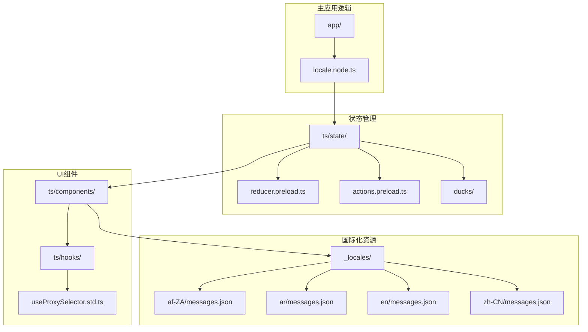
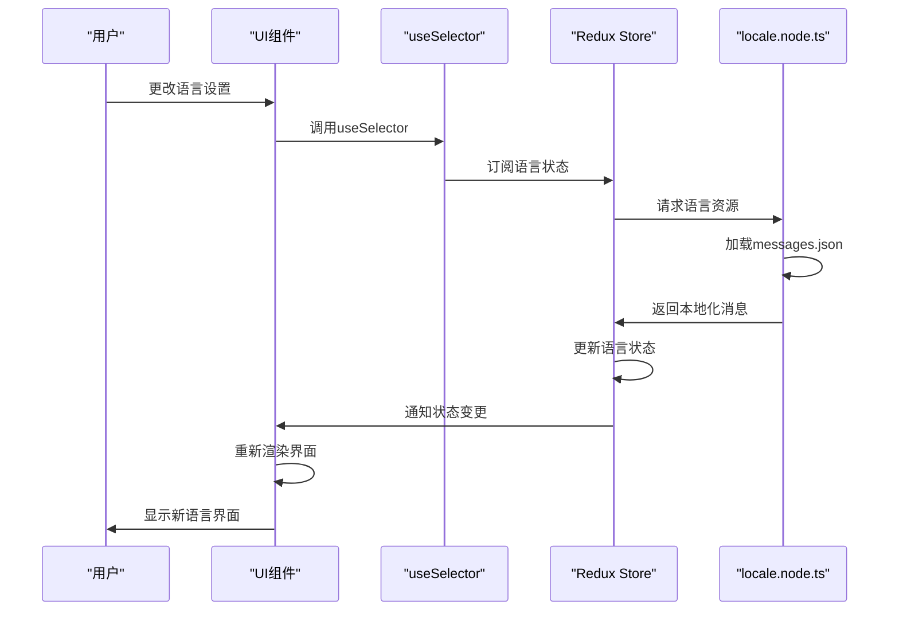
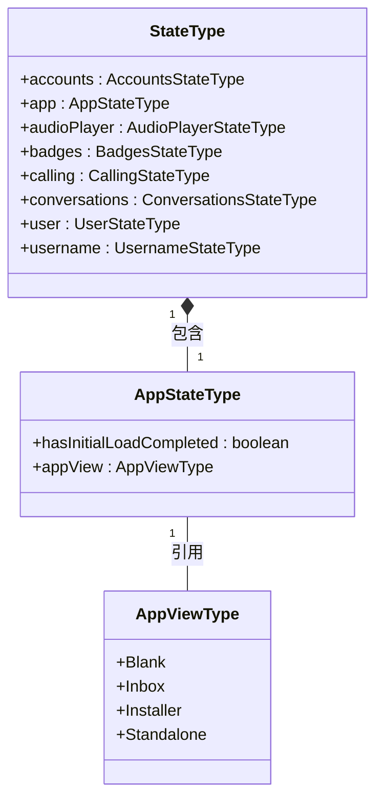
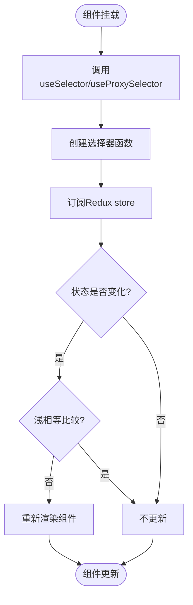
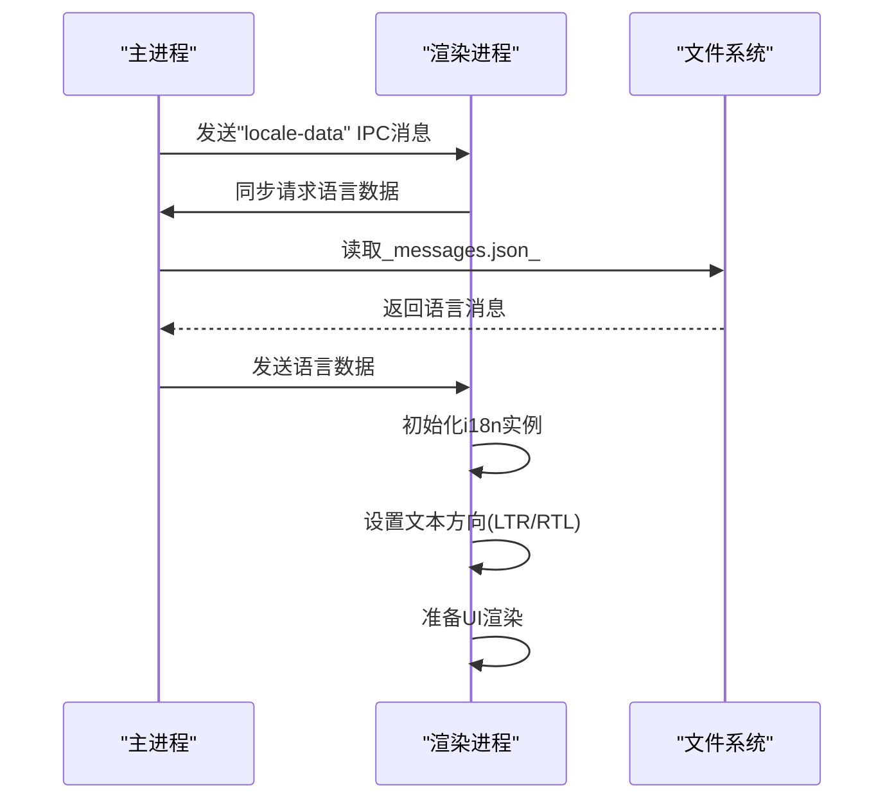

# 界面更新机制

<cite>
**本文档中引用的文件**  
- [reducer.preload.ts](file://ts/state/reducer.preload.ts)
- [initializeRedux.preload.ts](file://ts/state/initializeRedux.preload.ts)
- [reinitializeRedux.preload.ts](file://ts/state/reinitializeRedux.preload.ts)
- [useProxySelector.std.ts](file://ts/hooks/useProxySelector.std.ts)
- [locale.node.ts](file://app/locale.node.ts)
- [localeMessages.preload.ts](file://ts/context/localeMessages.preload.ts)
- [app.preload.ts](file://ts/state/ducks/app.preload.ts)
- [actions.preload.ts](file://ts/state/actions.preload.ts)
</cite>

## 目录
1. [简介](#简介)
2. [项目结构](#项目结构)
3. [核心组件](#核心组件)
4. [架构概述](#架构概述)
5. [详细组件分析](#详细组件分析)
6. [依赖分析](#依赖分析)
7. [性能考虑](#性能考虑)
8. [故障排除指南](#故障排除指南)
9. [结论](#结论)

## 简介
本文档详细说明Signal-Desktop应用程序的界面更新机制，重点介绍Redux状态变化如何触发UI组件重新渲染。文档将解释React组件如何通过`useSelector`钩子或`connect`函数订阅语言状态的变化，描述避免不必要重绘的优化策略，并分析语言变更对布局和文本方向（如RTL语言）的影响及相应的性能优化措施。

## 项目结构
Signal-Desktop项目采用模块化结构，将国际化和状态管理功能分离到不同的目录中。语言资源存储在`_locales`目录中，每个语言子目录包含`messages.json`文件。状态管理逻辑主要位于`ts/state`目录下，而React组件和钩子位于`ts/components`和`ts/hooks`目录中。



**Diagram sources**
- [locale.node.ts](file://app/locale.node.ts)
- [reducer.preload.ts](file://ts/state/reducer.preload.ts)
- [useProxySelector.std.ts](file://ts/hooks/useProxySelector.std.ts)

**Section sources**
- [app](file://app)
- [ts](file://ts)
- [_locales](file://_locales)

## 核心组件
Signal-Desktop的核心界面更新机制基于Redux状态管理和React组件订阅模式。当语言状态发生变化时，Redux store会更新，所有订阅了相关状态的React组件将自动重新渲染以反映新的语言设置。系统使用`useProxySelector`钩子来优化状态订阅，避免不必要的重新渲染。

**Section sources**
- [reducer.preload.ts](file://ts/state/reducer.preload.ts)
- [useProxySelector.std.ts](file://ts/hooks/useProxySelector.std.ts)
- [locale.node.ts](file://app/locale.node.ts)

## 架构概述
Signal-Desktop的界面更新架构采用典型的Redux模式，其中状态存储在中央store中，UI组件通过选择器订阅特定的状态片段。当用户更改语言设置时，系统会加载相应的语言资源并更新Redux store中的语言状态，触发所有相关组件的重新渲染。



**Diagram sources**
- [locale.node.ts](file://app/locale.node.ts)
- [reducer.preload.ts](file://ts/state/reducer.preload.ts)
- [useProxySelector.std.ts](file://ts/hooks/useProxySelector.std.ts)

## 详细组件分析

### Redux状态管理分析
Signal-Desktop使用Redux作为状态管理解决方案，所有应用状态集中存储在单一store中。状态更新通过action和reducer模式进行，确保状态变化的可预测性和可追踪性。

#### 状态结构


**Diagram sources**
- [reducer.preload.ts](file://ts/state/reducer.preload.ts)
- [app.preload.ts](file://ts/state/ducks/app.preload.ts)

### 语言状态订阅机制
React组件通过`useSelector`钩子或`useProxySelector`自定义钩子订阅Redux store中的语言状态变化。这种订阅机制确保组件仅在相关状态发生变化时才重新渲染。

#### 订阅流程


**Diagram sources**
- [useProxySelector.std.ts](file://ts/hooks/useProxySelector.std.ts)
- [reducer.preload.ts](file://ts/state/reducer.preload.ts)

### 国际化实现分析
Signal-Desktop的国际化系统基于ICU格式，支持复杂的语言特性，包括复数形式、选择格式和嵌套消息。系统使用`@formatjs/intl-localematcher`库进行语言匹配，确保用户获得最佳的语言体验。

#### 语言加载流程


**Diagram sources**
- [locale.node.ts](file://app/locale.node.ts)
- [localeMessages.preload.ts](file://ts/context/localeMessages.preload.ts)

**Section sources**
- [locale.node.ts](file://app/locale.node.ts#L1-L219)
- [localeMessages.preload.ts](file://ts/context/localeMessages.preload.ts#L1-L11)

## 依赖分析
Signal-Desktop的界面更新机制依赖于多个关键库和系统组件，这些依赖关系确保了国际化功能的完整性和性能。

```mermaid
graph LR
A[React] --> B[React-Redux]
B --> C[Redux]
C --> D[Redux-Thunk]
A --> E[@formatjs/intl-localematcher]
E --> F[Intl.Locale]
A --> G[lodash]
C --> H[redux-logger]
A --> I[@indutny/sneequals]
style A fill:#f9f,stroke:#333
style B fill:#bbf,stroke:#333
style C fill:#f96,stroke:#333
```

**Diagram sources**
- [package.json](file://package.json)
- [reducer.preload.ts](file://ts/state/reducer.preload.ts)
- [useProxySelector.std.ts](file://ts/hooks/useProxySelector.std.ts)

**Section sources**
- [package.json](file://package.json)
- [pnpm-lock.yaml](file://pnpm-lock.yaml)

## 性能考虑
Signal-Desktop在界面更新方面实施了多项性能优化策略，以确保语言切换和其他状态变化时的流畅用户体验。

### 重新渲染优化策略
1. **选择器记忆化**: 使用`useMemo`和`memoize`函数缓存选择器结果，避免重复计算
2. **浅比较**: Redux useSelector使用浅比较来确定是否需要重新渲染
3. **批量更新**: React 18的自动批处理功能减少不必要的渲染
4. **紧凑格式**: 发布版本使用紧凑的`values.json`格式减少内存占用

### 性能监控指标
| 指标 | 目标值 | 测量方法 |
|------|--------|----------|
| 语言切换时间 | < 200ms | performance.now() |
| 内存占用 | < 50MB | Chrome DevTools |
| 重渲染次数 | 最小化 | React DevTools Profiler |
| 初始加载时间 | < 2s | Lighthouse |

**Section sources**
- [useProxySelector.std.ts](file://ts/hooks/useProxySelector.std.ts#L1-L23)
- [reinitializeRedux.preload.ts](file://ts/state/reinitializeRedux.preload.ts#L1-L43)

## 故障排除指南
当遇到界面更新问题时，可以按照以下步骤进行诊断和修复。

### 常见问题及解决方案
1. **语言未更新**
   - 检查`locale.node.ts`中的语言匹配逻辑
   - 验证`messages.json`文件是否存在且格式正确
   - 确认Redux store中的语言状态已更新

2. **不必要的重新渲染**
   - 检查选择器函数是否正确记忆化
   - 验证组件是否订阅了过多的状态
   - 使用React DevTools分析渲染性能

3. **RTL布局问题**
   - 确认`getLocaleDirection`函数正确返回方向
   - 检查CSS中的`direction`属性设置
   - 验证RTL特定的样式规则

**Section sources**
- [locale.node.ts](file://app/locale.node.ts#L80-L114)
- [useProxySelector.std.ts](file://ts/hooks/useProxySelector.std.ts#L1-L23)

## 结论
Signal-Desktop的界面更新机制是一个高效、可扩展的系统，它结合了Redux状态管理和React组件订阅模式的优点。通过精心设计的状态结构、优化的选择器实现和智能的国际化策略，系统能够快速响应语言变化，同时保持良好的性能特征。未来的优化方向可能包括更精细的代码分割、预加载策略和更智能的缓存机制。