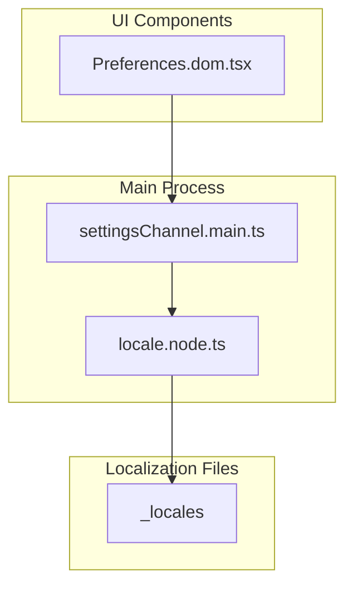
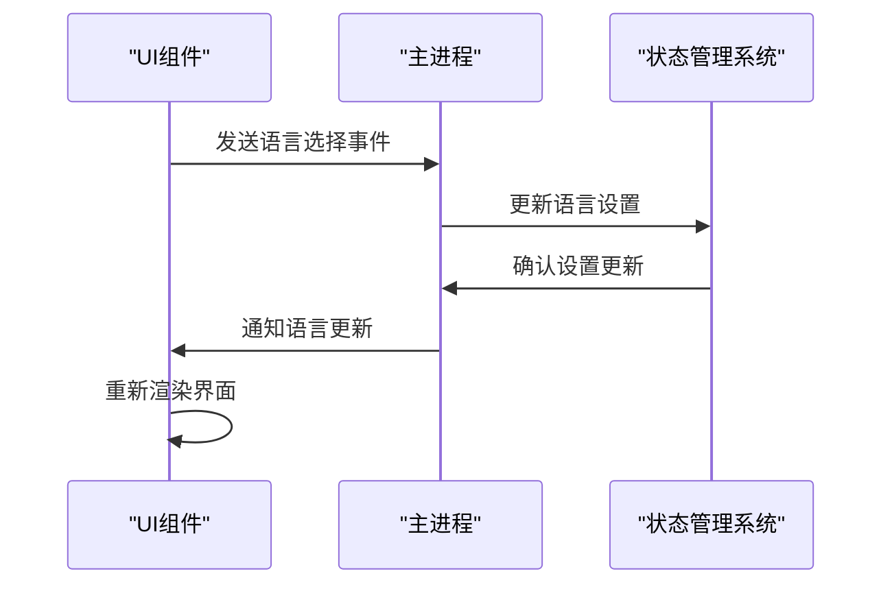
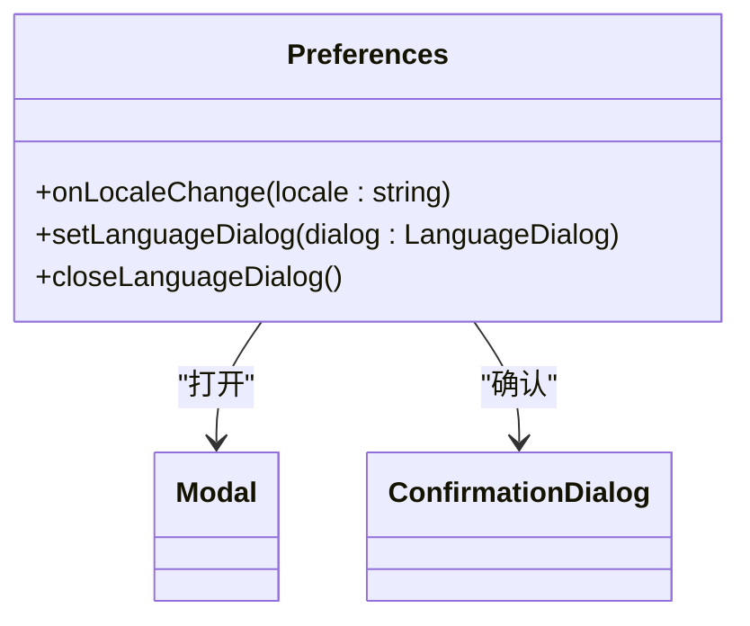
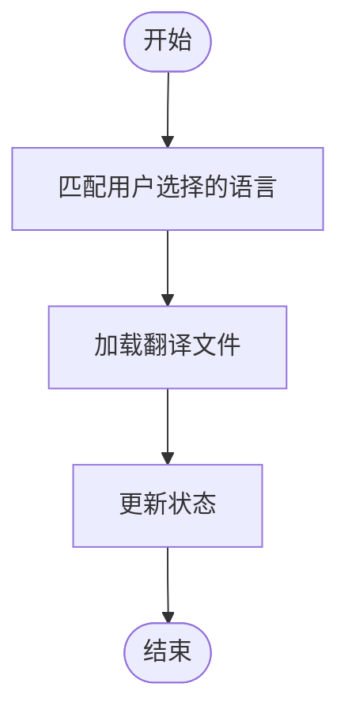
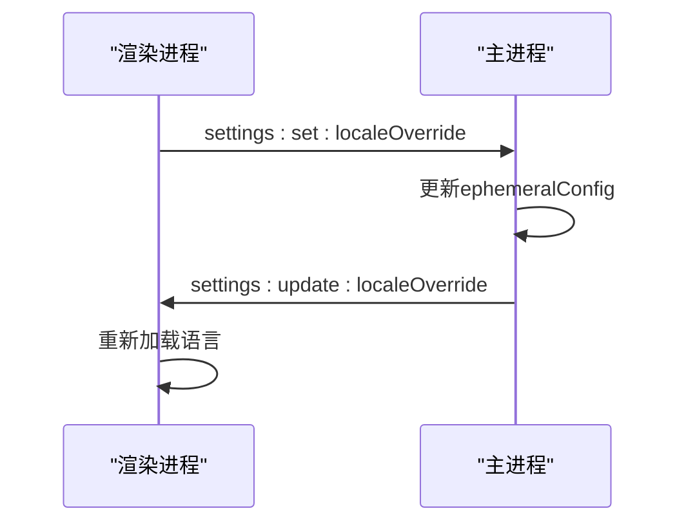
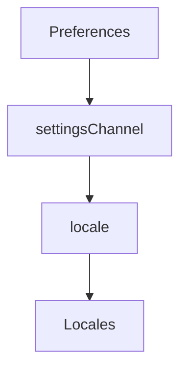

# 语言切换事件处理

<cite>
**本文档引用的文件**
- [Preferences.dom.tsx](file://ts/components/Preferences.dom.tsx)
- [locale.node.ts](file://app/locale.node.ts)
- [settingsChannel.main.ts](file://ts/main/settingsChannel.main.ts)
- [messages.json](file://_locales/zh-CN/messages.json)
</cite>

## 目录
1. [简介](#简介)
2. [项目结构](#项目结构)
3. [核心组件](#核心组件)
4. [架构概述](#架构概述)
5. [详细组件分析](#详细组件分析)
6. [依赖分析](#依赖分析)
7. [性能考虑](#性能考虑)
8. [故障排除指南](#故障排除指南)
9. [结论](#结论)

## 简介
本文档详细描述了Signal-Desktop应用程序中语言切换事件的处理机制。当用户在UI中选择新语言时，系统会触发一系列事件处理流程，从UI组件捕获语言选择动作，通过Redux action更新状态管理系统，最终实现界面语言的切换。文档将深入分析事件监听器如何工作，事件传播机制，以及相关的错误处理和优化策略。

## 项目结构
Signal-Desktop项目的语言切换功能主要涉及以下几个目录和文件：
- `_locales`：包含各种语言的翻译文件，如`zh-CN/messages.json`。
- `app`：包含主进程的逻辑，如`locale.node.ts`。
- `ts/components`：包含UI组件，如`Preferences.dom.tsx`。
- `ts/main`：包含主进程的设置通道，如`settingsChannel.main.ts`。

**图表来源**
- [Preferences.dom.tsx](file://ts/components/Preferences.dom.tsx#L921-L1023)
- [locale.node.ts](file://app/locale.node.ts#L125-L167)
- [settingsChannel.main.ts](file://ts/main/settingsChannel.main.ts#L46-L52)

**章节来源**
- [Preferences.dom.tsx](file://ts/components/Preferences.dom.tsx#L921-L1023)
- [locale.node.ts](file://app/locale.node.ts#L125-L167)
- [settingsChannel.main.ts](file://ts/main/settingsChannel.main.ts#L46-L52)

## 核心组件
语言切换的核心组件包括UI组件`Preferences.dom.tsx`、主进程的`locale.node.ts`和`settingsChannel.main.ts`。这些组件协同工作，确保用户选择的语言能够正确地应用到整个应用程序中。

**章节来源**
- [Preferences.dom.tsx](file://ts/components/Preferences.dom.tsx#L921-L1023)
- [locale.node.ts](file://app/locale.node.ts#L125-L167)
- [settingsChannel.main.ts](file://ts/main/settingsChannel.main.ts#L46-L52)

## 架构概述
语言切换的架构涉及UI组件、主进程和状态管理系统的交互。用户在UI中选择新语言后，事件通过IPC（Inter-Process Communication）传递到主进程，主进程更新配置并通知所有窗口重新加载语言设置。

**图表来源**
- [Preferences.dom.tsx](file://ts/components/Preferences.dom.tsx#L921-L1023)
- [locale.node.ts](file://app/locale.node.ts#L125-L167)
- [settingsChannel.main.ts](file://ts/main/settingsChannel.main.ts#L46-L52)

## 详细组件分析
### Preferences.dom.tsx 分析
`Preferences.dom.tsx`是用户选择语言的主要UI组件。当用户点击语言选择按钮时，会触发`onClick`事件，打开语言选择模态框。

**图表来源**
- [Preferences.dom.tsx](file://ts/components/Preferences.dom.tsx#L921-L1023)

**章节来源**
- [Preferences.dom.tsx](file://ts/components/Preferences.dom.tsx#L921-L1023)

### locale.node.ts 分析
`locale.node.ts`负责加载和匹配用户选择的语言。它使用`LocaleMatcher.match`方法来确定最佳匹配的语言，并加载相应的翻译文件。

**图表来源**
- [locale.node.ts](file://app/locale.node.ts#L125-L167)

**章节来源**
- [locale.node.ts](file://app/locale.node.ts#L125-L167)

### settingsChannel.main.ts 分析
`settingsChannel.main.ts`负责处理主进程中的设置变更。当用户选择新语言时，它会通过IPC通知主进程更新设置，并重新加载语言。

**图表来源**
- [settingsChannel.main.ts](file://ts/main/settingsChannel.main.ts#L46-L52)

**章节来源**
- [settingsChannel.main.ts](file://ts/main/settingsChannel.main.ts#L46-L52)

## 依赖分析
语言切换功能依赖于多个模块和文件，包括UI组件、主进程逻辑和翻译文件。这些依赖关系确保了语言切换的完整性和一致性。

**图表来源**
- [Preferences.dom.tsx](file://ts/components/Preferences.dom.tsx#L921-L1023)
- [settingsChannel.main.ts](file://ts/main/settingsChannel.main.ts#L46-L52)
- [locale.node.ts](file://app/locale.node.ts#L125-L167)

**章节来源**
- [Preferences.dom.tsx](file://ts/components/Preferences.dom.tsx#L921-L1023)
- [settingsChannel.main.ts](file://ts/main/settingsChannel.main.ts#L46-L52)
- [locale.node.ts](file://app/locale.node.ts#L125-L167)

## 性能考虑
语言切换过程中，系统需要加载新的翻译文件并重新渲染界面。为了优化性能，可以采用以下策略：
- 缓存已加载的翻译文件，避免重复加载。
- 使用异步加载，避免阻塞UI线程。
- 在用户选择语言后，延迟重新渲染，以减少不必要的界面更新。

## 故障排除指南
如果语言切换功能出现问题，可以检查以下几点：
- 确认翻译文件是否存在且格式正确。
- 检查主进程和渲染进程之间的IPC通信是否正常。
- 确认`locale.node.ts`中的`LocaleMatcher.match`方法是否正确匹配语言。

**章节来源**
- [locale.node.ts](file://app/locale.node.ts#L125-L167)
- [settingsChannel.main.ts](file://ts/main/settingsChannel.main.ts#L46-L52)

## 结论
Signal-Desktop的语言切换事件处理机制通过UI组件、主进程和状态管理系统的协同工作，实现了用户友好的语言切换功能。通过深入分析各个组件的实现细节，我们可以更好地理解其工作原理，并进行有效的维护和优化。