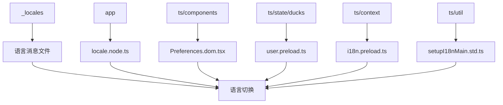
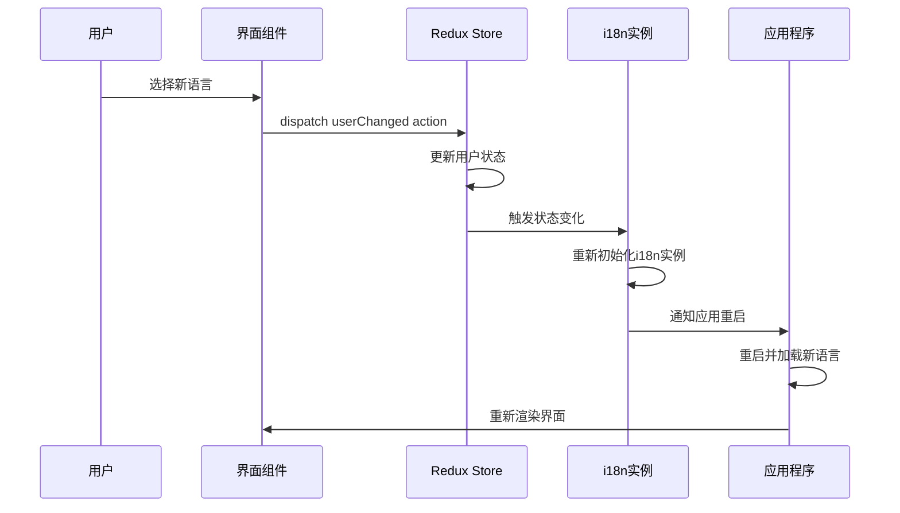
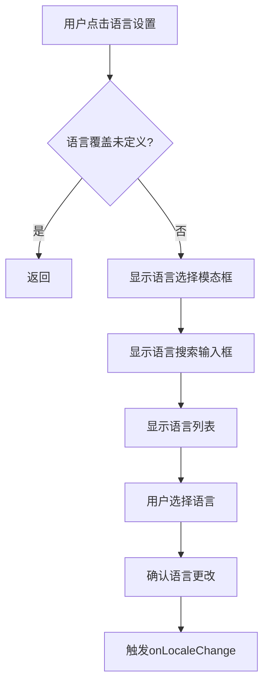
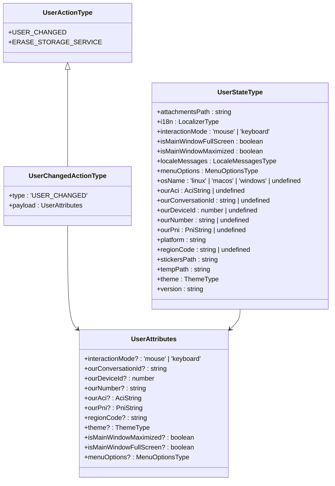
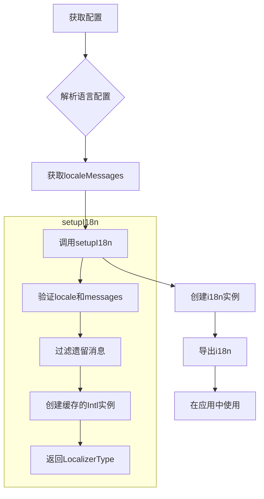
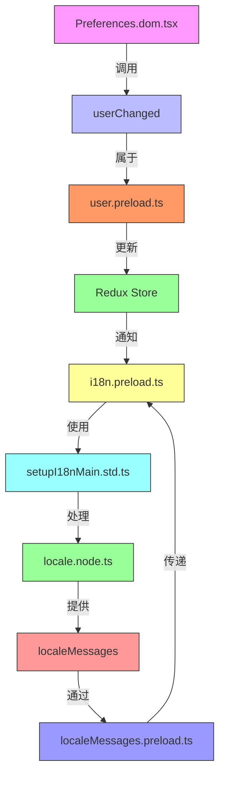

# 语言切换机制

<cite>
**本文档中引用的文件**  
- [locale.node.ts](file://app/locale.node.ts)
- [Preferences.dom.tsx](file://ts/components/Preferences.dom.tsx)
- [user.preload.ts](file://ts/state/ducks/user.preload.ts)
- [i18n.preload.ts](file://ts/context/i18n.preload.ts)
- [localeMessages.preload.ts](file://ts/context/localeMessages.preload.ts)
- [setupI18nMain.std.ts](file://ts/util/setupI18nMain.std.ts)
</cite>

## 目录
1. [简介](#简介)
2. [项目结构](#项目结构)
3. [核心组件](#核心组件)
4. [架构概述](#架构概述)
5. [详细组件分析](#详细组件分析)
6. [依赖分析](#依赖分析)
7. [性能考虑](#性能考虑)
8. [故障排除指南](#故障排除指南)
9. [结论](#结论)

## 简介
本文档详细描述了Signal-Desktop应用程序中的语言切换机制。当用户在界面中选择新语言时，系统会触发一系列操作来更新界面语言。该机制涉及用户交互、Redux状态更新、i18n实例重新初始化以及UI组件的重新渲染。文档将追踪从用户选择语言到界面刷新的完整流程，重点分析userChanged action如何更新Redux store中的语言相关属性，以及语言变更如何通过Redux状态变化驱动全局界面更新。

## 项目结构
Signal-Desktop的语言切换功能主要涉及以下几个目录和文件：
- `_locales`：包含所有支持语言的翻译消息文件
- `app`：包含主进程中的语言处理逻辑
- `ts/components`：包含用户界面组件，特别是语言选择界面
- `ts/state/ducks`：包含Redux状态管理逻辑
- `ts/context`：包含i18n上下文和配置
- `ts/util`：包含i18n实用工具函数

**图表来源**
- [locale.node.ts](file://app/locale.node.ts#L1-L219)
- [Preferences.dom.tsx](file://ts/components/Preferences.dom.tsx#L656-L1061)
- [user.preload.ts](file://ts/state/ducks/user.preload.ts#L87-L104)
- [i18n.preload.ts](file://ts/context/i18n.preload.ts#L1-L21)
- [setupI18nMain.std.ts](file://ts/util/setupI18nMain.std.ts#L116-L139)

**章节来源**
- [app/locale.node.ts](file://app/locale.node.ts#L1-L219)
- [ts/components/Preferences.dom.tsx](file://ts/components/Preferences.dom.tsx#L656-L1061)

## 核心组件
语言切换机制的核心组件包括：
1. 语言选择界面组件（Preferences.dom.tsx）
2. Redux用户状态管理（user.preload.ts）
3. 国际化(i18n)初始化和管理（i18n.preload.ts, setupI18nMain.std.ts）
4. 语言消息加载和处理（locale.node.ts）

这些组件协同工作，实现了从用户选择语言到界面刷新的完整流程。当用户在偏好设置中选择新语言时，系统会触发语言切换流程，更新Redux store中的语言相关属性，并重新初始化i18n实例，最终导致所有UI组件重新渲染以显示新语言。

**章节来源**
- [Preferences.dom.tsx](file://ts/components/Preferences.dom.tsx#L921-L1061)
- [user.preload.ts](file://ts/state/ducks/user.preload.ts#L87-L104)
- [i18n.preload.ts](file://ts/context/i18n.preload.ts#L1-L21)
- [locale.node.ts](file://app/locale.node.ts#L125-L219)

## 架构概述
Signal-Desktop的语言切换机制采用Redux状态管理架构，通过状态变化驱动UI更新。整个流程可以分为以下几个阶段：

**图表来源**
- [Preferences.dom.tsx](file://ts/components/Preferences.dom.tsx#L1035-L1037)
- [user.preload.ts](file://ts/state/ducks/user.preload.ts#L87-L104)
- [i18n.preload.ts](file://ts/context/i18n.preload.ts#L19-L21)

## 详细组件分析

### 语言选择界面分析
语言选择界面位于Preferences组件中，允许用户从支持的语言列表中选择新语言。当用户点击语言设置时，会弹出语言选择模态框。

**图表来源**
- [Preferences.dom.tsx](file://ts/components/Preferences.dom.tsx#L931-L1037)

**章节来源**
- [Preferences.dom.tsx](file://ts/components/Preferences.dom.tsx#L921-L1061)

### Redux状态管理分析
userChanged action是语言切换机制的核心，负责更新Redux store中的用户相关状态。

**图表来源**
- [user.preload.ts](file://ts/state/ducks/user.preload.ts#L43-L188)

**章节来源**
- [user.preload.ts](file://ts/state/ducks/user.preload.ts#L87-L104)

### i18n初始化分析
i18n实例的初始化和重新初始化是语言切换的关键环节，确保翻译消息正确加载和应用。

**图表来源**
- [i18n.preload.ts](file://ts/context/i18n.preload.ts#L1-L21)
- [setupI18nMain.std.ts](file://ts/util/setupI18nMain.std.ts#L116-L139)

**章节来源**
- [i18n.preload.ts](file://ts/context/i18n.preload.ts#L1-L21)
- [setupI18nMain.std.ts](file://ts/util/setupI18nMain.std.ts#L116-L139)

## 依赖分析
语言切换机制涉及多个组件之间的依赖关系，这些依赖确保了语言切换流程的正确执行。

**图表来源**
- [Preferences.dom.tsx](file://ts/components/Preferences.dom.tsx#L1035-L1037)
- [user.preload.ts](file://ts/state/ducks/user.preload.ts#L87-L104)
- [i18n.preload.ts](file://ts/context/i18n.preload.ts#L1-L21)
- [setupI18nMain.std.ts](file://ts/util/setupI18nMain.std.ts#L116-L139)
- [locale.node.ts](file://app/locale.node.ts#L125-L219)
- [localeMessages.preload.ts](file://ts/context/localeMessages.preload.ts#L6-L8)

**章节来源**
- [Preferences.dom.tsx](file://ts/components/Preferences.dom.tsx#L921-L1061)
- [user.preload.ts](file://ts/state/ducks/user.preload.ts#L87-L104)
- [i18n.preload.ts](file://ts/context/i18n.preload.ts#L1-L21)

## 性能考虑
语言切换机制在设计时考虑了性能优化，特别是在消息加载和i18n实例初始化方面：

1. **消息压缩**：在打包版本中，使用压缩格式的locale消息（values.json）而不是完整的messages.json，减少文件大小和加载时间。
2. **缓存机制**：使用createIntlCache()创建缓存的Intl实例，避免重复创建和解析。
3. **惰性加载**：语言消息在需要时才加载，而不是在应用启动时全部加载。
4. **批量更新**：通过Redux store的批量更新机制，减少UI重新渲染的次数。

这些优化确保了语言切换过程的高效性，即使在低性能设备上也能快速完成语言切换。

## 故障排除指南
在使用语言切换功能时，可能会遇到以下常见问题：

1. **语言未更改**：确保已正确设置localeOverride，并且应用已重启。
2. **翻译消息缺失**：检查_selected_语言的messages.json文件是否完整，包含所有必要的翻译键。
3. **界面未刷新**：确认Redux store已正确更新，并且i18n实例已重新初始化。
4. **RTL语言显示问题**：对于从右到左书写的语言，确保UI布局正确处理文本方向。

如果遇到问题，可以通过检查控制台日志来诊断问题，特别是与i18n和Redux相关的日志信息。

**章节来源**
- [locale.node.ts](file://app/locale.node.ts#L108-L124)
- [user.preload.ts](file://ts/state/ducks/user.preload.ts#L115-L117)
- [setupI18nMain.std.ts](file://ts/util/setupI18nMain.std.ts#L125-L130)

## 结论
Signal-Desktop的语言切换机制是一个精心设计的系统，通过Redux状态管理和i18n国际化框架实现了无缝的语言切换体验。该机制从用户界面交互开始，通过userChanged action更新Redux store中的语言相关属性，然后重新初始化i18n实例，最终通过应用重启完成语言切换。整个流程体现了清晰的职责分离和良好的架构设计，确保了语言切换的可靠性和性能。通过理解这一机制，开发者可以更好地维护和扩展Signal-Desktop的多语言支持功能。