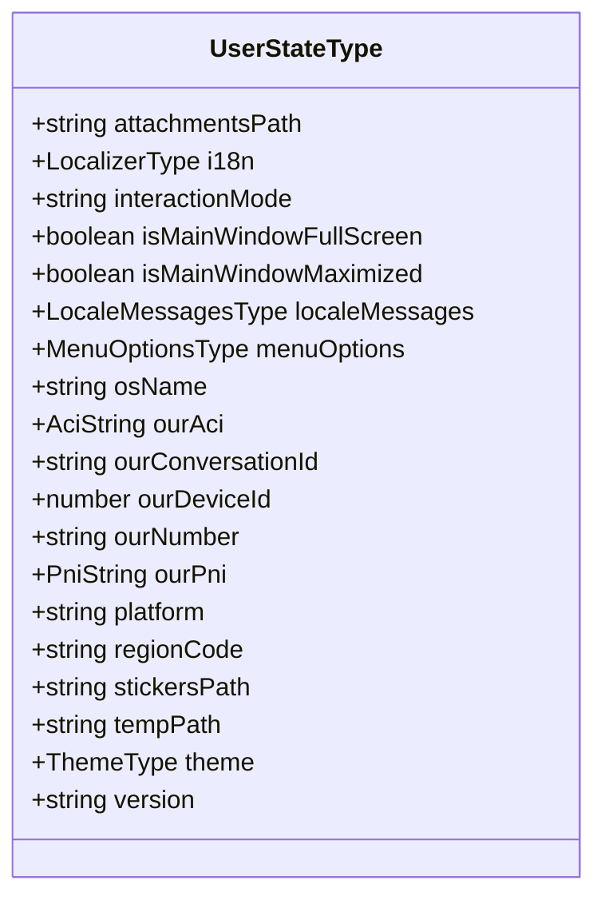
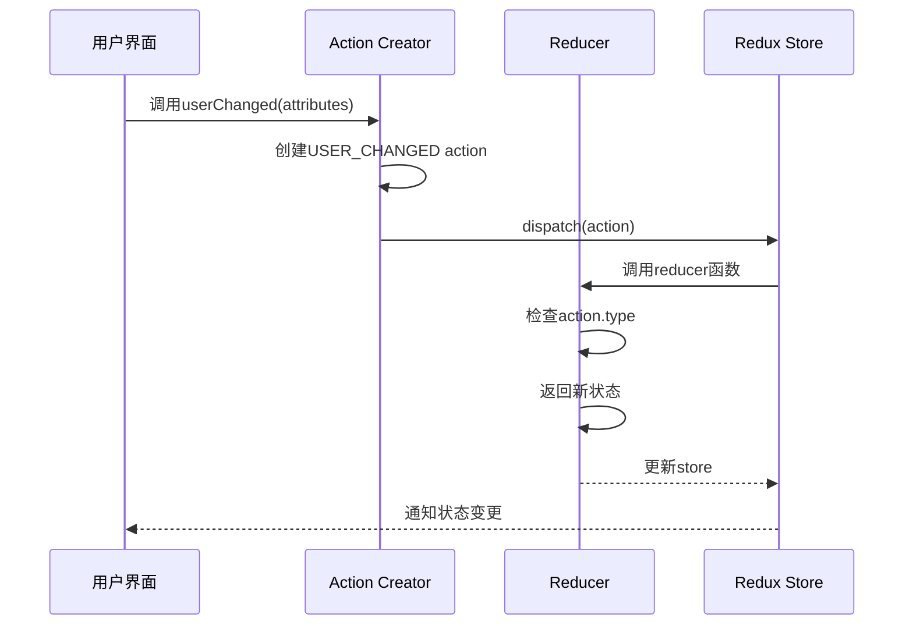
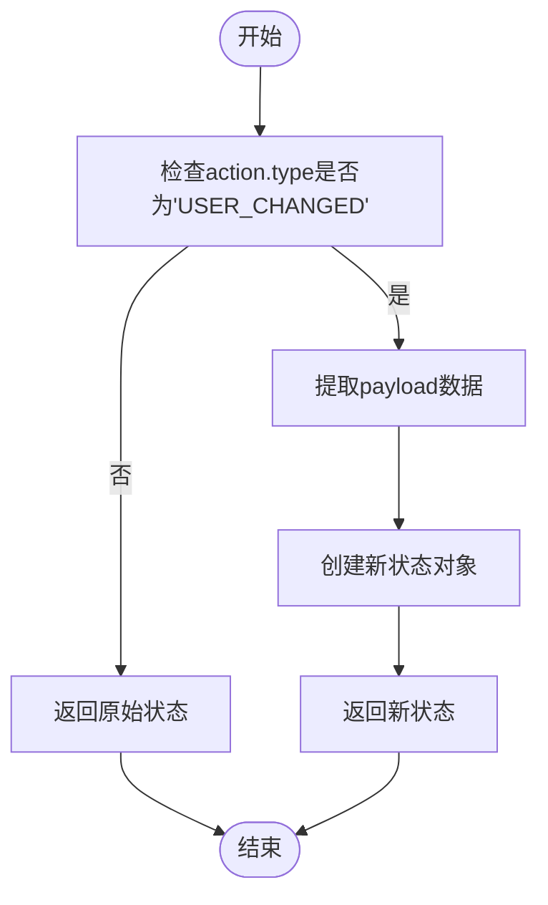
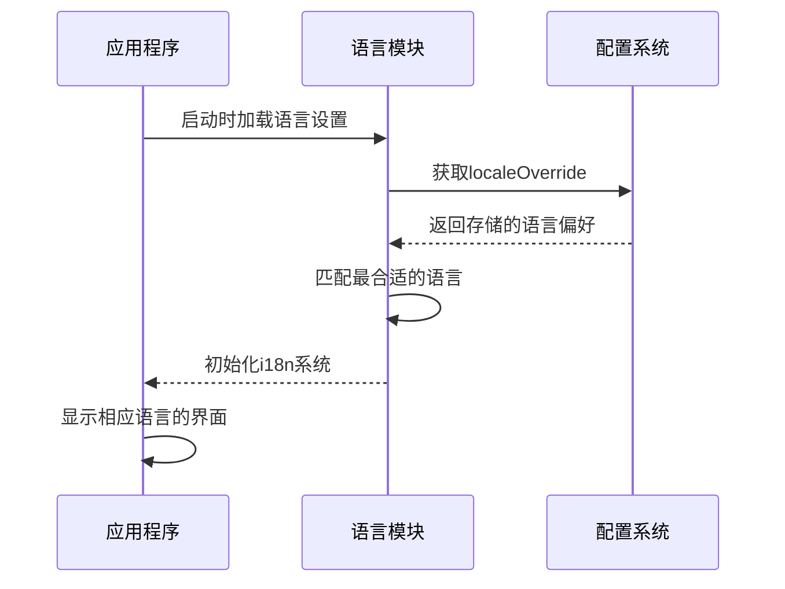
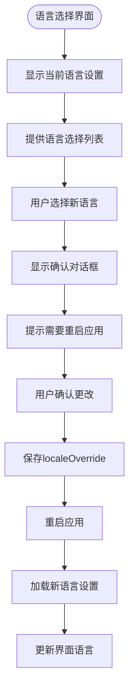

# 语言状态管理

<cite>
**本文档引用的文件**  
- [user.preload.ts](file://ts/state/ducks/user.preload.ts)
- [Preferences.dom.tsx](file://ts/components/Preferences.dom.tsx)
- [main.main.ts](file://app/main.main.ts)
- [locale.node.ts](file://app/locale.node.ts)
- [user.std.ts](file://ts/state/selectors/user.std.ts)
</cite>

## 目录
1. [简介](#简介)
2. [用户状态结构](#用户状态结构)
3. [语言变更操作](#语言变更操作)
4. [状态更新的不可变性](#状态更新的不可变性)
5. [状态持久化机制](#状态持久化机制)
6. [语言选择界面](#语言选择界面)
7. [总结](#总结)

## 简介
Signal-Desktop使用Redux进行全局状态管理，其中语言相关的状态存储在用户状态slice中。本文档详细说明了语言状态的管理机制，包括`userChanged` action如何更新Redux store中的语言相关属性，用户状态slice的结构，状态更新的不可变性原则，以及语言偏好在应用重启后如何持久化。

## 用户状态结构
用户状态slice定义了与用户相关的各种属性，包括语言相关的字段。通过分析代码，我们可以看到用户状态的主要结构：

**Diagram sources**  
- [user.preload.ts](file://ts/state/ducks/user.preload.ts#L19-L39)

**Section sources**  
- [user.preload.ts](file://ts/state/ducks/user.preload.ts#L19-L39)

## 语言变更操作
`userChanged` action是更新用户状态的主要方式。当用户更改语言设置时，会触发此action来更新Redux store中的相关属性。

**Diagram sources**  
- [user.preload.ts](file://ts/state/ducks/user.preload.ts#L87-L104)
- [user.preload.ts](file://ts/state/ducks/user.preload.ts#L170-L188)

**Section sources**  
- [user.preload.ts](file://ts/state/ducks/user.preload.ts#L87-L104)
- [user.preload.ts](file://ts/state/ducks/user.preload.ts#L170-L188)

## 状态更新的不可变性
在Redux中，状态更新必须遵循不可变性原则。Signal-Desktop通过使用扩展运算符(`...`)来确保状态的不可变性。

**Diagram sources**  
- [user.preload.ts](file://ts/state/ducks/user.preload.ts#L178-L185)

**Section sources**  
- [user.preload.ts](file://ts/state/ducks/user.preload.ts#L178-L185)

## 状态持久化机制
语言偏好设置在应用重启后需要保持不变，这通过状态持久化机制实现。Signal-Desktop使用localeOverride来存储用户的语言选择。

**Diagram sources**  
- [main.main.ts](file://app/main.main.ts#L460-L465)
- [locale.node.ts](file://app/locale.node.ts#L125-L167)

**Section sources**  
- [main.main.ts](file://app/main.main.ts#L460-L465)
- [locale.node.ts](file://app/locale.node.ts#L125-L167)

## 语言选择界面
用户通过偏好设置界面选择语言。选择后需要重启应用以应用新的语言设置。

**Diagram sources**  
- [Preferences.dom.tsx](file://ts/components/Preferences.dom.tsx#L921-L1023)
- [Preferences.dom.tsx](file://ts/components/Preferences.dom.tsx#L1024-L1043)

**Section sources**  
- [Preferences.dom.tsx](file://ts/components/Preferences.dom.tsx#L921-L1043)

## 总结
Signal-Desktop的语言状态管理通过Redux实现，使用`userChanged` action来更新用户状态slice中的语言相关属性。状态更新遵循不可变性原则，通过扩展运算符创建新状态对象。语言偏好通过localeOverride机制持久化存储，确保在应用重启后保持用户的语言选择。整个系统设计确保了语言切换的可靠性和一致性。

**Section sources**  
- [user.preload.ts](file://ts/state/ducks/user.preload.ts)
- [Preferences.dom.tsx](file://ts/components/Preferences.dom.tsx)
- [main.main.ts](file://app/main.main.ts)
- [locale.node.ts](file://app/locale.node.ts)
- [user.std.ts](file://ts/state/selectors/user.std.ts)