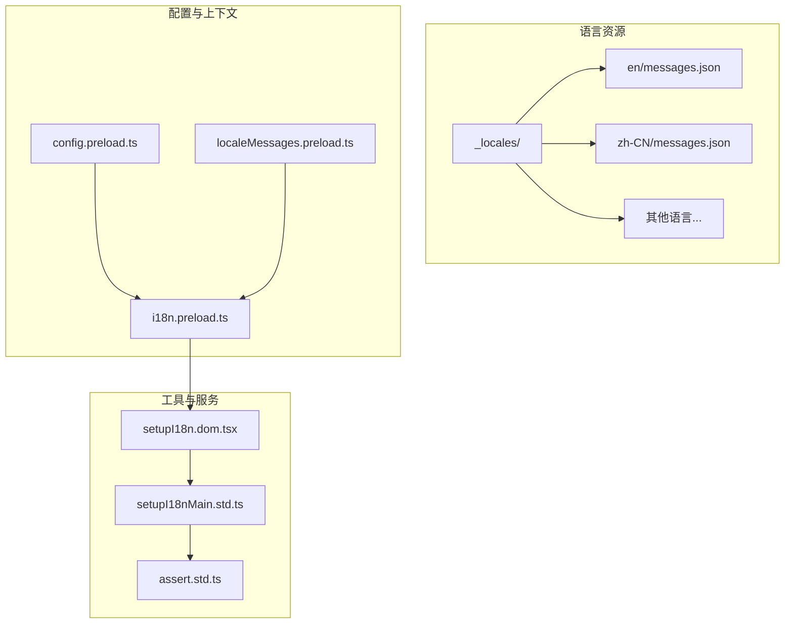
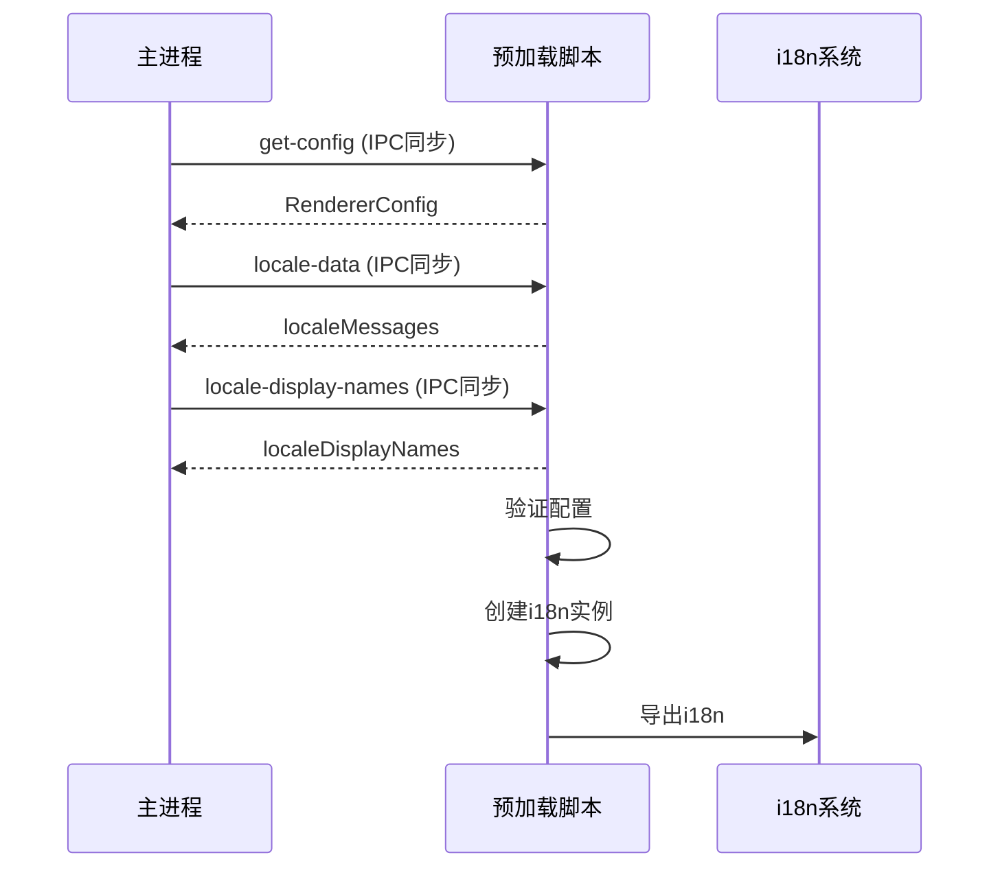
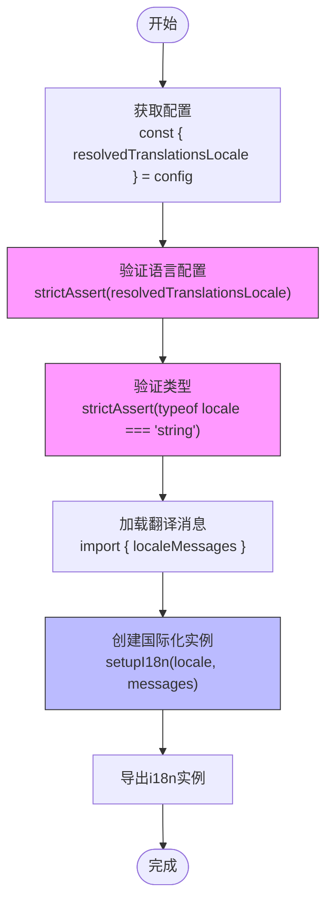
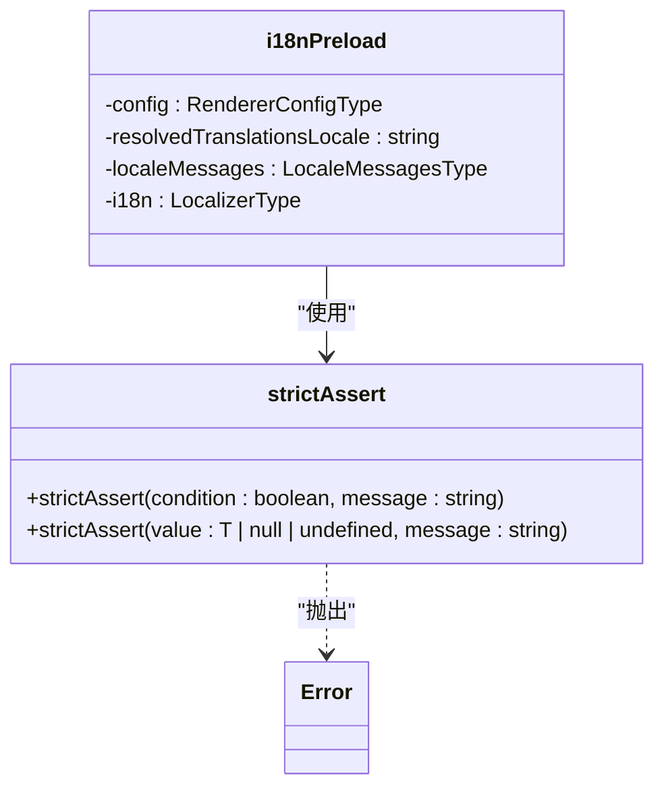
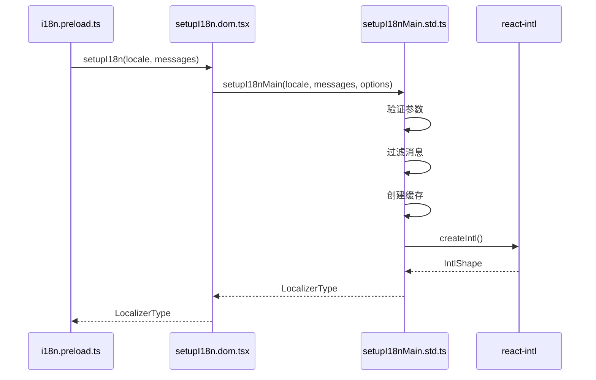
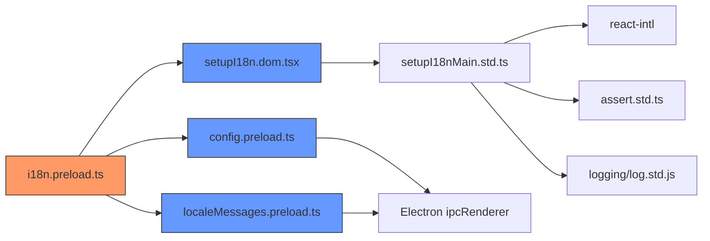

# 语言状态初始化

<cite>
**本文档中引用的文件**  
- [i18n.preload.ts](file://ts/context/i18n.preload.ts)
- [config.preload.ts](file://ts/context/config.preload.ts)
- [localeMessages.preload.ts](file://ts/context/localeMessages.preload.ts)
- [setupI18n.dom.tsx](file://ts/util/setupI18n.dom.tsx)
- [setupI18nMain.std.ts](file://ts/util/setupI18nMain.std.ts)
- [assert.std.ts](file://ts/util/assert.std.ts)
- [RendererConfig.std.ts](file://ts/types/RendererConfig.std.ts)
- [locale.node.ts](file://app/locale.node.ts)
</cite>

## 目录
1. [简介](#简介)
2. [项目结构](#项目结构)
3. [核心组件](#核心组件)
4. [架构概述](#架构概述)
5. [详细组件分析](#详细组件分析)
6. [依赖分析](#依赖分析)
7. [性能考虑](#性能考虑)
8. [故障排除指南](#故障排除指南)
9. [结论](#结论)

## 简介
本文档详细描述了Signal-Desktop应用程序中语言状态的初始化过程。重点分析了`i18n.preload.ts`文件中的`setupI18n`函数执行流程，解释其如何根据配置项确定默认语言并加载翻译资源。文档还阐述了翻译文件完整性的严格断言验证机制、国际化实例的全局配置过程以及初始化失败时的错误处理策略。

## 项目结构
Signal-Desktop的语言国际化系统采用分层架构设计，主要组件分布在`ts/context`和`ts/util`目录下。核心语言配置数据存储在`_locales`目录中，每个语言子目录包含`messages.json`翻译文件。系统通过Electron的IPC机制在主进程和渲染进程之间传递语言配置。

**图示来源**
- [i18n.preload.ts](file://ts/context/i18n.preload.ts)
- [config.preload.ts](file://ts/context/config.preload.ts)
- [localeMessages.preload.ts](file://ts/context/localeMessages.preload.ts)
- [setupI18n.dom.tsx](file://ts/util/setupI18n.dom.tsx)

**章节来源**
- [i18n.preload.ts](file://ts/context/i18n.preload.ts)
- [project_structure](file://project_structure)

## 核心组件
语言状态初始化的核心组件包括配置管理、消息加载和国际化实例创建三个主要部分。系统通过`config.preload.ts`获取解析后的语言配置，从`localeMessages.preload.ts`获取翻译消息，最终在`i18n.preload.ts`中组合这些信息创建国际化实例。

**章节来源**
- [i18n.preload.ts](file://ts/context/i18n.preload.ts)
- [config.preload.ts](file://ts/context/config.preload.ts)
- [localeMessages.preload.ts](file://ts/context/localeMessages.preload.ts)

## 架构概述
语言初始化架构采用预加载模式，在应用启动早期阶段完成国际化设置。系统首先通过IPC同步调用获取主进程中的语言配置和翻译数据，然后进行严格的验证，最后创建并导出可供整个应用使用的国际化实例。

**图示来源**
- [config.preload.ts](file://ts/context/config.preload.ts)
- [localeMessages.preload.ts](file://ts/context/localeMessages.preload.ts)
- [i18n.preload.ts](file://ts/context/i18n.preload.ts)

## 详细组件分析

### i18n初始化流程分析
`i18n.preload.ts`文件中的初始化流程严格按照顺序执行，确保语言配置的正确性和完整性。

#### 初始化流程图

**图示来源**
- [i18n.preload.ts](file://ts/context/i18n.preload.ts)

**章节来源**
- [i18n.preload.ts](file://ts/context/i18n.preload.ts#L1-L22)

### 配置验证机制
系统使用`strictAssert`函数对语言配置进行严格的运行时验证，确保应用程序不会在无效的国际化配置下运行。

#### 断言验证机制

**图示来源**
- [i18n.preload.ts](file://ts/context/i18n.preload.ts#L10-L17)
- [assert.std.ts](file://ts/util/assert.std.ts#L58-L75)

### 国际化实例创建
`setupI18n`函数负责创建最终的国际化实例，该实例封装了React Intl的所有功能并添加了Signal特有的扩展。

#### 实例创建流程

**图示来源**
- [i18n.preload.ts](file://ts/context/i18n.preload.ts#L19)
- [setupI18n.dom.tsx](file://ts/util/setupI18n.dom.tsx#L44-L58)
- [setupI18nMain.std.ts](file://ts/util/setupI18nMain.std.ts#L116-L184)

**章节来源**
- [setupI18nMain.std.ts](file://ts/util/setupI18nMain.std.ts#L116-L184)

## 依赖分析
语言初始化系统依赖多个核心组件和外部库，形成了清晰的依赖链。

**图示来源**
- [i18n.preload.ts](file://ts/context/i18n.preload.ts)
- [config.preload.ts](file://ts/context/config.preload.ts)
- [localeMessages.preload.ts](file://ts/context/localeMessages.preload.ts)
- [setupI18n.dom.tsx](file://ts/util/setupI18n.dom.tsx)
- [setupI18nMain.std.ts](file://ts/util/setupI18nMain.std.ts)

**章节来源**
- [i18n.preload.ts](file://ts/context/i18n.preload.ts)
- [setupI18nMain.std.ts](file://ts/util/setupI18nMain.std.ts)

## 性能考虑
语言初始化系统在设计时考虑了性能优化，主要体现在以下几个方面：

1. **同步IPC调用**：使用`ipcRenderer.sendSync`确保配置在渲染进程初始化早期就位
2. **消息缓存**：`createIntlCache`避免重复创建Intl实例
3. **预编译消息**：在构建时处理消息格式，减少运行时开销
4. **惰性加载**：仅在需要时才完全解析和验证所有翻译键

系统还通过`trackUsage`和`stopTrackingUsage`方法支持开发环境下的翻译使用情况分析，帮助识别未使用的翻译字符串。

## 故障排除指南
当语言初始化失败时，系统会提供明确的错误信息和诊断线索。

**章节来源**
- [i18n.preload.ts](file://ts/context/i18n.preload.ts#L10-L17)
- [setupI18nMain.std.ts](file://ts/util/setupI18nMain.std.ts#L125-L130)
- [assert.std.ts](file://ts/util/assert.std.ts)

### 常见问题及解决方案

| 问题现象 | 可能原因 | 解决方案 |
|---------|--------|---------|
| "locale could not be parsed from config" | 配置中缺少语言设置 | 检查主进程配置生成逻辑 |
| "locale is not a string" | 语言配置类型错误 | 验证RendererConfigSchema定义 |
| "missing translation for X" | 翻译键缺失 | 检查对应语言的messages.json文件 |
| IPC调用超时 | 主进程未正确响应 | 检查主进程中对应的IPC处理程序 |

### 错误处理策略
系统采用分层错误处理策略：
- **配置验证层**：使用`strictAssert`确保基本配置正确
- **运行时验证层**：在`setupI18n`中验证参数有效性
- **消息格式层**：通过`strictAssert(result !== key)`确保翻译存在
- **日志记录层**：所有错误都通过`createLogger`记录到应用日志

## 结论
Signal-Desktop的语言状态初始化系统设计严谨，通过多层次的验证和清晰的架构确保了国际化功能的可靠性。系统采用预加载模式，在应用启动早期完成语言配置，使用严格的断言机制防止无效配置导致的问题。整个流程从配置获取、验证到实例创建都经过精心设计，为应用程序提供了稳定可靠的多语言支持基础。