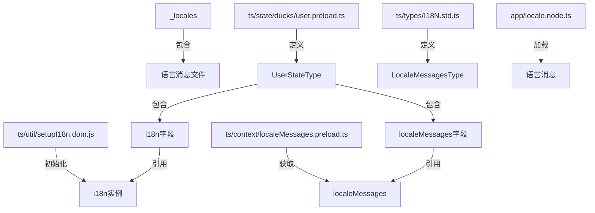
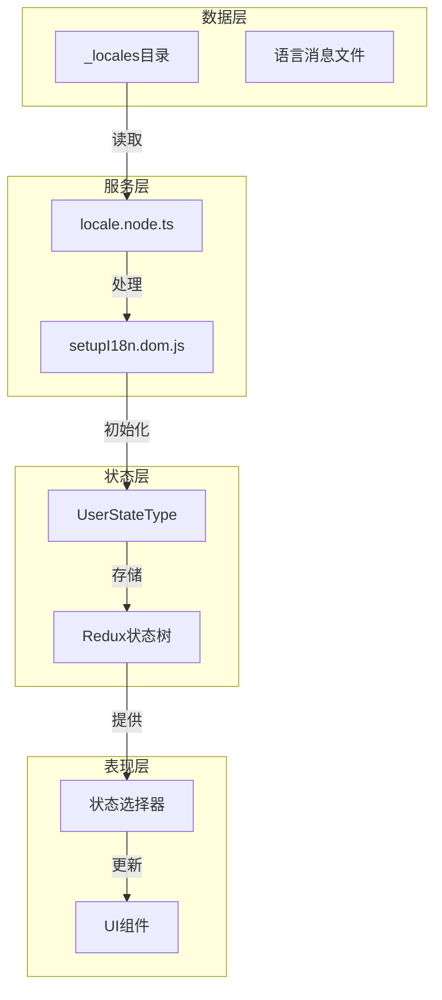
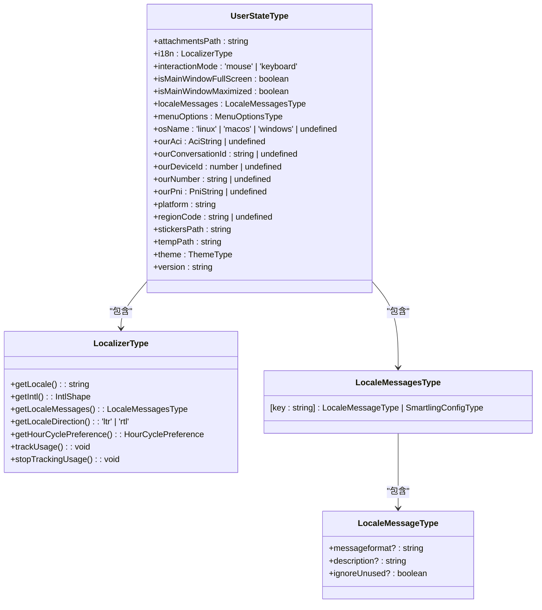
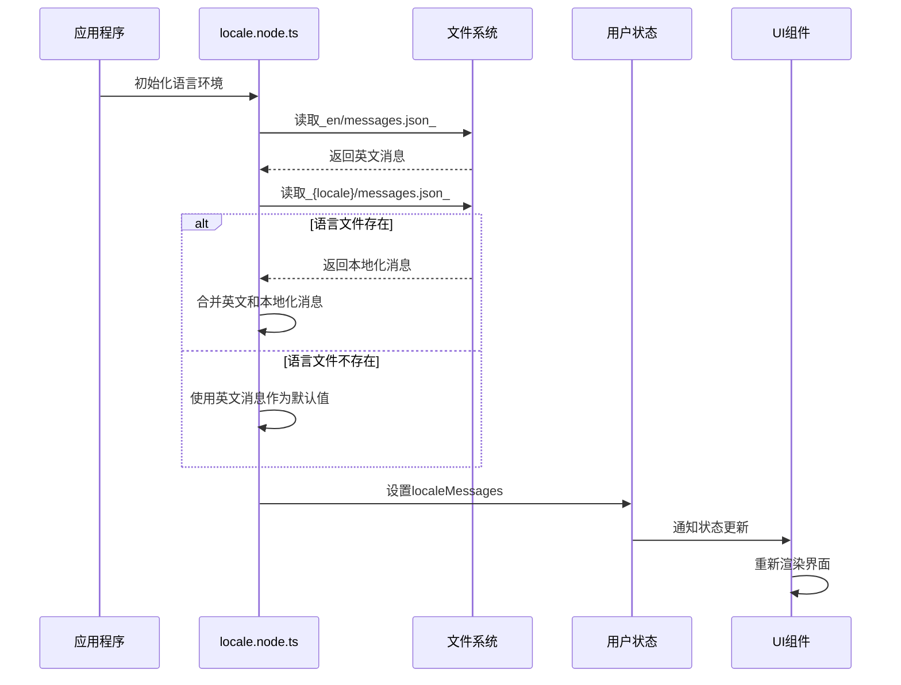
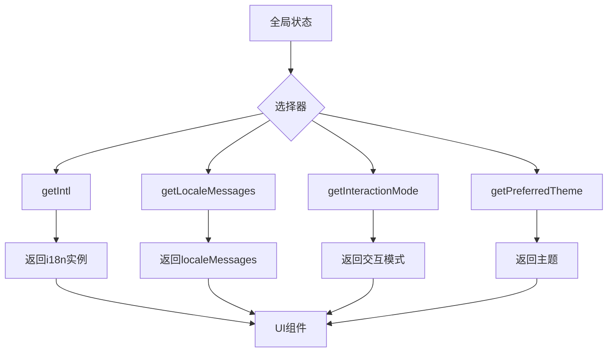

# 语言状态存储

<cite>
**本文档中引用的文件**  
- [user.preload.ts](file://ts/state/ducks/user.preload.ts)
- [I18N.std.ts](file://ts/types/I18N.std.ts)
- [locale.node.ts](file://app/locale.node.ts)
- [localeMessages.preload.ts](file://ts/context/localeMessages.preload.ts)
- [i18n.preload.ts](file://ts/context/i18n.preload.ts)
- [setupI18n.dom.js](file://ts/util/setupI18n.dom.js)
- [user.std.ts](file://ts/state/selectors/user.std.ts)
</cite>

## 目录
1. [简介](#简介)
2. [项目结构](#项目结构)
3. [核心组件](#核心组件)
4. [架构概述](#架构概述)
5. [详细组件分析](#详细组件分析)
6. [依赖分析](#依赖分析)
7. [性能考虑](#性能考虑)
8. [故障排除指南](#故障排除指南)
9. [结论](#结论)

## 简介
本文档详细分析Signal-Desktop应用程序中的语言状态存储机制。重点研究用户预加载模块中`UserStateType`类型定义，特别是`i18n`字段如何存储本地化函数和当前语言环境信息。文档将深入探讨`localeMessages`在Redux状态树中的结构和作用，解释其如何为UI组件提供实时翻译内容。同时，阐述语言状态与其他用户偏好（如主题、交互模式）的共存机制，以及状态持久化到本地存储的策略。最后，提供状态选择器（selector）如何从全局状态中高效提取语言相关数据的说明。

## 项目结构
Signal-Desktop的语言状态存储系统主要由以下几个关键部分组成：
- `_locales`目录：包含所有支持语言的翻译消息文件
- `ts/state/ducks/user.preload.ts`：定义用户状态类型和相关操作
- `ts/types/I18N.std.ts`：定义国际化相关的类型
- `app/locale.node.ts`：处理语言环境的初始化和消息加载
- `ts/context/localeMessages.preload.ts`：通过IPC同步获取本地化消息
- `ts/util/setupI18n.dom.js`：设置国际化实例



**图示来源**
- [_locales](file://_locales)
- [user.preload.ts](file://ts/state/ducks/user.preload.ts#L19-L39)
- [I18N.std.ts](file://ts/types/I18N.std.ts#L25-L30)
- [locale.node.ts](file://app/locale.node.ts#L30-L34)
- [localeMessages.preload.ts](file://ts/context/localeMessages.preload.ts#L6)
- [setupI18n.dom.js](file://ts/util/setupI18n.dom.js)

## 核心组件

`UserStateType`是Signal-Desktop中用户状态的核心类型定义，位于`user.preload.ts`文件中。该类型包含多个与用户偏好相关的字段，其中与语言状态相关的关键字段包括`i18n`和`localeMessages`。`i18n`字段存储了本地化函数的集合，而`localeMessages`字段则存储了当前语言环境的翻译消息。这些字段在应用启动时被初始化，并在整个应用生命周期中保持更新。

**组件来源**
- [user.preload.ts](file://ts/state/ducks/user.preload.ts#L19-L39)

## 架构概述

Signal-Desktop的语言状态存储采用分层架构，从底层的语言消息文件到顶层的UI组件，形成了一个完整的国际化解决方案。系统首先从`_locales`目录加载语言消息，然后通过`locale.node.ts`文件进行处理和匹配，最后将结果存储在Redux状态树中。UI组件通过状态选择器从全局状态中提取所需的语言信息，并实时更新界面内容。



**图示来源**
- [locale.node.ts](file://app/locale.node.ts)
- [setupI18n.dom.js](file://ts/util/setupI18n.dom.js)
- [user.preload.ts](file://ts/state/ducks/user.preload.ts)
- [user.std.ts](file://ts/state/selectors/user.std.ts)

## 详细组件分析

### UserStateType分析
`UserStateType`是Signal-Desktop中用户状态的核心类型，定义了应用中所有与用户相关的状态信息。该类型通过TypeScript的`Readonly`修饰符确保状态的不可变性，符合Redux的最佳实践。

#### 类型定义


**图示来源**
- [user.preload.ts](file://ts/state/ducks/user.preload.ts#L19-L39)
- [I18N.std.ts](file://ts/types/I18N.std.ts#L19-L30)

#### i18n字段
`i18n`字段是`UserStateType`中的关键组成部分，它存储了一个`LocalizerType`类型的对象。这个对象包含了多个用于国际化操作的方法，如`getLocale`、`getIntl`、`getLocaleMessages`等。在应用初始化时，`i18n`字段被设置为一个占位函数，抛出"i18n not yet set up"错误，直到真正的国际化实例被创建并赋值。

**组件来源**
- [user.preload.ts](file://ts/state/ducks/user.preload.ts#L134-L142)

#### localeMessages字段
`localeMessages`字段存储了当前语言环境的所有翻译消息，其类型为`LocaleMessagesType`。这是一个索引签名类型，允许使用任意字符串作为键来访问对应的`LocaleMessageType`对象。每个`LocaleMessageType`对象包含一个可选的`messageformat`字段，用于存储格式化的消息字符串。

**组件来源**
- [user.preload.ts](file://ts/state/ducks/user.preload.ts#L25)
- [I18N.std.ts](file://ts/types/I18N.std.ts#L25-L30)

### 语言消息加载流程
语言消息的加载是一个多步骤的过程，涉及多个文件和组件的协作。系统首先从`_locales`目录读取语言消息文件，然后通过`locale.node.ts`进行处理和匹配，最后将结果存储在全局状态中。



**图示来源**
- [locale.node.ts](file://app/locale.node.ts#L30-L34)
- [user.preload.ts](file://ts/state/ducks/user.preload.ts#L146)
- [user.std.ts](file://ts/state/selectors/user.std.ts#L54-L57)

### 状态选择器分析
状态选择器是连接Redux状态树和UI组件的桥梁。Signal-Desktop使用`reselect`库创建高效的记忆化选择器，避免不必要的重新计算。



**图示来源**
- [user.std.ts](file://ts/state/selectors/user.std.ts#L49-L57)

## 依赖分析

Signal-Desktop的语言状态存储系统依赖于多个外部库和内部模块。主要依赖包括：
- `electron`：用于IPC通信，获取本地化消息
- `lodash`：用于对象合并操作
- `@formatjs/intl-localematcher`：用于语言环境匹配
- `zod`：用于数据验证
- `reselect`：用于创建记忆化选择器

```mermaid
graph LR
A[user.preload.ts] --> B[electron]
A --> C[lodash]
A --> D[@formatjs/intl-localematcher]
A --> E[zod]
A --> F[reselect]
B --> G[IPC通信]
C --> H[对象合并]
D --> I[语言匹配]
E --> J[数据验证]
F --> K[记忆化选择器]
```

**图示来源**
- [user.preload.ts](file://ts/state/ducks/user.preload.ts#L4)
- [locale.node.ts](file://app/locale.node.ts#L7)

## 性能考虑
语言状态存储系统在设计时考虑了多个性能因素：
1. **消息合并优化**：在生产环境中，系统使用压缩的消息格式，减少文件大小和加载时间
2. **记忆化选择器**：使用`reselect`库创建的记忆化选择器避免了不必要的重新计算
3. **惰性加载**：语言消息在需要时才从文件系统读取，减少启动时间
4. **缓存机制**：已加载的语言消息被缓存，避免重复读取

## 故障排除指南
在开发和使用过程中可能遇到的常见问题及解决方案：

### 语言消息未更新
**问题**：更改语言设置后，界面文本未更新
**解决方案**：
1. 确保`userChanged`动作正确触发
2. 检查`localeMessages`是否正确更新
3. 验证UI组件是否正确订阅状态变化

### 缺失翻译消息
**问题**：某些文本显示为键名而非翻译内容
**解决方案**：
1. 检查对应语言的`messages.json`文件是否包含该键
2. 确认键名拼写正确
3. 验证是否需要添加到`keys.json`文件中

### 语言环境匹配失败
**问题**：无法正确匹配用户首选语言
**解决方案**：
1. 检查`availableLocales`配置
2. 验证`preferredSystemLocales`设置
3. 确认`localeOverride`未意外覆盖

**组件来源**
- [user.preload.ts](file://ts/state/ducks/user.preload.ts#L178-L185)
- [locale.node.ts](file://app/locale.node.ts#L166-L197)

## 结论
Signal-Desktop的语言状态存储系统是一个精心设计的国际化解决方案，通过Redux状态管理和模块化架构实现了高效、可维护的多语言支持。系统将语言消息与用户偏好状态分离存储，既保证了数据的一致性，又提供了灵活的扩展能力。通过记忆化选择器和优化的消息加载策略，系统在保持高性能的同时，为用户提供流畅的多语言体验。未来可以考虑引入动态语言切换和实时翻译更新功能，进一步提升用户体验。