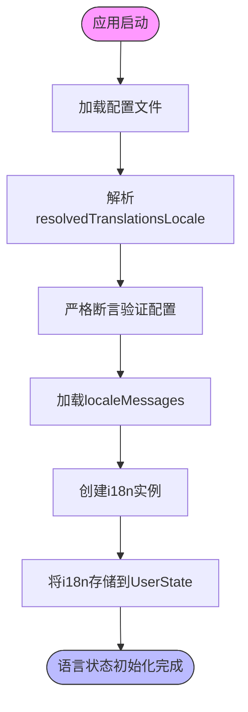
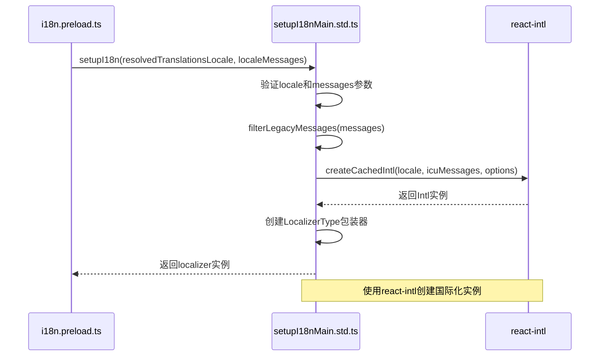
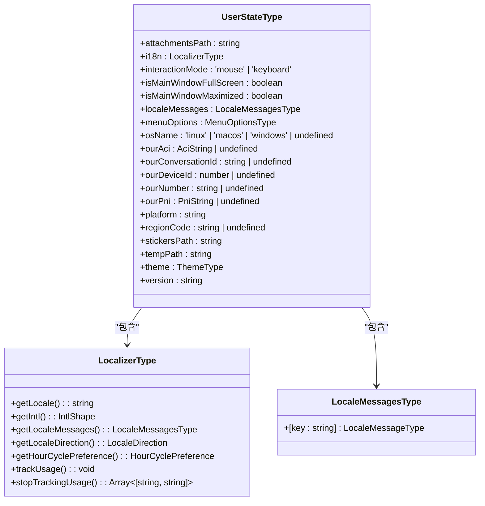
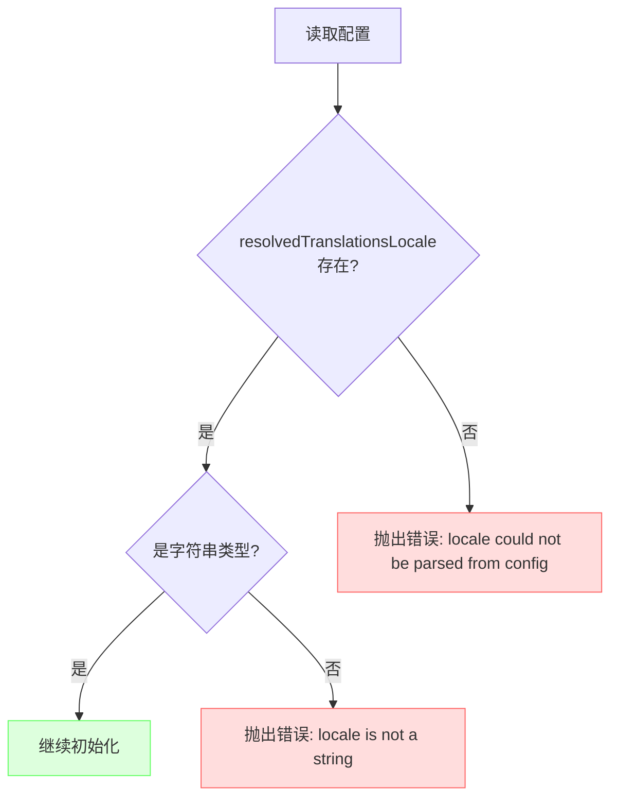
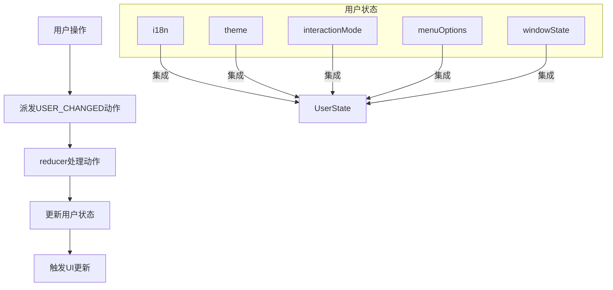
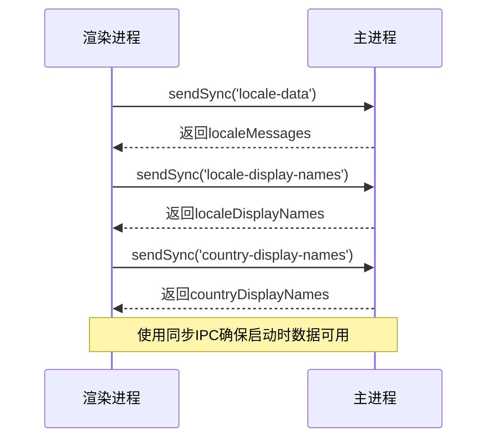

# 语言状态管理

<cite>
**本文档中引用的文件**
- [i18n.preload.ts](file://ts/context/i18n.preload.ts)
- [user.preload.ts](file://ts/state/ducks/user.preload.ts)
- [localeMessages.preload.ts](file://ts/context/localeMessages.preload.ts)
- [locale.node.ts](file://app/locale.node.ts)
- [setupI18nMain.std.ts](file://ts/util/setupI18nMain.std.ts)
</cite>

## 目录
1. [简介](#简介)
2. [语言状态初始化流程](#语言状态初始化流程)
3. [国际化实例初始化机制](#国际化实例初始化机制)
4. [用户状态中的语言字段](#用户状态中的语言字段)
5. [配置解析与断言验证](#配置解析与断言验证)
6. [语言状态与其他用户状态的集成](#语言状态与其他用户状态的集成)
7. [状态持久化策略](#状态持久化策略)
8. [结论](#结论)

## 简介
Signal-Desktop应用通过一套完整的国际化（i18n）系统来管理多语言支持。该系统在应用启动时初始化语言状态，根据用户配置和系统环境确定默认语言，并将本地化函数存储在用户状态中。本文档详细分析了语言状态管理的核心机制，包括国际化实例的初始化、语言配置的解析、断言验证以及与其他用户状态的集成方式。

## 语言状态初始化流程

Signal-Desktop的语言状态初始化是一个多步骤的过程，从配置解析开始，经过断言验证，最终创建国际化实例。这个过程确保了应用能够正确加载和使用本地化资源。

**图示来源**
- [i18n.preload.ts](file://ts/context/i18n.preload.ts#L9-L19)
- [user.preload.ts](file://ts/state/ducks/user.preload.ts#L121-L167)

**本节来源**
- [i18n.preload.ts](file://ts/context/i18n.preload.ts#L4-L22)
- [user.preload.ts](file://ts/state/ducks/user.preload.ts#L16-L167)

## 国际化实例初始化机制

国际化实例的初始化通过`setupI18n`函数完成，该函数位于`setupI18nMain.std.ts`文件中。此函数接收语言代码、消息对象和选项作为参数，创建并返回一个本地化器（LocalizerType）实例。

`setupI18n`函数首先验证输入参数的完整性，确保locale和messages参数都已提供。然后，它使用`createCachedIntl`函数创建一个Intl实例，该实例基于React Intl库，提供了格式化消息、日期、数字等国际化功能。

**图示来源**
- [i18n.preload.ts](file://ts/context/i18n.preload.ts#L19)
- [setupI18nMain.std.ts](file://ts/util/setupI18nMain.std.ts#L116-L184)

**本节来源**
- [setupI18nMain.std.ts](file://ts/util/setupI18nMain.std.ts#L116-L184)

## 用户状态中的语言字段

在`user.preload.ts`文件中定义的`UserStateType`类型包含了i18n字段，用于存储本地化函数。这个字段是`LocalizerType`类型的实例，提供了访问和使用翻译消息的接口。

`localeMessages`字段存储了当前语言的所有消息，这些消息从应用的`_locales`目录中加载。当应用需要显示文本时，会通过i18n函数查找`localeMessages`中的对应翻译。

**图示来源**
- [user.preload.ts](file://ts/state/ducks/user.preload.ts#L19-L39)
- [setupI18nMain.std.ts](file://ts/util/setupI18nMain.std.ts#L12-L15)

**本节来源**
- [user.preload.ts](file://ts/state/ducks/user.preload.ts#L19-L39)

## 配置解析与断言验证

语言配置的解析和验证是确保应用正确初始化的关键步骤。在`i18n.preload.ts`文件中，系统首先从配置中提取`resolvedTranslationsLocale`，然后使用`strictAssert`函数进行严格的断言验证。

`strictAssert`函数确保配置存在且为字符串类型，如果断言失败，应用将抛出错误并停止初始化。这种严格的验证机制防止了因配置错误导致的运行时问题。

**图示来源**
- [i18n.preload.ts](file://ts/context/i18n.preload.ts#L9-L17)

**本节来源**
- [i18n.preload.ts](file://ts/context/i18n.preload.ts#L9-L17)
- [setupI18nMain.std.ts](file://ts/util/setupI18nMain.std.ts#L125-L130)

## 语言状态与其他用户状态的集成

语言状态与其他用户状态（如主题、交互模式）集成在`UserStateType`中，形成一个统一的用户状态对象。这种设计使得所有用户相关的配置都集中管理，便于状态的更新和持久化。

当用户更改语言设置时，系统会派发`USER_CHANGED`动作，更新用户状态中的i18n字段。这种基于动作的状态管理机制确保了状态变更的可预测性和可追踪性。

**图示来源**
- [user.preload.ts](file://ts/state/ducks/user.preload.ts#L43-L58)
- [user.preload.ts](file://ts/state/ducks/user.preload.ts#L170-L188)

**本节来源**
- [user.preload.ts](file://ts/state/ducks/user.preload.ts#L43-L188)

## 状态持久化策略

Signal-Desktop通过Electron的IPC机制实现状态的持久化。在`localeMessages.preload.ts`文件中，系统使用`ipcRenderer.sendSync`同步地从主进程获取语言数据。

这种同步通信确保了语言状态在应用启动时就能立即可用，避免了异步加载导致的界面闪烁或延迟。所有语言相关的数据（localeMessages、localeDisplayNames、countryDisplayNames）都通过这种方式从主进程传递到渲染进程。

**图示来源**
- [localeMessages.preload.ts](file://ts/context/localeMessages.preload.ts#L6-L10)

**本节来源**
- [localeMessages.preload.ts](file://ts/context/localeMessages.preload.ts#L6-L10)
- [locale.node.ts](file://app/locale.node.ts#L125-L218)

## 结论

Signal-Desktop的语言状态管理系统通过精心设计的初始化流程、严格的配置验证和高效的IPC通信，确保了多语言支持的可靠性和性能。系统将国际化实例存储在用户状态中，与其他用户配置集成，形成了统一的状态管理方案。通过`setupI18n`函数创建的本地化器提供了完整的国际化功能，而同步的IPC通信确保了语言数据在应用启动时的即时可用性。这种架构设计既保证了系统的健壮性，又提供了良好的用户体验。