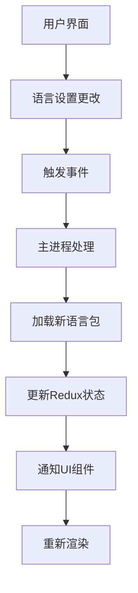
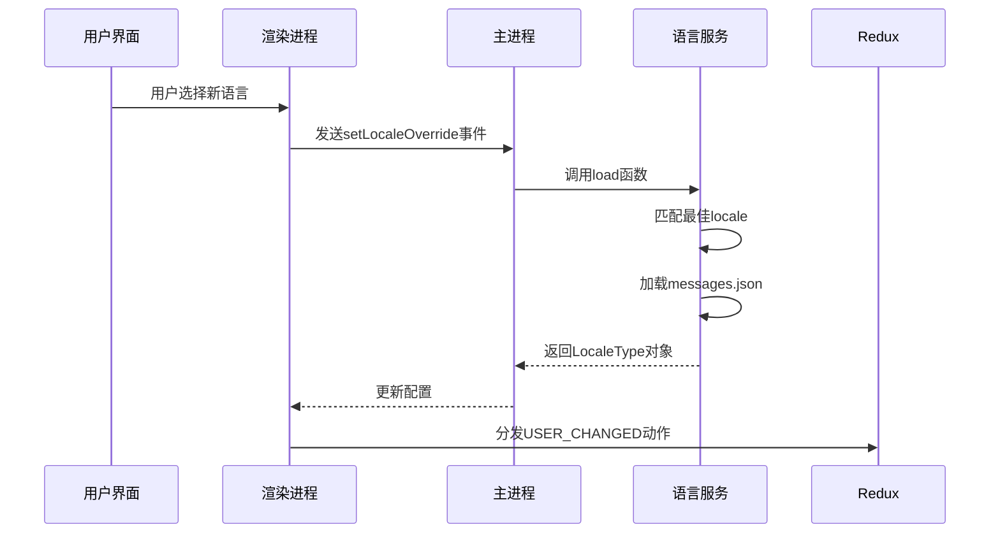
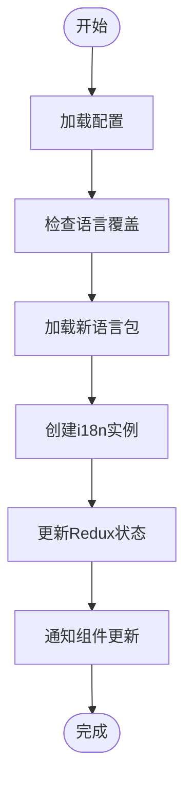

# 运行时语言更新

<cite>
**本文档引用的文件**
- [i18n.preload.ts](file://ts/context/i18n.preload.ts)
- [user.preload.ts](file://ts/state/ducks/user.preload.ts)
- [locale.node.ts](file://app/locale.node.ts)
- [config.preload.ts](file://ts/context/config.preload.ts)
- [localeMessages.preload.ts](file://ts/context/localeMessages.preload.ts)
- [getInitialState.preload.ts](file://ts/state/getInitialState.preload.ts)
- [main.main.ts](file://app/main.main.ts)
- [Preferences.preload.tsx](file://ts/state/smart/Preferences.preload.tsx)
</cite>

## 目录
1. [项目结构](#项目结构)
2. [核心组件](#核心组件)
3. [语言更新机制](#语言更新机制)
4. [状态同步流程](#状态同步流程)
5. [UI更新机制](#ui更新机制)
6. [错误处理与异步操作](#错误处理与异步操作)

## 项目结构

Signal-Desktop的国际化系统由多个关键组件构成，主要分布在`_locales`目录和`ts/context`目录中。`_locales`目录包含了所有支持语言的翻译文件，每个语言子目录下都有`messages.json`文件存储具体的翻译内容。核心的国际化逻辑实现在`ts/context`目录下的预加载文件中。

**图示来源**
- [i18n.preload.ts](file://ts/context/i18n.preload.ts)
- [user.preload.ts](file://ts/state/ducks/user.preload.ts)

**本节来源**
- [i18n.preload.ts](file://ts/context/i18n.preload.ts)
- [user.preload.ts](file://ts/state/ducks/user.preload.ts)

## 核心组件

Signal-Desktop的运行时语言更新系统由几个核心组件协同工作。`i18n.preload.ts`负责管理国际化实例，`user.preload.ts`中的Redux状态存储用户相关数据，包括语言设置。`locale.node.ts`在主进程中处理语言包的加载和解析。

**本节来源**
- [i18n.preload.ts](file://ts/context/i18n.preload.ts#L1-L22)
- [user.preload.ts](file://ts/state/ducks/user.preload.ts#L1-L189)
- [locale.node.ts](file://app/locale.node.ts#L1-L219)

## 语言更新机制

当用户在设置中更改语言时，系统通过事件机制触发语言更新流程。`Preferences.preload.tsx`中的`onLocaleChange`函数处理用户的语言选择，通过`window.Events.setLocaleOverride`将新的语言设置发送到主进程。

主进程在`main.main.ts`中监听配置变更，当收到新的语言设置时，会重新加载相应的语言包。`locale.node.ts`文件中的`load`函数负责实际的语言包加载工作，它会根据用户选择的语言匹配最合适的locale，并加载对应的翻译消息。

**图示来源**
- [Preferences.preload.tsx](file://ts/state/smart/Preferences.preload.tsx#L393-L477)
- [main.main.ts](file://app/main.main.ts#L1-L200)
- [locale.node.ts](file://app/locale.node.ts#L30-L219)

**本节来源**
- [Preferences.preload.tsx](file://ts/state/smart/Preferences.preload.tsx#L393-L477)
- [main.main.ts](file://app/main.main.ts#L1-L200)

## 状态同步流程

语言更新的核心是i18n实例与Redux状态的同步。`i18n.preload.ts`通过`config`和`localeMessages`初始化国际化实例，其中`config`来自`config.preload.ts`，包含解析后的翻译locale。

当语言更改时，系统需要重新初始化Redux状态以包含新的语言信息。`getInitialState.preload.ts`中的`generateUserState`函数在生成用户状态时，会从`window.SignalContext.i18n`获取当前的i18n实例和locale消息，确保Redux状态中的`i18n`和`localeMessages`字段与最新的语言设置保持同步。

**图示来源**
- [i18n.preload.ts](file://ts/context/i18n.preload.ts#L1-L22)
- [getInitialState.preload.ts](file://ts/state/getInitialState.preload.ts#L199-L247)
- [config.preload.ts](file://ts/context/config.preload.ts#L1-L11)

**本节来源**
- [i18n.preload.ts](file://ts/context/i18n.preload.ts#L1-L22)
- [getInitialState.preload.ts](file://ts/state/getInitialState.preload.ts#L199-L247)

## UI更新机制

语言更新后，所有已连接的UI组件需要重新渲染以反映新的语言环境。这一过程通过Redux状态管理实现。当语言更改时，系统会分发`USER_CHANGED`动作，该动作包含更新后的`i18n`实例和`localeMessages`。

`user.preload.ts`中的reducer处理`USER_CHANGED`动作，将新的i18n相关数据合并到用户状态中。由于Redux状态的变更，所有订阅了用户状态的React组件都会收到更新通知，并触发重新渲染。组件中的文本内容通过i18n实例的翻译函数获取，因此会自动显示为新的语言。

**本节来源**
- [user.preload.ts](file://ts/state/ducks/user.preload.ts#L170-L188)
- [i18n.preload.ts](file://ts/context/i18n.preload.ts#L1-L22)

## 错误处理与异步操作

语言更新流程中包含了完善的错误处理机制。在`locale.node.ts`中，加载语言包时使用了try-catch块捕获可能的文件读取错误。如果无法加载指定语言的翻译文件，系统会优雅地降级到英语作为默认语言。

异步操作主要体现在语言包的动态加载上。虽然大多数翻译文件在应用启动时已经预加载，但系统设计考虑了可能的异步加载场景。通过Promise和async/await模式，确保在语言包完全加载并解析后才更新UI，避免了渲染不完整或错误的翻译内容。

**本节来源**
- [locale.node.ts](file://app/locale.node.ts#L107-L114)
- [getInitialState.preload.ts](file://ts/state/getInitialState.preload.ts#L167-L197)