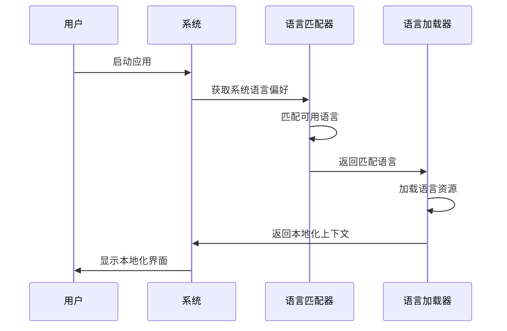
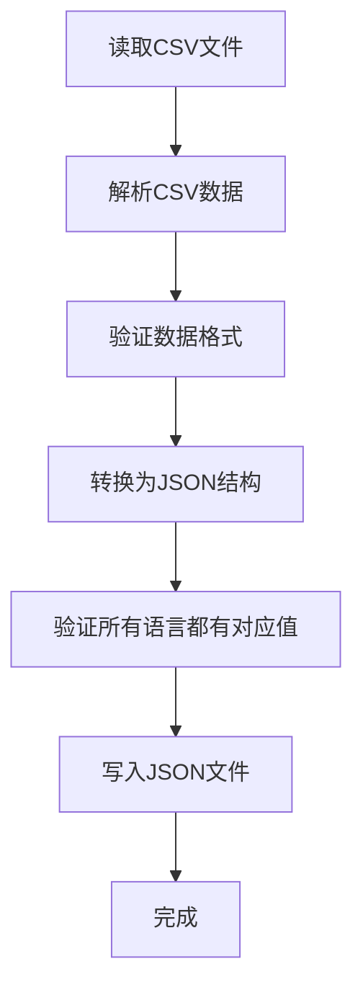
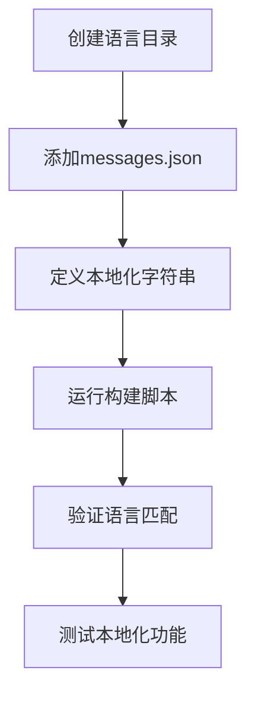
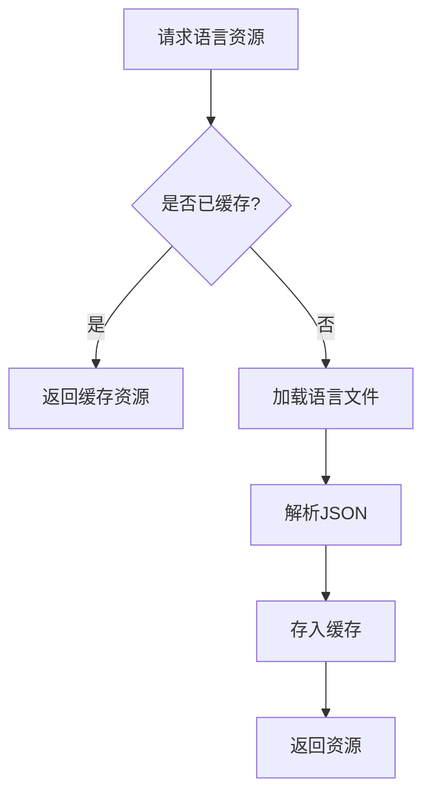

# 多语言实现

<cite>
**本文档中引用的文件**  
- [_locales\en\messages.json](file://_locales/en/messages.json)
- [_locales\zh-CN\messages.json](file://_locales/zh-CN/messages.json)
- [app\locale.node.ts](file://app/locale.node.ts)
- [ts\context\i18n.preload.ts](file://ts/context/i18n.preload.ts)
- [ts\scripts\build-localized-display-names.node.ts](file://ts/scripts/build-localized-display-names.node.ts)
- [ts\scripts\gen-locales-config.node.ts](file://ts/scripts/gen-locales-config.node.ts)
- [build\available-locales.json](file://build/available-locales.json)
</cite>

## 目录
1. [简介](#简介)
2. [多语言文件结构](#多语言文件结构)
3. [国际化上下文实现](#国际化上下文实现)
4. [本地化显示名称生成](#本地化显示名称生成)
5. [添加新语言](#添加新语言)
6. [实际应用示例](#实际应用示例)
7. [性能优化策略](#性能优化策略)
8. [结论](#结论)

## 简介
Signal-Desktop实现了全面的多语言支持，覆盖超过100种语言。该系统基于_locales目录的JSON消息文件，通过i18n.preload.ts实现国际化上下文，支持语言加载、字符串解析和动态语言切换功能。构建脚本build-localized-display-names.node.ts负责生成本地化显示名称。系统采用智能的性能优化策略，包括语言包的懒加载和缓存机制。

## 多语言文件结构
Signal-Desktop的多语言实现基于_locales目录，该目录包含100多种语言的本地化文件。每种语言都有一个独立的子目录，目录名称遵循标准的区域设置格式（如en、zh-CN、fr等）。

每个语言目录包含一个messages.json文件，该文件定义了该语言的所有本地化字符串。文件结构采用ICU（International Components for Unicode）消息格式，支持复杂的语言特性，如复数形式、选择性文本和占位符。

```mermaid
graph TD
A[_locales] --> B[af-ZA]
A --> C[ar]
A --> D[az-AZ]
A --> E[bg-BG]
A --> F[bn-BD]
A --> G[bs-BA]
A --> H[ca]
A --> I[cs]
A --> J[da]
A --> K[de]
A --> L[el]
A --> M[en]
A --> N[es]
A --> O[et-EE]
A --> P[eu]
A --> Q[fa-IR]
A --> R[fi]
A --> S[fr]
A --> T[ga-IE]
A --> U[gl-ES]
A --> V[gu-IN]
A --> W[he]
A --> X[hi-IN]
A --> Y[hr-HR]
A --> Z[hu]
B --> BA[messages.json]
C --> CA[messages.json]
D --> DA[messages.json]
E --> EA[messages.json]
F --> FA[messages.json]
G --> GA[messages.json]
H --> HA[messages.json]
I --> IA[messages.json]
J --> JA[messages.json]
K --> KA[messages.json]
L --> LA[messages.json]
M --> MA[messages.json]
N --> NA[messages.json]
O --> OA[messages.json]
P --> PA[messages.json]
Q --> QA[messages.json]
R --> RA[messages.json]
S --> SA[messages.json]
T --> TA[messages.json]
U --> UA[messages.json]
V --> VA[messages.json]
W --> WA[messages.json]
W --> XA[messages.json]
Y --> YA[messages.json]
Z --> ZA[messages.json]
```



**图源**  
- [app\locale.node.ts](file://app/locale.node.ts#L30-L34)

**本节源码**  
- [app\locale.node.ts](file://app/locale.node.ts#L30-L34)
- [_locales\en\messages.json](file://_locales/en/messages.json)
- [_locales\zh-CN\messages.json](file://_locales/zh-CN/messages.json)

## 国际化上下文实现
Signal-Desktop的国际化上下文主要通过i18n.preload.ts和locale.node.ts文件实现。系统使用@formatjs/intl-localematcher库进行语言匹配，确保用户界面显示最合适的语言版本。

在应用启动时，系统会根据用户的系统语言偏好和可用语言列表，通过最佳匹配算法确定最终使用的语言。load函数负责加载语言资源，首先尝试加载打包版本的紧凑语言包，如果不可用则加载完整的JSON文件。



**图源**  
- [app\locale.node.ts](file://app/locale.node.ts#L148-L159)
- [ts\context\i18n.preload.ts](file://ts/context/i18n.preload.ts#L19)

**本节源码**  
- [app\locale.node.ts](file://app/locale.node.ts#L125-L218)
- [ts\context\i18n.preload.ts](file://ts/context/i18n.preload.ts#L1-22)

## 本地化显示名称生成
本地化显示名称的生成由build-localized-display-names.node.ts脚本负责。该脚本从CSV源文件读取数据，将其转换为JSON格式，并验证所有语言和国家/地区都有对应的显示名称。

脚本支持两种类型的显示名称生成：语言名称和国家/地区名称。对于语言名称，数据按语言代码组织；对于国家/地区名称，数据采用转置矩阵形式组织，便于按国家/地区查找。



**图源**  
- [ts\scripts\build-localized-display-names.node.ts](file://ts/scripts/build-localized-display-names.node.ts#L120-L131)

**本节源码**  
- [ts\scripts\build-localized-display-names.node.ts](file://ts/scripts/build-localized-display-names.node.ts#L1-138)

## 添加新语言
添加新语言需要遵循特定的步骤和文件结构。首先，需要在_locales目录下创建新的语言子目录，目录名称必须符合标准的区域设置格式。

然后，需要在messages.json文件中定义所有必要的本地化字符串。系统会自动从build\available-locales.json文件中获取可用语言列表，该文件由gen-locales-config.node.ts脚本生成。



**图源**  
- [ts\scripts\gen-locales-config.node.ts](file://ts/scripts/gen-locales-config.node.ts#L54)
- [build\available-locales.json](file://build/available-locales.json)

**本节源码**  
- [ts\scripts\gen-locales-config.node.ts](file://ts/scripts/gen-locales-config.node.ts#L1-63)
- [build\available-locales.json](file://build/available-locales.json)

## 实际应用示例
在实际应用中，多语言系统被广泛用于界面标签本地化、错误消息翻译和动态内容生成。例如，在zh-CN/messages.json文件中，"icu:AddUserToAnotherGroupModal__title"键对应的值为"添加至群组"，而在en/messages.json中则为"Add to a group"。

系统支持复杂的ICU消息格式，如复数形式处理：
```json
"icu:GroupListItem__message-default": {
  "messageformat": "{count, plural, one {# member} other {# members}}"
}
```

这种格式允许根据count的值自动选择合适的文本形式，确保语言的自然流畅。

**本节源码**  
- [_locales\en\messages.json](file://_locales/en/messages.json#L54-L57)
- [_locales\zh-CN\messages.json](file://_locales/zh-CN/messages.json#L29-L31)

## 性能优化策略
Signal-Desktop采用多种性能优化策略来提高多语言系统的效率。在打包版本中，系统使用紧凑的语言包格式，将键和值分离存储，减少文件大小。

系统实现了语言包的懒加载机制，只在需要时才加载特定语言资源。同时，已加载的语言资源会被缓存，避免重复加载和解析，提高应用性能。



**图源**  
- [app\locale.node.ts](file://app/locale.node.ts#L167-L197)

**本节源码**  
- [app\locale.node.ts](file://app/locale.node.ts#L167-L197)

## 结论
Signal-Desktop的多语言实现是一个完整、高效且易于扩展的系统。通过基于_locales目录的JSON消息文件结构，系统支持100多种语言的本地化。i18n.preload.ts中的国际化上下文实现确保了语言加载、字符串解析和动态语言切换的流畅性。构建脚本build-localized-display-names.node.ts自动化了本地化显示名称的生成过程。系统还采用了懒加载和缓存等性能优化策略，确保多语言支持不会影响应用性能。