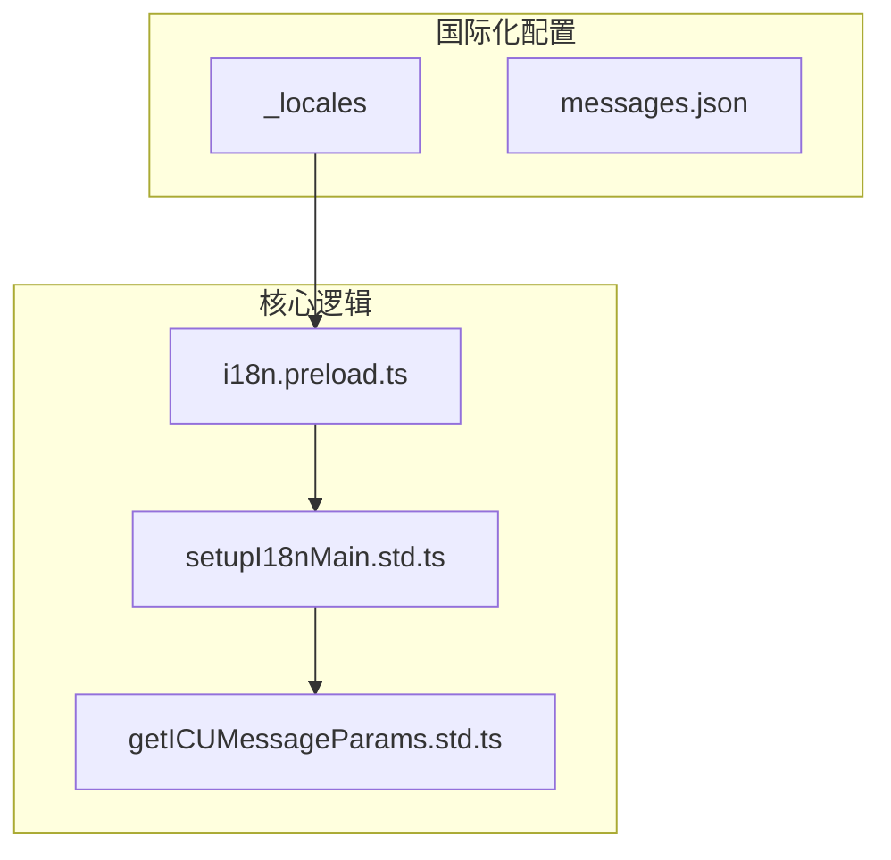
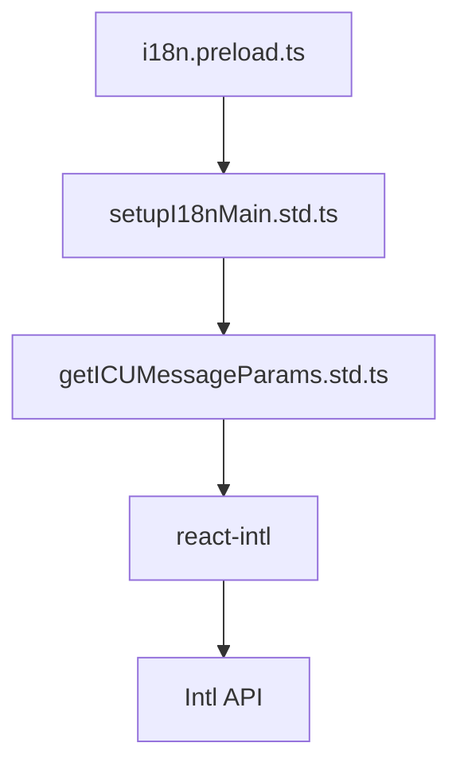
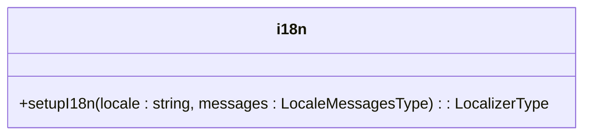
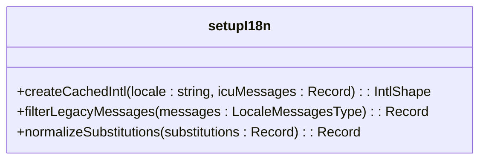
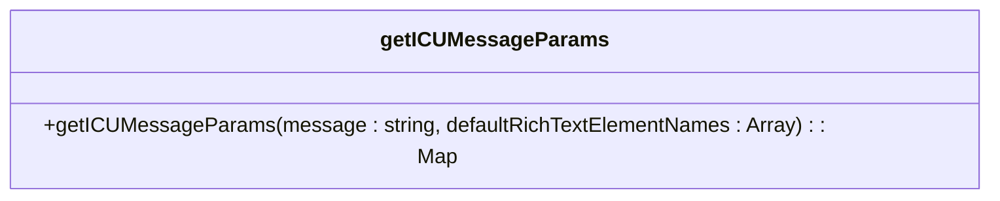

# ICU格式支持

<cite>
**本文档中引用的文件**  
- [i18n.preload.ts](file://ts/context/i18n.preload.ts)
- [getICUMessageParams.std.ts](file://ts/util/getICUMessageParams.std.ts)
- [setupI18nMain.std.ts](file://ts/util/setupI18nMain.std.ts)
- [messages.json](file://_locales/en/messages.json)
</cite>

## 目录
1. [简介](#简介)
2. [项目结构](#项目结构)
3. [核心组件](#核心组件)
4. [架构概述](#架构概述)
5. [详细组件分析](#详细组件分析)
6. [依赖分析](#依赖分析)
7. [性能考虑](#性能考虑)
8. [故障排除指南](#故障排除指南)
9. [结论](#结论)

## 简介
Signal-Desktop 使用 ICU（国际组件 for Unicode）消息格式来实现多语言支持。该系统允许开发者使用选择格式（select）、数量格式（plural）和日期/时间格式等高级功能，以提供自然语言级别的文本变体控制。本文档详细阐述了 `i18n.preload.ts` 文件中对 ICU 消息格式的实现，包括嵌套表达式的解析、条件逻辑处理以及与 JavaScript 的 Intl API 集成。

## 项目结构
Signal-Desktop 的国际化支持主要集中在 `_locales` 目录下的 `messages.json` 文件中，这些文件包含了不同语言的翻译内容。核心的国际化逻辑位于 `ts/context/i18n.preload.ts` 和 `ts/util/setupI18nMain.std.ts` 中，而具体的 ICU 消息参数解析则由 `ts/util/getICUMessageParams.std.ts` 提供。



**图表来源**  
- [i18n.preload.ts](file://ts/context/i18n.preload.ts)
- [setupI18nMain.std.ts](file://ts/util/setupI18nMain.std.ts)
- [getICUMessageParams.std.ts](file://ts/util/getICUMessageParams.std.ts)

**章节来源**  
- [i18n.preload.ts](file://ts/context/i18n.preload.ts)
- [setupI18nMain.std.ts](file://ts/util/setupI18nMain.std.ts)

## 核心组件
Signal-Desktop 的 ICU 支持依赖于以下几个核心组件：
- `i18n.preload.ts`：初始化并导出 `i18n` 实例，用于在应用中进行国际化。
- `setupI18nMain.std.ts`：提供 `setupI18n` 函数，用于创建和配置 `IntlShape` 实例。
- `getICUMessageParams.std.ts`：解析 ICU 消息字符串，提取参数类型和选项。

**章节来源**  
- [i18n.preload.ts](file://ts/context/i18n.preload.ts)
- [setupI18nMain.std.ts](file://ts/util/setupI18nMain.std.ts)
- [getICUMessageParams.std.ts](file://ts/util/getICUMessageParams.std.ts)

## 架构概述
Signal-Desktop 的 ICU 支持架构如下图所示，展示了各个组件之间的交互关系。



**图表来源**  
- [i18n.preload.ts](file://ts/context/i18n.preload.ts)
- [setupI18nMain.std.ts](file://ts/util/setupI18nMain.std.ts)
- [getICUMessageParams.std.ts](file://ts/util/getICUMessageParams.std.ts)

## 详细组件分析

### i18n.preload.ts 分析
`i18n.preload.ts` 文件负责初始化 `i18n` 实例，并将其导出供其他模块使用。它通过调用 `setupI18n` 函数来完成这一任务。



**图表来源**  
- [i18n.preload.ts](file://ts/context/i18n.preload.ts)

**章节来源**  
- [i18n.preload.ts](file://ts/context/i18n.preload.ts)

### setupI18nMain.std.ts 分析
`setupI18nMain.std.ts` 文件提供了 `setupI18n` 函数，该函数创建并配置 `IntlShape` 实例。它还处理了消息的过滤和标准化。



**图表来源**  
- [setupI18nMain.std.ts](file://ts/util/setupI18nMain.std.ts)

**章节来源**  
- [setupI18nMain.std.ts](file://ts/util/setupI18nMain.std.ts)

### getICUMessageParams.std.ts 分析
`getICUMessageParams.std.ts` 文件提供了 `getICUMessageParams` 函数，该函数解析 ICU 消息字符串，提取参数类型和选项。它支持选择格式（select）、数量格式（plural）和日期/时间格式。



**图表来源**  
- [getICUMessageParams.std.ts](file://ts/util/getICUMessageParams.std.ts)

**章节来源**  
- [getICUMessageParams.std.ts](file://ts/util/getICUMessageParams.std.ts)

## 依赖分析
Signal-Desktop 的 ICU 支持依赖于 `react-intl` 库，该库提供了 `IntlShape` 接口和 `createIntl` 函数。此外，`@formatjs/icu-messageformat-parser` 库用于解析 ICU 消息字符串。

```mermaid
graph TD
A[Signal-Desktop] --> B[react-intl]
A --> C[@formatjs/icu-messageformat-parser]
B --> D[Intl API]
```

**图表来源**  
- [setupI18nMain.std.ts](file://ts/util/setupI18nMain.std.ts)
- [getICUMessageParams.std.ts](file://ts/util/getICUMessageParams.std.ts)

**章节来源**  
- [setupI18nMain.std.ts](file://ts/util/setupI18nMain.std.ts)
- [getICUMessageParams.std.ts](file://ts/util/getICUMessageParams.std.ts)

## 性能考虑
ICU 消息格式的解析和渲染可能会对性能产生影响，特别是在处理大量消息或复杂表达式时。为了优化性能，可以采取以下措施：
- 缓存已解析的消息格式。
- 使用 `createIntlCache` 来缓存 `IntlShape` 实例。
- 避免在运行时频繁调用 `getICUMessageParams` 函数。

**章节来源**  
- [setupI18nMain.std.ts](file://ts/util/setupI18nMain.std.ts)
- [getICUMessageParams.std.ts](file://ts/util/getICUMessageParams.std.ts)

## 故障排除指南
在使用 ICU 消息格式时，可能会遇到以下常见问题：
- **缺少翻译**：确保所有消息键都在 `messages.json` 文件中定义。
- **解析错误**：检查 ICU 消息字符串是否符合规范。
- **性能问题**：使用缓存机制来减少重复解析。

**章节来源**  
- [setupI18nMain.std.ts](file://ts/util/setupI18nMain.std.ts)
- [getICUMessageParams.std.ts](file://ts/util/getICUMessageParams.std.ts)

## 结论
Signal-Desktop 通过 `i18n.preload.ts`、`setupI18nMain.std.ts` 和 `getICUMessageParams.std.ts` 文件实现了对 ICU 消息格式的全面支持。这些组件共同工作，提供了选择格式、数量格式和日期/时间格式等高级功能，使应用能够提供自然语言级别的文本变体控制。通过合理使用缓存和优化策略，可以有效提升性能。