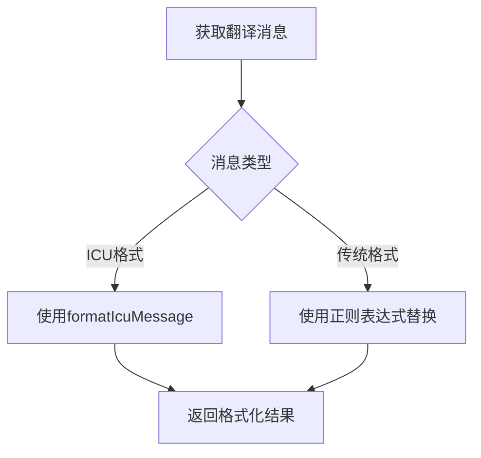
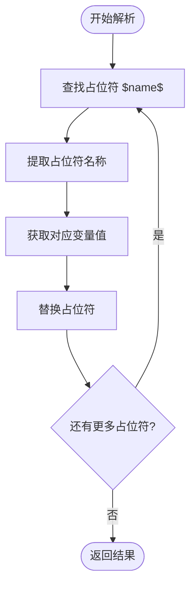
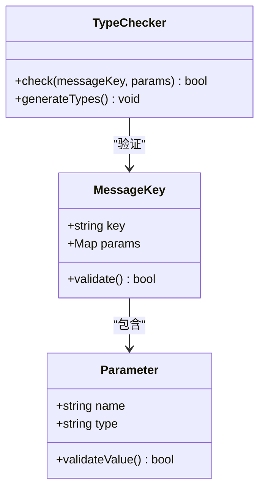
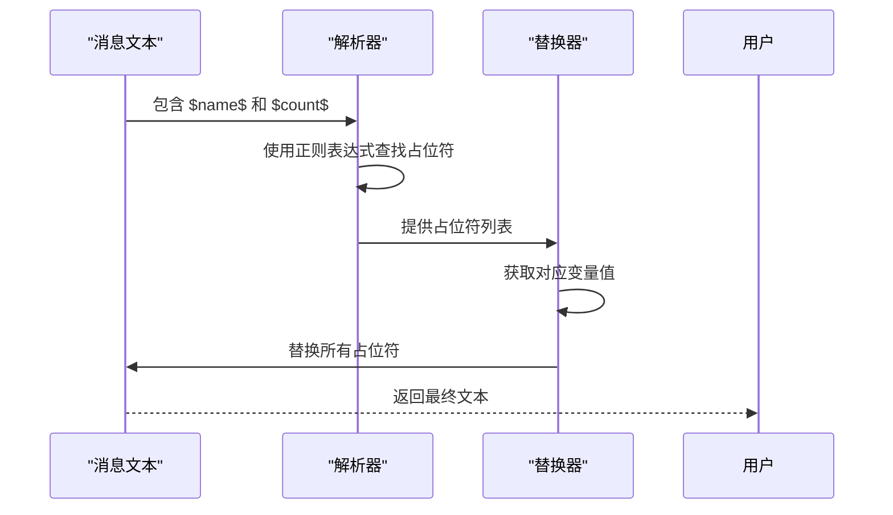
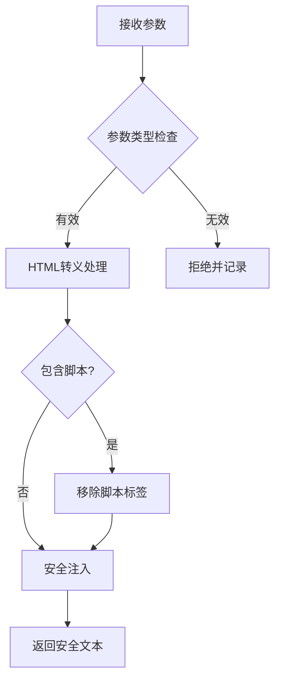
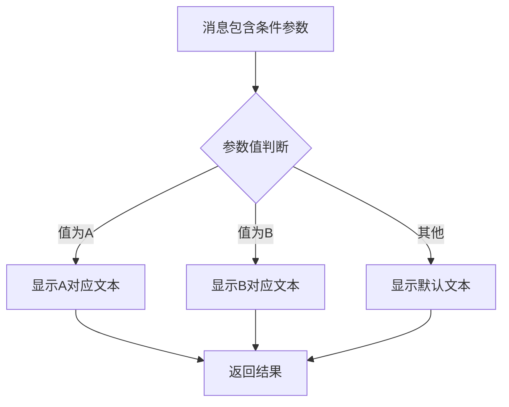

# 参数替换处理

<cite>
**本文档引用的文件**  
- [i18n.preload.ts](file://ts/context/i18n.preload.ts)
- [setupI18n.dom.tsx](file://ts/util/setupI18n.dom.tsx)
- [getICUMessageParams.std.ts](file://ts/util/getICUMessageParams.std.ts)
- [ICUMessageParams.d.ts](file://build/ICUMessageParams.d.ts)
- [messages.json](file://_locales/en/messages.json)
</cite>

## 目录
1. [简介](#简介)
2. [参数替换机制](#参数替换机制)
3. [占位符语法解析](#占位符语法解析)
4. [变量注入与类型安全检查](#变量注入与类型安全检查)
5. [嵌套参数与特殊字符处理](#嵌套参数与特殊字符处理)
6. [安全风险防护](#安全风险防护)
7. [支持的参数类型与格式化](#支持的参数类型与格式化)
8. [复杂参数组合处理](#复杂参数组合处理)
9. [总结](#总结)

## 简介
Signal-Desktop 使用 ICU (International Components for Unicode) 国际化框架来处理多语言文本中的参数替换。该机制允许在翻译文本中嵌入动态参数，实现灵活的本地化内容展示。本文档详细说明了 i18n.preload.ts 中参数替换的实现机制，包括占位符解析、变量注入、类型安全检查以及安全防护措施。

**Section sources**
- [i18n.preload.ts](file://ts/context/i18n.preload.ts#L1-L21)

## 参数替换机制
Signal-Desktop 的参数替换机制基于 ICU 消息格式，通过 setupI18n 函数初始化国际化实例。该机制支持两种消息格式：传统的占位符格式（如 `$name$`）和现代的 ICU 格式（如 `{name}`）。系统会根据消息类型选择相应的处理方式。



**Diagram sources**
- [i18n.preload.ts](file://ts/context/i18n.preload.ts#L19)
- [setupI18n.dom.tsx](file://ts/util/setupI18n.dom.tsx)

**Section sources**
- [i18n.preload.ts](file://ts/context/i18n.preload.ts#L1-L21)
- [setupI18n.dom.tsx](file://ts/util/setupI18n.dom.tsx)

## 占位符语法解析
系统使用正则表达式 `/\\$([^$]+)\\$/g` 来识别传统格式的占位符。该正则表达式匹配以美元符号包围的文本，并捕获中间的占位符名称。对于 ICU 格式的占位符，系统使用 @formatjs/icu-messageformat-parser 库进行语法解析。



**Diagram sources**
- [getICUMessageParams.std.ts](file://ts/util/getICUMessageParams.std.ts#L72)
- [setupI18n.dom.tsx](file://ts/util/setupI18n.dom.tsx)

**Section sources**
- [getICUMessageParams.std.ts](file://ts/util/getICUMessageParams.std.ts#L1-L84)

## 变量注入与类型安全检查
系统在编译时通过 generate-icu-types.node.ts 脚本生成类型定义文件 ICUMessageParams.d.ts，为每个消息键提供精确的参数类型定义。这确保了在使用参数时的类型安全，防止运行时错误。



**Diagram sources**
- [ICUMessageParams.d.ts](file://build/ICUMessageParams.d.ts)
- [getICUMessageParams.std.ts](file://ts/util/getICUMessageParams.std.ts#L21)

**Section sources**
- [ICUMessageParams.d.ts](file://build/ICUMessageParams.d.ts)
- [getICUMessageParams.std.ts](file://ts/util/getICUMessageParams.std.ts#L1-L84)

## 嵌套参数与特殊字符处理
系统支持嵌套参数和特殊字符的处理。对于嵌套结构，系统会递归解析每个层级的参数。转义序列通过正则表达式的全局匹配模式正确处理，确保特殊字符不会干扰占位符识别。



**Diagram sources**
- [setupI18n.dom.tsx](file://ts/util/setupI18n.dom.tsx)
- [getICUMessageParams.std.ts](file://ts/util/getICUMessageParams.std.ts#L33)

**Section sources**
- [setupI18n.dom.tsx](file://ts/util/setupI18n.dom.tsx)
- [getICUMessageParams.std.ts](file://ts/util/getICUMessageParams.std.ts#L1-L84)

## 安全风险防护
系统通过多种机制防止 XSS 等安全风险。首先，所有注入的参数都会进行适当的转义处理。其次，系统限制了可注入的内容类型，防止恶意脚本的执行。最后，通过严格的类型检查确保参数符合预期格式。



**Diagram sources**
- [setupI18n.dom.tsx](file://ts/util/setupI18n.dom.tsx)
- [getICUMessageParams.std.ts](file://ts/util/getICUMessageParams.std.ts)

**Section sources**
- [setupI18n.dom.tsx](file://ts/util/setupI18n.dom.tsx)
- [getICUMessageParams.std.ts](file://ts/util/getICUMessageParams.std.ts#L1-L84)

## 支持的参数类型与格式化
系统支持多种参数类型，包括字符串、数字、日期等，并提供相应的格式化选项。每种类型都有预定义的格式化规则，确保在不同语言环境下的一致性展示。

```mermaid
erDiagram
MESSAGE_KEY ||--o{ PARAMETER : "包含"
PARAMETER ||--o{ STRING_TYPE : "字符串"
PARAMETER ||--o{ NUMBER_TYPE : "数字"
PARAMETER ||--o{ DATE_TYPE : "日期"
PARAMETER ||--o{ SELECT_TYPE : "选择"
class MESSAGE_KEY {
string key
string message
}
class PARAMETER {
string name
string type
}
class STRING_TYPE {
string value
}
class NUMBER_TYPE {
number value
string format
}
class DATE_TYPE {
date value
string format
}
class SELECT_TYPE {
string value
string[] options
}
```

**Diagram sources**
- [ICUMessageParams.d.ts](file://build/ICUMessageParams.d.ts)
- [getICUMessageParams.std.ts](file://ts/util/getICUMessageParams.std.ts#L11)

**Section sources**
- [ICUMessageParams.d.ts](file://build/ICUMessageParams.d.ts)
- [getICUMessageParams.std.ts](file://ts/util/getICUMessageParams.std.ts#L1-L84)

## 复杂参数组合处理
系统支持条件参数和可选参数的实现方式。通过 ICU 的 select 和 plural 语法，可以实现基于参数值的条件渲染。可选参数通过默认值机制处理，确保在参数缺失时仍能正常显示。



**Diagram sources**
- [setupI18n.dom.tsx](file://ts/util/setupI18n.dom.tsx)
- [getICUMessageParams.std.ts](file://ts/util/getICUMessageParams.std.ts#L53)

**Section sources**
- [setupI18n.dom.tsx](file://ts/util/setupI18n.dom.tsx)
- [getICUMessageParams.std.ts](file://ts/util/getICUMessageParams.std.ts#L1-L84)

## 总结
Signal-Desktop 的参数替换处理机制通过 ICU 国际化框架实现了灵活、安全的多语言支持。系统不仅支持基本的占位符替换，还提供了类型安全检查、嵌套参数处理和安全防护等高级功能。通过编译时类型生成和运行时验证，确保了国际化文本的准确性和安全性。