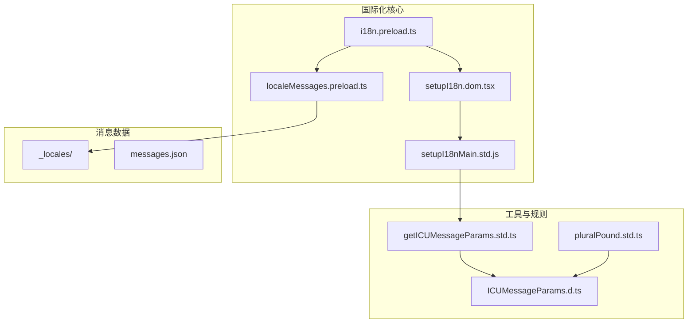
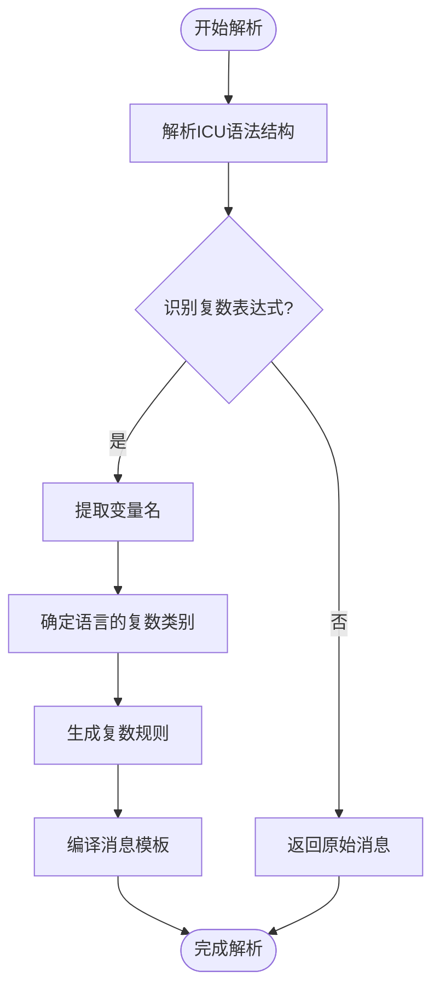
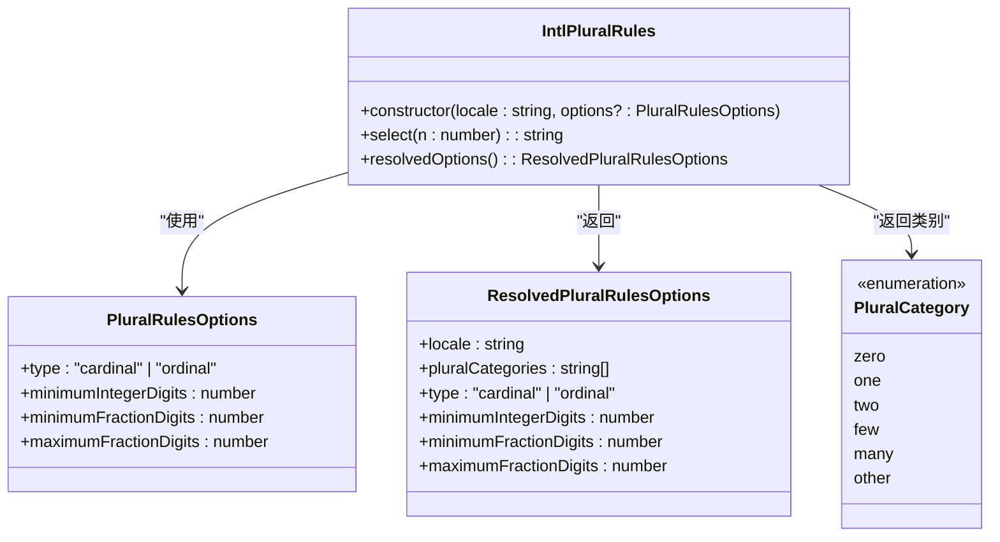
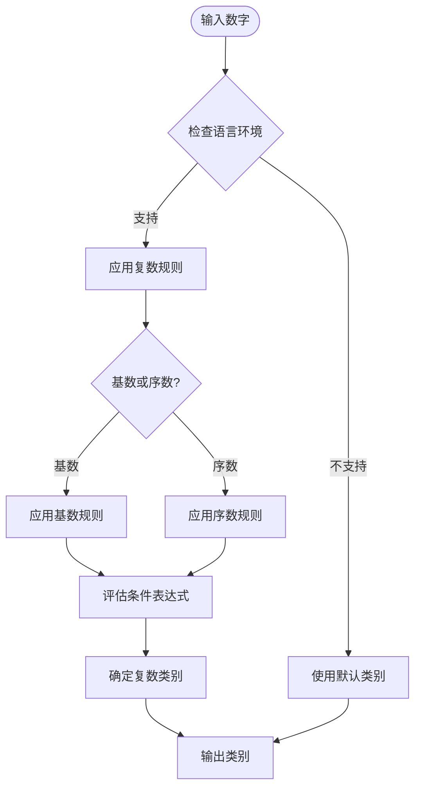
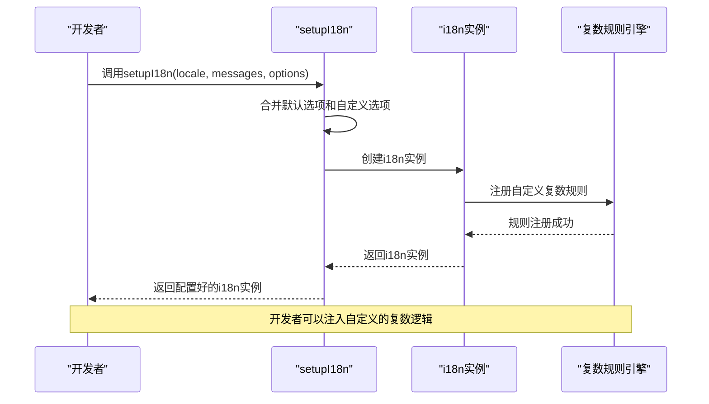
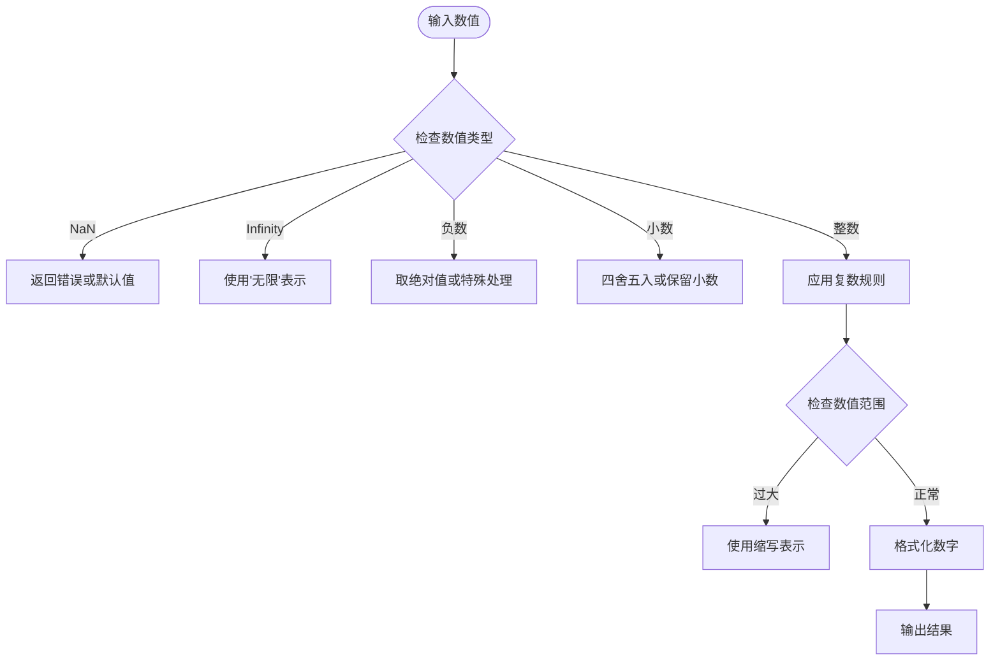
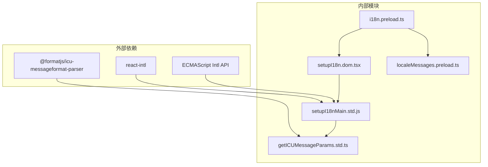

# 复数形式处理

<cite>
**本文档中引用的文件**  
- [i18n.preload.ts](file://ts/context/i18n.preload.ts)
- [setupI18n.dom.tsx](file://ts/util/setupI18n.dom.tsx)
- [setupI18nMain.std.js](file://ts/util/setupI18nMain.std.js)
- [localeMessages.preload.ts](file://ts/context/localeMessages.preload.ts)
- [pluralPound.std.ts](file://build/intl-linter/rules/pluralPound.std.ts)
- [ICUMessageParams.d.ts](file://build/ICUMessageParams.d.ts)
- [sticker-creator/src/util/i18n.ts](file://sticker-creator/src/util/i18n.ts)
- [getICUMessageParams.std.ts](file://ts/util/getICUMessageParams.std.ts)
</cite>

## 目录
1. [简介](#简介)
2. [项目结构与国际化框架](#项目结构与国际化框架)
3. [核心组件分析](#核心组件分析)
4. [复数规则实现机制](#复数规则实现机制)
5. [ICU复数格式解析](#icu复数格式解析)
6. [语言特定的复数规则应用](#语言特定的复数规则应用)
7. [数字分类算法](#数字分类算法)
8. [自定义复数逻辑实现](#自定义复数逻辑实现)
9. [多语言环境下的复数消息处理](#多语言环境下的复数消息处理)
10. [边界情况与极端数值处理](#边界情况与极端数值处理)
11. [依赖关系分析](#依赖关系分析)
12. [故障排除指南](#故障排除指南)

## 简介
Signal-Desktop 应用程序通过国际化的支持实现了对多种语言的全面适配，其中复数形式的处理是确保用户界面在不同语言环境下正确显示的关键机制。本文档深入解析 Signal-Desktop 中复数形式处理的实现，重点分析 `i18n.preload.ts` 文件中复数规则的实现机制，包括 ICU（International Components for Unicode）复数格式的解析、语言特定的复数规则应用以及数字分类算法。文档还将探讨如何处理不同语言的复数类别（如英语的单数/复数与俄语的复杂复数规则），以及如何实现自定义复数逻辑。通过代码示例展示在多种语言环境下复数消息的正确解析，包括边界情况和极端数值的处理策略。

## 项目结构与国际化框架
Signal-Desktop 的国际化框架主要集中在 `ts/context` 和 `ts/util` 目录下，通过一系列预加载（preload）文件和工具函数实现多语言支持。核心的国际化功能由 `i18n.preload.ts` 文件提供，该文件通过 `setupI18n` 函数初始化国际化实例，并结合 `localeMessages.preload.ts` 提供的本地化消息数据，实现对不同语言的支持。



**图示来源**  
- [i18n.preload.ts](file://ts/context/i18n.preload.ts)
- [setupI18n.dom.tsx](file://ts/util/setupI18n.dom.tsx)
- [setupI18nMain.std.js](file://ts/util/setupI18nMain.std.js)
- [localeMessages.preload.ts](file://ts/context/localeMessages.preload.ts)
- [getICUMessageParams.std.ts](file://ts/util/getICUMessageParams.std.ts)
- [ICUMessageParams.d.ts](file://build/ICUMessageParams.d.ts)

**本节来源**  
- [i18n.preload.ts](file://ts/context/i18n.preload.ts)
- [setupI18n.dom.tsx](file://ts/util/setupI18n.dom.tsx)
- [localeMessages.preload.ts](file://ts/context/localeMessages.preload.ts)

## 核心组件分析
Signal-Desktop 的复数形式处理依赖于多个核心组件的协同工作。`i18n.preload.ts` 是国际化功能的入口点，负责初始化 `i18n` 实例。`setupI18n.dom.tsx` 提供了创建和配置国际化实例的函数，而 `setupI18nMain.std.js` 则包含了实际的国际化逻辑。`localeMessages.preload.ts` 负责从 Electron 的 IPC 通道获取本地化消息数据。

**本节来源**  
- [i18n.preload.ts](file://ts/context/i18n.preload.ts#L1-L22)
- [setupI18n.dom.tsx](file://ts/util/setupI18n.dom.tsx#L1-L59)
- [setupI18nMain.std.js](file://ts/util/setupI18nMain.std.js)
- [localeMessages.preload.ts](file://ts/context/localeMessages.preload.ts#L1-L11)

## 复数规则实现机制
Signal-Desktop 使用 ICU 消息格式来处理复数形式，这种格式允许开发者为不同的数字类别定义不同的消息。ICU 复数规则基于 Unicode Common Locale Data Repository (CLDR) 定义的语言特定规则，能够准确地处理各种语言的复数形式。

### ICU 复数类别
ICU 定义了以下复数类别：
- **zero**: 表示零的数量
- **one**: 表示单数（1）
- **two**: 表示双数（2）
- **few**: 表示少量
- **many**: 表示大量
- **other**: 其他情况（默认）

不同语言使用不同的类别组合。例如：
- 英语：`one` 和 `other`
- 俄语：`one`、`few`、`many` 和 `other`
- 阿拉伯语：`zero`、`one`、`two`、`few`、`many` 和 `other`

## ICU复数格式解析
ICU 复数格式使用 `{variable, plural, ...}` 语法来定义复数消息。Signal-Desktop 通过 `@formatjs/icu-messageformat-parser` 库解析这些格式。



**图示来源**  
- [getICUMessageParams.std.ts](file://ts/util/getICUMessageParams.std.ts#L1-L46)
- [ICUMessageParams.d.ts](file://build/ICUMessageParams.d.ts)

**本节来源**  
- [getICUMessageParams.std.ts](file://ts/util/getICUMessageParams.std.ts#L1-L46)

## 语言特定的复数规则应用
Signal-Desktop 通过 `Intl.PluralRules` API 应用语言特定的复数规则。`Intl.PluralRules` 是 ECMAScript 国际化 API 的一部分，能够根据指定的语言环境返回正确的复数类别。



**图示来源**  
- [sticker-creator/src/util/i18n.ts](file://sticker-creator/src/util/i18n.ts#L26-L28)
- [setupI18nMain.std.js](file://ts/util/setupI18nMain.std.js)

**本节来源**  
- [sticker-creator/src/util/i18n.ts](file://sticker-creator/src/util/i18n.ts#L26-L28)

## 数字分类算法
Signal-Desktop 的数字分类算法基于 `Intl.PluralRules` 的实现，该算法根据语言环境和数字值确定正确的复数类别。算法考虑了语言的复数规则、数字的基数或序数性质以及其他格式化选项。



**图示来源**  
- [setupI18nMain.std.js](file://ts/util/setupI18nMain.std.js)
- [getICUMessageParams.std.ts](file://ts/util/getICUMessageParams.std.ts)

**本节来源**  
- [setupI18nMain.std.js](file://ts/util/setupI18nMain.std.js)
- [getICUMessageParams.std.ts](file://ts/util/getICUMessageParams.std.ts)

## 自定义复数逻辑实现
Signal-Desktop 允许通过自定义逻辑扩展复数处理功能。开发者可以通过 `setupI18n` 函数的选项参数注入自定义的格式化函数和规则。



**图示来源**  
- [setupI18n.dom.tsx](file://ts/util/setupI18n.dom.tsx#L44-L58)
- [setupI18nMain.std.js](file://ts/util/setupI18nMain.std.js)

**本节来源**  
- [setupI18n.dom.tsx](file://ts/util/setupI18n.dom.tsx#L44-L58)

## 多语言环境下的复数消息处理
Signal-Desktop 支持多种语言的复数消息处理，每种语言都有其特定的复数规则。以下是一些主要语言的复数规则示例：

### 英语（en）
英语使用简单的二元复数系统：
```icu
{count, plural, one {1 message} other {# messages}}
```

### 俄语（ru）
俄语使用复杂的三元复数系统：
```icu
{count, plural, one {# сообщение} few {# сообщения} many {# сообщений} other {# сообщения}}
```

### 阿拉伯语（ar）
阿拉伯语使用六元复数系统：
```icu
{count, plural, zero {صفر رسائل} one {رسالة واحدة} two {رسالتان} few {# رسائل} many {# رسالة} other {# رسالة}}
```

### 日语（ja）
日语通常不区分复数，使用单一形式：
```icu
{count} メッセージ
```

## 边界情况与极端数值处理
Signal-Desktop 的复数处理机制需要考虑各种边界情况和极端数值，以确保在所有情况下都能正确显示消息。

### 边界情况
- **零值处理**: 某些语言（如阿拉伯语）有专门的 "zero" 类别
- **小数处理**: 复数规则通常只适用于整数，小数需要特殊处理
- **负数处理**: 负数通常被视为 "other" 类别
- **大数处理**: 非常大的数字可能需要使用科学记数法或缩写

### 极端数值处理策略


**图示来源**  
- [setupI18nMain.std.js](file://ts/util/setupI18nMain.std.js)
- [getICUMessageParams.std.ts](file://ts/util/getICUMessageParams.std.ts)

**本节来源**  
- [setupI18nMain.std.js](file://ts/util/setupI18nMain.std.js)
- [getICUMessageParams.std.ts](file://ts/util/getICUMessageParams.std.ts)

## 依赖关系分析
Signal-Desktop 的复数形式处理依赖于多个外部库和内部模块的协同工作。



**图示来源**  
- [i18n.preload.ts](file://ts/context/i18n.preload.ts)
- [setupI18n.dom.tsx](file://ts/util/setupI18n.dom.tsx)
- [setupI18nMain.std.js](file://ts/util/setupI18nMain.std.js)
- [localeMessages.preload.ts](file://ts/context/localeMessages.preload.ts)
- [getICUMessageParams.std.ts](file://ts/util/getICUMessageParams.std.ts)

**本节来源**  
- [i18n.preload.ts](file://ts/context/i18n.preload.ts)
- [setupI18n.dom.tsx](file://ts/util/setupI18n.dom.tsx)
- [setupI18nMain.std.js](file://ts/util/setupI18nMain.std.js)

## 故障排除指南
在使用 Signal-Desktop 的复数形式处理功能时，可能会遇到一些常见问题。以下是故障排除指南：

### 常见问题
1. **复数消息未正确显示**
   - 检查语言环境是否正确设置
   - 验证消息格式是否符合 ICU 规范
   - 确认本地化消息文件中包含正确的复数规则

2. **数字格式化错误**
   - 检查数字类型是否正确（整数 vs 小数）
   - 验证语言环境的数字格式化规则
   - 确认是否需要特殊处理边界情况

3. **性能问题**
   - 避免在循环中频繁调用复数格式化函数
   - 考虑缓存常用的复数规则实例
   - 使用 `memoize` 函数优化重复计算

**本节来源**  
- [setupI18nMain.std.js](file://ts/util/setupI18nMain.std.js)
- [getICUMessageParams.std.ts](file://ts/util/getICUMessageParams.std.ts)
- [pluralPound.std.ts](file://build/intl-linter/rules/pluralPound.std.ts)