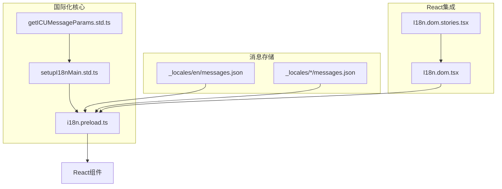
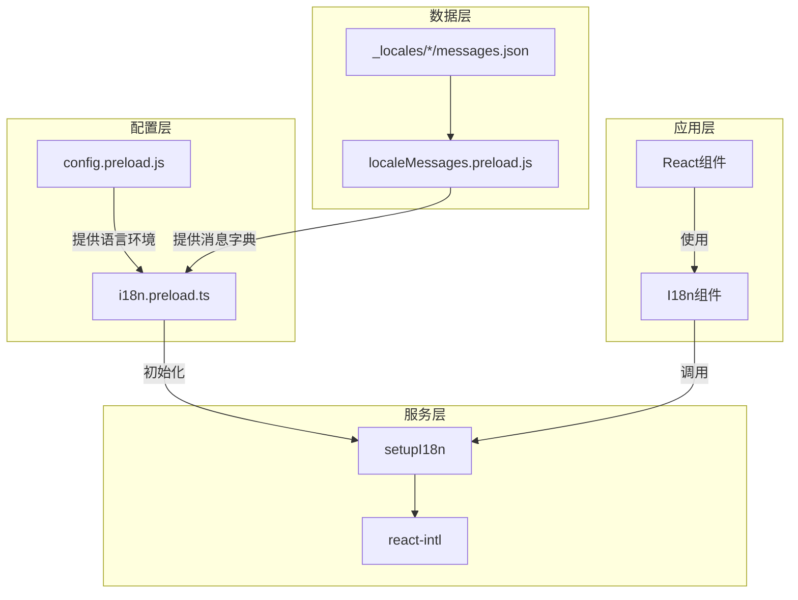
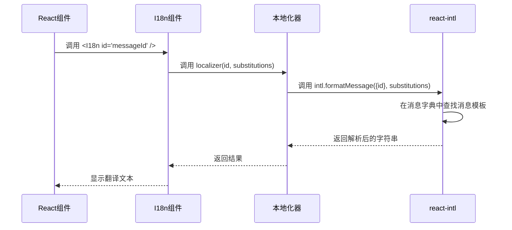
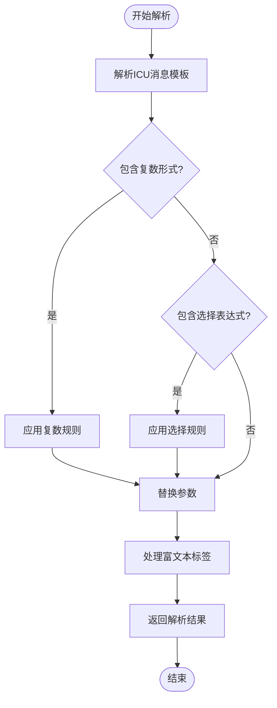

# 字符串解析

<cite>
**本文档中引用的文件**  
- [i18n.preload.ts](file://ts/context/i18n.preload.ts)
- [setupI18n.dom.js](file://ts/util/setupI18n.dom.js)
- [setupI18nMain.std.ts](file://ts/util/setupI18nMain.std.ts)
- [getICUMessageParams.std.ts](file://ts/util/getICUMessageParams.std.ts)
- [messages.json](file://_locales/en/messages.json)
- [I18n.dom.tsx](file://ts/components/I18n.dom.tsx)
- [I18n.dom.stories.tsx](file://ts/components/I18n.dom.stories.tsx)
</cite>

## 目录
1. [简介](#简介)
2. [项目结构](#项目结构)
3. [核心组件](#核心组件)
4. [架构概述](#架构概述)
5. [详细组件分析](#详细组件分析)
6. [依赖分析](#依赖分析)
7. [性能考虑](#性能考虑)
8. [故障排除指南](#故障排除指南)
9. [结论](#结论)

## 简介
Signal-Desktop 使用强大的国际化（i18n）系统来支持多语言界面。该系统基于 ICU（International Components for Unicode）消息格式，提供对复杂语言结构的全面支持，包括参数替换、复数形式、选择性文本和条件表达式。本文件详细说明了 `i18n.preload.ts` 中消息解析器的实现机制，涵盖其架构、功能、性能优化和在 React 组件中的使用方法。

## 项目结构
Signal-Desktop 的国际化系统由多个核心组件构成，这些组件分布在不同的目录中。主要的国际化逻辑位于 `ts/util/` 目录下，而具体的语言消息文件则存储在 `_locales/` 目录中。



**图表来源**  
- [i18n.preload.ts](file://ts/context/i18n.preload.ts#L1-L22)
- [setupI18nMain.std.ts](file://ts/util/setupI18nMain.std.ts#L1-L185)
- [_locales/en/messages.json](file://_locales/en/messages.json#L1-L200)

**章节来源**  
- [i18n.preload.ts](file://ts/context/i18n.preload.ts#L1-L22)
- [setupI18nMain.std.ts](file://ts/util/setupI18nMain.std.ts#L1-L185)

## 核心组件
字符串解析功能的核心是 `setupI18n` 函数，它负责初始化国际化环境并创建一个本地化器（localizer）。该函数接收当前语言环境和消息字典作为输入，并返回一个可调用的函数，用于根据消息ID查找和解析字符串。

**章节来源**  
- [setupI18nMain.std.ts](file://ts/util/setupI18nMain.std.ts#L116-L184)
- [i18n.preload.ts](file://ts/context/i18n.preload.ts#L1-L22)

## 架构概述
Signal-Desktop 的字符串解析系统采用分层架构，从配置加载到消息解析，再到React集成，形成了一个完整的国际化解决方案。



**图表来源**  
- [i18n.preload.ts](file://ts/context/i18n.preload.ts#L4-L21)
- [setupI18nMain.std.ts](file://ts/util/setupI18nMain.std.ts#L116-L184)
- [I18n.dom.tsx](file://ts/components/I18n.dom.tsx#L1-L33)

## 详细组件分析

### 消息解析器分析
消息解析器的核心功能是根据消息ID查找对应的消息模板，并使用提供的参数进行替换。该过程涉及消息ID查找、参数替换和复数形式处理。

#### 消息ID查找机制
系统通过 `setupI18n` 函数创建的本地化器来查找消息。本地化器维护一个消息字典，该字典在应用启动时从 `_locales` 目录加载。



**图表来源**  
- [I18n.dom.tsx](file://ts/components/I18n.dom.tsx#L24-L33)
- [setupI18nMain.std.ts](file://ts/util/setupI18nMain.std.ts#L140-L157)

#### 参数替换与复数形式处理
系统使用 ICU 消息格式来处理复杂的语言结构。消息模板可以包含参数占位符和复数规则。



**图表来源**  
- [getICUMessageParams.std.ts](file://ts/util/getICUMessageParams.std.ts#L21-L84)
- [setupI18nMain.std.ts](file://ts/util/setupI18nMain.std.ts#L74-L100)

### ICU消息格式实现
Signal-Desktop 使用 ICU 消息格式来实现复杂的语言结构支持。这种格式允许开发者定义包含条件逻辑、复数形式和选择性文本的动态消息。

#### 复数形式处理示例
在 `messages.json` 文件中，复数形式通过 `plural` 关键字定义：

```json
"icu:GroupListItem__message-default": {
  "messageformat": "{count, plural, one {# member} other {# members}}",
  "description": "Shown below the group name when selecting a group to invite a contact to"
}
```

当 `count` 为1时，显示"1 member"；当 `count` 为其他值时，显示"# members"。

#### 条件表达式与选择性文本
ICU 格式还支持 `select` 表达式，用于根据变量值选择不同的文本：

```json
"icu:About__AppEnvironment": {
  "messageformat": "{appEnv}",
  "description": "AboutWindow > App Environment Info > On non-apple devices"
},
"icu:About__AppEnvironment--AppleSilicon": {
  "messageformat": "{appEnv} (Apple silicon)",
  "description": "AboutWindow > App Environment Info > On Apple Silicon Devices"
}
```

#### 富文本与JSX支持
系统支持在消息中嵌入富文本标签，这些标签可以被替换为React组件：

```json
"icu:leftTheGroup": {
  "messageformat": "{name} left the group",
  "description": "Shown when a contact leaves a group"
}
```

在React组件中，`name` 可以被替换为一个按钮或其他UI元素。

**章节来源**  
- [_locales/en/messages.json](file://_locales/en/messages.json#L54-L65)
- [I18n.dom.stories.tsx](file://ts/components/I18n.dom.stories.tsx#L1-L88)

## 依赖分析
字符串解析系统依赖于多个外部库和内部模块，形成了一个复杂的依赖网络。

```mermaid
graph LR
A[i18n.preload.ts] --> B[setupI18n.dom.js]
B --> C[react-intl]
C --> D[@formatjs/icu-messageformat-parser]
A --> E[config.preload.js]
A --> F[localeMessages.preload.js]
F --> G[_locales/]
H[I18n.dom.tsx] --> A
H --> C
```

**图表来源**  
- [package.json](file://package.json#L120)
- [i18n.preload.ts](file://ts/context/i18n.preload.ts#L4-L6)
- [setupI18nMain.std.ts](file://ts/util/setupI18nMain.std.ts#L4-L5)

**章节来源**  
- [package.json](file://package.json#L120)
- [pnpm-lock.yaml](file://pnpm-lock.yaml#L80)

## 性能考虑
为了优化字符串解析的性能，Signal-Desktop 实现了多种策略，包括解析结果的缓存和预编译处理。

### 缓存机制
系统使用 `createIntlCache` 来缓存已解析的消息，避免重复解析相同的模板。这在频繁使用相同消息ID的场景下显著提升了性能。

### 预编译处理
虽然当前实现主要依赖运行时解析，但系统设计允许通过预编译ICU消息来进一步提升性能。这可以通过构建时工具实现，将消息模板预先编译为JavaScript函数。

## 故障排除指南
### 错误处理机制
系统实现了完善的错误处理机制，确保在消息ID缺失或格式错误时能够优雅地恢复。

#### 缺失消息ID的处理
当请求的消息ID不存在时，系统会抛出断言错误：

```typescript
strictAssert(result !== key, `i18n: missing translation for "${key}"`);
```

这确保了开发者能够及时发现未翻译的消息。

#### 格式错误的恢复策略
对于格式错误的消息模板，`react-intl` 库会捕获并报告错误，同时提供默认的错误处理回调：

```typescript
onError(error) {
  log.error('intl.onError', Errors.toLogFormat(error));
}
```

### 调试工具
系统提供了 `trackUsage` 和 `stopTrackingUsage` 方法，用于在开发和测试环境中跟踪消息的使用情况：

```typescript
localizer.trackUsage = () => {
  if (usedStrings !== undefined) {
    throw new Error('Already tracking usage');
  }
  usedStrings = new Map();
};

localizer.stopTrackingUsage = () => {
  if (usedStrings === undefined) {
    throw new Error('Not tracking usage');
  }
  const result = Array.from(usedStrings.entries());
  usedStrings = undefined;
  return result;
};
```

**章节来源**  
- [setupI18nMain.std.ts](file://ts/util/setupI18nMain.std.ts#L168-L181)

## 结论
Signal-Desktop 的字符串解析系统是一个功能强大且设计精良的国际化解决方案。它基于标准的 ICU 消息格式，提供了对复杂语言结构的全面支持。通过分层架构和模块化设计，系统实现了高可维护性和可扩展性。性能优化策略如缓存机制确保了在大规模应用中的高效运行。完善的错误处理和调试工具为开发者提供了良好的开发体验。该系统不仅满足了多语言支持的基本需求，还为未来的功能扩展奠定了坚实的基础。