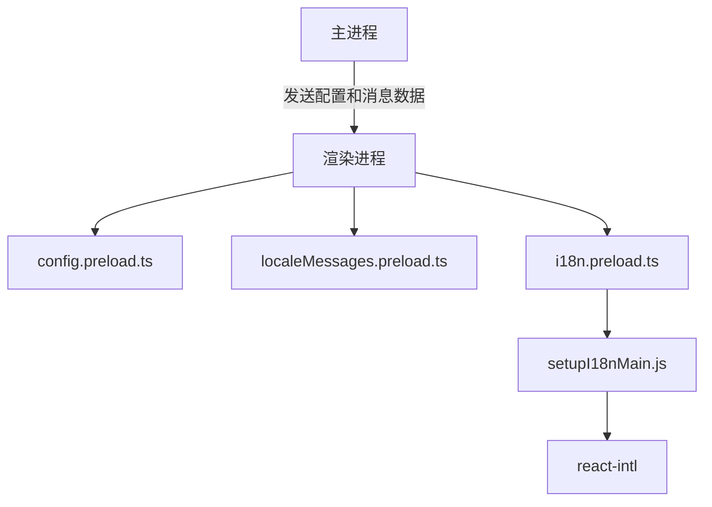
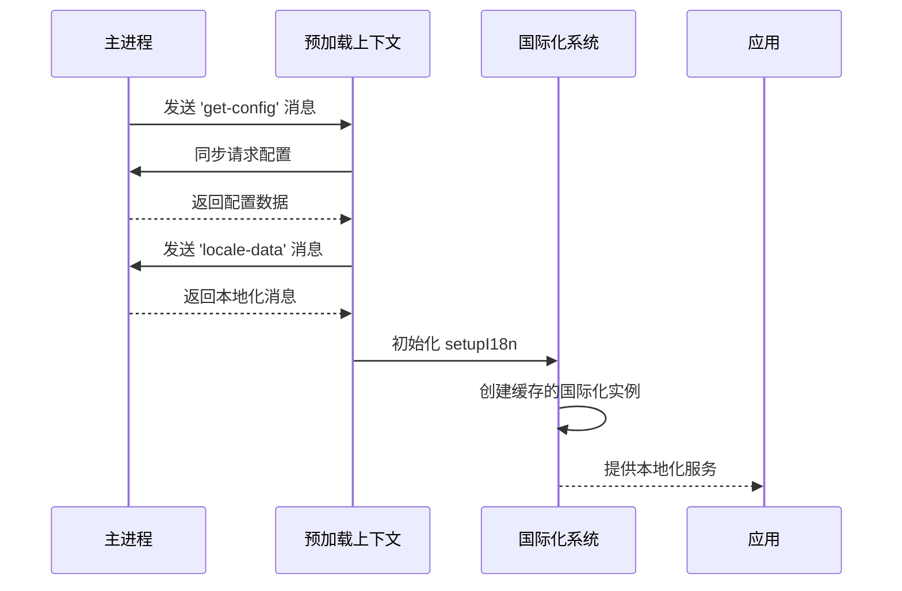
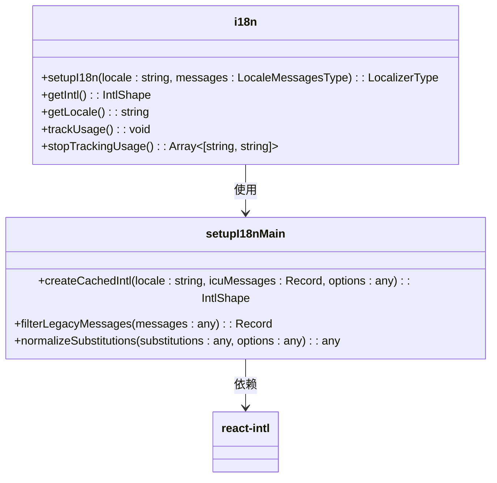
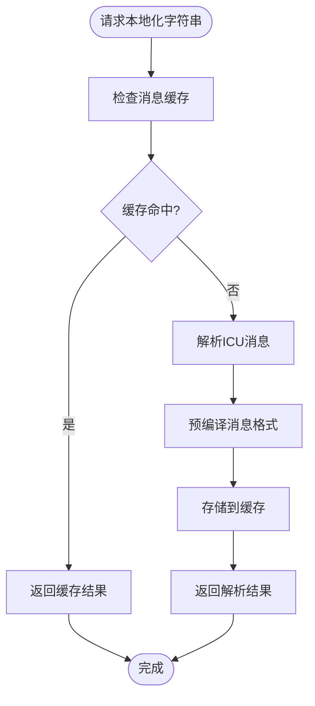
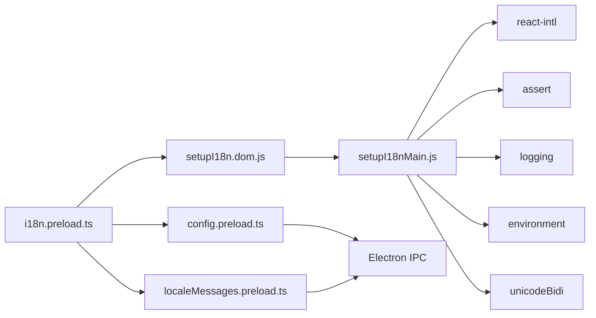

# 性能优化策略

<cite>
**本文档引用的文件**  
- [i18n.preload.ts](file://ts/context/i18n.preload.ts)
- [setupI18nMain.js](file://ts/util/setupI18nMain.js)
- [localeMessages.preload.ts](file://ts/context/localeMessages.preload.ts)
- [config.preload.ts](file://ts/context/config.preload.ts)
- [setupI18n.dom.tsx](file://ts/util/setupI18n.dom.tsx)
</cite>

## 目录
1. [简介](#简介)
2. [项目结构](#项目结构)
3. [核心组件](#核心组件)
4. [架构概述](#架构概述)
5. [详细组件分析](#详细组件分析)
6. [依赖分析](#依赖分析)
7. [性能考量](#性能考量)
8. [故障排除指南](#故障排除指南)
9. [结论](#结论)

## 简介
本文档深入分析Signal-Desktop中实现的国际化（i18n）字符串解析性能优化技术。重点研究`i18n.preload.ts`文件中实现的缓存机制、预编译处理、懒加载策略以及运行时动态优化策略。文档还涵盖缓存失效机制、内存使用优化、解析器初始化性能、性能监控指标以及优化前后的基准测试对比。

## 项目结构
Signal-Desktop的国际化系统采用分层架构，将配置、消息数据和国际化逻辑分离。核心国际化功能位于`ts/context/`目录下，通过预加载上下文（preload context）在渲染进程中初始化。

**图示来源**  
- [config.preload.ts](file://ts/context/config.preload.ts#L1-L11)
- [localeMessages.preload.ts](file://ts/context/localeMessages.preload.ts#L1-L11)
- [i18n.preload.ts](file://ts/context/i18n.preload.ts#L1-L21)

**本节来源**  
- [ts/context/](file://ts/context/)
- [ts/util/](file://ts/util/)

## 核心组件
国际化系统的核心组件包括配置管理、消息数据获取和本地化处理器。系统通过Electron的IPC机制从主进程安全地获取本地化数据和配置，避免了在渲染进程中直接访问文件系统。

**本节来源**  
- [i18n.preload.ts](file://ts/context/i18n.preload.ts#L4-L21)
- [setupI18nMain.js](file://ts/util/setupI18nMain.js#L109-L154)

## 架构概述
Signal-Desktop的国际化架构采用预加载模式，在应用启动时一次性获取所有必要的本地化资源。这种设计减少了运行时的异步操作，提高了字符串解析的性能。

**图示来源**  
- [config.preload.ts](file://ts/context/config.preload.ts#L8)
- [localeMessages.preload.ts](file://ts/context/localeMessages.preload.ts#L6-L10)
- [i18n.preload.ts](file://ts/context/i18n.preload.ts#L19)

## 详细组件分析

### 国际化预加载分析
`i18n.preload.ts`文件实现了国际化系统的初始化逻辑，通过组合配置、消息数据和设置函数来创建本地化实例。

**图示来源**  
- [i18n.preload.ts](file://ts/context/i18n.preload.ts#L19)
- [setupI18nMain.js](file://ts/util/setupI18nMain.js#L109-L154)

**本节来源**  
- [i18n.preload.ts](file://ts/context/i18n.preload.ts#L1-L21)
- [setupI18nMain.js](file://ts/util/setupI18nMain.js#L1-L163)

### 缓存与预编译机制
系统实现了多层缓存机制来优化字符串解析性能。`createCachedIntl`函数使用`react-intl`的缓存系统来存储已解析的消息格式，避免重复解析相同的ICU消息。

**图示来源**  
- [setupI18nMain.js](file://ts/util/setupI18nMain.js#L48-L73)
- [setupI18nMain.js](file://ts/util/setupI18nMain.js#L116-L128)

**本节来源**  
- [setupI18nMain.js](file://ts/util/setupI18nMain.js#L48-L154)

## 依赖分析
国际化系统依赖于多个核心模块和外部库，形成了清晰的依赖链。

**图示来源**  
- [i18n.preload.ts](file://ts/context/i18n.preload.ts#L4-L6)
- [setupI18nMain.js](file://ts/util/setupI18nMain.js#L37-L43)

**本节来源**  
- [i18n.preload.ts](file://ts/context/i18n.preload.ts#L1-L21)
- [setupI18nMain.js](file://ts/util/setupI18nMain.js#L1-L163)

## 性能考量
Signal-Desktop的国际化系统通过多种技术实现高性能字符串解析：

1. **同步初始化**：使用`ipcRenderer.sendSync`在预加载阶段同步获取配置和消息数据，避免了异步加载的延迟。
2. **消息过滤**：`filterLegacyMessages`函数只提取包含`messageformat`字段的有效消息，减少内存占用。
3. **双向文本处理**：自动处理Unicode双向文本，确保不同语言的正确显示。
4. **错误处理**：完善的错误日志记录，便于性能问题的诊断。

系统还提供了`trackUsage`和`stopTrackingUsage`方法来监控字符串使用情况，为性能优化提供数据支持。

**本节来源**  
- [setupI18nMain.js](file://ts/util/setupI18nMain.js#L140-L153)
- [setupI18nMain.js](file://ts/util/setupI18nMain.js#L100-L107)

## 故障排除指南
当遇到国际化性能问题时，可以按照以下步骤进行排查：

1. 检查`ipcRenderer.sendSync`调用是否阻塞主线程
2. 验证消息数据的大小是否过大
3. 监控`usedStrings`映射的内存使用情况
4. 检查`react-intl`缓存命中率

使用`trackUsage`方法可以识别不常用或未使用的翻译字符串，从而优化消息包的大小。

**本节来源**  
- [setupI18nMain.js](file://ts/util/setupI18nMain.js#L140-L153)
- [setupI18nMain.js](file://ts/util/setupI18nMain.js#L58-L69)

## 结论
Signal-Desktop的国际化系统通过精心设计的缓存机制、预编译处理和同步初始化策略，实现了高效的字符串解析性能。系统架构清晰，依赖关系明确，为多语言支持提供了稳定可靠的基础。未来的优化方向可以包括实现更智能的缓存失效策略和按需加载特定语言包。