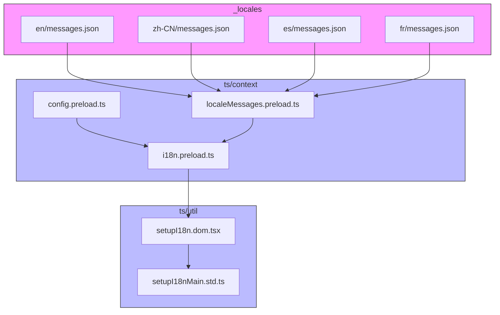
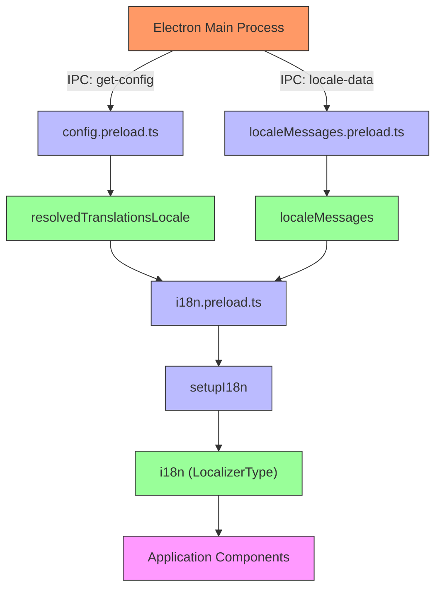
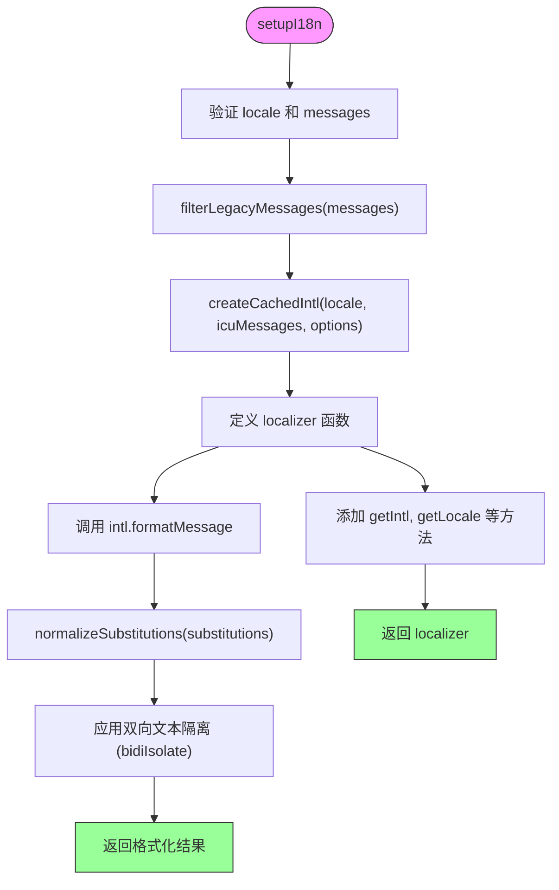
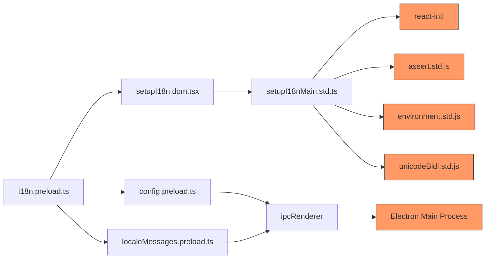

# 消息查找机制

<cite>
**本文档引用的文件**  
- [i18n.preload.ts](file://ts/context/i18n.preload.ts)
- [localeMessages.preload.ts](file://ts/context/localeMessages.preload.ts)
- [setupI18n.dom.tsx](file://ts/util/setupI18n.dom.tsx)
- [setupI18nMain.std.ts](file://ts/util/setupI18nMain.std.ts)
- [config.preload.ts](file://ts/context/config.preload.ts)
- [_locales/en/messages.json](file://_locales/en/messages.json)
</cite>

## 目录
1. [简介](#简介)
2. [项目结构](#项目结构)
3. [核心组件](#核心组件)
4. [架构概述](#架构概述)
5. [详细组件分析](#详细组件分析)
6. [依赖分析](#依赖分析)
7. [性能考虑](#性能考虑)
8. [故障排除指南](#故障排除指南)
9. [结论](#结论)

## 简介
Signal-Desktop 的消息查找机制是其国际化（i18n）系统的核心部分，负责在多语言环境下高效地定位和渲染本地化字符串。该机制基于 ICU（International Components for Unicode）标准，结合嵌套对象结构和智能回退策略，实现了灵活且可扩展的多语言支持。系统通过 `i18n.preload.ts` 文件初始化，利用 Electron 的 IPC 机制从主进程获取语言环境和消息数据，并通过 `react-intl` 库进行消息格式化和渲染。本文档将深入解析其实现原理，包括消息ID的层级结构、语言环境优先级、回退机制以及性能特征。

## 项目结构
Signal-Desktop 的国际化资源组织遵循清晰的目录结构。所有语言资源存储在根目录下的 `_locales` 文件夹中，每个子目录代表一种语言或区域设置（如 `en`、`zh-CN`），其中包含一个 `messages.json` 文件。该 JSON 文件采用嵌套的对象结构，以消息ID为键，存储包含 `messageformat`（ICU格式消息）和 `description`（描述）的复合值。这种结构使得消息可以按功能模块进行逻辑分组，例如 `icu:AddUserToAnotherGroupModal__title` 表示“添加到群组”对话框的标题。

**图示来源**
- [_locales](file://_locales)
- [i18n.preload.ts](file://ts/context/i18n.preload.ts)
- [localeMessages.preload.ts](file://ts/context/localeMessages.preload.ts)
- [setupI18n.dom.tsx](file://ts/util/setupI18n.dom.tsx)

**本节来源**
- [i18n.preload.ts](file://ts/context/i18n.preload.ts)
- [localeMessages.preload.ts](file://ts/context/localeMessages.preload.ts)

## 核心组件
消息查找机制的核心组件包括 `i18n` 实例、`localeMessages` 数据源和 `setupI18n` 工厂函数。`i18n` 实例是全局的本地化函数，由 `setupI18n` 创建，它封装了 `react-intl` 的 `IntlShape` 对象。`localeMessages` 是一个通过 IPC 从主进程同步获取的庞大对象，包含了当前语言环境下的所有消息。`setupI18n` 函数则负责初始化整个本地化系统，它接收语言代码和消息对象，配置 `react-intl` 的 `intl` 实例，并返回一个类型安全的 `LocalizerType` 函数，该函数可用于在应用的任何地方查找和格式化消息。

**本节来源**
- [i18n.preload.ts](file://ts/context/i18n.preload.ts)
- [setupI18nMain.std.ts](file://ts/util/setupI18nMain.std.ts)

## 架构概述
整个消息查找机制的架构可以分为三层：配置层、数据层和接口层。配置层由 `config.preload.ts` 提供，它通过 IPC 调用 `get-config` 获取应用的配置，其中包括解析后的语言环境 `resolvedTranslationsLocale`。数据层由 `localeMessages.preload.ts` 构成，它通过 IPC 调用 `locale-data` 获取完整的本地化消息包。接口层是 `i18n.preload.ts`，它组合前两层的数据，调用 `setupI18n` 创建最终的 `i18n` 函数，并将其导出供整个应用使用。这种分层设计实现了关注点分离，使得配置、数据和逻辑可以独立演化。

**图示来源**
- [config.preload.ts](file://ts/context/config.preload.ts)
- [localeMessages.preload.ts](file://ts/context/localeMessages.preload.ts)
- [i18n.preload.ts](file://ts/context/i18n.preload.ts)
- [setupI18nMain.std.ts](file://ts/util/setupI18nMain.std.ts)

## 详细组件分析

### i18n.preload.ts 分析
`i18n.preload.ts` 是消息查找机制的入口点。它首先从 `config` 对象中解构出 `resolvedTranslationsLocale`，并使用 `strictAssert` 进行严格的运行时检查，确保语言环境存在且为字符串类型。随后，它调用 `setupI18n` 函数，传入语言环境和 `localeMessages`，创建 `i18n` 实例。该文件的逻辑非常简洁，主要职责是协调配置和数据，创建并导出本地化函数。

**本节来源**
- [i18n.preload.ts](file://ts/context/i18n.preload.ts)

### setupI18nMain.std.ts 分析
`setupI18nMain.std.ts` 是整个机制的核心实现。`setupI18n` 函数首先对输入参数进行验证，然后调用 `filterLegacyMessages` 函数。该函数遍历 `messages` 对象，提取所有包含 `messageformat` 字段的条目，构建一个仅包含 ICU 格式消息的 `icuMessages` 对象。这个 `icuMessages` 对象随后被传递给 `createCachedIntl`，用于初始化 `react-intl` 的 `intl` 实例。`setupI18n` 返回的 `localizer` 函数本质上是对 `intl.formatMessage` 的封装，它在调用前会通过 `normalizeSubstitutions` 处理占位符替换，并在开发模式下通过 `strictAssert` 确保消息不会回退到其自身的 ID（即没有缺失翻译）。

**图示来源**
- [setupI18nMain.std.ts](file://ts/util/setupI18nMain.std.ts)

**本节来源**
- [setupI18nMain.std.ts](file://ts/util/setupI18nMain.std.ts)

## 依赖分析
消息查找机制依赖于多个关键模块和外部库。其核心依赖是 `react-intl`，它提供了 ICU 消息格式化的能力。`@formatjs` 相关的库（如 `fast-memoize`）用于性能优化。在内部，它依赖于 `assert.std.js` 进行运行时断言，`environment.std.js` 用于区分不同环境，以及 `unicodeBidi.std.js` 来处理复杂的双向文本。通过 Electron 的 `ipcRenderer`，它与主进程通信以获取配置和消息数据，这构成了一个清晰的依赖边界，将渲染进程的本地化逻辑与主进程的数据管理分离开来。

**图示来源**
- [i18n.preload.ts](file://ts/context/i18n.preload.ts)
- [setupI18n.dom.tsx](file://ts/util/setupI18n.dom.tsx)
- [setupI18nMain.std.ts](file://ts/util/setupI18nMain.std.ts)
- [config.preload.ts](file://ts/context/config.preload.ts)
- [localeMessages.preload.ts](file://ts/context/localeMessages.preload.ts)

**本节来源**
- [setupI18nMain.std.ts](file://ts/util/setupI18nMain.std.ts)
- [i18n.preload.ts](file://ts/context/i18n.preload.ts)

## 性能考虑
该消息查找机制在性能方面进行了精心设计。首先，`createIntlCache()` 的使用确保了 `react-intl` 的内部缓存机制被启用，避免了对相同消息的重复解析。其次，`filterLegacyMessages` 在初始化时就过滤出 `icuMessages`，减少了运行时查找的开销。`normalizeSubstitutions` 函数对字符串替换进行预处理，确保了双向文本的安全性。整个 `i18n` 函数的调用时间复杂度为 O(1)，因为 `react-intl` 的 `formatMessage` 基于哈希表查找。然而，初始化过程（特别是 IPC 通信和 JSON 解析）可能有较高的延迟，因此该过程被设计为在应用启动时一次性完成。

## 故障排除指南
当遇到消息查找问题时，应首先检查 `i18n` 函数的调用是否正确。如果返回了消息ID本身（如 `icu:unknownContact`），这通常意味着该消息ID在当前语言的 `messages.json` 文件中缺失，`strictAssert` 会抛出错误。应检查 `_locales` 目录下对应语言的文件，确认该ID是否存在。如果遇到占位符替换问题，应检查传递给 `i18n` 函数的 `substitutions` 对象的键名是否与消息中的占位符（如 `{name}`）完全匹配。对于双向文本显示问题，应检查 `normalizeSubstitutions` 是否正确应用了 `bidiIsolate`。最后，如果整个本地化系统未初始化，应检查 `config` 和 `localeMessages` 是否通过 IPC 正确获取。

**本节来源**
- [setupI18nMain.std.ts](file://ts/util/setupI18nMain.std.ts)
- [i18n.preload.ts](file://ts/context/i18n.preload.ts)

## 结论
Signal-Desktop 的消息查找机制是一个设计精良、健壮且高效的国际化解决方案。它通过分层架构和模块化设计，将配置、数据和逻辑清晰地分离。利用 `react-intl` 和 ICU 标准，它支持复杂的语言特性，如复数和选择格式。其基于消息ID的查找方式和严格的运行时检查，确保了应用的本地化质量和一致性。该机制的性能特征良好，初始化开销被最小化，运行时查找快速。整体而言，这是一个可维护、可扩展且用户友好的国际化实现。