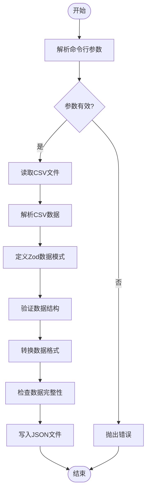

# 本地化显示名称生成

<cite>
**本文档引用的文件**
- [build-localized-display-names.node.ts](file://ts/scripts/build-localized-display-names.node.ts)
- [locale-display-names.csv](file://ts/scripts/locale-data/locale-display-names.csv)
- [country-display-names.csv](file://ts/scripts/locale-data/country-display-names.csv)
- [locale.node.ts](file://app/locale.node.ts)
- [package.json](file://package.json)
- [available-locales.json](file://build/available-locales.json)
</cite>

## 目录
1. [简介](#简介)
2. [构建脚本实现逻辑](#构建脚本实现逻辑)
3. [数据源文件分析](#数据源文件分析)
4. [数据转换与处理流程](#数据转换与处理流程)
5. [生成文件的集成与使用](#生成文件的集成与使用)
6. [脚本执行与自动化](#脚本执行与自动化)
7. [实际示例](#实际示例)

## 简介
本项目中的本地化显示名称生成系统负责为Signal-Desktop应用程序提供多语言支持的国家名称和区域设置名称。该系统通过一个名为`build-localized-display-names.node.ts`的构建脚本，从CSV数据文件中读取并处理本地化数据，生成供应用程序界面使用的JSON文件。此文档将深入解析该构建脚本的实现逻辑，详细说明数据转换和处理流程，并解释生成的本地化显示名称如何被集成到应用中。

**Section sources**
- [build-localized-display-names.node.ts](file://ts/scripts/build-localized-display-names.node.ts)

## 构建脚本实现逻辑
`build-localized-display-names.node.ts`是生成本地化显示名称的核心构建脚本。该脚本是一个Node.js程序，通过命令行参数接收输入和输出配置，读取CSV数据文件，进行数据转换和验证，最终生成JSON格式的输出文件。

脚本的执行流程如下：
1.  **参数解析与验证**：脚本首先检查命令行参数，确保第一个参数为`countries`或`locales`，以确定处理的是国家名称还是区域设置名称。同时验证源CSV文件路径和输出JSON文件路径是否提供。
2.  **可用区域设置获取**：通过导入`app/locale.node.ts`中的`_getAvailableLocales`函数，获取应用程序支持的所有区域设置列表。这个列表用于后续的数据完整性验证。
3.  **数据模式定义**：使用`zod`库定义了`LocaleDisplayNames`数据模式，用于验证从CSV文件读取的数据结构。该模式确保数据的第一行包含正确的标题（`locale`或`Country Code`），并且后续的每一行都符合预期的格式。
4.  **CSV文件读取与解析**：使用`node:fs/promises`模块异步读取指定路径的CSV文件内容，并通过`csv-parse`库将其解析为二维字符串数组（`Records`）。
5.  **数据转换**：根据脚本的第一个参数（`type`），调用`convertData`函数将解析后的CSV数据转换为嵌套的JSON对象。对于区域设置名称（`locales`），数据按行转换；对于国家名称（`countries`），数据按列转换（转置矩阵）。
6.  **数据完整性验证**：调用`assertValuesForAllLocales`或`assertValuesForAllCountries`函数，确保生成的JSON对象中包含了所有可用区域设置所需的数据，防止出现遗漏。
7.  **JSON文件生成**：将验证通过的转换结果格式化为JSON字符串，并写入指定的输出文件路径。



**Diagram sources**
- [build-localized-display-names.node.ts](file://ts/scripts/build-localized-display-names.node.ts)

**Section sources**
- [build-localized-display-names.node.ts](file://ts/scripts/build-localized-display-names.node.ts)

## 数据源文件分析
本地化显示名称的数据来源于两个CSV文件：`locale-display-names.csv`和`country-display-names.csv`。这两个文件位于`ts/scripts/locale-data/`目录下。

-   **locale-display-names.csv**：此文件包含了不同语言环境下，各种语言名称的本地化翻译。文件的第一行是标题行，第一列是`locale`，后续各列是不同的区域设置代码（如`en`, `zh-CN`, `es`等）。从第二行开始，每一行代表一种语言（如`en`代表英语），其在各个区域设置下的显示名称。
-   **country-display-names.csv**：此文件包含了不同语言环境下，各个国家名称的本地化翻译。文件结构与`locale-display-names.csv`类似，第一列是`Country Code`，代表国家的ISO代码（如`US`, `CN`, `FR`等），后续各列是不同的区域设置代码。从第二行开始，每一行代表一个国家，其在各个区域设置下的显示名称。

这两个CSV文件的设计使得数据可以被`build-localized-display-names.node.ts`脚本高效地读取和处理。`locale.node.ts`文件中的`_getAvailableLocales`函数返回的可用区域设置列表，直接对应于这两个CSV文件中的列名，确保了数据的完整性和一致性。

**Section sources**
- [locale-display-names.csv](file://ts/scripts/locale-data/locale-display-names.csv)
- [country-display-names.csv](file://ts/scripts/locale-data/country-display-names.csv)
- [locale.node.ts](file://app/locale.node.ts)

## 数据转换与处理流程
数据转换的核心是`convertData`函数，它根据输入数据的类型（国家或区域设置）采用不同的转换策略。

当`type`为`'locales'`时，脚本处理`locale-display-names.csv`文件。转换过程如下：
1.  从解析后的数据中解构出第一行作为`keys`（即所有区域设置代码），其余行作为`rows`。
2.  遍历`rows`中的每一行，将该行的第一个元素作为`subKey`（即语言代码，如`en`），其余元素作为`messages`（即该语言在其他区域设置下的名称）。
3.  在结果对象`result`中，以`subKey`为键创建一个新对象，并将`messages`数组中的每个元素，按照其在数组中的索引，与`keys`数组中对应索引的区域设置代码配对，存入新对象中。

当`type`为`'countries'`时，脚本处理`country-display-names.csv`文件。由于国家名称数据在CSV中是按行组织的，但需要转换为按列（国家代码）组织的JSON结构，因此需要进行矩阵转置：
1.  首先，根据`keys`数组（区域设置代码）在结果对象`result`中预先创建所有国家代码的键。
2.  然后，遍历`rows`中的每一行，将该行的第一个元素作为`subKey`（即国家代码，如`US`），其余元素作为`messages`（即该国家在其他区域设置下的名称）。
3.  遍历`messages`数组，将每个`message`按照其索引，存入`result`中对应`keys`索引的国家代码对象下。

此转换流程确保了无论输入数据如何组织，最终生成的JSON文件都具有统一的、易于应用程序查询的嵌套结构：`result[locale][target]`，其中`locale`是当前应用的区域设置，`target`是目标语言或国家的代码。

**Section sources**
- [build-localized-display-names.node.ts](file://ts/scripts/build-localized-display-names.node.ts)

## 生成文件的集成与使用
构建脚本生成的两个JSON文件——`locale-display-names.json`和`country-display-names.json`——被放置在`build/`目录下，并通过`package.json`中的`build.files`配置项被包含在最终的应用程序包中。

这些文件在应用程序启动时被`app/locale.node.ts`模块加载。`locale.node.ts`文件中的`getLocaleDisplayNames`和`getCountryDisplayNames`函数负责读取这两个JSON文件，并将其内容作为`LocaleDisplayNames`和`CountryDisplayNames`类型的对象返回。这些对象随后被注入到`LocaleType`对象中，供整个应用程序使用。

在用户界面中，当需要显示一个国家或语言的名称时，应用程序会根据当前的区域设置（`matchedLocale`）和目标国家/语言的代码，从`localeDisplayNames`或`countryDisplayNames`对象中查询对应的本地化名称。例如，当用户在设置中选择语言时，下拉列表中的语言名称会根据用户的系统语言自动显示为相应的本地化名称（如英语用户看到"Spanish"，中文用户看到"西班牙语"）。

这种设计将本地化数据的生成与应用逻辑分离，使得翻译团队可以独立地更新CSV文件，而无需修改核心代码，极大地提高了本地化工作的效率和灵活性。

**Section sources**
- [locale.node.ts](file://app/locale.node.ts)
- [package.json](file://package.json)

## 脚本执行与自动化
`build-localized-display-names.node.ts`脚本通过`package.json`中的npm脚本进行调用和自动化。相关的脚本命令如下：

-   `get-strings:locales`: 用于生成区域设置名称文件。命令为：
    ```bash
    ts-node ./ts/scripts/build-localized-display-names.node.ts locales ts/scripts/locale-data/locale-display-names.csv build/locale-display-names.json
    ```
-   `get-strings:countries`: 用于生成国家名称文件。命令为：
    ```bash
    ts-node ./ts/scripts/build-localized-display-names.node.ts countries ts/scripts/locale-data/country-display-names.csv build/country-display-names.json
    ```

这些脚本通常作为更大构建流程的一部分被调用。例如，`get-strings`脚本会依次执行`get-strings:locales`、`get-strings:countries`等命令，以一次性生成所有需要的本地化字符串文件。整个构建流程由`generate`和`build`等高层级脚本驱动，确保了在每次构建应用程序时，本地化数据都是最新且完整的。

**Section sources**
- [package.json](file://package.json)

## 实际示例
以下示例展示了不同语言环境下，国家名称和区域设置名称的正确显示效果。

假设用户将系统语言设置为简体中文（`zh-CN`），则在Signal-Desktop的国家选择列表中：
-   `US` (美国) 将显示为 "美国"
-   `FR` (法国) 将显示为 "法国"
-   `JP` (日本) 将显示为 "日本"

同样，在语言选择列表中：
-   `en` (英语) 将显示为 "英语"
-   `es` (西班牙语) 将显示为 "西班牙语"
-   `ar` (阿拉伯语) 将显示为 "阿拉伯语"

如果用户将系统语言设置为阿拉伯语（`ar`），则相同的国家和语言名称将显示为相应的阿拉伯语翻译：
-   `US` 将显示为 "الولايات المتحدة"
-   `en` 将显示为 "الإنجليزية"

这证明了`build-localized-display-names.node.ts`脚本成功地将CSV中的多语言数据转换为了应用程序可用的JSON格式，并通过`locale.node.ts`模块实现了在不同语言环境下的正确显示。

**Section sources**
- [country-display-names.csv](file://ts/scripts/locale-data/country-display-names.csv)
- [locale-display-names.csv](file://ts/scripts/locale-data/locale-display-names.csv)
- [locale.node.ts](file://app/locale.node.ts)