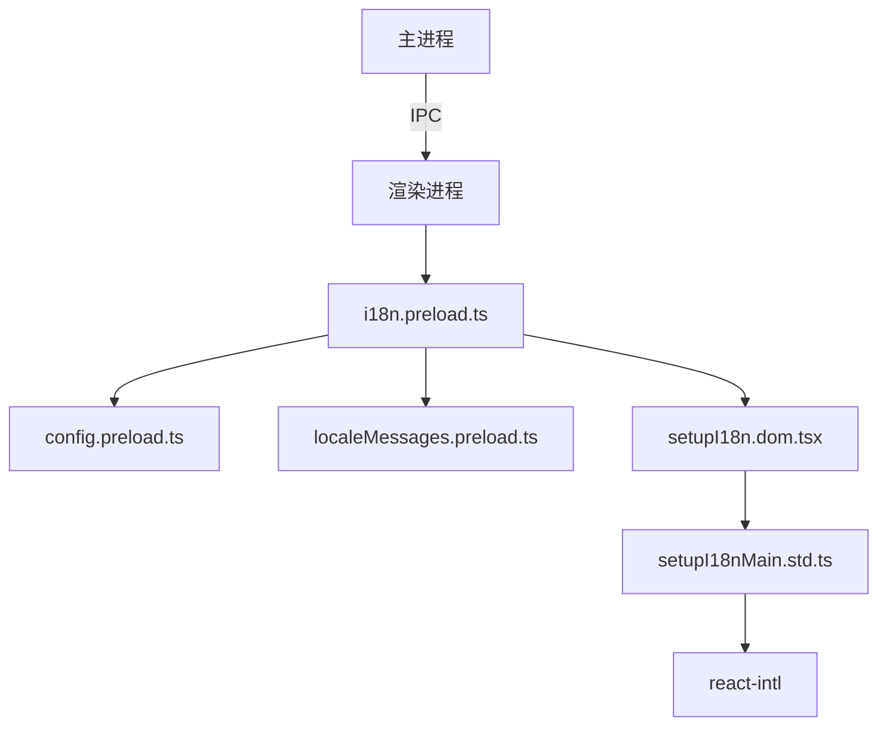
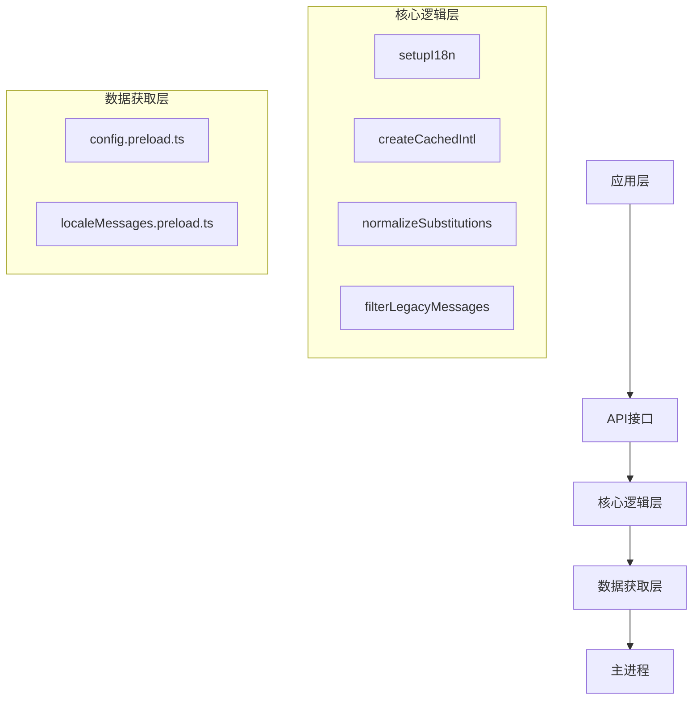
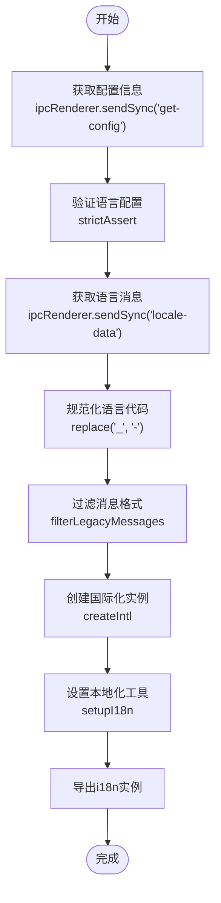
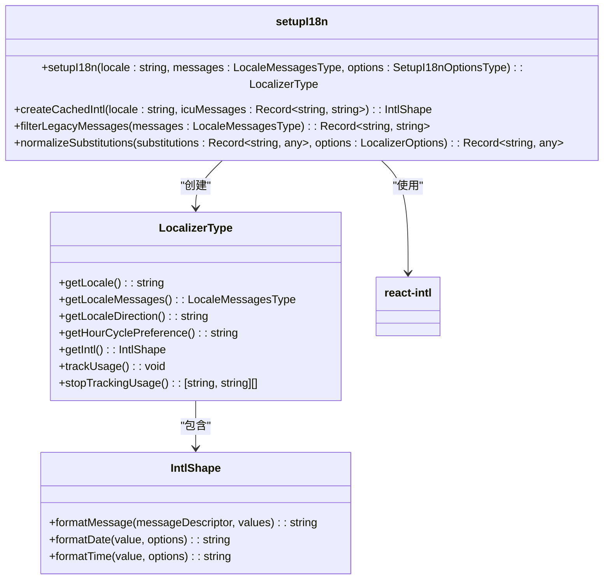
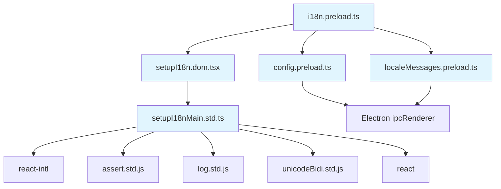

# 语言加载器实现

<cite>
**本文档引用的文件**  
- [i18n.preload.ts](file://ts/context/i18n.preload.ts)
- [setupI18n.dom.tsx](file://ts/util/setupI18n.dom.tsx)
- [setupI18nMain.std.ts](file://ts/util/setupI18nMain.std.ts)
- [localeMessages.preload.ts](file://ts/context/localeMessages.preload.ts)
- [config.preload.ts](file://ts/context/config.preload.ts)
- [I18N.std.ts](file://ts/types/I18N.std.ts)
</cite>

## 目录
1. [简介](#简介)
2. [项目结构](#项目结构)
3. [核心组件](#核心组件)
4. [架构概述](#架构概述)
5. [详细组件分析](#详细组件分析)
6. [依赖分析](#依赖分析)
7. [性能考虑](#性能考虑)
8. [故障排除指南](#故障排除指南)
9. [结论](#结论)

## 简介
本文档详细解析Signal-Desktop应用程序中语言加载器的实现机制。重点分析`i18n.preload.ts`文件中的核心逻辑，涵盖语言包的异步加载、JSON解析流程、内存缓存策略以及基于用户偏好或系统设置的语言选择机制。同时，文档还说明了错误处理、异常恢复机制和性能优化措施。

## 项目结构
Signal-Desktop的语言国际化（i18n）系统主要由以下几个部分构成：
- `_locales` 目录：包含所有支持语言的JSON消息文件
- `ts/context/` 目录：包含配置和语言消息的预加载模块
- `ts/util/` 目录：包含i18n核心功能的实现
- `ts/types/` 目录：包含相关类型定义

语言加载器主要在渲染进程（preload）上下文中运行，通过Electron的IPC机制与主进程通信获取配置和语言数据。



**Diagram sources**
- [i18n.preload.ts](file://ts/context/i18n.preload.ts)
- [config.preload.ts](file://ts/context/config.preload.ts)
- [localeMessages.preload.ts](file://ts/context/localeMessages.preload.ts)
- [setupI18n.dom.tsx](file://ts/util/setupI18n.dom.tsx)

**Section sources**
- [i18n.preload.ts](file://ts/context/i18n.preload.ts)
- [config.preload.ts](file://ts/context/config.preload.ts)

## 核心组件
语言加载器的核心组件包括：
- **配置获取模块**：通过IPC从主进程获取用户语言偏好设置
- **语言消息加载模块**：通过IPC同步获取所有语言消息数据
- **i18n初始化模块**：使用react-intl库创建国际化实例
- **本地化工具**：提供格式化消息、处理双向文本等实用功能

这些组件协同工作，确保应用程序能够正确加载和显示用户首选语言的界面文本。

**Section sources**
- [i18n.preload.ts](file://ts/context/i18n.preload.ts)
- [setupI18nMain.std.ts](file://ts/util/setupI18nMain.std.ts)

## 架构概述
语言加载器采用分层架构设计，各层职责分明：



**Diagram sources**
- [i18n.preload.ts](file://ts/context/i18n.preload.ts)
- [setupI18nMain.std.ts](file://ts/util/setupI18nMain.std.ts)
- [config.preload.ts](file://ts/context/config.preload.ts)
- [localeMessages.preload.ts](file://ts/context/localeMessages.preload.ts)

## 详细组件分析

### 语言加载流程分析
语言加载器的工作流程如下：



**Diagram sources**
- [i18n.preload.ts](file://ts/context/i18n.preload.ts)
- [setupI18nMain.std.ts](file://ts/util/setupI18nMain.std.ts)
- [config.preload.ts](file://ts/context/config.preload.ts)
- [localeMessages.preload.ts](file://ts/context/localeMessages.preload.ts)

**Section sources**
- [i18n.preload.ts](file://ts/context/i18n.preload.ts#L1-L22)
- [config.preload.ts](file://ts/context/config.preload.ts#L1-L11)
- [localeMessages.preload.ts](file://ts/context/localeMessages.preload.ts#L1-L11)

### 核心类分析
语言加载器的核心功能由`setupI18n`函数实现，该函数返回一个`LocalizerType`对象。



**Diagram sources**
- [setupI18nMain.std.ts](file://ts/util/setupI18nMain.std.ts#L116-L184)
- [I18N.std.ts](file://ts/types/I18N.std.ts)

**Section sources**
- [setupI18nMain.std.ts](file://ts/util/setupI18nMain.std.ts#L1-L185)

### 错误处理机制分析
语言加载器实现了完善的错误处理机制，确保在各种异常情况下应用程序仍能正常运行。

```mermaid
flowchart TD
A[错误发生] --> B{错误类型}
B --> |配置错误| C["抛出Error<br/>'locale parameter is required'"]
B --> |消息缺失| D["抛出AssertionError<br/>'missing translation for \"key\"'"]
B --> |intl运行时错误| E["记录错误日志<br/>log.error('intl.onError')"]
B --> |intl警告| F["记录警告日志<br/>log.warn('intl.onWarn')"]
C --> G[应用崩溃或回退到默认语言]
D --> H[开发环境提示翻译缺失]
E --> I[继续执行，可能显示原始ID]
F --> J[继续执行]
style C fill:#ffcccc,stroke:#ff0000
style D fill:#ffcccc,stroke:#ff0000
style E fill:#ffffcc,stroke:#cccc00
style F fill:#ffffcc,stroke:#cccc00
```

**Diagram sources**
- [setupI18nMain.std.ts](file://ts/util/setupI18nMain.std.ts#L125-L155)
- [setupI18nMain.std.ts](file://ts/util/setupI18nMain.std.ts#L53-L67)

**Section sources**
- [setupI18nMain.std.ts](file://ts/util/setupI18nMain.std.ts#L22-L72)

## 依赖分析
语言加载器依赖于多个内部和外部组件：



**Diagram sources**
- [i18n.preload.ts](file://ts/context/i18n.preload.ts)
- [config.preload.ts](file://ts/context/config.preload.ts)
- [localeMessages.preload.ts](file://ts/context/localeMessages.preload.ts)
- [setupI18n.dom.tsx](file://ts/util/setupI18n.dom.tsx)
- [setupI18nMain.std.ts](file://ts/util/setupI18nMain.std.ts)

**Section sources**
- [i18n.preload.ts](file://ts/context/i18n.preload.ts#L4-L5)
- [setupI18n.dom.tsx](file://ts/util/setupI18n.dom.tsx#L10-L13)

## 性能考虑
语言加载器在设计时考虑了多项性能优化措施：

1. **内存缓存**：使用`createIntlCache()`缓存国际化实例，避免重复创建开销
2. **同步加载**：在应用启动时通过同步IPC调用一次性获取所有语言数据，确保界面渲染时数据已就绪
3. **消息过滤**：只提取需要的ICU消息格式，减少内存占用
4. **双向文本处理**：对字符串进行适当的双向隔离处理，确保文本显示正确
5. **错误日志控制**：在测试环境中过滤掉已知的噪音警告，提高调试效率

这些优化措施确保了语言加载过程高效且资源占用合理。

## 故障排除指南
当遇到语言加载相关问题时，可参考以下排查步骤：

**Section sources**
- [setupI18nMain.std.ts](file://ts/util/setupI18nMain.std.ts#L125-L130)
- [i18n.preload.ts](file://ts/context/i18n.preload.ts#L10-L17)

### 常见问题及解决方案
| 问题现象 | 可能原因 | 解决方案 |
|--------|--------|--------|
| 应用启动失败，提示"locale could not be parsed" | 配置中缺少语言设置 | 检查主进程是否正确发送了配置信息 |
| 界面显示消息ID而非翻译文本 | 特定语言的消息缺失 | 确保对应语言的messages.json文件完整 |
| 特定语言文本显示异常 | 双向文本处理问题 | 检查unicodeBidi.std.js中的处理逻辑 |
| 性能下降 | 频繁创建国际化实例 | 确保使用了缓存机制 |
| 开发者控制台出现大量警告 | react-intl警告 | 检查消息格式是否正确，或在测试中忽略特定警告 |

## 结论
Signal-Desktop的语言加载器实现了一个健壮、高效的国际化系统。通过分层架构设计，系统将配置获取、消息加载、实例创建等职责分离，提高了代码的可维护性。利用Electron的IPC机制，渲染进程能够安全地获取主进程中的语言配置和消息数据。基于react-intl的实现确保了消息格式化的灵活性和准确性。完善的错误处理机制和性能优化措施保证了用户体验的流畅性。整体设计体现了良好的软件工程实践，为多语言支持提供了可靠的基础。