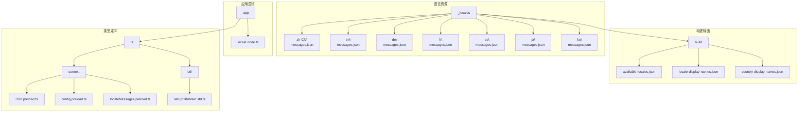
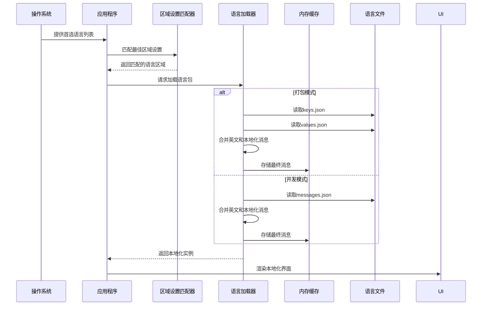
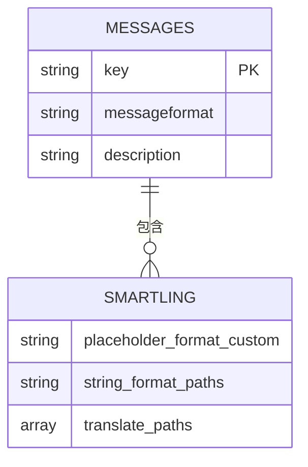
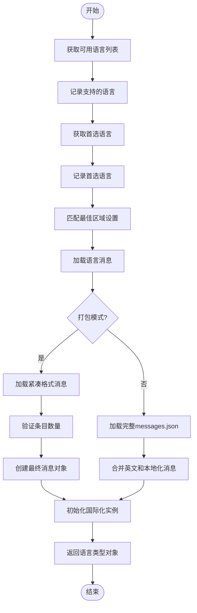
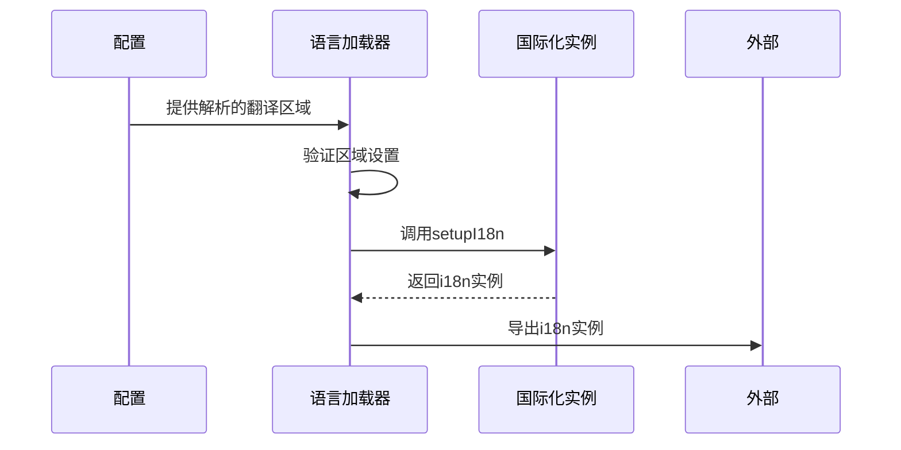
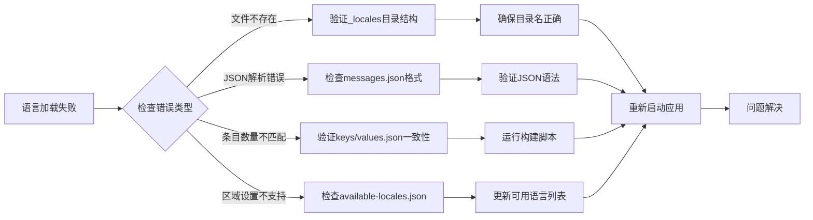

# 语言加载机制

<cite>
**本文档引用的文件**
- [locale.node.ts](file://app/locale.node.ts)
- [i18n.preload.ts](file://ts/context/i18n.preload.ts)
- [setupI18nMain.std.ts](file://ts/util/setupI18nMain.std.ts)
- [messages.json](file://_locales/en/messages.json)
- [available-locales.json](file://build/available-locales.json)
- [config.preload.ts](file://ts/context/config.preload.ts)
- [localeMessages.preload.ts](file://ts/context/localeMessages.preload.ts)
</cite>

## 目录
1. [简介](#简介)
2. [项目结构](#项目结构)
3. [核心组件](#核心组件)
4. [架构概述](#架构概述)
5. [详细组件分析](#详细组件分析)
6. [依赖分析](#依赖分析)
7. [性能考虑](#性能考虑)
8. [故障排除指南](#故障排除指南)
9. [结论](#结论)

## 简介
Signal-Desktop的语言加载机制是一个复杂的国际化系统，负责管理应用程序的多语言支持。该系统通过精心设计的文件结构和加载策略，实现了高效的语言资源管理和动态语言切换功能。本系统支持70多种语言区域设置，包括中文（zh-CN、zh-HK、zh-Hant）、英语、德语等主要语言。语言加载机制不仅处理基本的文本翻译，还包含方向性（LTR/RTL）检测、小时制偏好、区域名称显示等高级功能。系统采用分层的降级策略确保语言资源的可用性，并通过预加载和缓存机制优化性能。

## 项目结构
Signal-Desktop的语言相关文件组织在一个清晰的目录结构中，确保了良好的可维护性和扩展性。核心语言资源存储在根目录的_locales文件夹中，每个支持的语言区域都有独立的子目录。



**图示来源**
- [locale.node.ts](file://app/locale.node.ts#L30-L45)
- [available-locales.json](file://build/available-locales.json#L1-L71)

**本节来源**
- [locale.node.ts](file://app/locale.node.ts#L1-L219)
- [project_structure](file://project_structure)

## 核心组件
语言加载机制的核心组件包括语言资源文件、加载器实现、区域设置匹配器和国际化工具。系统通过_locales目录下的JSON文件存储所有翻译消息，每个语言区域对应一个独立的messages.json文件。加载器实现位于app/locale.node.ts中，负责解析用户偏好、匹配最佳语言区域并加载相应的语言包。区域设置匹配使用@formatjs/intl-localematcher库，基于最佳匹配算法选择最合适的语言。国际化工具setupI18nMain.std.ts封装了react-intl的功能，提供统一的本地化接口。系统还包含构建时生成的available-locales.json文件，列出了所有可用的语言区域，确保运行时的类型安全。

**本节来源**
- [locale.node.ts](file://app/locale.node.ts#L30-L219)
- [setupI18nMain.std.ts](file://ts/util/setupI18nMain.std.ts#L1-L185)

## 架构概述
Signal-Desktop的语言加载架构采用分层设计，从底层文件存储到上层应用接口形成了完整的国际化解决方案。系统首先通过操作系统获取用户的首选语言列表，然后使用区域设置匹配器在可用语言中寻找最佳匹配。加载过程分为开发模式和打包模式两种路径，以优化不同环境下的性能表现。



**图示来源**
- [locale.node.ts](file://app/locale.node.ts#L125-L219)
- [setupI18nMain.std.ts](file://ts/util/setupI18nMain.std.ts#L116-L185)

## 详细组件分析

### 语言资源结构分析
_locales目录下的每个语言区域文件夹包含messages.json文件，采用标准化的JSON结构存储翻译消息。每个消息条目包含messageformat字段和description字段，前者存储实际的翻译文本，后者提供上下文说明。



**图示来源**
- [messages.json](file://_locales/en/messages.json#L1-L200)
- [locale.node.ts](file://app/locale.node.ts#L30-L34)

### 语言加载器实现分析
语言加载器的核心实现位于locale.node.ts文件中，通过load函数提供主要功能。系统首先获取可用语言列表，然后根据用户首选项和覆盖设置确定最佳匹配区域。



**图示来源**
- [locale.node.ts](file://app/locale.node.ts#L125-L219)
- [setupI18nMain.std.ts](file://ts/util/setupI18nMain.std.ts#L116-L185)

**本节来源**
- [locale.node.ts](file://app/locale.node.ts#L125-L219)
- [setupI18nMain.std.ts](file://ts/util/setupI18nMain.std.ts#L116-L185)

### 预加载机制分析
在预加载上下文中，语言系统通过i18n.preload.ts文件提供简化的接口。该机制依赖于配置文件中解析的语言设置，确保在渲染进程启动时即可使用正确的本地化实例。



**图示来源**
- [i18n.preload.ts](file://ts/context/i18n.preload.ts#L1-L22)
- [config.preload.ts](file://ts/context/config.preload.ts)
- [localeMessages.preload.ts](file://ts/context/localeMessages.preload.ts)

**本节来源**
- [i18n.preload.ts](file://ts/context/i18n.preload.ts#L1-L22)

## 依赖分析
语言加载系统依赖多个关键组件和外部库，形成了复杂的依赖网络。核心依赖包括Node.js的文件系统模块、Lodash库、@formatjs/intl-localematcher以及react-intl。

```mermaid
graph LR
A[语言加载器] --> B[Node.js fs]
A --> C[Lodash]
A --> D[@formatjs/intl-localematcher]
A --> E[react-intl]
A --> F[zod]
B --> G[读取语言文件]
C --> H[合并消息对象]
D --> I[区域设置匹配]
E --> J[格式化消息]
F --> K[验证数据结构]
subgraph "构建时依赖"
M[gen-locales-config.node.ts] --> N[生成available-locales.json]
N --> A
end
```

**图示来源**
- [locale.node.ts](file://app/locale.node.ts#L4-L8)
- [setupI18nMain.std.ts](file://ts/util/setupI18nMain.std.ts#L4-L5)
- [gen-locales-config.node.ts](file://ts/scripts/gen-locales-config.node.ts#L38-L62)

**本节来源**
- [locale.node.ts](file://app/locale.node.ts#L1-L219)
- [setupI18nMain.std.ts](file://ts/util/setupI18nMain.std.ts#L1-L185)

## 性能考虑
语言加载系统在设计时充分考虑了性能优化，采用了多种策略来提升加载速度和运行效率。在打包模式下，系统使用紧凑格式存储语言数据，通过分离的keys.json和values.json文件减少文件大小和解析时间。

系统实现了内存缓存机制，通过createIntlCache()函数创建缓存实例，避免重复解析相同的语言消息。加载器采用惰性加载策略，只在需要时才读取和解析语言文件，减少了启动时的I/O操作。

对于大型语言包，系统采用合并策略，以英文消息为基础，仅覆盖本地化消息，减少了内存占用。错误处理机制确保在语言文件损坏或缺失时能够优雅降级，不影响应用程序的正常运行。

**本节来源**
- [setupI18nMain.std.ts](file://ts/util/setupI18nMain.std.ts#L40-L72)
- [locale.node.ts](file://app/locale.node.ts#L167-L197)

## 故障排除指南
当语言加载出现问题时，系统提供了详细的日志记录和错误处理机制。常见问题包括语言文件缺失、JSON格式错误和区域设置不匹配。



**本节来源**
- [locale.node.ts](file://app/locale.node.ts#L171-L181)
- [setupI18nMain.std.ts](file://ts/util/setupI18nMain.std.ts#L53-L67)

## 结论
Signal-Desktop的语言加载机制是一个成熟、高效的国际化解决方案，通过精心设计的架构和优化策略，为用户提供流畅的多语言体验。系统采用分层设计，将语言资源管理、区域设置匹配和消息格式化分离，提高了代码的可维护性和可扩展性。打包模式下的紧凑格式存储和开发模式下的完整JSON文件支持，平衡了性能和开发便利性。基于react-intl的强大格式化能力，结合自定义的降级和缓存策略，确保了系统的稳定性和响应速度。该机制不仅满足了当前的多语言需求，还为未来支持更多语言区域提供了良好的基础。