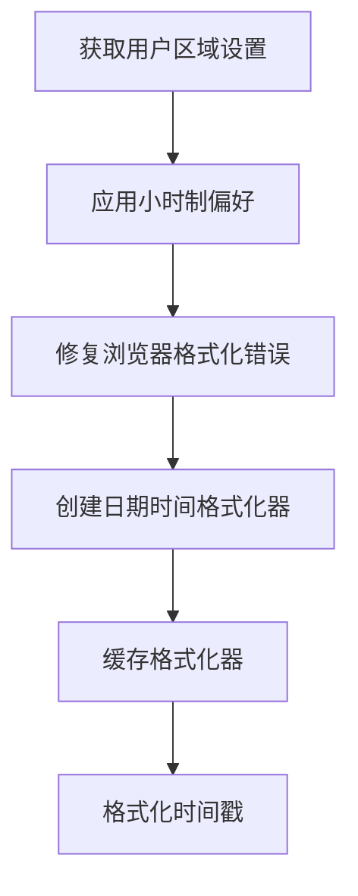
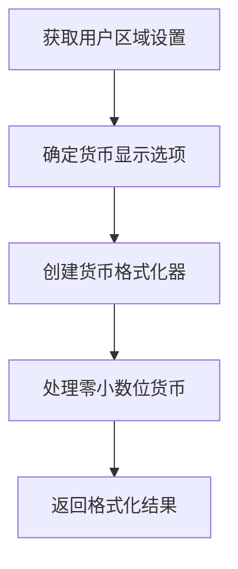
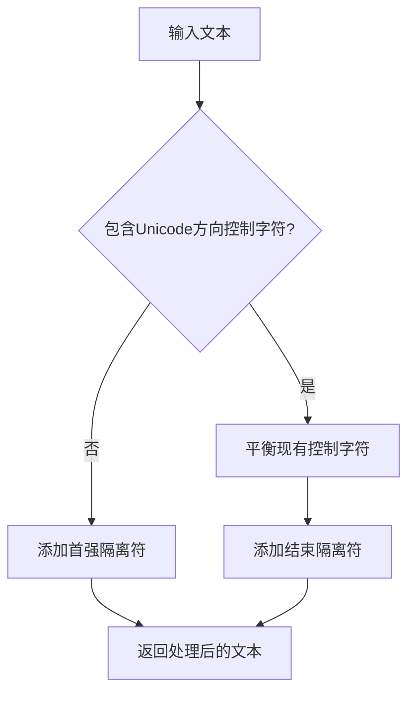
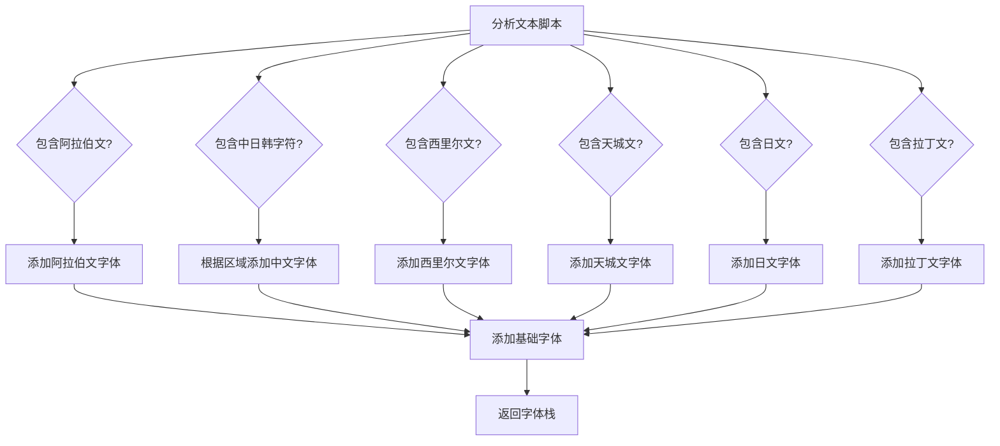
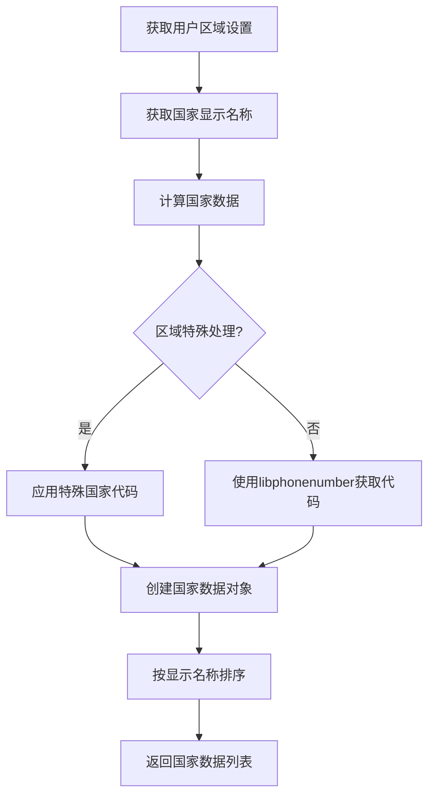
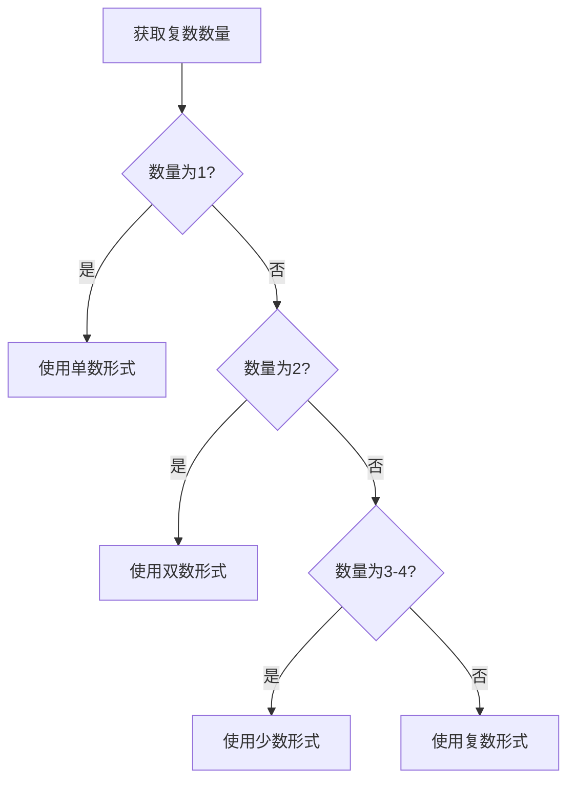
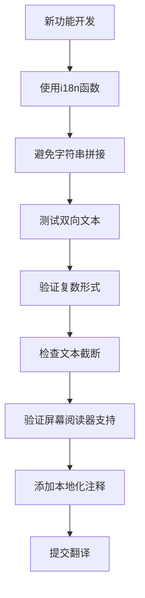

# 本地化最佳实践

<cite>
**本文档中引用的文件**   
- [formatTimestamp.dom.ts](file://ts/util/formatTimestamp.dom.ts)
- [getCountryData.dom.ts](file://ts/util/getCountryData.dom.ts)
- [currency.dom.ts](file://ts/util/currency.dom.ts)
- [setupI18nMain.std.ts](file://ts/util/setupI18nMain.std.ts)
- [unicodeBidi.std.ts](file://ts/util/unicodeBidi.std.ts)
- [getFontNameByTextScript.std.ts](file://ts/util/getFontNameByTextScript.std.ts)
- [messages.json](file://_locales/en/messages.json)
</cite>

## 目录
1. [简介](#简介)
2. [区域特定格式处理](#区域特定格式处理)
3. [文化敏感性考虑](#文化敏感性考虑)
4. [界面布局与文本截断](#界面布局与文本截断)
5. [国家/地区数据与电话号码格式化](#国家-地区数据与电话号码格式化)
6. [可访问性考虑](#可访问性考虑)
7. [复数形式与上下文相关翻译](#复数形式与上下文相关翻译)
8. [开发人员检查清单](#开发人员检查清单)

## 简介

Signal-Desktop的本地化系统旨在为全球用户提供一致且文化敏感的用户体验。本指南详细说明了处理区域特定格式、文化差异、界面布局和可访问性的最佳实践。系统使用ICU（International Components for Unicode）消息格式来处理复杂的语言特性，并利用现代Web API（如Intl）来格式化日期、时间和货币。

**Section sources**
- [setupI18nMain.std.ts](file://ts/util/setupI18nMain.std.ts#L1-L185)

## 区域特定格式处理

### 日期/时间格式化

Signal-Desktop使用`formatTimestamp.dom.ts`文件中的`getDateTimeFormatter`函数来处理日期和时间格式化。该系统基于用户的区域设置和首选项，使用`Intl.DateTimeFormat` API来确保正确的格式化。

**Diagram sources**
- [formatTimestamp.dom.ts](file://ts/util/formatTimestamp.dom.ts#L71-L88)

系统实现了多种时间显示格式：
- `formatDateTimeShort`：用于消息时间戳，根据时间差异显示"现在"、"X分钟前"或日期
- `formatDateTimeLong`：用于详细时间显示，包含"今天"、"昨天"等上下文信息
- `formatTime`：用于精确时间显示，支持12小时制和24小时制

**Section sources**
- [formatTimestamp.dom.ts](file://ts/util/formatTimestamp.dom.ts#L91-L272)

### 数字与货币格式化

货币格式化在`currency.dom.ts`文件中处理，使用`Intl.NumberFormat` API来确保正确的区域特定格式。

**Diagram sources**
- [currency.dom.ts](file://ts/util/currency.dom.ts#L104-L117)

系统特别处理了零小数位货币（如日元、韩元），并支持多种符号显示选项：
- `symbol`：显示标准货币符号（如$、€）
- `narrowSymbol`：显示窄符号（如$代替CA$）
- `none`：不显示货币符号

**Section sources**
- [currency.dom.ts](file://ts/util/currency.dom.ts#L73-L120)

## 文化敏感性考虑

### 双向文本支持

Signal-Desktop通过`unicodeBidi.std.ts`文件中的`bidiIsolate`函数提供双向文本支持。该函数使用Unicode双向控制字符来确保混合方向文本的正确显示。

**Diagram sources**
- [unicodeBidi.std.ts](file://ts/util/unicodeBidi.std.ts#L192-L199)

系统使用以下Unicode控制字符：
- `\u2068` (FSI)：首强隔离符
- `\u2069` (PDI)：弹出方向隔离符
- `\u2066` (LRI)：从左到右隔离符
- `\u2067` (RLI)：从右到左隔离符

**Section sources**
- [unicodeBidi.std.ts](file://ts/util/unicodeBidi.std.ts#L1-L224)

### 文本扩展率与字体兼容性

`getFontNameByTextScript.std.ts`文件处理字体兼容性问题，根据文本内容和用户区域设置选择适当的字体栈。

**Diagram sources**
- [getFontNameByTextScript.std.ts](file://ts/util/getFontNameByTextScript.std.ts#L115-L160)

系统考虑了不同语言的文本扩展率，确保界面元素有足够的空间容纳翻译后的文本，特别是对于德语等扩展率较高的语言。

**Section sources**
- [getFontNameByTextScript.std.ts](file://ts/util/getFontNameByTextScript.std.ts#L1-L161)

## 界面布局与文本截断

Signal-Desktop的界面设计考虑了文本截断问题，特别是在按钮和菜单项中。系统使用以下策略：

1. **弹性布局**：使用CSS Flexbox和Grid布局，允许界面元素根据内容大小自动调整
2. **文本换行**：在适当位置启用文本换行，避免水平滚动
3. **省略号处理**：对于无法换行的短文本，使用CSS `text-overflow: ellipsis`
4. **动态调整**：根据翻译文本长度动态调整组件大小

在`AxoButton.dom.tsx`等组件中，按钮文本的显示经过特别设计，确保在不同语言环境下都能正确显示。

**Section sources**
- [quill/formatting/menu.dom.tsx](file://ts/quill/formatting/menu.dom.tsx#L457-L492)
- [axo/AxoAlertDialog.dom.stories.tsx](file://ts/axo/AxoAlertDialog.dom.stories.tsx#L103-L111)

## 国家/地区数据与电话号码格式化

`getCountryData.dom.ts`文件处理国家/地区数据管理和电话号码格式化。

**Diagram sources**
- [getCountryData.dom.ts](file://ts/util/getCountryData.dom.ts#L65-L87)

系统特别处理了以下特殊区域：
- 南极洲 (AQ)：+672
- 布维岛 (BV)：+55
- 加那利群岛 (IC)：+34
- 戴戈加西亚 (DG)：+246
- 科索沃 (XK)：+383

电话号码格式化依赖于libphonenumber库，确保全球范围内的正确格式化。

**Section sources**
- [getCountryData.dom.ts](file://ts/util/getCountryData.dom.ts#L1-L90)

## 可访问性考虑

Signal-Desktop确保屏幕阅读器能够正确处理本地化内容。系统通过以下方式实现：

1. **ARIA标签**：在`AriaClickable.dom.tsx`中使用适当的ARIA属性
2. **双向文本标记**：使用Unicode控制字符确保屏幕阅读器正确解析混合方向文本
3. **上下文信息**：为时间戳等动态内容提供足够的上下文，如"今天"、"昨天"
4. **替代文本**：为图标和图像提供本地化的替代文本

在`setupI18nMain.std.ts`中，系统通过`normalizeSubstitutions`函数处理替代文本，确保双向文本的正确隔离。

**Section sources**
- [setupI18nMain.std.ts](file://ts/util/setupI18nMain.std.ts#L74-L99)
- [axo/AxoSymbol.dom.stories.tsx](file://ts/axo/AxoSymbol.dom.stories.tsx#L57-L61)

## 复数形式与上下文相关翻译

Signal-Desktop使用ICU消息格式处理复杂的复数形式和上下文相关翻译。在`messages.json`文件中，可以看到多种复数规则的实现。

**Diagram sources**
- [messages.json](file://_locales/sl-SI/messages.json#L1934-L1935)

系统支持多种语言的复数规则，包括：
- 英语：one/other
- 斯洛文尼亚语：one/two/few/other
- 马拉地语：one/other

对于性别特定语言，系统使用上下文相关的翻译键，确保在不同文化背景下使用适当的称谓。

**Section sources**
- [messages.json](file://_locales/mr-IN/messages.json#L1934-L1935)
- [messages.json](file://_locales/sl-SI/messages.json#L1934-L1935)
- [SharedGroupNames.dom.tsx](file://ts/components/SharedGroupNames.dom.tsx#L43-L97)

## 开发人员检查清单

为确保新功能的本地化就绪，开发人员应遵循以下检查清单：

**Diagram sources**
- [setupI18nMain.std.ts](file://ts/util/setupI18nMain.std.ts#L140-L157)

具体检查项包括：
- ✅ 所有用户界面文本都通过`i18n`函数处理
- ✅ 避免使用字符串拼接，使用ICU消息格式的替代参数
- ✅ 测试阿拉伯语、希伯来语等从右到左语言的显示
- ✅ 验证复数形式在不同数量下的正确显示
- ✅ 检查德语、俄语等长文本语言的界面布局
- ✅ 确保屏幕阅读器能够正确读取所有界面元素
- ✅ 为复杂翻译添加上下文注释
- ✅ 提交新字符串到翻译系统

**Section sources**
- [setupI18nMain.std.ts](file://ts/util/setupI18nMain.std.ts#L140-L157)
- [formatTimestamp.dom.ts](file://ts/util/formatTimestamp.dom.ts#L91-L102)