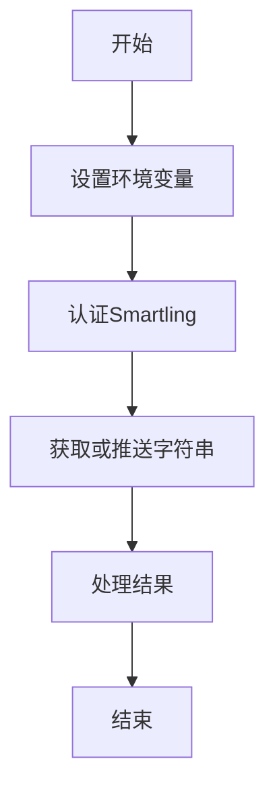
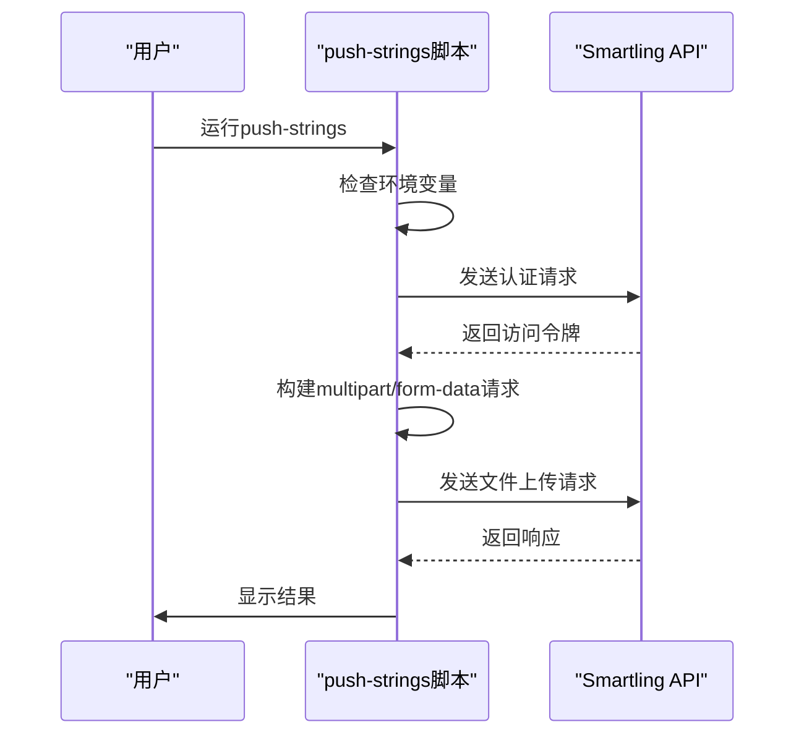
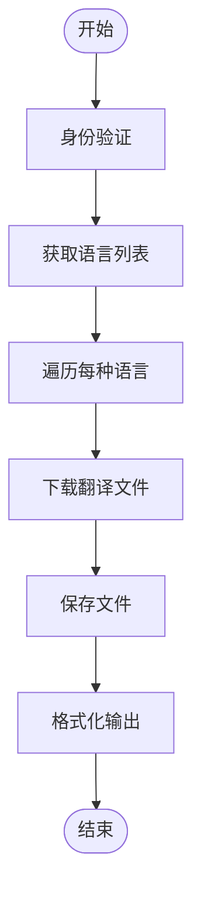
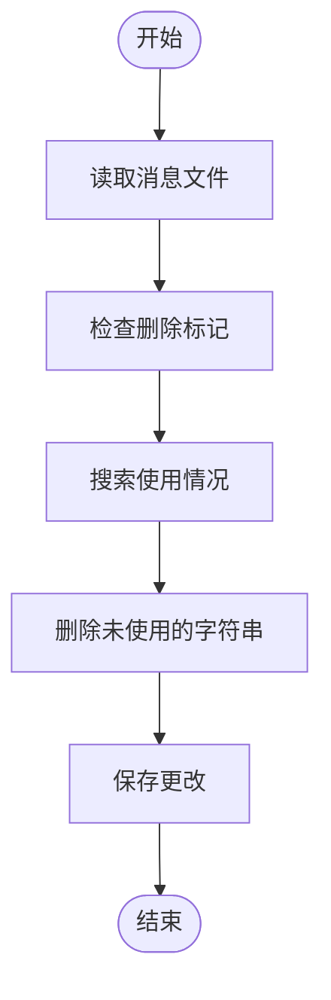

# 外部服务集成

<cite>
**本文档中引用的文件**  
- [.smartling.yml](file://.smartling.yml)
- [.smartling-source-example.sh](file://.smartling-source-example.sh)
- [push-strings.node.ts](file://ts/scripts/push-strings.node.ts)
- [get-strings.node.ts](file://ts/scripts/get-strings.node.ts)
- [smartling.node.ts](file://ts/util/smartling.node.ts)
- [remove-strings.node.ts](file://ts/scripts/remove-strings.node.ts)
- [package.json](file://package.json)
- [gen-locales-config.node.ts](file://ts/scripts/gen-locales-config.node.ts)
</cite>

## 目录
1. [简介](#简介)
2. [项目结构](#项目结构)
3. [核心组件](#核心组件)
4. [架构概述](#架构概述)
5. [详细组件分析](#详细组件分析)
6. [依赖分析](#依赖分析)
7. [性能考虑](#性能考虑)
8. [故障排除指南](#故障排除指南)
9. [结论](#结论)

## 简介
本文档详细解析Signal-Desktop与Smartling翻译平台的集成机制。文档涵盖.smartling.yml配置文件的各个部分，包括项目设置、文件类型配置、翻译记忆库选项和质量保证规则。同时，文档解释了如何通过API密钥和项目ID建立安全连接，以及push-strings脚本如何利用Smartling API执行字符串推送操作，包括错误处理和重试机制。此外，文档还说明了如何配置自动化工作流，如自动推送新字符串和拉取已完成的翻译，并涵盖安全考虑，如API密钥管理、数据加密传输和访问控制。

## 项目结构
Signal-Desktop项目的结构清晰，主要包含以下几个部分：
- `_locales`：包含各种语言的翻译文件，每个语言目录下都有一个messages.json文件。
- `app`：包含主应用程序的代码。
- `config`：包含不同环境的配置文件。
- `scripts`：包含各种脚本，如构建、测试和部署脚本。
- `ts`：包含TypeScript源代码，包括脚本和工具。

**Section sources**
- [project_structure](file://project_structure)

## 核心组件
### .smartling.yml 配置文件
该文件包含了与Smartling平台集成所需的基本配置信息，包括账户ID和项目ID。

```yaml
account_id: '92ff14ad'
project_id: 'ef62d1ebb'
```

**Section sources**
- [.smartling.yml](file://.smartling.yml#L6-L7)

### .smartling-source-example.sh 脚本
该脚本用于设置环境变量，以便在运行get-strings或push-strings命令前提供Smartling的用户标识和密钥。

```bash
export SMARTLING_USER="your token 'user identifier' here"
export SMARTLING_SECRET="your token secret here"
```

**Section sources**
- [.smartling-source-example.sh](file://.smartling-source-example.sh#L8-L9)

## 架构概述
Signal-Desktop通过一系列脚本和配置文件与Smartling平台进行集成。这些脚本负责从Smartling获取最新的翻译、推送新的字符串到Smartling，以及管理翻译文件的生命周期。



**Diagram sources**
- [push-strings.node.ts](file://ts/scripts/push-strings.node.ts#L11-L72)
- [get-strings.node.ts](file://ts/scripts/get-strings.node.ts#L1-L45)

## 详细组件分析
### push-strings 脚本
该脚本负责将新的字符串推送到Smartling平台。它首先检查是否设置了必要的环境变量（SMARTLING_USER和SMARTLING_SECRET），然后使用这些凭据进行身份验证。接着，它构建一个multipart/form-data请求，将_en/messages.json_文件作为附件发送给Smartling。

#### 关键步骤
1. **环境变量检查**：确保SMARTLING_USER和SMARTLING_SECRET已设置。
2. **身份验证**：调用`authenticate`函数，使用提供的凭据获取访问令牌。
3. **构建请求体**：创建一个包含文件URI、文件类型和文件内容的multipart/form-data请求体。
4. **发送请求**：向Smartling API发送POST请求，上传文件。
5. **错误处理**：如果请求失败，抛出异常并退出脚本。



**Diagram sources**
- [push-strings.node.ts](file://ts/scripts/push-strings.node.ts#L11-L72)

### get-strings 脚本
该脚本负责从Smartling平台获取最新的翻译。它首先进行身份验证，然后遍历所有支持的语言，下载对应的翻译文件，并将其保存到本地。

#### 关键步骤
1. **身份验证**：与push-strings脚本相同，使用SMARTLING_USER和SMARTLING_SECRET进行身份验证。
2. **获取语言列表**：从Smartling API获取所有支持的语言。
3. **下载翻译文件**：为每种语言构造请求URL，下载翻译文件。
4. **保存文件**：将下载的翻译文件保存到相应的语言目录中。
5. **格式化输出**：使用Prettier工具对JSON文件进行格式化。



**Diagram sources**
- [get-strings.node.ts](file://ts/scripts/get-strings.node.ts#L1-L45)

### remove-strings 脚本
该脚本用于删除不再使用的字符串。它会检查_en/messages.json_文件中的每个字符串，如果发现某个字符串的描述中包含"Deleted"字样且超过一个月，则尝试从代码库中查找该字符串的使用情况。如果没有找到使用，则从文件中删除该字符串。

#### 关键步骤
1. **读取消息文件**：加载_en/messages.json_文件。
2. **检查删除标记**：遍历所有字符串，查找带有"Deleted"标记的条目。
3. **检查使用情况**：使用`git grep`命令在代码库中搜索该字符串的使用。
4. **删除未使用的字符串**：如果没有找到使用，则从文件中删除该字符串。
5. **保存更改**：将修改后的文件写回磁盘。



**Diagram sources**
- [remove-strings.node.ts](file://ts/scripts/remove-strings.node.ts#L1-L106)

## 依赖分析
Signal-Desktop项目依赖于多个外部库来实现与Smartling平台的集成。主要依赖包括：
- `node-fetch`：用于发起HTTP请求。
- `fast-glob`：用于文件路径匹配。
- `prettier`：用于代码格式化。
- `p-map`：用于并行处理任务。
- `zod`：用于数据验证。

这些依赖项在package.json文件中定义，并通过pnpm进行管理。

**Section sources**
- [package.json](file://package.json#L119-L225)

## 性能考虑
在处理大量翻译文件时，性能是一个重要的考虑因素。为了提高效率，Signal-Desktop采用了以下策略：
- **并行处理**：使用`p-map`库并行处理多个语言的翻译文件下载。
- **缓存机制**：利用Prettier的缓存功能减少重复的格式化操作。
- **批量操作**：尽可能地批量处理文件读写操作，减少I/O开销。

尽管如此，在处理非常大的项目时，仍可能遇到性能瓶颈。建议定期监控脚本的执行时间和资源消耗，以确保系统的稳定运行。

## 故障排除指南
### 常见问题及解决方案
1. **认证失败**
   - **症状**：脚本输出“Failed to authenticate with Smartling”。
   - **原因**：SMARTLING_USER或SMARTLING_SECRET环境变量未正确设置。
   - **解决方案**：确保在运行脚本前正确设置了这两个环境变量。

2. **文件上传失败**
   - **症状**：脚本输出“Failed to push strings”。
   - **原因**：可能是网络问题或Smartling API暂时不可用。
   - **解决方案**：检查网络连接，稍后重试。如果问题持续存在，请联系Smartling支持。

3. **翻译文件缺失**
   - **症状**：某些语言的翻译文件未更新。
   - **原因**：可能是get-strings脚本执行过程中出现错误。
   - **解决方案**：检查脚本日志，确认是否有任何错误信息。可以尝试手动运行脚本以获取更详细的输出。

4. **字符串删除失败**
   - **症状**：已标记为删除的字符串仍然存在于代码中。
   - **原因**：可能是remove-strings脚本未能正确识别字符串的使用情况。
   - **解决方案**：检查git grep命令的输出，确认是否正确找到了字符串的使用位置。必要时可以手动删除。

### 调试技巧
- **启用详细日志**：在运行脚本时添加`--verbose`参数，以获取更详细的输出信息。
- **检查环境变量**：使用`printenv`命令检查所有相关的环境变量是否已正确设置。
- **验证API响应**：使用curl或Postman等工具直接调用Smartling API，验证其响应是否符合预期。

**Section sources**
- [push-strings.node.ts](file://ts/scripts/push-strings.node.ts#L63-L65)
- [get-strings.node.ts](file://ts/scripts/get-strings.node.ts#L115-L117)
- [remove-strings.node.ts](file://ts/scripts/remove-strings.node.ts#L76-L84)

## 结论
Signal-Desktop与Smartling翻译平台的集成通过一系列精心设计的脚本和配置文件实现。这些组件共同工作，确保了翻译内容的高效管理和同步。通过理解这些组件的工作原理和相互关系，开发人员可以更好地维护和优化这一集成过程，从而提升产品的国际化水平。