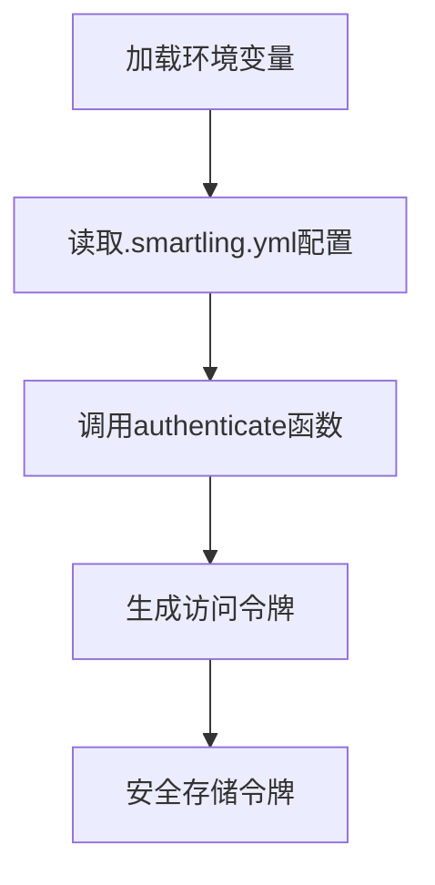
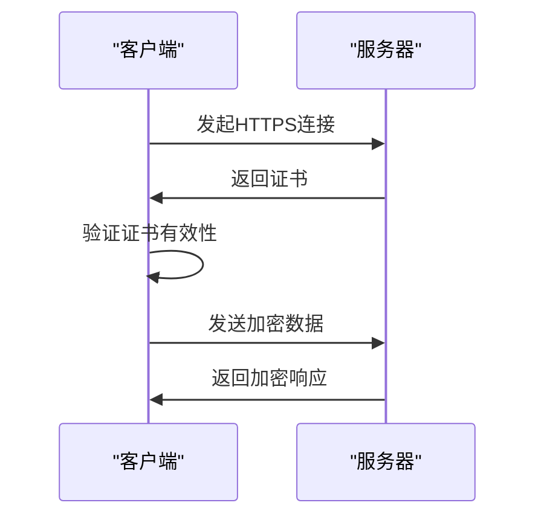
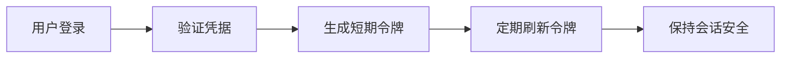
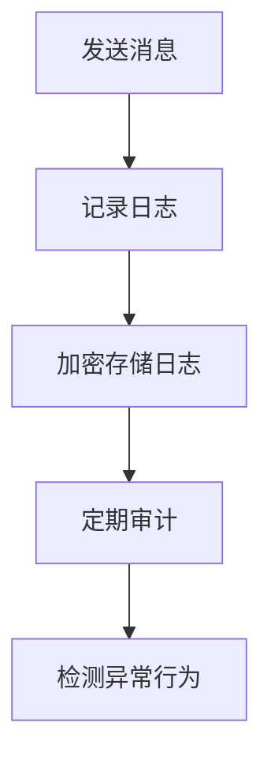
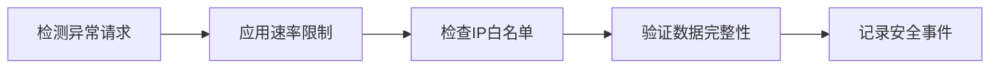
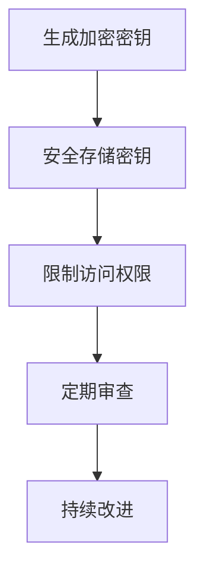

# 安全机制

<cite>
**本文档中引用的文件**  
- [.smartling.yml](file://.smartling.yml)
- [.smartling-source-example.sh](file://.smartling-source-example.sh)
- [smartling.node.ts](file://ts/util/smartling.node.ts)
- [config.main.ts](file://app/config.main.ts)
- [base_config.node.ts](file://app/base_config.node.ts)
- [default.json](file://config/default.json)
- [production.json](file://config/production.json)
- [SocketManager.preload.ts](file://ts/textsecure/SocketManager.preload.ts)
- [WebAPI.preload.ts](file://ts/textsecure/WebAPI.preload.ts)
- [groupCredentialFetcher.preload.ts](file://ts/services/groupCredentialFetcher.preload.ts)
- [senderCertificate.preload.ts](file://ts/services/senderCertificate.preload.ts)
- [handleMessageSend.preload.ts](file://ts/util/handleMessageSend.preload.ts)
- [main.main.ts](file://app/main.main.ts)
- [Crypto.node.ts](file://ts/Crypto.node.ts)
- [AttachmentCrypto.node.ts](file://ts/AttachmentCrypto.node.ts)
</cite>

## 目录
1. [简介](#简介)
2. [API密钥存储与访问控制](#api密钥存储与访问控制)
3. [HTTPS通信安全](#https通信安全)
4. [身份验证与令牌刷新](#身份验证与令牌刷新)
5. [安全审计日志与监控](#安全审计日志与监控)
6. [安全漏洞缓解措施](#安全漏洞缓解措施)
7. [安全最佳实践](#安全最佳实践)
8. [结论](#结论)

## 简介
Signal-Desktop与Smartling集成的安全机制旨在确保翻译流程的安全性，同时保护用户数据和通信隐私。该机制涵盖了API密钥管理、HTTPS通信、身份验证流程、安全审计以及漏洞缓解等多个方面。通过严格的加密存储、环境变量管理和证书验证，系统确保了敏感信息的安全性和通信的完整性。

## API密钥存储与访问控制
Signal-Desktop通过环境变量和加密存储方案管理API密钥，确保密钥的安全性。Smartling集成使用`.smartling-source-example.sh`文件中的环境变量`SMARTLING_USER`和`SMARTLING_SECRET`来存储用户标识和密钥。这些密钥在运行时通过`source .smartling-source.sh`命令加载，避免了硬编码密钥的风险。

密钥的访问控制通过`smartling.node.ts`文件中的`authenticate`函数实现。该函数使用`userIdentifier`和`userSecret`进行身份验证，并生成访问令牌。密钥的存储路径在`config.main.ts`中通过`NODE_CONFIG_DIR`环境变量指定，确保配置文件的安全加载。

**图表来源**  
- [.smartling-source-example.sh](file://.smartling-source-example.sh#L8-L9)
- [smartling.node.ts](file://ts/util/smartling.node.ts#L15-L41)
- [config.main.ts](file://app/config.main.ts#L30-L31)

**本节来源**  
- [.smartling.yml](file://.smartling.yml#L6-L7)
- [.smartling-source-example.sh](file://.smartling-source-example.sh#L8-L9)
- [smartling.node.ts](file://ts/util/smartling.node.ts#L7-L41)
- [config.main.ts](file://app/config.main.ts#L30-L31)

## HTTPS通信安全
Signal-Desktop通过严格的HTTPS通信确保数据传输的安全性。系统使用`default.json`和`production.json`中的`serverUrl`、`storageUrl`等配置项指定安全的HTTPS端点。通信过程中，系统验证服务器证书的有效性，防止中间人攻击。

在`SocketManager.preload.ts`中，`authenticate`函数通过HTTPS连接到服务器，并验证响应的完整性。系统还使用`certificateAuthority`字段中的证书颁发机构信息来验证服务器证书的合法性，确保通信的端到端安全。

**图表来源**  
- [default.json](file://config/default.json#L2-L26)
- [production.json](file://config/production.json#L2-L23)
- [SocketManager.preload.ts](file://ts/textsecure/SocketManager.preload.ts#L159-L198)

**本节来源**  
- [default.json](file://config/default.json#L2-L26)
- [production.json](file://config/production.json#L2-L23)
- [SocketManager.preload.ts](file://ts/textsecure/SocketManager.preload.ts#L159-L198)

## 身份验证与令牌刷新
身份验证流程通过`WebAPI.preload.ts`中的`authenticate`函数实现。该函数接收用户名和密码，并通过`socketManager.authenticate`方法进行身份验证。系统使用短期令牌和刷新机制确保会话的安全性，避免长期有效的令牌被滥用。

令牌刷新机制在`groupCredentialFetcher.preload.ts`中实现。系统定期检查凭证的有效性，并在必要时通过`maybeFetchNewCredentials`函数获取新的凭证。这一机制确保了即使令牌过期，系统也能自动刷新，保持会话的连续性。

**图表来源**  
- [WebAPI.preload.ts](file://ts/textsecure/WebAPI.preload.ts#L1957-L1964)
- [groupCredentialFetcher.preload.ts](file://ts/services/groupCredentialFetcher.preload.ts#L156-L308)

**本节来源**  
- [WebAPI.preload.ts](file://ts/textsecure/WebAPI.preload.ts#L1957-L1964)
- [groupCredentialFetcher.preload.ts](file://ts/services/groupCredentialFetcher.preload.ts#L156-L308)

## 安全审计日志与监控
安全审计日志通过`handleMessageSend.preload.ts`中的`maybeSaveToSendLog`函数实现。该函数记录发送消息的详细信息，包括消息ID、发送类型和时间戳。日志信息存储在加密的数据库中，确保数据的机密性和完整性。

监控策略通过`senderCertificate.preload.ts`中的`get`函数实现。系统定期检查发送者证书的有效性，并在证书即将过期时自动获取新的证书。这一机制确保了通信的持续安全，并提供了详细的日志记录用于审计。

**图表来源**  
- [handleMessageSend.preload.ts](file://ts/util/handleMessageSend.preload.ts#L234-L288)
- [senderCertificate.preload.ts](file://ts/services/senderCertificate.preload.ts#L77-L204)

**本节来源**  
- [handleMessageSend.preload.ts](file://ts/util/handleMessageSend.preload.ts#L234-L288)
- [senderCertificate.preload.ts](file://ts/services/senderCertificate.preload.ts#L77-L204)

## 安全漏洞缓解措施
Signal-Desktop通过多种措施缓解安全漏洞。速率限制在`SocketManager.preload.ts`中实现，防止恶意用户通过高频请求耗尽服务器资源。IP白名单通过配置文件中的`cdn`字段实现，限制访问来源。

异常检测通过`Crypto.node.ts`中的加密算法实现。系统使用AES-CTR模式加密数据，并通过HMAC验证数据完整性。任何解密失败的尝试都会被记录并触发警报，防止数据泄露。

**图表来源**  
- [SocketManager.preload.ts](file://ts/textsecure/SocketManager.preload.ts#L322-L332)
- [Crypto.node.ts](file://ts/Crypto.node.ts#L127-L159)
- [AttachmentCrypto.node.ts](file://ts/AttachmentCrypto.node.ts#L118-L165)

**本节来源**  
- [SocketManager.preload.ts](file://ts/textsecure/SocketManager.preload.ts#L322-L332)
- [Crypto.node.ts](file://ts/Crypto.node.ts#L127-L159)
- [AttachmentCrypto.node.ts](file://ts/AttachmentCrypto.node.ts#L118-L165)

## 安全最佳实践
Signal-Desktop遵循多项安全最佳实践。首先，所有敏感数据均通过加密存储，确保即使数据泄露也无法被读取。其次，系统使用最小权限原则，限制各组件的访问权限。此外，定期安全审查和漏洞扫描确保系统持续符合安全标准。

加密密钥通过`main.main.ts`中的`getSQLKey`函数生成和管理。系统使用安全的随机数生成器创建密钥，并通过安全存储后端保护密钥。任何密钥访问尝试都会被记录并审计。

**图表来源**  
- [main.main.ts](file://app/main.main.ts#L1627-L1666)
- [Crypto.node.ts](file://ts/Crypto.node.ts#L161-L167)

**本节来源**  
- [main.main.ts](file://app/main.main.ts#L1627-L1666)
- [Crypto.node.ts](file://ts/Crypto.node.ts#L161-L167)

## 结论
Signal-Desktop与Smartling集成的安全机制通过多层次的安全措施确保了系统的整体安全性。从API密钥管理到HTTPS通信，从身份验证到安全审计，每个环节都经过精心设计和严格实施。通过遵循安全最佳实践和定期审查，系统能够有效抵御各种安全威胁，保护用户数据和隐私。