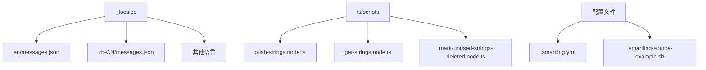
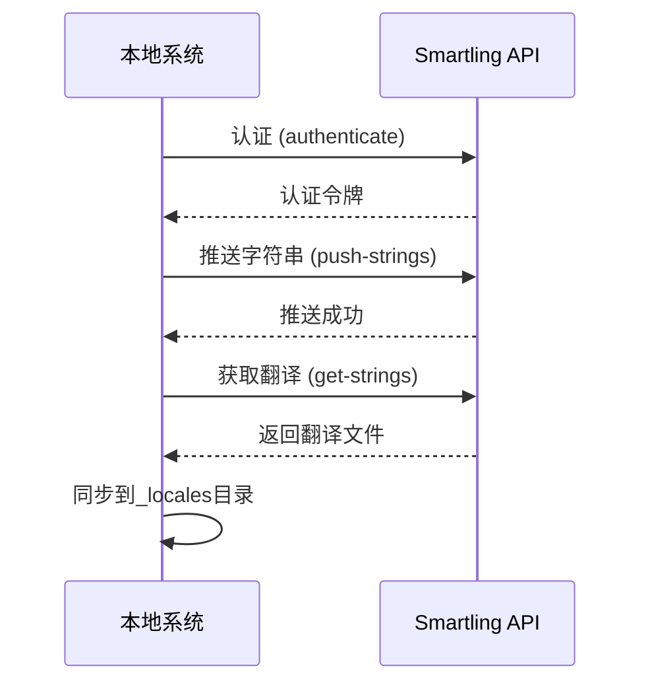
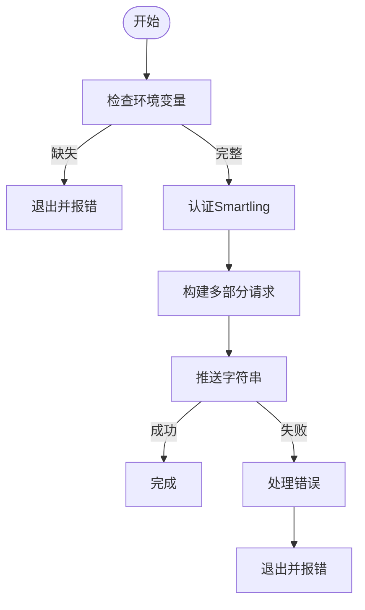
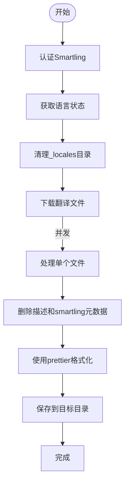
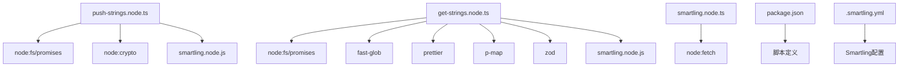

# 自动化流程

<cite>
**本文档中引用的文件**  
- [push-strings.node.ts](file://ts/scripts/push-strings.node.ts)
- [get-strings.node.ts](file://ts/scripts/get-strings.node.ts)
- [smartling.node.ts](file://ts/util/smartling.node.ts)
- [package.json](file://package.json)
- [.smartling.yml](file://.smartling.yml)
- [.smartling-source-example.sh](file://.smartling-source-example.sh)
- [mark-unused-strings-deleted.node.ts](file://ts/scripts/mark-unused-strings-deleted.node.ts)
</cite>

## 目录
1. [简介](#简介)
2. [项目结构](#项目结构)
3. [核心组件](#核心组件)
4. [架构概述](#架构概述)
5. [详细组件分析](#详细组件分析)
6. [依赖分析](#依赖分析)
7. [性能考虑](#性能考虑)
8. [故障排除指南](#故障排除指南)
9. [结论](#结论)

## 简介
本文档全面解释了Signal-Desktop项目中翻译自动化流程的工作机制。重点介绍`push-strings`脚本的字符串提取、格式转换、API调用和错误处理流程。同时描述了定时任务和CI/CD集成的设置方法，以实现自动化的翻译同步。文档还涵盖了错误重试策略、失败通知机制、性能优化建议（如批量处理和并发控制）、监控和报告功能，以及自定义自动化工作流的扩展指南。

## 项目结构
Signal-Desktop项目的翻译自动化流程主要围绕`_locales`目录和一系列脚本文件构建。`_locales`目录包含所有语言的翻译文件，每个子目录对应一种语言，包含`messages.json`文件。自动化脚本位于`ts/scripts`目录下，包括`push-strings.node.ts`、`get-strings.node.ts`等关键文件。

**图示来源**
- [_locales](file://_locales)
- [ts/scripts](file://ts/scripts)
- [.smartling.yml](file://.smartling.yml)
- [.smartling-source-example.sh](file://.smartling-source-example.sh)

**本节来源**
- [_locales](file://_locales)
- [ts/scripts](file://ts/scripts)

## 核心组件
核心组件包括`push-strings.node.ts`、`get-strings.node.ts`和`smartling.node.ts`。这些脚本共同实现了翻译的推送、获取和认证功能。`push-strings.node.ts`负责将英文字符串推送到Smartling平台，`get-strings.node.ts`从Smartling获取翻译后的字符串，`smartling.node.ts`提供认证和API基础配置。

**本节来源**
- [push-strings.node.ts](file://ts/scripts/push-strings.node.ts)
- [get-strings.node.ts](file://ts/scripts/get-strings.node.ts)
- [smartling.node.ts](file://ts/util/smartling.node.ts)

## 架构概述
翻译自动化流程的架构分为三个主要部分：字符串提取、API通信和本地同步。首先，`push-strings`脚本从`_locales/en/messages.json`提取字符串；然后通过Smartling API将字符串推送到翻译平台；最后，`get-strings`脚本从平台获取翻译结果并同步到本地文件系统。

**图示来源**
- [push-strings.node.ts](file://ts/scripts/push-strings.node.ts)
- [get-strings.node.ts](file://ts/scripts/get-strings.node.ts)
- [smartling.node.ts](file://ts/util/smartling.node.ts)

## 详细组件分析

### push-strings脚本分析
`push-strings.node.ts`脚本负责将英文字符串推送到Smartling平台。脚本首先验证环境变量`SMARTLING_USER`和`SMARTLING_SECRET`，然后通过`authenticate`函数获取认证令牌。使用多部分表单数据格式构建请求体，包含文件URI、文件类型和文件内容。

**图示来源**
- [push-strings.node.ts](file://ts/scripts/push-strings.node.ts)

**本节来源**
- [push-strings.node.ts](file://ts/scripts/push-strings.node.ts)

### get-strings脚本分析
`get-strings.node.ts`脚本从Smartling平台获取翻译后的字符串。脚本首先获取所有可用语言的状态，然后并发地下载每个语言的翻译文件。下载后，脚本会删除描述字段和smartling元数据，使用prettier格式化JSON文件，并保存到相应的语言目录中。

**图示来源**
- [get-strings.node.ts](file://ts/scripts/get-strings.node.ts)

**本节来源**
- [get-strings.node.ts](file://ts/scripts/get-strings.node.ts)

### 错误处理与重试机制
自动化流程包含完善的错误处理机制。所有主要操作都包含try-catch块，确保在发生错误时能够捕获并记录错误信息。对于网络请求，脚本会检查响应状态码，并在失败时抛出包含详细信息的错误。虽然当前代码未实现自动重试，但可以通过包装fetch调用添加重试逻辑。

**本节来源**
- [push-strings.node.ts](file://ts/scripts/push-strings.node.ts)
- [get-strings.node.ts](file://ts/scripts/get-strings.node.ts)

## 依赖分析
翻译自动化流程依赖多个外部库和配置文件。主要依赖包括`node:fs/promises`用于文件操作，`fast-glob`用于文件路径匹配，`prettier`用于代码格式化，`p-map`用于并发处理，`zod`用于数据验证。配置文件`.smartling.yml`包含Smartling账户和项目ID，`.smartling-source-example.sh`提供环境变量示例。

**图示来源**
- [package.json](file://package.json)
- [.smartling.yml](file://.smartling.yml)

**本节来源**
- [package.json](file://package.json)
- [.smartling.yml](file://.smartling.yml)

## 性能考虑
为了优化性能，`get-strings`脚本使用`p-map`库实现并发下载，设置并发限制为20。这可以显著减少下载所有翻译文件的总时间。`push-strings`脚本虽然没有显式的并发控制，但由于只推送一个文件，性能影响较小。建议在大规模项目中实现批量处理和更精细的并发控制。

**本节来源**
- [get-strings.node.ts](file://ts/scripts/get-strings.node.ts)

## 故障排除指南
常见问题包括环境变量未设置、网络连接失败和认证错误。确保`SMARTLING_USER`和`SMARTLING_SECRET`环境变量正确设置。检查网络连接是否正常，特别是对`api.smartling.com`的访问。如果认证失败，请验证用户标识符和密钥是否正确。对于文件操作错误，检查文件路径和权限。

**本节来源**
- [push-strings.node.ts](file://ts/scripts/push-strings.node.ts)
- [get-strings.node.ts](file://ts/scripts/get-strings.node.ts)

## 结论
Signal-Desktop的翻译自动化流程通过一系列精心设计的脚本实现了高效的翻译管理。`push-strings`和`get-strings`脚本分别处理字符串的推送和获取，`smartling.node.ts`提供统一的认证和API配置。流程包含完善的错误处理和性能优化措施。通过CI/CD集成，可以实现完全自动化的翻译同步，大大提高多语言支持的效率和质量。