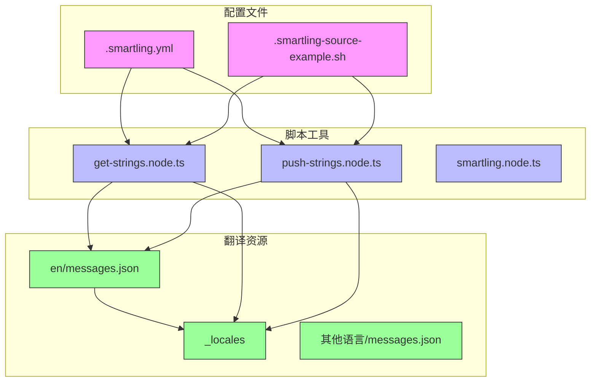
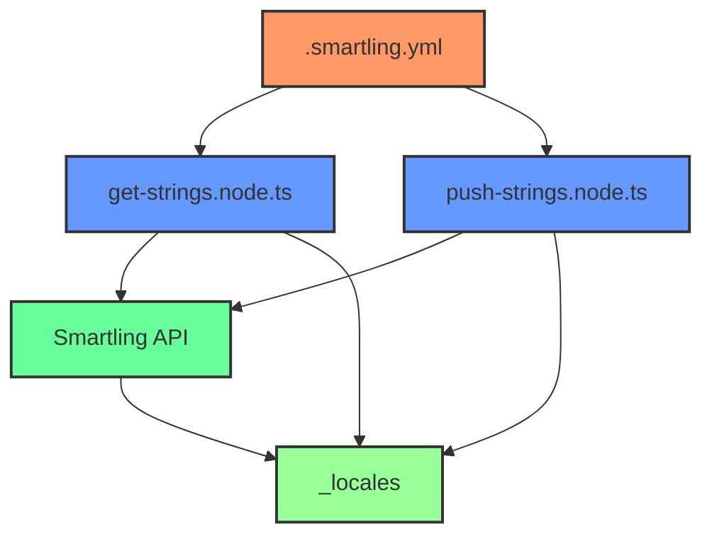
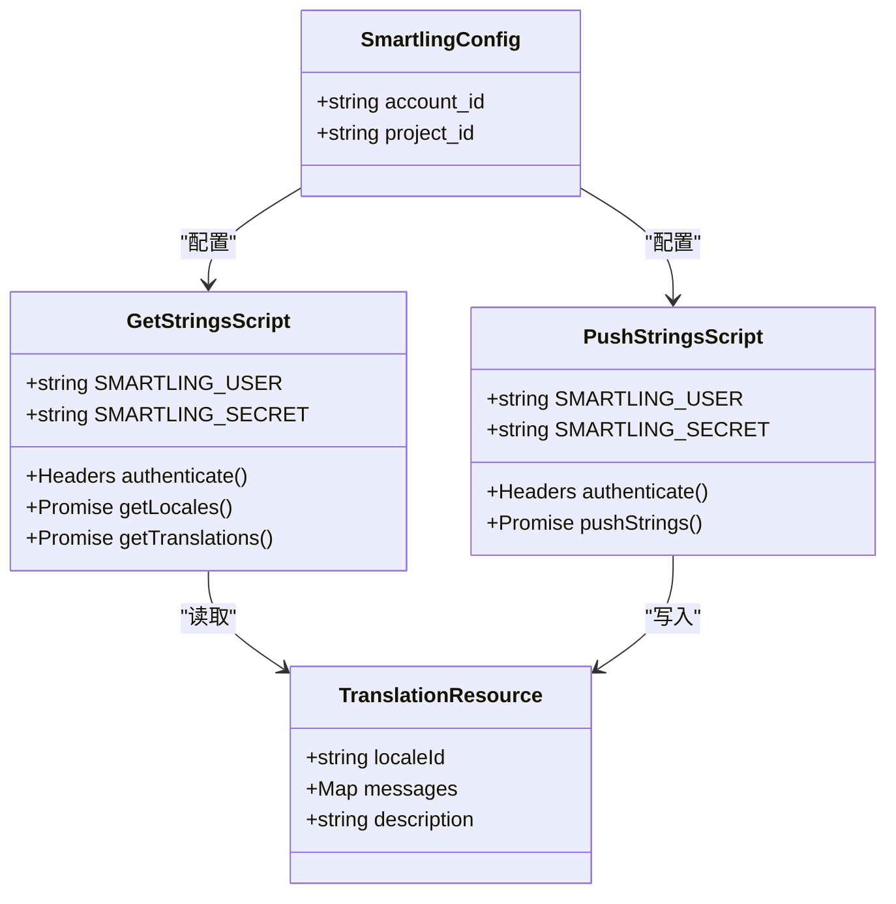
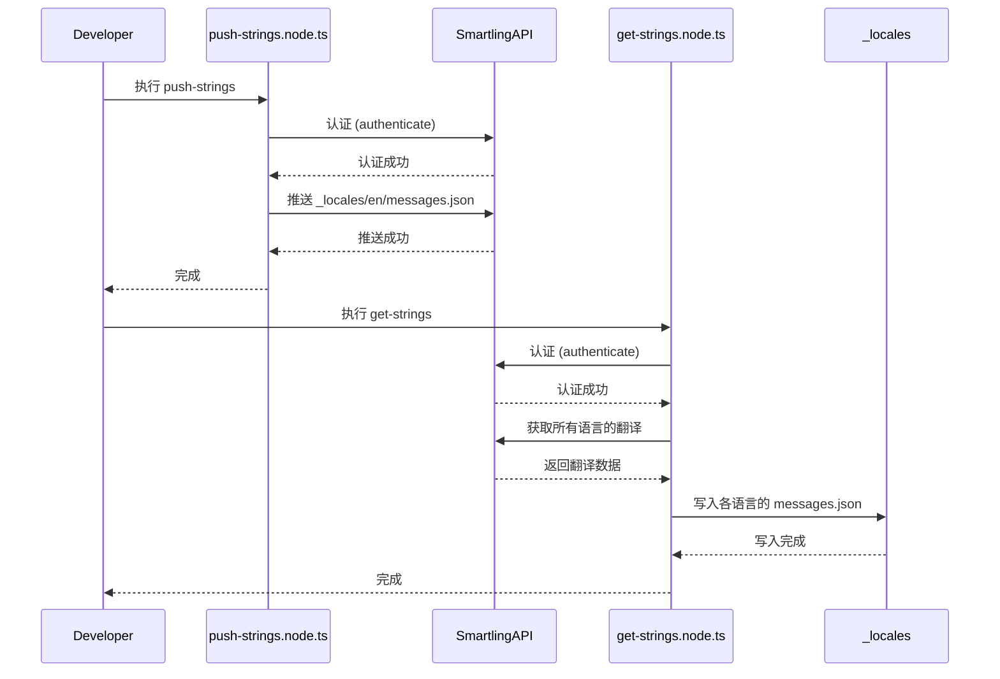
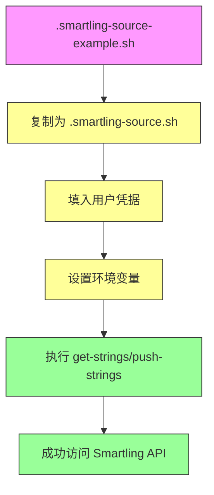
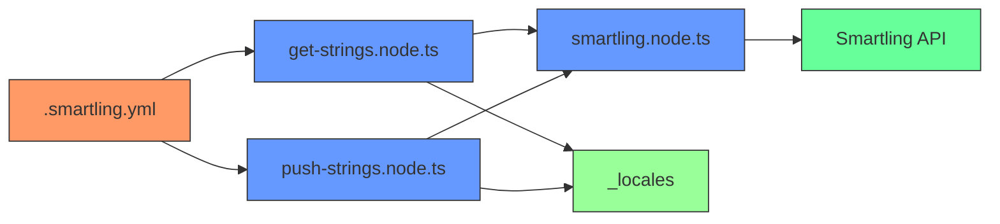

# 配置管理

<cite>
**本文档中引用的文件**   
- [.smartling.yml](file://.smartling.yml)
- [_locales/en/messages.json](file://_locales/en/messages.json)
- [ts/util/smartling.node.ts](file://ts/util/smartling.node.ts)
- [ts/scripts/get-strings.node.ts](file://ts/scripts/get-strings.node.ts)
- [ts/scripts/push-strings.node.ts](file://ts/scripts/push-strings.node.ts)
- [.smartling-source-example.sh](file://.smartling-source-example.sh)
</cite>

## 目录
1. [简介](#简介)
2. [项目结构](#项目结构)
3. [核心组件](#核心组件)
4. [架构概述](#架构概述)
5. [详细组件分析](#详细组件分析)
6. [依赖分析](#依赖分析)
7. [性能考虑](#性能考虑)
8. [故障排除指南](#故障排除指南)
9. [结论](#结论)

## 简介
Signal-Desktop项目使用Smartling平台进行多语言翻译管理，通过.smartling.yml配置文件定义翻译流程的核心参数。该配置文件与一系列脚本和工具协同工作，实现了从源语言提取到目标语言同步的完整国际化工作流。本文档深入解析.smartling.yml配置文件的各个组成部分，包括项目标识、文件类型设置、源语言和目标语言配置等关键要素，并提供配置最佳实践和常见问题解决方案。

## 项目结构
Signal-Desktop项目的国际化架构围绕_locales目录组织，该目录包含所有支持的语言环境。每个语言环境子目录（如af-ZA、ar、de等）都包含一个messages.json文件，存储该语言的翻译字符串。核心配置由.smartling.yml文件管理，该文件位于项目根目录，定义了与Smartling翻译平台的连接参数和同步规则。翻译工作流通过get-strings和push-strings等脚本自动化执行，这些脚本位于ts/scripts目录中，与Smartling API进行交互以获取和推送翻译内容。

**Diagram sources**
- [.smartling.yml](file://.smartling.yml)
- [ts/scripts/get-strings.node.ts](file://ts/scripts/get-strings.node.ts)
- [ts/scripts/push-strings.node.ts](file://ts/scripts/push-strings.node.ts)
- [_locales](file://_locales)

**Section sources**
- [.smartling.yml](file://.smartling.yml)
- [_locales](file://_locales)
- [ts/scripts](file://ts/scripts)

## 核心组件
Signal-Desktop的翻译配置系统由多个核心组件构成，包括.smartling.yml配置文件、Smartling API交互脚本和翻译资源文件。.smartling.yml文件定义了项目与Smartling平台的基本连接参数，如account_id和project_id。get-strings.node.ts和push-strings.node.ts脚本实现了从Smartling获取翻译和向Smartling推送源字符串的功能。smartling.node.ts文件提供了与Smartling API认证和通信的底层功能。这些组件共同构成了一个完整的翻译管理流水线，确保多语言资源的准确同步和高效管理。

**Section sources**
- [.smartling.yml](file://.smartling.yml)
- [ts/scripts/get-strings.node.ts](file://ts/scripts/get-strings.node.ts)
- [ts/scripts/push-strings.node.ts](file://ts/scripts/push-strings.node.ts)
- [ts/util/smartling.node.ts](file://ts/util/smartling.node.ts)

## 架构概述
Signal-Desktop的翻译管理架构采用分层设计，将配置、工具和资源分离。顶层是.smartling.yml配置文件，它定义了与Smartling平台的连接参数。中间层是Node.js脚本，包括get-strings和push-strings，它们读取配置并执行具体的API调用。底层是_locales目录中的翻译资源文件，存储实际的翻译内容。这种架构实现了关注点分离，使得配置管理、流程执行和数据存储各司其职，提高了系统的可维护性和可扩展性。

**Diagram sources**
- [.smartling.yml](file://.smartling.yml)
- [ts/scripts/get-strings.node.ts](file://ts/scripts/get-strings.node.ts)
- [ts/scripts/push-strings.node.ts](file://ts/scripts/push-strings.node.ts)
- [ts/util/smartling.node.ts](file://ts/util/smartling.node.ts)

## 详细组件分析

### .smartling.yml 配置文件分析
.smartling.yml文件是Signal-Desktop翻译配置的核心，它定义了与Smartling平台的基本连接参数。该文件包含account_id和project_id两个关键字段，用于标识特定的Smartling账户和项目。这些标识符确保翻译请求被正确路由到相应的项目空间。配置文件还隐式定义了文件同步的路径和格式，通过与get-strings和push-strings脚本的约定，确定了源字符串文件（_locales/en/messages.json）的位置和格式。

**Diagram sources**
- [.smartling.yml](file://.smartling.yml)
- [ts/scripts/get-strings.node.ts](file://ts/scripts/get-strings.node.ts)
- [ts/scripts/push-strings.node.ts](file://ts/scripts/push-strings.node.ts)

### 翻译工作流分析
Signal-Desktop的翻译工作流由一系列协调的步骤组成，确保翻译资源的准确同步。工作流始于源字符串的提取和推送，通过push-strings脚本将_en/messages.json中的新字符串发送到Smartling平台。翻译完成后，通过get-strings脚本从Smartling获取已翻译的字符串，并将其写入相应的语言环境目录。这个过程通过自动化脚本实现，减少了人为错误的可能性，并确保了翻译资源的一致性。

**Diagram sources**
- [ts/scripts/push-strings.node.ts](file://ts/scripts/push-strings.node.ts)
- [ts/scripts/get-strings.node.ts](file://ts/scripts/get-strings.node.ts)
- [ts/util/smartling.node.ts](file://ts/util/smartling.node.ts)
- [_locales](file://_locales)

### 环境配置管理
Signal-Desktop通过.smartling-source-example.sh文件提供环境配置管理的最佳实践。该文件定义了SMARTLING_USER和SMARTLING_SECRET环境变量，这些变量包含访问Smartling API所需的认证凭据。通过将敏感信息存储在环境变量中而不是硬编码在配置文件中，项目实现了安全的凭据管理。开发人员可以复制这个示例文件并填入自己的凭据，从而在本地环境中安全地使用翻译工具。

**Diagram sources**
- [.smartling-source-example.sh](file://.smartling-source-example.sh)

**Section sources**
- [.smartling-source-example.sh](file://.smartling-source-example.sh)
- [ts/scripts/get-strings.node.ts](file://ts/scripts/get-strings.node.ts)
- [ts/scripts/push-strings.node.ts](file://ts/scripts/push-strings.node.ts)

## 依赖分析
Signal-Desktop的翻译系统依赖于多个内部和外部组件。内部依赖包括_locales目录结构、get-strings和push-strings脚本以及smartling.node.ts工具模块。外部依赖主要是Smartling API，它提供翻译平台的核心功能。这些依赖关系通过清晰的接口定义，确保了系统的模块化和可维护性。.smartling.yml配置文件作为这些依赖关系的中心枢纽，协调着各个组件之间的交互。

**Diagram sources**
- [.smartling.yml](file://.smartling.yml)
- [ts/scripts/get-strings.node.ts](file://ts/scripts/get-strings.node.ts)
- [ts/scripts/push-strings.node.ts](file://ts/scripts/push-strings.node.ts)
- [ts/util/smartling.node.ts](file://ts/util/smartling.node.ts)

**Section sources**
- [.smartling.yml](file://.smartling.yml)
- [ts/scripts](file://ts/scripts)
- [ts/util/smartling.node.ts](file://ts/util/smartling.node.ts)
- [_locales](file://_locales)

## 性能考虑
Signal-Desktop的翻译系统在设计时考虑了性能优化。get-strings脚本使用p-map库实现并发处理，允许同时获取多个语言的翻译，显著提高了同步效率。系统还通过prettier格式化输出，确保生成的JSON文件具有一致的格式，便于版本控制和差异比较。此外，脚本在执行前会清理_locales目录中除英语外的所有翻译文件，避免了旧翻译的累积，保持了翻译资源的整洁。

## 故障排除指南
在使用Signal-Desktop的翻译系统时，可能会遇到一些常见问题。最常见的问题是环境变量未正确设置，导致无法认证到Smartling API。确保SMARTLING_USER和SMARTLING_SECRET环境变量已正确设置是解决此类问题的关键。另一个常见问题是网络连接问题，可能导致API调用失败。在这些情况下，检查网络连接和API端点的可达性是必要的。如果遇到翻译同步问题，可以尝试清理_locales目录并重新执行get-strings脚本。

**Section sources**
- [ts/scripts/get-strings.node.ts](file://ts/scripts/get-strings.node.ts)
- [ts/scripts/push-strings.node.ts](file://ts/scripts/push-strings.node.ts)
- [.smartling-source-example.sh](file://.smartling-source-example.sh)

## 结论
Signal-Desktop的.smartling.yml配置文件及其相关工具构成了一个高效、安全的翻译管理系统。通过清晰的配置、自动化的脚本和模块化的架构，项目实现了多语言资源的高效管理。该系统不仅确保了翻译内容的准确同步，还通过环境变量管理等最佳实践保证了安全性。未来可以考虑进一步优化，如增加配置验证功能和更详细的错误报告，以提升开发体验。