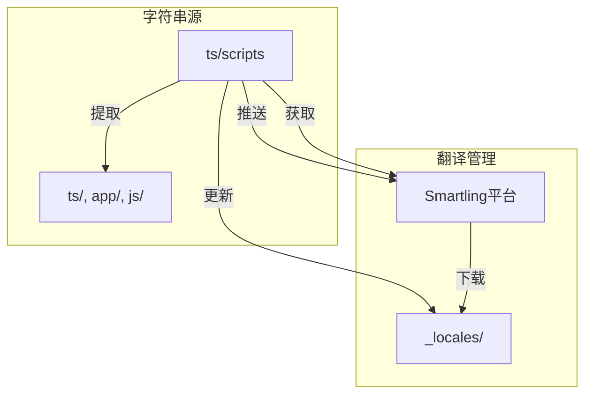
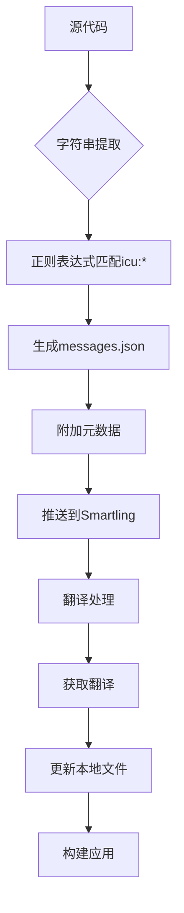
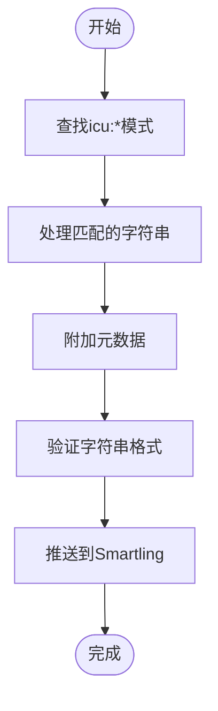
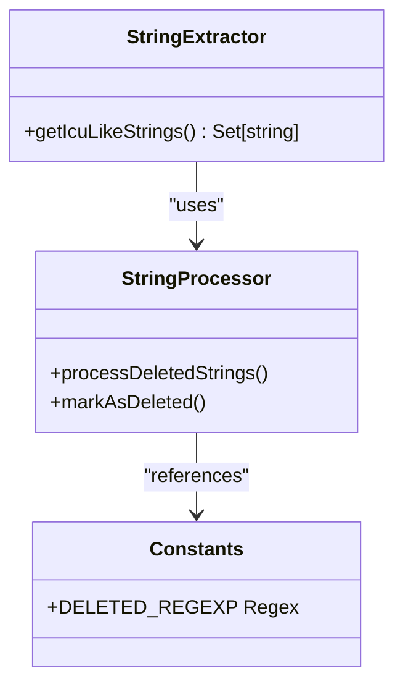
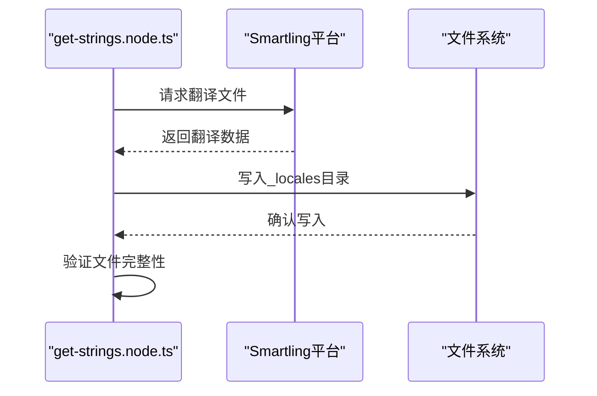

# 字符串管理

<cite>
**本文档中引用的文件**  
- [mark-unused-strings-deleted.node.ts](file://ts/scripts/mark-unused-strings-deleted.node.ts)
- [constants.std.ts](file://ts/scripts/constants.std.ts)
- [push-strings.node.ts](file://ts/scripts/push-strings.node.ts)
- [get-strings.node.ts](file://ts/scripts/get-strings.node.ts)
- [locale.node.ts](file://app/locale.node.ts)
- [.smartling.yml](file://.smartling.yml)
- [.smartling-source-example.sh](file://.smartling-source-example.sh)
</cite>

## 目录
1. [简介](#简介)
2. [项目结构](#项目结构)
3. [核心组件](#核心组件)
4. [架构概述](#架构概述)
5. [详细组件分析](#详细组件分析)
6. [依赖分析](#依赖分析)
7. [性能考虑](#性能考虑)
8. [故障排除指南](#故障排除指南)
9. [结论](#结论)

## 简介
本文档详细描述了Signal-Desktop项目中的国际化字符串管理机制。重点介绍如何通过自动化脚本从代码库中提取待翻译的字符串并推送到Smartling翻译平台，以及如何同步删除的字符串以保持代码与翻译平台的一致性。文档涵盖字符串提取、推送、获取和清理的完整生命周期管理流程。

## 项目结构
Signal-Desktop的字符串管理主要集中在`_locales`目录和`ts/scripts`目录中。`_locales`目录存储所有语言的翻译文件，而`ts/scripts`目录包含用于管理这些字符串的脚本工具。



**Diagram sources**
- [mark-unused-strings-deleted.node.ts](file://ts/scripts/mark-unused-strings-deleted.node.ts)
- [push-strings.node.ts](file://ts/scripts/push-strings.node.ts)
- [get-strings.node.ts](file://ts/scripts/get-strings.node.ts)

**Section sources**
- [mark-unused-strings-deleted.node.ts](file://ts/scripts/mark-unused-strings-deleted.node.ts)
- [push-strings.node.ts](file://ts/scripts/push-strings.node.ts)
- [get-strings.node.ts](file://ts/scripts/get-strings.node.ts)

## 核心组件
Signal-Desktop的字符串管理系统由多个核心脚本组成，包括`push-strings.node.ts`、`get-strings.node.ts`和`mark-unused-strings-deleted.node.ts`。这些脚本协同工作，实现字符串的提取、推送、获取和清理。

**Section sources**
- [push-strings.node.ts](file://ts/scripts/push-strings.node.ts)
- [get-strings.node.ts](file://ts/scripts/get-strings.node.ts)
- [mark-unused-strings-deleted.node.ts](file://ts/scripts/mark-unused-strings-deleted.node.ts)

## 架构概述
Signal-Desktop的字符串管理采用基于ICU格式的国际化框架，通过Smartling平台进行翻译管理。系统架构包括字符串提取、元数据附加、平台同步和版本控制等多个环节。



**Diagram sources**
- [push-strings.node.ts](file://ts/scripts/push-strings.node.ts)
- [get-strings.node.ts](file://ts/scripts/get-strings.node.ts)
- [mark-unused-strings-deleted.node.ts](file://ts/scripts/mark-unused-strings-deleted.node.ts)

## 详细组件分析

### 字符串推送脚本分析
`push-strings.node.ts`脚本负责从代码库中提取待翻译的字符串并推送到Smartling平台。

#### 字符串提取机制


**Diagram sources**
- [push-strings.node.ts](file://ts/scripts/push-strings.node.ts)

### 字符串删除处理分析
`mark-unused-strings-deleted.node.ts`脚本负责识别和处理已从代码库中删除的字符串。

#### 删除字符串识别流程


**Diagram sources**
- [mark-unused-strings-deleted.node.ts](file://ts/scripts/mark-unused-strings-deleted.node.ts)
- [constants.std.ts](file://ts/scripts/constants.std.ts)

### 字符串获取脚本分析
`get-strings.node.ts`脚本负责从Smartling平台获取最新的翻译字符串。

#### 获取流程


**Diagram sources**
- [get-strings.node.ts](file://ts/scripts/get-strings.node.ts)

## 依赖分析
字符串管理系统依赖于多个外部工具和配置文件，包括Smartling CLI、ICU格式解析器和项目特定的配置。

```mermaid
graph LR
A[push-strings.node.ts] --> B[grep]
A --> C[Smartling CLI]
A --> D[@formatjs/icu-messageformat-parser]
E[get-strings.node.ts] --> C
E --> F[fast-glob]
G[mark-unused-strings-deleted.node.ts] --> B
G --> H[constants.std.ts]
```

**Diagram sources**
- [push-strings.node.ts](file://ts/scripts/push-strings.node.ts)
- [get-strings.node.ts](file://ts/scripts/get-strings.node.ts)
- [mark-unused-strings-deleted.node.ts](file://ts/scripts/mark-unused-strings-deleted.node.ts)
- [constants.std.ts](file://ts/scripts/constants.std.ts)

**Section sources**
- [push-strings.node.ts](file://ts/scripts/push-strings.node.ts)
- [get-strings.node.ts](file://ts/scripts/get-strings.node.ts)
- [mark-unused-strings-deleted.node.ts](file://ts/scripts/mark-unused-strings-deleted.node.ts)
- [constants.std.ts](file://ts/scripts/constants.std.ts)

## 性能考虑
字符串管理脚本在处理大量字符串时需要考虑性能优化，包括正则表达式效率、文件I/O操作和网络请求的优化。

## 故障排除指南
当字符串管理出现问题时，可以检查以下常见问题：

**Section sources**
- [.smartling.yml](file://.smartling.yml)
- [.smartling-source-example.sh](file://.smartling-source-example.sh)
- [locale.node.ts](file://app/locale.node.ts)

## 结论
Signal-Desktop的字符串管理系统通过自动化脚本实现了高效的国际化管理。系统采用ICU格式，与Smartling平台集成，确保了翻译的准确性和一致性。通过定期运行字符串管理脚本，可以有效维护代码库与翻译平台的同步。