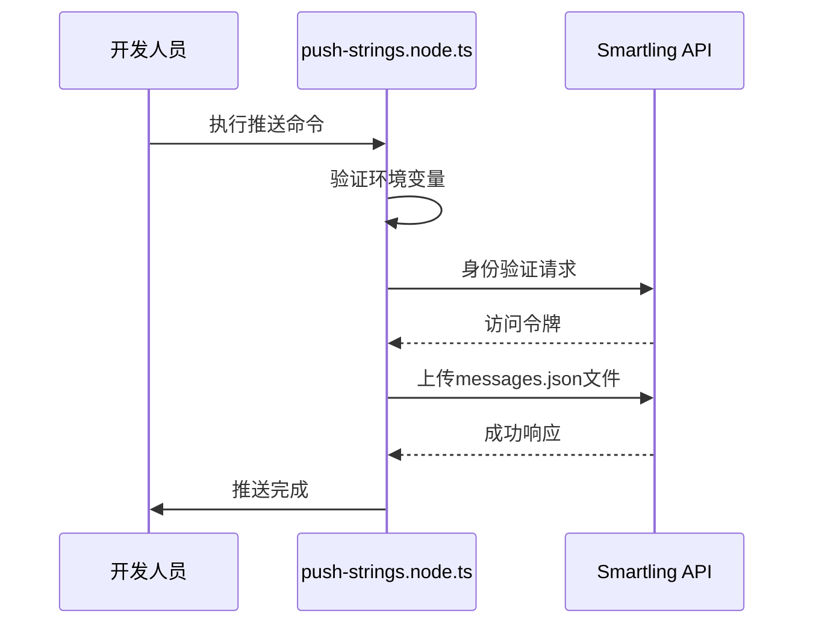
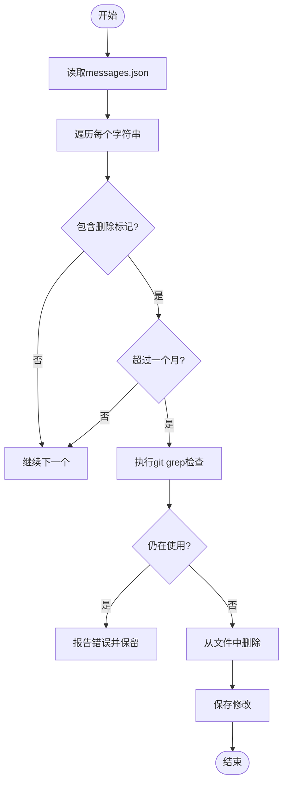
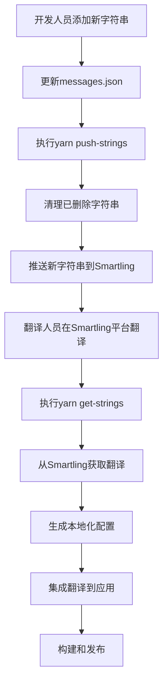

# 翻译流程

<cite>
**本文档引用的文件**  
- [.smartling.yml](file://.smartling.yml)
- [push-strings.node.ts](file://ts/scripts/push-strings.node.ts)
- [remove-strings.node.ts](file://ts/scripts/remove-strings.node.ts)
- [smartling.node.ts](file://ts/util/smartling.node.ts)
- [constants.std.ts](file://ts/scripts/constants.std.ts)
- [package.json](file://package.json)
- [get-strings.node.ts](file://ts/scripts/get-strings.node.ts)
- [gen-locales-config.node.ts](file://ts/scripts/gen-locales-config.node.ts)
- [mark-unused-strings-deleted.node.ts](file://ts/scripts/mark-unused-strings-deleted.node.ts)
- [en/messages.json](file://_locales/en/messages.json)
</cite>

## 目录
1. [简介](#简介)
2. [翻译集成机制](#翻译集成机制)
3. [Smartling配置](#smartling配置)
4. [翻译工作流程](#翻译工作流程)
5. [版本控制策略](#版本控制策略)
6. [质量保证措施](#质量保证措施)
7. [紧急更新与回滚](#紧急更新与回滚)
8. [结论](#结论)

## 简介

Signal-Desktop项目采用Smartling作为外部翻译服务，实现多语言支持。该系统通过自动化脚本管理翻译字符串的推送、删除和同步，确保用户界面在不同语言环境下的准确性和一致性。本文件详细说明了与Smartling的集成机制、配置设置、工作流程以及质量保证措施。

**Section sources**
- [.smartling.yml](file://.smartling.yml#L1-L8)
- [package.json](file://package.json#L28-L32)

## 翻译集成机制

Signal-Desktop通过两个核心脚本与Smartling服务进行集成：`push-strings.node.ts`用于推送待翻译字符串，`remove-strings.node.ts`用于处理已删除的字符串。

### 推送字符串机制

`push-strings.node.ts`脚本负责将英文源字符串推送到Smartling平台进行翻译。该脚本首先验证必要的环境变量`SMARTLING_USER`和`SMARTLING_SECRET`是否已设置，然后通过Smartling API进行身份验证。验证成功后，脚本构建一个multipart/form-data请求，将`_locales/en/messages.json`文件作为JSON类型上传到Smartling项目中。



**Diagram sources**
- [push-strings.node.ts](file://ts/scripts/push-strings.node.ts#L11-L72)
- [smartling.node.ts](file://ts/util/smartling.node.ts#L15-L41)

### 删除字符串机制

`remove-strings.node.ts`脚本负责清理不再使用的翻译字符串。该脚本首先读取`_locales/en/messages.json`文件，然后检查每个字符串的描述字段是否包含删除标记（通过正则表达式`DELETED_REGEXP`匹配）。如果发现删除标记且该字符串已标记超过一个月，则脚本使用git grep命令检查该字符串是否仍在代码库中使用。如果未找到使用痕迹，该字符串将从文件中删除。



**Diagram sources**
- [remove-strings.node.ts](file://ts/scripts/remove-strings.node.ts#L19-L106)
- [constants.std.ts](file://ts/scripts/constants.std.ts#L4)

**Section sources**
- [remove-strings.node.ts](file://ts/scripts/remove-strings.node.ts#L19-L106)
- [constants.std.ts](file://ts/scripts/constants.std.ts#L4)

## Smartling配置

`.smartling.yml`文件包含与Smartling服务集成所需的基本配置信息。该文件定义了Smartling账户ID和项目ID，这些信息用于身份验证和API请求路由。

```yaml
account_id: '92ff14ad'
project_id: 'ef62d1ebb'
```

此外，项目通过`.smartling-source-example.sh`文件提供环境变量设置示例，指导开发人员如何配置`SMARTLING_USER`和`SMARTLING_SECRET`环境变量以进行身份验证。

**Section sources**
- [.smartling.yml](file://.smartling.yml#L6-L7)
- [.smartling-source-example.sh](file://.smartling-source-example.sh#L8-L9)

## 翻译工作流程

Signal-Desktop的翻译工作流程从开发人员提交新字符串开始，到翻译完成后的集成结束，形成一个完整的闭环。

### 字符串提交与推送

当开发人员添加新的用户界面字符串时，这些字符串首先被添加到`_locales/en/messages.json`文件中。随后，通过执行`yarn push-strings`命令，触发以下流程：
1. 执行`remove-strings.node.js`脚本清理已删除的字符串
2. 执行`push-strings.node.js`脚本将更新后的字符串文件推送到Smartling

### 翻译获取与集成

翻译完成后，开发人员执行`yarn get-strings`命令从Smartling获取翻译结果。此命令触发一系列脚本：
- `get-strings.node.ts`：从Smartling下载翻译文件
- `gen-nsis-script.node.ts`：生成NSIS安装脚本
- `gen-locales-config.node.ts`：生成本地化配置
- `build-localized-display-names.node.ts`：构建本地化显示名称
- `get-emoji-locales.node.ts`：获取表情符号本地化数据
- `mark-unused-strings-deleted.node.ts`：标记未使用的字符串为已删除



**Diagram sources**
- [package.json](file://package.json#L28-L32)
- [get-strings.node.ts](file://ts/scripts/get-strings.node.ts#L1-L45)
- [gen-locales-config.node.ts](file://ts/scripts/gen-locales-config.node.ts#L1-L41)

**Section sources**
- [package.json](file://package.json#L28-L32)
- [get-strings.node.ts](file://ts/scripts/get-strings.node.ts#L1-L45)

## 版本控制策略

Signal-Desktop采用严格的版本控制策略确保翻译文件与代码库同步。所有翻译相关的更改都通过Git进行管理，确保可追溯性和团队协作。

### 文件结构与组织

翻译文件存储在`_locales`目录下，每个支持的语言都有一个独立的子目录，如`_locales/en`、`_locales/es`等。每个子目录包含一个`messages.json`文件，存储该语言的所有翻译字符串。

### 变更管理

当翻译字符串发生变化时，遵循以下流程：
1. 开发人员在`_locales/en/messages.json`中添加或修改字符串
2. 提交更改到Git仓库
3. 执行`yarn push-strings`将更改推送到Smartling
4. 翻译完成后，执行`yarn get-strings`获取翻译结果
5. 将翻译文件提交到Git仓库

这种策略确保了翻译文件的变更历史与代码变更历史保持一致，便于追踪和回滚。

**Section sources**
- [_locales](file://_locales)
- [package.json](file://package.json#L28-L32)

## 质量保证措施

Signal-Desktop实施多项质量保证措施，确保翻译的准确性和一致性。

### 翻译一致性检查

系统通过`mark-unused-strings-deleted.node.ts`脚本自动检测未使用的字符串。该脚本分析代码库，识别不再引用的翻译键，并在其描述字段中添加删除标记和日期。一个月后，`remove-strings.node.ts`脚本将自动删除这些标记的字符串，防止翻译资源的积累和混乱。

### 占位符处理

翻译字符串中的占位符（如`$name$`）被特殊处理，确保翻译过程中占位符的完整性和正确性。系统验证翻译后的字符串是否包含所有必要的占位符，防止因占位符丢失导致的运行时错误。

### 字符限制验证

虽然当前配置中未明确指定字符限制规则，但Smartling平台本身支持字符限制功能。可以通过`.smartling.yml`文件配置质量保证规则，对翻译字符串的长度进行限制，确保用户界面布局的稳定性。

**Section sources**
- [mark-unused-strings-deleted.node.ts](file://ts/scripts/mark-unused-strings-deleted.node.ts#L42-L76)
- [remove-strings.node.ts](file://ts/scripts/remove-strings.node.ts#L44-L105)

## 紧急更新与回滚

在紧急情况下，Signal-Desktop提供快速更新和回滚机制。

### 紧急翻译更新

对于需要立即发布的翻译更新，开发团队可以：
1. 直接修改`_locales/en/messages.json`文件
2. 执行`yarn push-strings`立即推送更改
3. 手动触发翻译获取流程

### 回滚机制

如果发现翻译问题，可以通过以下方式回滚：
1. 使用Git恢复到之前的提交
2. 重新执行`yarn get-strings`获取之前的翻译状态
3. 重新构建和发布应用

这种基于Git的版本控制策略使得回滚过程简单可靠。

**Section sources**
- [package.json](file://package.json#L28-L32)
- [git](file://.git)

## 结论

Signal-Desktop的翻译流程通过自动化脚本和外部翻译服务Smartling的集成，实现了高效、可靠的多语言支持。该系统不仅简化了翻译管理，还通过严格的质量保证措施和版本控制策略，确保了翻译质量和代码库的稳定性。开发团队应遵循既定流程，充分利用自动化工具，保持翻译资源的准确性和时效性。