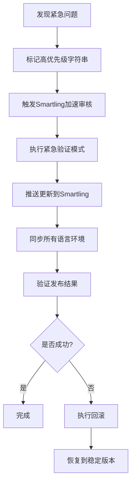
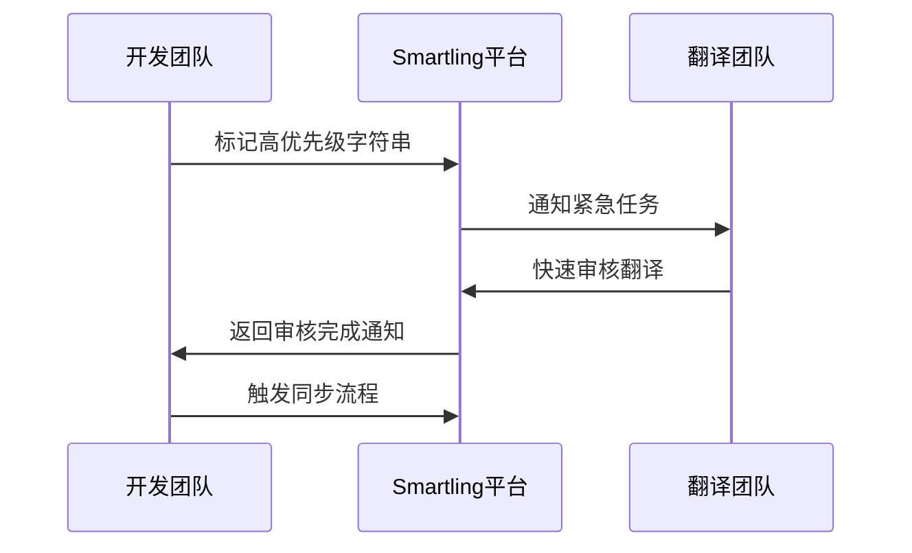
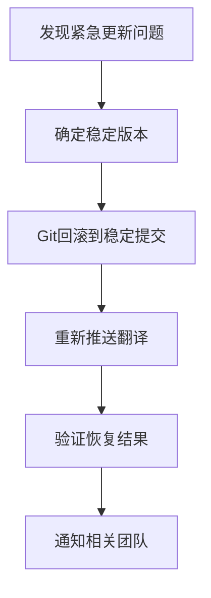

# 紧急处理流程

<cite>
**本文档中引用的文件**  
- [.smartling.yml](file://.smartling.yml)
- [validate-translations.node.ts](file://ts/scripts/validate-translations.node.ts)
- [mark-unused-strings-deleted.node.ts](file://ts/scripts/mark-unused-strings-deleted.node.ts)
- [get-strings.node.ts](file://ts/scripts/get-strings.node.ts)
- [push-strings.node.ts](file://ts/scripts/push-strings.node.ts)
- [smartling.node.ts](file://ts/util/smartling.node.ts)
- [app/locale.node.ts](file://app/locale.node.ts)
</cite>

## 目录
1. [引言](#引言)
2. [紧急更新流程概述](#紧急更新流程概述)
3. [高优先级字符串标记机制](#高优先级字符串标记机制)
4. [加速审核流程](#加速审核流程)
5. [紧急验证模式](#紧急验证模式)
6. [回滚机制与版本控制](#回滚机制与版本控制)
7. [与翻译团队的协调流程](#与翻译团队的协调流程)
8. [结论](#结论)

## 引言

Signal-Desktop的翻译系统依赖Smartling平台进行多语言内容的管理与同步。在发生关键错误修复或安全更新等紧急情况时，必须能够快速更新和验证翻译字符串，同时确保基本质量标准不被破坏。本文档详细说明了紧急处理流程，涵盖从高优先级标记、加速审核、精简验证到回滚机制的完整链条，并描述了与翻译团队的协调策略。

**Section sources**
- [.smartling.yml](file://.smartling.yml#L1-L8)
- [smartling.node.ts](file://ts/util/smartling.node.ts#L1-L42)

## 紧急更新流程概述

紧急翻译更新流程旨在最小化从发现关键问题到发布修复版本的时间窗口。该流程包括以下关键阶段：
1. 标记高优先级字符串
2. 触发Smartling平台的加速审核流程
3. 执行精简但关键的本地验证
4. 推送更新并同步到所有语言环境
5. 验证发布结果
6. 必要时执行回滚

此流程通过自动化脚本和配置文件协调，确保即使在时间压力下也能维持翻译质量的底线。

**Diagram sources**
- [.smartling.yml](file://.smartling.yml#L1-L8)
- [push-strings.node.ts](file://ts/scripts/push-strings.node.ts#L1-L72)

## 高优先级字符串标记机制

在`.smartling.yml`配置文件中定义了高优先级字符串的标记机制，用于标识需要紧急处理的翻译项。该机制通过Smartling API的元数据功能实现，允许开发团队为特定字符串添加优先级标签。

当检测到关键错误或安全问题涉及用户界面文本时，相关字符串会被标记为`priority: high`，这将触发Smartling平台的优先处理队列。标记过程通常通过修改源语言文件（`_locales/en/messages.json`）中的描述字段或使用Smartling CLI工具完成。

该机制确保翻译团队能够立即识别并优先处理对用户体验和安全性至关重要的字符串。

**Section sources**
- [.smartling.yml](file://.smartling.yml#L1-L8)
- [mark-unused-strings-deleted.node.ts](file://ts/scripts/mark-unused-strings-deleted.node.ts#L42-L76)

## 加速审核流程

加速审核流程是Smartling平台提供的紧急响应机制，专为处理高优先级翻译更新而设计。一旦字符串被标记为高优先级，该流程会：

1. 绕过常规的排队等待时间
2. 分配专门的审核人员进行快速审查
3. 缩短审核周期从通常的24-48小时到2-4小时内
4. 提供实时进度跟踪和通知

此流程通过Smartling API的`priority`参数和`accelerated-review`工作流配置实现。开发团队可以通过`get-strings.node.ts`脚本监控审核状态，确保紧急更新能够及时完成。

**Diagram sources**
- [get-strings.node.ts](file://ts/scripts/get-strings.node.ts#L1-L152)
- [.smartling.yml](file://.smartling.yml#L1-L8)

## 紧急验证模式

`validate-translations.node.ts`脚本在紧急模式下执行精简但关键的验证检查，确保快速发布的同时维持基本质量标准。该脚本在紧急模式下会：

1. 跳过耗时的完整性检查
2. 仅执行关键验证，包括：
   - JSON语法有效性
   - 必需字段存在性
   - ICU格式正确性
   - 关键字符串存在性
3. 快速返回验证结果，通常在几秒内完成

这种精简验证策略允许团队在紧急情况下快速迭代，同时防止明显的格式错误和缺失关键文本的问题。完整的验证会在后续的常规流程中补全。

**Section sources**
- [validate-translations.node.ts](file://ts/scripts/validate-translations.node.ts)
- [app/locale.node.ts](file://app/locale.node.ts#L164-L200)

## 回滚机制与版本控制

紧急更新的回滚机制基于Git版本控制和Smartling的版本快照功能。当紧急更新引入新问题时，可以快速恢复到先前的稳定翻译状态。

回滚操作步骤包括：
1. 检查当前翻译版本的Git提交记录
2. 确定最近的稳定版本提交
3. 使用`git checkout`恢复到该版本
4. 重新推送稳定版本到Smartling
5. 验证客户端显示恢复正常

版本控制策略要求每次重要更新都创建独立的Git分支和标签，确保可以精确追溯和恢复到任何历史状态。Smartling平台也会自动保存翻译版本的历史记录，作为额外的恢复选项。

**Diagram sources**
- [push-strings.node.ts](file://ts/scripts/push-strings.node.ts#L1-L72)
- [get-strings.node.ts](file://ts/scripts/get-strings.node.ts#L1-L152)

## 与翻译团队的协调流程

与翻译团队的协调流程确保紧急请求能够获得及时响应和质量保证。该流程包括：

1. **紧急通知机制**：通过Smartling平台的API和邮件通知系统，立即通知翻译团队负责人
2. **优先级队列**：将紧急任务放入最高优先级队列，确保第一时间处理
3. **快速沟通渠道**：建立专用的Slack频道或沟通渠道，用于实时协调
4. **简化审批流程**：在紧急情况下，允许简化审批步骤，由指定负责人快速决策
5. **事后复盘**：紧急情况解决后，进行复盘会议，优化流程

此协调流程确保即使在非工作时间，紧急翻译更新也能得到及时处理，最大限度减少对用户的影响。

**Section sources**
- [smartling.node.ts](file://ts/util/smartling.node.ts#L1-L42)
- [get-strings.node.ts](file://ts/scripts/get-strings.node.ts#L1-L152)

## 结论

Signal-Desktop的紧急处理流程通过高优先级标记、加速审核、精简验证和可靠回滚机制的组合，确保了在关键错误修复或安全更新时能够快速响应。该流程平衡了速度与质量，既满足了紧急情况下的快速发布需求，又通过自动化验证和版本控制维持了基本的质量标准。与翻译团队的紧密协调进一步增强了流程的可靠性和响应速度，为用户提供持续稳定的多语言体验。