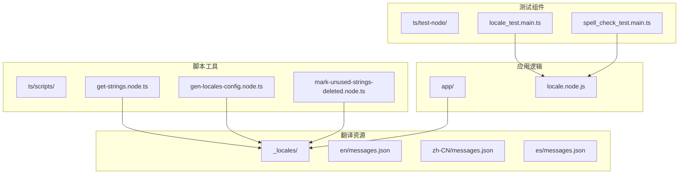
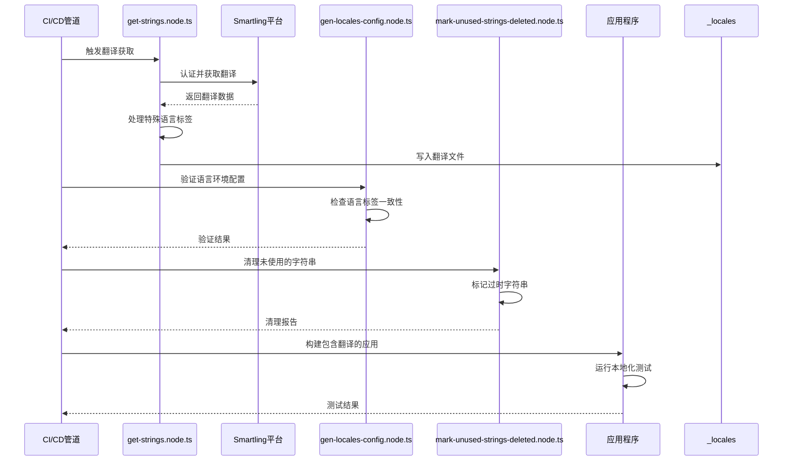
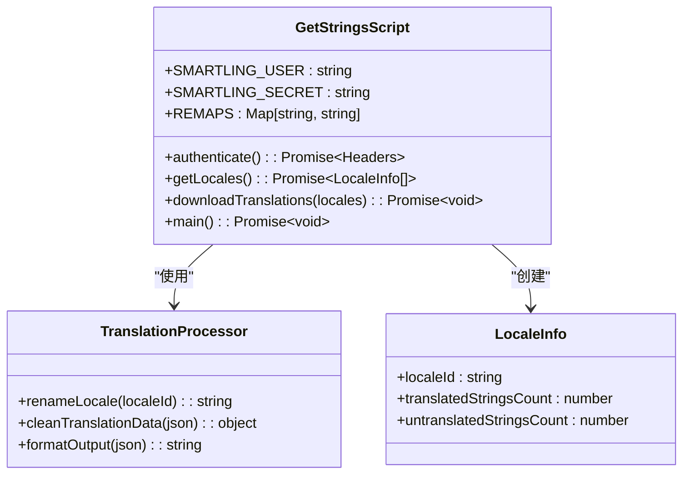
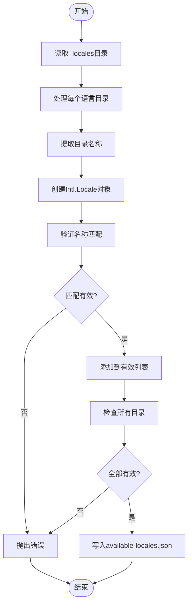
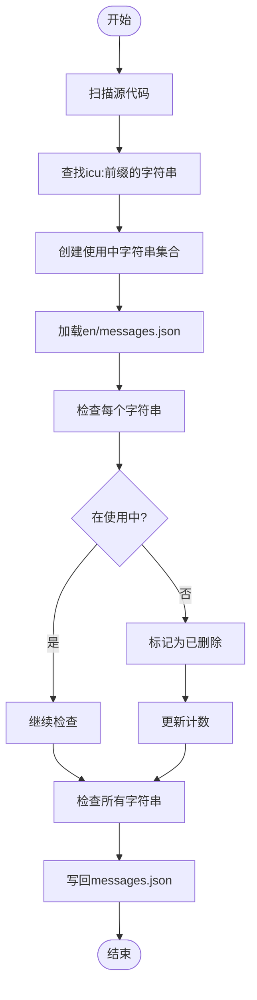
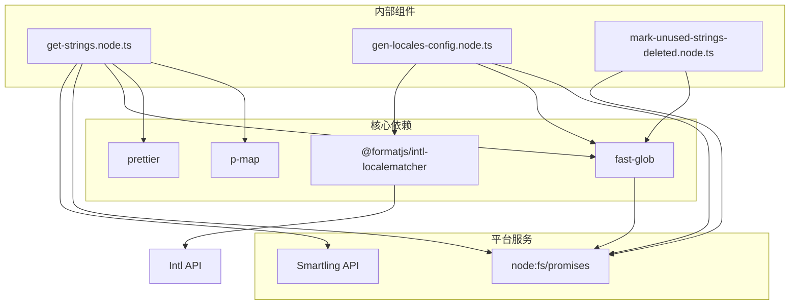

# 自动化测试

<cite>
**本文档中引用的文件**   
- [get-strings.node.ts](file://ts/scripts/get-strings.node.ts)
- [gen-locales-config.node.ts](file://ts/scripts/gen-locales-config.node.ts)
- [mark-unused-strings-deleted.node.ts](file://ts/scripts/mark-unused-strings-deleted.node.ts)
- [locale_test.main.ts](file://ts/test-node/app/locale_test.main.ts)
- [messages.json](file://_locales/en/messages.json)
- [locale.node.js](file://app/locale.node.js)
- [constants.std.js](file://ts/scripts/constants.std.js)
</cite>

## 目录
1. [简介](#简介)
2. [项目结构](#项目结构)
3. [核心组件](#核心组件)
4. [架构概述](#架构概述)
5. [详细组件分析](#详细组件分析)
6. [依赖分析](#依赖分析)
7. [性能考虑](#性能考虑)
8. [故障排除指南](#故障排除指南)
9. [结论](#结论)

## 简介
Signal-Desktop项目通过一系列自动化脚本来确保多语言翻译的完整性、准确性和一致性。本文件详细说明了翻译验证的自动化测试流程，包括CI/CD管道中的集成方式、测试用例设计原理、单元测试实现以及性能优化策略。系统通过智能语言匹配算法处理复杂的本地化需求，如复数形式、性别变体和动态参数替换，并通过全面的测试套件确保翻译质量。

## 项目结构
Signal-Desktop的翻译系统采用模块化设计，核心组件分布在多个目录中。_locales目录包含所有语言包，每个子目录对应一种语言，其中messages.json文件存储具体的翻译字符串。脚本文件位于ts/scripts目录下，负责翻译资源的获取、验证和清理。测试文件位于ts/test-node目录下，用于验证本地化功能的正确性。

**图表来源**
- [get-strings.node.ts](file://ts/scripts/get-strings.node.ts#L1-L153)
- [gen-locales-config.node.ts](file://ts/scripts/gen-locales-config.node.ts#L1-L63)
- [mark-unused-strings-deleted.node.ts](file://ts/scripts/mark-unused-strings-deleted.node.ts#L1-L153)
- [_locales](file://_locales#L1-L200)

**本节来源**
- [get-strings.node.ts](file://ts/scripts/get-strings.node.ts#L1-L153)
- [gen-locales-config.node.ts](file://ts/scripts/gen-locales-config.node.ts#L1-L63)
- [mark-unused-strings-deleted.node.ts](file://ts/scripts/mark-unused-strings-deleted.node.ts#L1-L153)
- [_locales](file://_locales#L1-L200)

## 核心组件
Signal-Desktop的翻译自动化测试系统由三个核心脚本组成：get-strings.node.ts负责从Smartling翻译平台获取最新翻译，gen-locales-config.node.ts验证语言环境配置的正确性，mark-unused-strings-deleted.node.ts标记未使用的字符串。这些脚本共同确保翻译资源的完整性和时效性，同时通过严格的验证机制防止无效或过时的翻译进入生产环境。

**本节来源**
- [get-strings.node.ts](file://ts/scripts/get-strings.node.ts#L1-L153)
- [gen-locales-config.node.ts](file://ts/scripts/gen-locales-config.node.ts#L1-L63)
- [mark-unused-strings-deleted.node.ts](file://ts/scripts/mark-unused-strings-deleted.node.ts#L1-L153)

## 架构概述
Signal-Desktop的翻译验证系统采用分层架构，从翻译平台获取数据，经过本地验证和处理，最终集成到应用程序中。整个流程在CI/CD管道中自动执行，确保每次代码提交都包含完整且准确的翻译资源。系统使用ICU消息格式支持复杂的本地化需求，如复数形式和动态参数替换，并通过智能语言匹配算法处理区域特定的变体。

**图表来源**
- [get-strings.node.ts](file://ts/scripts/get-strings.node.ts#L1-L153)
- [gen-locales-config.node.ts](file://ts/scripts/gen-locales-config.node.ts#L1-L63)
- [mark-unused-strings-deleted.node.ts](file://ts/scripts/mark-unused-strings-deleted.node.ts#L1-L153)
- [locale.node.js](file://app/locale.node.js#L1-L200)

## 详细组件分析

### 翻译获取与验证组件
get-strings.node.ts脚本负责从Smartling翻译平台获取最新的翻译资源。它首先通过API认证，然后获取所有支持的语言列表，最后并行下载每个语言的翻译文件。脚本特别处理了一些不标准的语言标签，如将Smartling使用的"zh-YU"重命名为标准的"yue"，并将"zh-TW"重命名为"zh-Hant"以确保正确的语言匹配。

**图表来源**
- [get-strings.node.ts](file://ts/scripts/get-strings.node.ts#L1-L153)
- [constants.std.js](file://ts/scripts/constants.std.js#L1-L20)

**本节来源**
- [get-strings.node.ts](file://ts/scripts/get-strings.node.ts#L1-L153)
- [constants.std.js](file://ts/scripts/constants.std.js#L1-L20)

### 本地化配置验证组件
gen-locales-config.node.ts脚本验证语言环境配置的正确性。它检查每个语言目录的名称是否与其实际语言标签匹配，防止因Smartling平台的不标准标签导致的问题。脚本使用Intl.LocaleMatcher进行精确的语言匹配验证，确保系统能够正确识别和处理各种语言变体。

**图表来源**
- [gen-locales-config.node.ts](file://ts/scripts/gen-locales-config.node.ts#L1-L63)
- [locale.node.js](file://app/locale.node.js#L1-L200)

**本节来源**
- [gen-locales-config.node.ts](file://ts/scripts/gen-locales-config.node.ts#L1-L63)
- [locale.node.js](file://app/locale.node.js#L1-L200)

### 未使用字符串清理组件
mark-unused-strings-deleted.node.ts脚本负责清理未使用的翻译字符串。它通过grep命令扫描源代码中的ICU消息引用，然后与_en/messages.json_中的字符串进行比对，标记那些不再使用的字符串。这种机制确保翻译资源库的整洁，避免积累过时的翻译条目。

**图表来源**
- [mark-unused-strings-deleted.node.ts](file://ts/scripts/mark-unused-strings-deleted.node.ts#L1-L153)
- [constants.std.js](file://ts/scripts/constants.std.js#L1-L20)

**本节来源**
- [mark-unused-strings-deleted.node.ts](file://ts/scripts/mark-unused-strings-deleted.node.ts#L1-L153)
- [constants.std.js](file://ts/scripts/constants.std.js#L1-L20)

## 依赖分析
Signal-Desktop的翻译系统依赖于多个外部库和平台服务。核心依赖包括@formatjs/intl-localematcher用于精确的语言匹配，fast-glob用于高效的文件系统操作，以及Smartling平台用于翻译管理。这些依赖关系确保了系统能够正确处理复杂的本地化需求，同时保持高性能和可靠性。

**图表来源**
- [get-strings.node.ts](file://ts/scripts/get-strings.node.ts#L1-L153)
- [gen-locales-config.node.ts](file://ts/scripts/gen-locales-config.node.ts#L1-L63)
- [mark-unused-strings-deleted.node.ts](file://ts/scripts/mark-unused-strings-deleted.node.ts#L1-L153)

**本节来源**
- [get-strings.node.ts](file://ts/scripts/get-strings.node.ts#L1-L153)
- [gen-locales-config.node.ts](file://ts/scripts/gen-locales-config.node.ts#L1-L63)
- [mark-unused-strings-deleted.node.ts](file://ts/scripts/mark-unused-strings-deleted.node.ts#L1-L153)

## 性能考虑
Signal-Desktop的翻译验证系统通过多种策略优化性能。get-strings.node.ts使用p-map库并行下载翻译文件，将并发数设置为20，显著提高了下载效率。系统还使用prettier格式化输出，确保所有翻译文件具有一致的格式。对于大规模翻译文件的处理，系统采用流式处理方式，避免内存溢出问题。

**本节来源**
- [get-strings.node.ts](file://ts/scripts/get-strings.node.ts#L1-L153)
- [gen-locales-config.node.ts](file://ts/scripts/gen-locales-config.node.ts#L1-L63)

## 故障排除指南
当翻译验证系统出现问题时，可以按照以下步骤进行排查。首先检查环境变量SMARTLING_USER和SMARTLING_SECRET是否正确设置。然后验证网络连接是否正常，确保能够访问Smartling API。如果遇到语言匹配问题，检查REMAPS映射表是否包含必要的重命名规则。对于未使用的字符串清理问题，确保grep命令能够正确扫描所有源文件。

**本节来源**
- [get-strings.node.ts](file://ts/scripts/get-strings.node.ts#L1-L153)
- [mark-unused-strings-deleted.node.ts](file://ts/scripts/mark-unused-strings-deleted.node.ts#L1-L153)

## 结论
Signal-Desktop的翻译自动化测试系统通过精心设计的脚本和严格的验证流程，确保了多语言支持的高质量和可靠性。系统不仅能够高效地获取和验证翻译资源，还能自动清理过时的字符串，保持翻译库的整洁。通过在CI/CD管道中集成这些自动化测试，团队能够在早期发现并修复翻译问题，确保全球用户都能获得一致且准确的用户体验。