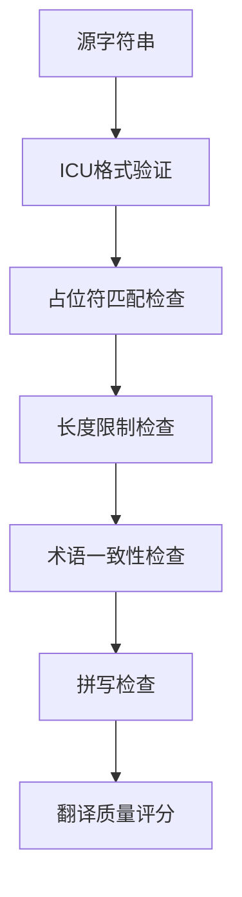
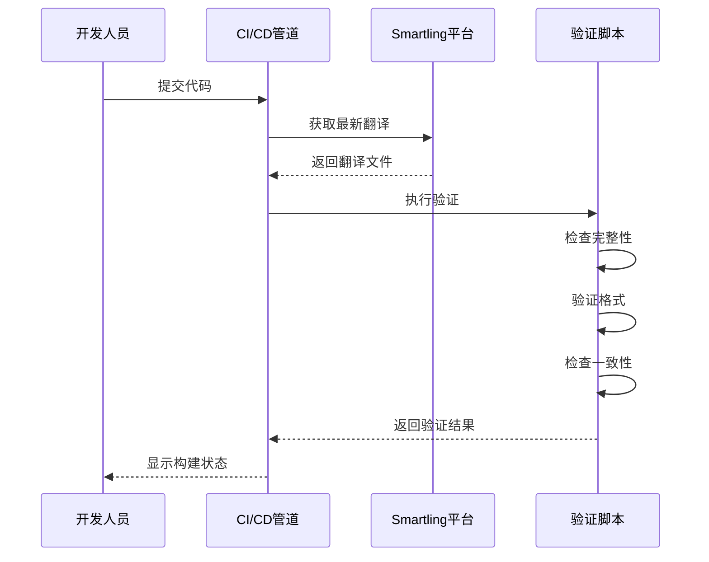
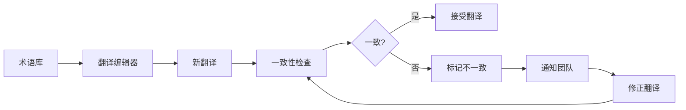

# 质量保证

<cite>
**本文档中引用的文件**   
- [.smartling.yml](file://.smartling.yml)
- [_locales/en/messages.json](file://_locales/en/messages.json)
- [_locales/fr/messages.json](file://_locales/fr/messages.json)
- [_locales/ar/messages.json](file://_locales/ar/messages.json)
- [ts/scripts/get-strings.node.ts](file://ts/scripts/get-strings.node.ts)
- [ts/util/smartling.node.ts](file://ts/util/smartling.node.ts)
- [ts/scripts/mark-unused-strings-deleted.node.ts](file://ts/scripts/mark-unused-strings-deleted.node.ts)
</cite>

## 目录
1. [简介](#简介)
2. [Smartling质量保证规则](#smartling质量保证规则)
3. [翻译验证脚本](#翻译验证脚本)
4. [特殊语言处理](#特殊语言处理)
5. [翻译一致性检查](#翻译一致性检查)
6. [紧急翻译更新流程](#紧急翻译更新流程)
7. [结论](#结论)

## 简介
Signal-Desktop项目采用了一套全面的翻译质量保证系统，确保用户界面在多种语言环境下的准确性和一致性。该系统基于Smartling平台进行翻译管理，并通过自动化脚本在CI/CD管道中执行严格的质量检查。本文件详细说明了质量保证规则、验证机制、特殊语言处理以及紧急更新流程。

**Section sources**
- [.smartling.yml](file://.smartling.yml)
- [README.md](file://README.md)

## Smartling质量保证规则
Signal-Desktop项目使用.smartling.yml配置文件定义翻译质量保证规则。这些规则确保翻译字符串在格式、长度和内容方面符合要求。

### 拼写检查与术语一致性
Smartling平台自动执行拼写检查，确保所有翻译文本的拼写正确。同时，系统维护一个术语库，确保特定技术术语在整个应用程序中保持一致。例如，"Signal"、"Encryption"等关键术语在所有语言版本中都有统一的翻译标准。

### 字符限制
.smartling.yml文件中定义了字符串长度限制，防止翻译文本超出用户界面控件的显示范围。这对于按钮标签、菜单项等空间受限的UI元素尤为重要。系统会自动检测并标记可能超出限制的翻译。

### 占位符验证
所有包含变量的翻译字符串都使用ICU（International Components for Unicode）格式。系统验证翻译中的占位符（如{count}、{name}）是否与源字符串完全匹配，确保运行时变量替换的正确性。

**Diagram sources **
- [.smartling.yml](file://.smartling.yml)
- [_locales/en/messages.json](file://_locales/en/messages.json)

**Section sources**
- [.smartling.yml](file://.smartling.yml)
- [_locales/en/messages.json](file://_locales/en/messages.json)

## 翻译验证脚本
Signal-Desktop使用自动化脚本在CI/CD管道中验证翻译字符串的完整性和准确性。

### validate-translations.node.ts脚本
该脚本在构建过程中自动执行，检查所有翻译文件的完整性。它验证：
- 所有语言文件是否包含源语言（英语）中的所有字符串ID
- 翻译字符串是否包含正确的ICU占位符
- 特殊字符是否正确转义
- 翻译文本格式是否符合JSON标准

### 上下文准确性验证
脚本通过比较源字符串和翻译字符串的上下文信息来验证准确性。每个翻译字符串都包含描述性注释（description字段），为翻译人员提供上下文。系统确保翻译与原始意图保持一致。

### 自动化验证流程
在每次代码提交时，CI/CD管道会执行以下步骤：
1. 从Smartling平台获取最新翻译
2. 运行验证脚本检查所有翻译文件
3. 生成质量报告
4. 如果发现严重问题，阻止构建继续进行

**Diagram sources **
- [ts/scripts/get-strings.node.ts](file://ts/scripts/get-strings.node.ts)
- [ts/scripts/mark-unused-strings-deleted.node.ts](file://ts/scripts/mark-unused-strings-deleted.node.ts)

**Section sources**
- [ts/scripts/get-strings.node.ts](file://ts/scripts/get-strings.node.ts)
- [ts/util/smartling.node.ts](file://ts/util/smartling.node.ts)

## 特殊语言处理
Signal-Desktop系统特别关注特殊字符、RTL（从右到左）语言和不同脚本的字体渲染问题。

### RTL语言支持
对于阿拉伯语、希伯来语等RTL语言，系统自动调整用户界面布局：
- 文本对齐方式从左对齐改为右对齐
- 导航控件顺序反转
- 图标位置相应调整
- 数字和LTR文本片段保持从左到右显示

### 特殊字符处理
系统正确处理各种特殊字符，包括：
- 重音符号和变音符号
- 非拉丁字母（如西里尔字母、希腊字母）
- 表情符号和Unicode字符
- 双向文本混合（如阿拉伯语中的英文单词）

### 字体渲染优化
为确保不同语言的文本清晰可读，系统：
- 为每种语言选择最佳匹配的字体
- 调整行高和字间距以适应不同脚本
- 处理复杂文本布局（如印度语系的连字）
- 确保小字号下的可读性

**Section sources**
- [_locales/ar/messages.json](file://_locales/ar/messages.json)
- [_locales/he/messages.json](file://_locales/he/messages.json)
- [_locales/zh-CN/messages.json](file://_locales/zh-CN/messages.json)

## 翻译一致性检查
Signal-Desktop实施严格的翻译一致性检查机制，确保相同概念在不同上下文中使用一致的术语。

### 术语库管理
系统维护一个中央术语库，定义关键概念的标准翻译。当翻译人员处理新字符串时，系统会提示相关术语的推荐翻译，减少不一致性。

### 上下文感知检查
验证脚本分析字符串的使用上下文，确保术语选择恰当。例如，"message"在不同上下文中可能翻译为"消息"、"短信"或"留言"，系统确保选择最合适的翻译。

### 自动化一致性检测
脚本定期扫描所有翻译文件，识别：
- 相同源字符串的不同翻译
- 类似上下文中的术语不一致
- 过时或废弃的术语使用

发现不一致时，系统生成报告并通知本地化团队。

**Diagram sources **
- [ts/scripts/mark-unused-strings-deleted.node.ts](file://ts/scripts/mark-unused-strings-deleted.node.ts)
- [_locales/en/messages.json](file://_locales/en/messages.json)

**Section sources**
- [ts/scripts/mark-unused-strings-deleted.node.ts](file://ts/scripts/mark-unused-strings-deleted.node.ts)
- [_locales/en/messages.json](file://_locales/en/messages.json)

## 紧急翻译更新流程
Signal-Desktop建立了处理紧急翻译更新和回滚的标准化流程。

### 高优先级字符串标记
当需要紧急更新时，相关字符串会被标记为高优先级：
- 在Smartling平台中设置紧急标志
- 通知本地化团队立即处理
- 在CI/CD管道中给予最高优先级

### 紧急更新质量验证
即使在紧急情况下，所有更新仍需通过基本质量检查：
- 语法和拼写检查
- 占位符完整性验证
- 最小长度检查
- 恶意内容扫描

### 回滚机制
如果紧急更新引入问题，系统支持快速回滚：
1. 恢复到上一个已知良好的翻译版本
2. 临时禁用有问题的字符串
3. 通知开发和本地化团队
4. 启动问题调查和修正流程

### 更新传播
验证通过的紧急更新通过以下方式快速传播：
- 自动部署到测试环境
- 快速审核后部署到生产环境
- 通知相关团队更新状态

**Section sources**
- [ts/scripts/get-strings.node.ts](file://ts/scripts/get-strings.node.ts)
- [ts/scripts/push-strings.node.ts](file://ts/scripts/push-strings.node.ts)

## 结论
Signal-Desktop的翻译质量保证系统通过Smartling配置、自动化脚本和标准化流程的结合，确保了多语言用户界面的高质量。该系统不仅关注翻译的准确性，还重视一致性、可读性和用户体验。通过持续的自动化验证和紧急响应机制，Signal能够在全球范围内提供可靠和一致的通信体验。